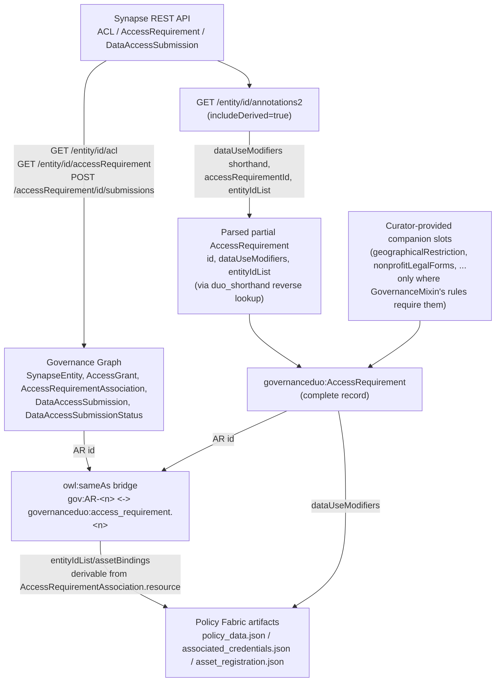

# Sourcing the Governance Graph from real Synapse data

This page is a **design document**, like [DRS interoperability](drs-interop.md) — it
identifies how the Governance Graph should be populated from real Synapse governance
records, and how that connects to the DUO-core model and Policy Fabric, but nothing
here is implemented yet. [Use cases, data sources, and the submission
pipeline](use-cases.md) already flagged this as the biggest gap in the repo: every
class in `governance_graph.yaml` was verified column-by-column against real Synapse
tables specifically so a sync like this could exist, but `build_governance_graph.py`
only ever runs against hand-authored examples today.

## The real data sources (verified against rest-docs.synapse.org)

| Governance Graph class | Synapse REST source |
| --- | --- |
| `SynapseEntity` | `GET /entity/{id}` (structural fields); `GET /entity/{id}/annotations2` for DUO-related annotations |
| `AccessGrant` + `Principal` | `GET /entity/{id}/acl` → `AccessControlList.resourceAccess[]` (each entry: `principalId`, `accessType[]`) — one `AccessGrant` per `resourceAccess` entry, one `Principal` per distinct `principalId` |
| `AccessRequirementAssociation` | `GET /entity/{id}/accessRequirement` (Access Requirements bound to that entity); `bindingType` (Direct/Inherited) resolved by comparing the entity's own ACL/AR listing against `GET /entity/{id}/benefactor` |
| `DataAccessSubmission` + `DataAccessSubmissionStatus` | `POST /accessRequirement/{requirementId}/submissions` (list) + `GET /dataAccessSubmission/{submissionId}` |
| The `gov:AR-<n>` stub / `owl:sameAs` target | `GET /accessRequirement/{requirementId}` itself |

## The critical finding: DUO conditions are not on Synapse's `AccessRequirement` object

Synapse's native `AccessRequirement` interface (confirmed directly against
`rest-docs.synapse.org`) has **no data-use-condition fields at all** — it's limited to
structural fields: `id`, `concreteType`, `accessType`, `subjectIds`,
`subjectsDefinedByAnnotations`, plus the usual audit fields. `dataUseModifiers` and
its companion slots are Sage's own extension, implemented as **entity annotations**
(readable via `GET /entity/{id}/annotations2?includeDerived=true`), populated by the
conditional-JSON-schema mechanism `use-cases.md` already documents: a curator-authored
Data Dictionary → `generate_duo_schema.py` → a conditional schema bound with
`derivedAnnotations = TRUE`.

This means a sync from real Synapse data can capture **who has access and what
structural conditions gate it** (ACLs, AR bindings, submission status) directly. What
about the DUO conditions themselves — can *those* be parsed out of the same
Synapse-derived annotation content? Partially, and more than might be expected: see
the next section.

## Parsing DUO conditions back out of derived annotations

The Data Dictionary format `use-cases.md` documents
([`access_requirement_JSON/README.md`](https://github.com/mc2-center/governanceDUO/blob/main/access_requirement_JSON/README.md)) stores
`dataUseModifiers` as DUO **shorthand** codes — `IRB`, `NPU`, `HMB`, etc. — the exact
same shorthand `mixins.yaml`'s `DataUseModifierEnum` already tags onto every one of
its 24 real DUO permissible values, via `annotations.duo_shorthand`. Verified directly
against the schema:

| Data Dictionary value | `duo_shorthand` | `meaning` |
| --- | --- | --- |
| `IRB` | `"IRB"` | `DUO:0000021` |
| `NPU` | `"NPU"` | `DUO:0000045` |
| `HMB` | `"HMB"` | `DUO:0000006` |

— exact matches to `access_requirement_JSON/README.md`'s own example rows. That's a
complete, ready-to-use reverse-lookup table (shorthand → real DUO CURIE) already
sitting in the schema, read by no script today. Combined with two mechanical
transforms — `accessRequirementId` (a bare Synapse numeric id) needs only the
`access_requirement.` prefix every other id-minting script in this repo already
applies; `entityIdList` needs no transform at all, since both sides already share the
`^syn\d+$` pattern (tightened earlier this session specifically so they'd match) — a
real, partial `governanceduo:AccessRequirement` instance (`id`, `dataUseModifiers`,
`entityIdList`) genuinely **can** be parsed straight out of
`GET /entity/{id}/annotations2?includeDerived=true`'s response.

**Where it stops being complete**, for two concrete reasons, not hypothetical ones:

1. Only the 24 *real* DUO terms have a `duo_shorthand`. The 7 Sage-local `DUOPlus1`–
   `DUOPlus7` extensions don't — they aren't part of the external DUO vocabulary
   Synapse's shorthand convention covers — so anything relying on those can't be
   reconstructed this way.
2. `GovernanceMixin`'s own conditional `rules:` require companion slots for many DUO
   codes (`DUO:0000045`/`NPU` needs `nonprofitLegalForms`; `DUO:0000022` needs
   `geographicalRestriction`) that the Data Dictionary CSV has no column for at all.
   A record parsed purely from annotations is **valid** for a code with no companion
   requirement (`DUO:0000021`/`IRB` has none) but **conditionally incomplete** for one
   that has — those specific slots would still need curator-provided data to produce
   a record that actually passes `GovernanceMixin`'s own validation rules.

So: the Governance Graph sync and the DUO-core model are not fully separate sources of
truth after all — `id`/`dataUseModifiers`/`entityIdList` are genuinely recoverable
from the same annotation data the sync would already be reading. Only the
DUOPlus-extension and companion-condition slots remain curator-only.

## The bridge that already exists: `owl:sameAs`

This is exactly why the `owl:sameAs` bridge added in
[`scripts/build_governance_graph.py`](https://github.com/mc2-center/governanceDUO/blob/main/scripts/build_governance_graph.py) (`gov:AR-<n>
owl:sameAs governanceduo:access_requirement.<n>`) matters for real interoperability, not
just documentation tidiness. Once the sync below exists, the numeric AR id returned by
`GET /entity/{id}/accessRequirement` becomes the join key connecting:

1. The Governance Graph's structural binding — *this AR governs this `SynapseEntity`*
   (`AccessRequirementAssociation`).
2. A `governanceduo:AccessRequirement` record with the same id — either **parsed**
   directly from that entity's own derived annotations (for `id`/`dataUseModifiers`/
   `entityIdList`, per above) or **curated**, for any companion condition slots the
   annotation data doesn't carry.
3. Policy Fabric's `scripts/build_policy_fabric.py` input, which reads
   `dataUseModifiers` off exactly that `governanceduo:AccessRequirement` record,
   however it was assembled.

## Proposed conversion/interoperation flow

## What this would enable, that doesn't exist today

1. **A partial `AccessRequirement` (`id`/`dataUseModifiers`/`entityIdList`) parsed
   directly from Synapse's own derived annotations**, using the `duo_shorthand`
   reverse lookup above, instead of requiring a curator to re-type data Synapse
   already has — with any companion-condition gap made explicit (see below), rather
   than silently producing an incomplete record.
2. **`entityIdList`/`assetBindings` no longer need hand-curation** — they could be
   *derived* from the Governance Graph's real `AccessRequirementAssociation.resource`
   bindings (themselves sourced from Synapse's own `GET /entity/{id}/accessRequirement`),
   closing a duplication gap between the DUO-core record and structural reality.
3. **A live consistency check** — "does this AR's Policy Fabric config still match what
   Synapse's ACL/AR state currently says it governs?" — becomes possible, where today
   the two can silently drift apart.
4. **A trigger for Policy Fabric generation** tied to real governance changes, instead
   of the current manual, one-example-at-a-time `make policy-fabric` run.

## Proposed script changes (not implemented)

- A new `scripts/sync_governance_graph.py`, requiring `synapseclient` (not yet a
  repo dependency), replacing the example-only invocation path for
  `build_governance_graph.py` — it would walk the endpoints above for a given entity
  (or entity tree) and produce the same shape of instance dicts
  `build_governance_graph.py`'s existing `add_synapse_entity`/`add_access_grant`/etc.
  functions already consume, so most of that script's logic is reusable as-is; only
  the instance-loading step (currently `yaml.safe_load` over
  `linkml/examples/governance_graph/*.example.yaml`) would change.
- A `parse_duo_annotations()` function: builds the shorthand → DUO CURIE map from
  `DataUseModifierEnum` via `SchemaView` at runtime (the same schema-derived pattern
  `scripts/build_owl.py` already uses, rather than hardcoding the map and risking it
  going stale the way `build_owl.py`'s own hardcoded term list already did once),
  parses `dataUseModifiers`/`accessRequirementId`/`entityIdList` out of a
  `GET /entity/{id}/annotations2?includeDerived=true` response, and — for each DUO
  code with a `GovernanceMixin` companion-slot rule the parsed data can't satisfy —
  emits an explicit gap rather than a silently-incomplete record (mirroring
  `policy_fabric_bindings.yaml`'s own `notes:` convention for documented gaps).
- A separate orchestration step (not `build_policy_fabric.py` itself) that, for each
  `gov:AR-<n>` the sync encounters: runs the parser above, merges in any
  curator-provided companion slots still needed, derives `entityIdList`/`assetBindings`
  from the sync's own `AccessRequirementAssociation` bindings rather than requiring
  them hand-typed, and then runs `build_policy_fabric.py` against the result.

## Open design questions

This is where the design needs your input before any of the above gets built:

1. **Where should the sync script live** — this repo (like `build_governance_graph.py`
   itself) or the external `mc2-center-dcc` repo (like `generate_duo_schema.py`
   currently does, per `access_requirement_JSON/README.md`)?
2. **Sync cadence** — on-demand CLI run against specific entities, a scheduled batch
   job, or event-driven (e.g. a Synapse webhook on ACL/AR changes)?
3. **Incomplete parsed records** — a record parsed purely from annotations can be
   missing companion-condition slots `GovernanceMixin`'s `rules:` require (see above).
   Should Policy Fabric generation proceed with a parsed-but-incomplete record (error,
   warning, or silent skip — the same three choices `build_policy_fabric.py` already
   faces for unmapped `referenceValueKeys`), or block until a curator supplies the
   missing slots?
4. **Auth** — a `synapseclient` session via a service account/PAT, or one scoped to
   the invoking curator?

None of this can be verified end-to-end without live Synapse credentials, which this
environment doesn't have — unlike everything else in this repo's docs, which was
checked against real, running output.
