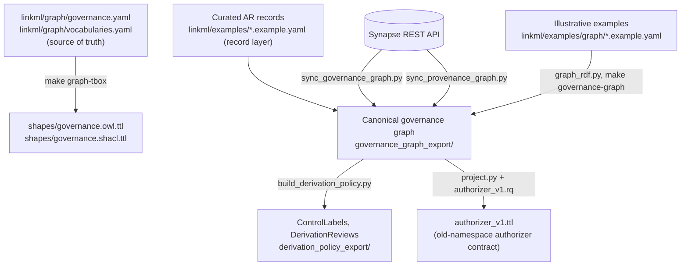

# Technical implementation

This page is the technical deep dive behind [Governance graph design](graph-design.md):
exact classes and predicates, the build pipeline's scripts and Makefile targets,
the literal SPARQL. Each section here expands the same-numbered idea from the
overview page — read that first if you haven't; this page assumes it. For the RDF
artifacts themselves, file by file, see
[Knowledge graph representation](knowledge-graph.md).

## 1. Identifiers and namespaces

Every node has one IRI, and the same thing gets the same IRI in every graph that
mentions it. That is what makes the layers — and sagebrain-model's graph — one
graph. `scripts/graph_iris.py` is the only place IRIs are minted; every emitter and
check builds them through it.

| Namespace | Used for | Examples |
|---|---|---|
| `gov:` = `https://w3id.org/synapse/governance#` | Graph-layer terms: classes, slots, and vocabulary concepts | `gov:SynapseEntity`, `gov:AccessRequirement`, `gov:ControlledTier`, `gov:Download` |
| `govid:` = `https://w3id.org/synapse/governance/` | Everything the layer mints, shaped `<kind>/<id>`, beside the model's own namespace, not inside it | `govid:ar/42`, `govid:authorization/syn10081783-9000001`, `govid:control-label/syn10081783`, `govid:derivation-review/1001` |
| `syn:` = `https://www.synapse.org/Synapse:` | Synapse entities | `syn:syn10081783` |
| `synuser:` = `https://www.synapse.org/Profile:` | Synapse users, by their own profile URL | `synuser:2000001` |
| `synteam:` = `https://www.synapse.org/Team:` | Synapse teams, by their own team URL | `synteam:9000001` |
| `governanceduo:` = `https://w3id.org/sage-bionetworks/governance-duo/` | Record-layer schema terms and non-AR record ids (studies, resources) | `governanceduo:study.mc2-jax-5xfad` |

Synapse's own things use Synapse's own URLs (entities, users, teams); nothing about
a real-world thing is re-minted. One Access Requirement is one IRI in both layers:
a curated record `access_requirement.42` and its graph node are both `govid:ar/42`
(`graph_iris.record_iri()`, decision R5 of `plans/model_refactor.md`). All
references are absolute IRIs, which Neptune's bulk loader requires; a bare id would
become a relative IRI that joins nothing.

The `authorizer_v1` projection is the one deliberate exception: it re-mints its
output entirely under the pre-refactor namespace,
`https://sagebionetworks.org/governance/`, to match sagebrain-infra's existing,
unmodified authorizer contract (sections 3, 4) — infra doesn't need to change
for the canonical graph to move to WAC and the new namespace underneath it.

### External vocabularies reused

Standard vocabularies are used directly wherever they fit, rather than mapping a
local `gov:` term onto them with `rdfs:subPropertyOf` (Neptune doesn't infer, so a
mapping axiom alone wouldn't make the standard term queryable):

| Vocabulary | Prefix | IRI | Reused for |
|---|---|---|---|
| W3C Web Access Control (WAC) | `acl:` | `http://www.w3.org/ns/auth/acl#` | ACL entries (`acl:Authorization`), permissions as WAC modes, agent classes |
| vCard | `vcard:` | `http://www.w3.org/2006/vcard/ns#` | Teams (`vcard:Group`) and their membership (`vcard:hasMember`) |
| FOAF | `foaf:` | `http://xmlns.com/foaf/0.1/` | The generic `Agent` class; PUBLIC as `foaf:Agent` |
| PROV-O | `prov:` | `http://www.w3.org/ns/prov#` | Activities and Usages; the derivation relationship |
| SKOS | `skos:` | `http://www.w3.org/2004/02/skos/core#` | The concept/scheme pattern every graph-layer vocabulary follows (`skos:Concept`, `skos:ConceptScheme`, `skos:notation`, ...) |
| Data Use Ontology (DUO) | `DUO:` | `http://purl.obolibrary.org/obo/DUO_` | Data-use conditions |
| MONDO | `MONDO:` | `http://purl.obolibrary.org/obo/MONDO_` | Disease context on disease-specific conditions |

A term outside `gov:` gets a bare declaration in the generated OWL — no axioms, ever
— plus one annotation, `skos:scopeNote`, wherever this schema itself wrote a
description of how it uses that term (see [section 3](#3-how-the-graph-is-built)).
Every constraint on a reused term lives in the SHACL, not the OWL.

## 2. The model, in full

### Classes at a glance

| Class | Ontology term | Layer | Key predicates |
|---|---|---|---|
| `SynapseEntity` | `gov:SynapseEntity` (`skos:closeMatch prov:Entity`) | Governance | `parent`, `benefactor`, `requiresAR`, `entityType` |
| `User` | `gov:User` | Governance | `company`, `affiliatedWith` |
| `Team` | `vcard:Group` | Governance | `hasMember` |
| `Site` | `gov:Site` | Governance | `institution`, `participatesIn` |
| `Program` | `gov:Program` | Governance | `name` |
| `Authorization` | `acl:Authorization` | Governance | `accessTo`, `default`, `agent`/`agentGroup`/`agentClass`, `mode` |
| `AccessRequirement` | `gov:AccessRequirement` | Governance | `requirementType`, `accessType`, `dataTier`, `hasCondition` |
| `AccessRequirementTemplate` | `gov:AccessRequirementTemplate` | Governance | `domain` |
| `IRBRequirement` | `gov:IRBRequirement` | Governance | `extendsTemplate`, `scopedToProgram`, `scopedToSite` |
| `Approval` | `gov:Approval` | Governance | `satisfies`, `heldBy`, `status`, `expiresAt`, `requirementVersion` |
| `DataAccessRequest` | `gov:DataAccessRequest` | Governance | `accessRequirement`, `researchProject` |
| `DataAccessSubmission` | `gov:DataAccessSubmission` | Governance | `accessRequirement`, `state`, `requirementVersion` |
| `ResearchProject` | `gov:ResearchProject` | Governance | `projectLead`, `intendedDataUseStatement` |
| `Condition` | `gov:Condition` | Conditions | `dataUseTerm`, `diseaseContext`, `conditionDetail` |
| `Activity` | `prov:Activity` | Provenance | `generated`, `qualifiedUsage` |
| `Usage` | `prov:Usage` | Provenance | `entity` / `url`+`name` (exactly one), `wasExecuted` |
| `ControlLabel` | `gov:ControlLabel` | Derivation policy | `subject`, `dataTier`, `sourceAccessRequirements`, `computedFrom` |
| `DerivationReview` | `gov:DerivationReview` | Derivation policy | `activity`, `inputLabels`, `reviewStatus`, `reviewNotes` |

`DerivationRule` (curator configuration for tier combinations) stays in the record
layer; it isn't a graph-layer class.

### Governance layer

The governance layer is built on standard RDF vocabularies rather than a bespoke
grant model:

- An **`Authorization`** (`acl:Authorization`, W3C Web Access Control) is one ACL
  entry: `acl:accessTo` and `acl:default` both name the **benefactor** — the entity
  whose ACL actually covers it, which is WAC's own inheritance idiom (`acl:default`
  covers every descendant with no ACL of its own). Exactly one of `acl:agent` (a
  `User`), `acl:agentGroup` (a `Team`, `vcard:Group`) or `acl:agentClass`
  (`AgentClass`, for Synapse's PUBLIC/AUTHENTICATED_USERS groups) names the
  principal; `acl:mode` carries one or more `Permission` concepts — Synapse's own
  `ACCESS_TYPE` values, each also `rdfs:subClassOf` the WAC mode it amounts to
  (`acl:Read`, `acl:Write`, `acl:Append`, `acl:Control`, or bare `acl:Access` when it
  has none).
- A **`Team`** (`vcard:Group`) carries its membership, `vcard:hasMember`, so an
  evaluator can resolve a team grant down to the individual it covers — a WAC
  `acl:agentGroup` grant alone doesn't say who is in the group. This is a
  deliberate data-exposure decision, not an incidental one: team rosters, which
  Synapse otherwise scopes per-team, become queryable graph-wide to anyone who
  can read the governance graph. The alternative — resolving membership only at
  query time, outside the graph — was rejected because the authorizer's
  contract ([section 4](#4-rebac-implementation-detail)) needs a static, replayable
  grant set to expand teams into per-member ones (`authorizer_v1_teams.rq`); storing
  the roster once here is what makes that projection possible without a live
  Synapse call per authorization.
- The canonical graph does **not** materialize inherited bindings onto every
  descendant the way the pre-refactor pipeline did. Instead, each `SynapseEntity`
  records `gov:benefactor` (which entity's ACL governs it — itself, or its nearest
  ancestor with its own ACL) and `gov:parent` (its place in Synapse's container
  hierarchy) exactly once. Anything that needs the materialized, per-entity view —
  an evaluator, a projection — walks `gov:benefactor`/`gov:parent*` itself, or reads
  it precomputed from a projection ([section 3](#3-how-the-graph-is-built)).
- An **`AccessRequirement`** attaches to an entity with `gov:requiresAR` — one of the
  AR's own `subjectIds`, recorded once, not copied onto descendants. An AR also
  governs the entity's descendants, again by walking `gov:parent+`, not by
  restating the edge.

Effective access needs both halves: a matching `Authorization`, reached by walking
`gov:benefactor`, **and** every governing AR (walked over `gov:parent+`) satisfied.
AR satisfaction is recorded as an **`Approval`** (`gov:heldBy` the user, `gov:satisfies`
the AR, with `gov:status` and `gov:expiresAt`) — close to a GA4GH Passport
`ControlledAccessGrants` visa, which has no RDF IRI to map to. Every approval is
recorded whatever its status; whether it currently holds (`APPROVED` and not past
`expiresAt`) is left to the evaluator (a projection judges it as of a given time,
[section 3](#3-how-the-graph-is-built)). The workflow behind an approval is recorded
too: **`DataAccessRequest`** → **`DataAccessSubmission`** (with its `state`), linked
to the **`ResearchProject`** it serves and the requester's **`Site`**.

The target ontology proposed for sagebrain-infra also models how ARs are organized:
an **`AccessRequirementTemplate`** is a reusable set of conditions for a domain; an
**`IRBRequirement`** extends a template for one `Program` and `Site`
(`gov:extendsTemplate`, `gov:scopedToProgram`, `gov:scopedToSite`).

### Conditions layer

A **`Condition`** is one data-use condition on an AR: `gov:AR-42 gov:hasCondition
gov:AR-42-condition-DUO-0000007`, or in the current namespace,
`govid:ar/42 gov:hasCondition govid:ar/42/condition/DUO_0000007`. Its
`gov:dataUseTerm` is the term's own concept IRI — `DUO:0000007` for real DUO terms
(the same IRIs sagebrain-model imports), or `gov:DUOPlus1`–`7` for Sage's local
extensions (source geography, data tier, license, attribution, ...), each declared
`rdfs:subClassOf DUO:0000017`. `gov:diseaseContext` holds MONDO IRIs for
disease-specific terms; `gov:conditionDetail` holds any other companion parameter
the curated record's DUO rules name (an agreement document id, a region, a time
limit). A curation placeholder such as "Pending Annotation", or the abstract
`DUO:0000017` itself, is not a condition and mints no node.

The curated-record source described here is the current mechanism, not a
permanent one: the adopted direction is for these conditions to come from an
annotation ACT applies directly to the AR in Synapse, once a confirmed mechanism
exists to read it — see `plans/ar_level_duo_annotations.md`.

### Provenance layer

This layer uses PROV-O directly, mirroring Synapse's provenance feature, and lives
in the same graph schema as everything else (not a separate module):

- A **`prov:Activity`** is one pipeline run: `prov:generated` its output entities
  (one or more — Synapse allows an Activity to generate several) and
  `prov:qualifiedUsage` its inputs.
- A **`prov:Usage`** is either a Synapse entity (`prov:entity`, optionally
  `gov:entityVersionNumber`) or an external resource (`gov:url` + `gov:name`, e.g. a
  workflow release page). `gov:wasExecuted` distinguishes the tool that ran from the
  data it consumed.
- `prov:wasDerivedFrom` is **not** stored on the canonical graph; it's derived by a
  projection (`projections/provenance.rq`) from the two facts above — every output
  was derived from every non-executed input — since the canonical graph records only
  what Synapse says.

### Derivation policy layer

This layer is this repository's own vocabulary, in the same graph schema as the
governance and provenance layers (`ControlLabel`/`DerivationReview` moved out of the
record layer in the refactor; `DerivationRule` stays record-layer curator
configuration):

- A **`ControlLabel`** is precomputed per entity: the highest data tier across the
  entity's own AR bindings and its whole derivation ancestry, plus every AR that
  contributed (`gov:sourceAccessRequirements`) and the Activity it was computed from.
  `gov:dataTier` holds a `DataTier` concept IRI, not a string — tiers rank
  `gov:AnonymousTier` < `gov:OpenTier` < `gov:ControlledTier` < `gov:PrivateTier` <
  `gov:UnclassifiedTier`, by each concept's own `gov:rank`. An AR with no curated tier
  contributes `Unclassified`, so unknown fails closed rather than reading as
  unrestricted.
- A **`DerivationReview`** is minted, `Flagged`, for any Activity whose inputs' labels
  cite disjoint sets of ARs — two independently approved sources combined — or whose
  tier combination a rule marks for review. It records the case for a person to
  review; it decides nothing.
- A **`DerivationRule`** is curator configuration: for a combination of input tiers,
  whether deriving from them is permitted, what tier the result carries, and whether
  it needs review. No Synapse source enumerates these today; the shipped rule is
  illustrative.

Labels are computed once, when content is built, and stored on the graph — not
re-derived by walking ancestry on every query. Derivation ancestry is
`prov:wasDerivedFrom` (the provenance projection above) plus every property declared
`rdfs:subPropertyOf*` it in the loaded graphs — sagebrain-model declares
`sagebrain:derived_from rdfs:subPropertyOf prov:wasDerivedFrom`, so labels reach its
Associations and Samples, not just Synapse files ([section 6](#6-sagebrain-model-the-contract-check)).

### A worked example

The canonical example (`linkml/examples/graph/governance_graph.example.yaml`, built
to RDF by `scripts/graph_rdf.py` as
`linkml/examples/graph/rdf/governance_graph.ttl`/`governance_graph_export/governance_graph.ttl`)
describes one raw sequencing file under a study. The study, not the file, carries the
Access Requirement — the file has its own ACL but inherits AR-42 by container
hierarchy:

```turtle
syn:syn2343195 a gov:SynapseEntity ;
    gov:name "NF2-related schwannomatosis RNA-seq study" ;
    gov:benefactor syn:syn2343195 ;         # its own ACL
    gov:requiresAR govid:ar/42 .             # AR-42 governs this and its descendants

syn:syn10081783 a gov:SynapseEntity ;
    gov:name "HS01_CUDC907_Run1_S2_R1_001.fastq" ;
    gov:parent syn:syn2343195 ;             # inherits AR-42 through here
    gov:benefactor syn:syn10081783 .        # but has its own ACL

govid:authorization/syn10081783-9000001 a acl:Authorization ;
    acl:accessTo syn:syn10081783 ;
    acl:default syn:syn10081783 ;
    acl:agentGroup synteam:9000001 ;        # a Team
    acl:mode gov:Download .

synteam:9000001 a vcard:Group ;
    vcard:hasMember synuser:2000001 .

govid:ar/42 a gov:AccessRequirement ;
    gov:requirementType gov:ManagedACTRequirement ;
    gov:accessType gov:Download ;
    gov:hasCondition govid:ar/42/condition/DUO_0000007 .

govid:ar/42/condition/DUO_0000007 a gov:Condition ;
    gov:dataUseTerm DUO:0000007 ;                  # disease-specific research
    gov:diseaseContext MONDO:0004975 .             # Alzheimer disease

govid:approval/55001 a gov:Approval ;
    gov:heldBy synuser:2000001 ;
    gov:satisfies govid:ar/42 ;
    gov:status gov:Approved ;
    gov:expiresAt "2026-08-14T19:33:20Z"^^xsd:dateTime .
```

Team 9000001 holds `DOWNLOAD` on the file through its own Authorization; user
2000001, a team member, is approved for AR-42, which is attached to the parent study
and restricts use to Alzheimer disease research (a projection materializes it onto
the file, [section 3](#3-how-the-graph-is-built)). The provenance examples then
derive a QC summary (`syn:syn30000001`) from this file, and the derivation builder
labels the summary `Controlled`, citing AR-42.

## 3. How the graph is built



### The model and its generated artifacts

`linkml/graph/governance.yaml` (importing `linkml/graph/vocabularies.yaml`) is the
one schema for all four content layers. Every graph-facing class and slot declares
its `class_uri`/`slot_uri`, so the schema, not the scripts, decides the graph's
vocabulary; `scripts/build_graph_tbox.py` runs LinkML's own generators (owlgen,
shaclgen) over it and applies the layer's conventions:

- an enum that `implements: [skos:Concept]` (Permission, ApprovalStatus,
  SubmissionState, AccessRequirementType, DataTier, DerivationReviewStatus) becomes
  a SKOS vocabulary: its `enum_uri` is a concept class, a `<enum_uri>Scheme`
  `skos:ConceptScheme` is generated, and each value is a concept with
  `skos:prefLabel`/`skos:notation`/`skos:definition`/`skos:inScheme` (and `gov:rank`
  for DataTier). A value's `implements:` becomes `rdfs:subClassOf` — a WAC-mode
  permission is punned as both a concept and a class, which OWL 2 DL allows;
- an enum that `implements: [owl:Class]` (AgentClass, DataUseTerm) lists external or
  Sage-local classes used as values and gets no class of its own;
- the OWL makes no axioms about terms outside `gov:` — declarations only, plus
  `skos:scopeNote` wherever this schema itself wrote a description of a reused
  term (an annotation on how it's used, not a claim about what it means), the same
  "not ours to give" rule the record layer's OWL follows for the terms it reuses;
  every constraint on a reused class lives in the SHACL instead;
- every `gov:` term gets `owl:versionInfo` (the schema's own version), not just the
  ontology header;
- every `gov:` property gets `rdfs:domain` (a union when shared) and `rdfs:range`
  from the schema; shapes are named in their own namespace
  (`<ns>shapes#<Class>Shape`), not after the class they target.

The output — `shapes/governance.owl.ttl`, `shapes/governance.shacl.ttl` — is
versioned independently (`GRAPH_VERSION`, currently `0.2.0`) from the record layer's
own OWL/SHACL (`shapes/governance_duo.owl.ttl`/`.shacl.ttl`, `VERSION`, currently
`0.1.0`): the two no longer share any `gov:` term, so there's nothing left to gain
from a merged TBox.

`scripts/graph_rdf.py` is the one path from graph-layer LinkML objects to Turtle —
examples, the Synapse syncs and the derivation builder all hand it a
`GovernanceGraph` container and get triples back. The output has no blank nodes:
every node carries an IRI (`scripts/graph_iris.py`), so a Neptune reload merges
rather than duplicates. For the full breakdown of every RDF artifact this repository
produces — what generates it, what namespace it's in, what validates it — see
[Knowledge graph representation](knowledge-graph.md).

### From Synapse

`scripts/sync_governance_graph.py` builds the governance and conditions layers for
explicitly listed Synapse entities. For each one it resolves:

1. the entity, its ancestor chain (`GET /entity/{id}/path`) and each one's
   benefactor;
2. its benefactor's ACL, one `acl:Authorization` per entry — users are `acl:agent`,
   teams `acl:agentGroup` (with their members, `GET /teamMembers`), and Synapse's
   PUBLIC/AUTHENTICATED_USERS groups `acl:agentClass` (`foaf:Agent`/
   `acl:AuthenticatedAgent`);
3. the Access Requirements that apply to it (`GET /entity/{id}/accessRequirement`),
   each attached by `gov:requiresAR` to the entities in the chain that are its own
   `subjectIds` — not copied onto every entity it governs. A curator-authored record
   adds its data-use conditions and tier;
4. for managed ARs only, their `DataAccessSubmission`s (`POST
   /accessRequirement/{id}/submissions`); for every AR, every `Approval` (`POST
   /accessApproval/search`), whatever its state or expiry. A submission's or
   approval's own `requirementVersion` is compared against the AR's current
   `versionNumber` (both recorded, never dropped); a mismatch is warned, not
   corrected — it means the AR changed since that submission or approval was made,
   which is exactly the situation a person, not this script, should judge.

Calls that can fail for reasons outside the script (an entity with no submissions,
an endpoint the credential can't reach) warn and skip rather than abort. A value
outside its vocabulary (a new `ACCESS_TYPE`, say) is warned and left out, never
minted. The credential needs Access and Compliance Team (ACT) access for the
submission and approval endpoints. The full source map is in
[`plans/governance_graph_ingestion.md`](https://github.com/mc2-center/governanceDUO/blob/main/plans/governance_graph_ingestion.md).

`scripts/sync_provenance_graph.py` fetches each entity's Activity
(`GET /entity/{id}/generatedBy`) and builds each Activity once with all of its
requested outputs (one Activity can generate several entities). Synapse provenance
is opt-in, so most entities have none; they are skipped with a warning.
`prov:wasDerivedFrom` is left to the `provenance.rq` projection, not written here.

Both write through `build_graph.GraphBuilder` and `graph_rdf.to_rdf`, the same path
the canonical example uses: `make governance-graph` now builds
`governance_graph_export/governance_graph.ttl` directly from
`linkml/examples/graph/*.example.yaml`, replacing the retired
`scripts/build_governance_graph.py` and its hand-written example directory.

### Derivation labels

`scripts/build_derivation_policy.py` reads one or more canonical graphs (`--graph`,
repeatable — the governance and provenance content is one graph now, not two) and
the curated `DerivationRule` records (`--derivation-rules`), computes a ControlLabel
per entity, then flags DerivationReviews. An entity's Access Requirements are its own
`gov:requiresAR` plus every ancestor's over `gov:parent+`; an AR's tier comes off its
`gov:dataTier` concept, mapped back to a rank through the DataTier enum's own
`gov:rank`. Ancestry follows `prov:wasDerivedFrom` (the provenance projection) and
every property declared a sub-property of it. Pass sagebrain-model's graphs with
`--extra-graph`, and labels follow its `sagebrain:derived_from` edges to its
Associations and Samples.

### Projections

The canonical graph deliberately doesn't materialize what a consumer can compute for
itself: per-entity inherited grants, flattened team membership, "is this approval
still active right now." Those are SPARQL `CONSTRUCT` queries in `projections/`, run
by `scripts/project.py` over the canonical graph merged with the graph TBox (a
vocabulary concept's `skos:notation`, which a projection matches permissions on,
lives there, not on any ABox):

- **`projections/authorizer_v1.rq`** reproduces sagebrain-infra's existing (commit
  `fc6de51`) authorizer contract, in *its* namespace
  (`https://sagebionetworks.org/governance/`) — one `gov:AccessGrant` per (entity,
  direct principal), `gov:bindingType` `Direct`/`Inferred` (computed from
  `gov:benefactor`, not stored), `gov:hasAccessRequirement` walked over
  `gov:parent*`, and `gov:hasApproval` for approvals that are `Approved` and not
  past `expiresAt` as of a given time. That cutoff (`--as-of`) is bound through
  SPARQL `initBindings`, never spliced into the query text. Team
  (`acl:agentGroup`) grants stay at the team's own principal id here — the existing
  contract, which does no member expansion.
- **`projections/authorizer_v1_teams.rq`** is the separate, opt-in (`TEAMS=1`)
  flattening of a team grant to its members, carrying `gov:viaTeam` and the source
  grant's binding type.
- **`scripts/project.py`** also reports how many `acl:agentClass` authorizations
  (PUBLIC, AUTHENTICATED_USERS) neither projection can express as a per-principal
  grant, so that gap stays visible rather than silent.

`make projections` writes these to `governance_graph_export/authorizer_v1.ttl` (and
`_teams.ttl` with `TEAMS=1`). This is a deliberate compatibility step: sagebrain-infra
keeps reading exactly the contract it always has while the canonical graph itself
moves to WAC and the new namespace underneath it ([section 4](#4-rebac-implementation-detail)).

### Validation

`make validate-all`, which CI runs on every pull request, checks:

- every example ABox and the canonical/exported governance graph against the
  generated graph shapes (pyshacl, inference off), plus a set of deliberate defects
  each caught by its intended shape (`graph-validate`);
- the sync scripts, offline against fake Synapse clients (`sync-governance-check`,
  `sync-provenance-check`);
- the derivation builder, against a committed fixture whose output (merged with its
  inputs) conforms to the graph shapes, including label inheritance into a
  sagebrain-shaped Association (`derivation-policy-check`);
- the projections, with a golden diff against `tests/golden/governance_graph.ttl`,
  approval expiry, team-member and descendant-grant behavior
  (`projections-check`);
- the projected `authorizer_v1.ttl`, against sagebrain-infra's pinned authorizer
  query (`infra-contract-check`);
- every curated example via `linkml-validate` — the only enforcer of the DUO
  `rules:`, which neither SHACL nor OWL carries (`linkml-validate-examples`);
- the record-layer OWL and the graph TBox, each against the OWL 2 DL profile, alone
  and merged with every canonical ABox this repo produces (`owl-profile`,
  `graph-owl-profile`), plus every `prov:` term this repo declares against the types
  W3C PROV-O gives them.

`make sagebrain-contract-check SAGEBRAIN_MODEL=<path>` checks the layer inside
sagebrain-model's graph. It's opt-in because it needs that checkout
([section 6](#6-sagebrain-model-the-contract-check)).

### Release

The published artifacts are `shapes/governance.owl.ttl`/`shapes/governance.shacl.ttl`
(the graph layer, `GRAPH_VERSION`, currently `0.2.0`) and
`shapes/governance_duo.owl.ttl`/`shapes/governance_duo.shacl.ttl` (the record layer,
`VERSION`, currently `0.1.0`) — the two release independently, since the
pre-refactor hand-written graph shapes that used to share the record layer's version
are retired. `make release-check` runs `make validate-all` and verifies every
artifact carries its own version (and, with `TAG=v<version>`, that the tag agrees
with `VERSION`) before tagging. Consumers pin a tag, or a commit hash until one
exists.

## 4. ReBAC: implementation detail

sagebrain-infra authorizes queries with a Neptune + Cedar pattern. The graph supplies
the governance facts — by way of the `authorizer_v1` projection, not the canonical
WAC graph directly — and a Cedar policy in Amazon Verified Permissions (AVP) makes
the decision.

### The authorization flow

1. The query API runs a query and collects the Synapse ids in its results.
2. It asks the authorizer (`POST /authorize`) whether the requesting user may take
   the action `ACCESS` on those resources.
3. For each resource, the authorizer queries the projected governance graph (the
   same query it has always run, now against `authorizer_v1.ttl` rather than a
   directly-exported graph):

   ```sparql
   PREFIX gov: <https://sagebionetworks.org/governance/>
   SELECT ?grant ?grantPrincipal ?permission ?bindingType ?accessRequirement
   WHERE {
     VALUES ?resource { <https://www.synapse.org/Synapse:syn10081783> }
     OPTIONAL { ?resource gov:hasAccessRequirement ?accessRequirement . }
     OPTIONAL {
       ?resource gov:hasACL ?grant .
       ?grant a gov:AccessGrant ;
              gov:principal ?grantPrincipal ;
              gov:permission ?permission ;
              gov:bindingType ?bindingType .
     }
   }
   ```

4. It keeps the grants whose principal IRI ends in `principal-<user id>` and whose
   permission's local name equals the action.
5. For each such grant it calls AVP with context flags (`governanceEvidencePresent`,
   `principalMatchesGrant`, `permissionMatchesGrant`, `arSatisfied`,
   `hasInferredGrant`, `inferredAllSatisfied`, `inferredEdgeMode`). It then merges
   direct and inherited decisions (`intersection`: direct allow and every inherited
   allow; `union`: any allow).
6. On Neptune or AVP errors it denies, returning `authorization_unavailable`.

### What the canonical graph records, once

- **`gov:benefactor`/`gov:parent`**, so ACL and AR inheritance can be walked rather
  than restated on every descendant.
- **`acl:Authorization`** entries with WAC modes, and **`gov:requiresAR`** only where
  an AR is actually attached.
- **`gov:Approval`** with status and expiry, and **`gov:Condition`** with DUO IRIs,
  for evaluating AR satisfaction directly off the canonical graph.
- **ControlLabels** on derived content, including sagebrain-model nodes, carrying
  the ARs they inherit (`gov:sourceAccessRequirements`), for gating results that
  contain no Synapse id.

### What `authorizer_v1.rq` derives for the authorizer's existing contract

- Per-entity **`gov:hasACL`/`gov:hasAccessRequirement`**, materialized over
  `gov:benefactor`/`gov:parent*` so the query is one hop regardless of hierarchy
  depth.
- **`gov:bindingType`** (`Direct`/`Inferred`), computed from whether the entity is
  its own benefactor rather than stored on the canonical graph.
- **Principal IRIs** shaped `gov:principal-<Synapse id>`, matched by suffix.
- **`gov:hasApproval`**, only for approvals that are `Approved` and not past
  `expiresAt` as of the projection's `--as-of` time.
- **`gov:ACCESS`** on every grant carrying Synapse `DOWNLOAD`. Synapse has no ACCESS
  permission; it is SageBrain's Cedar action, derived from DOWNLOAD because graph
  answers expose content computed from files, which Synapse gates at DOWNLOAD, not
  READ, so the mapping fails closed. The real Synapse permissions stay alongside it.

Team grants stay at the team's own principal id (member expansion is the separate,
opt-in `authorizer_v1_teams.rq`); `acl:agentClass` grants (PUBLIC,
AUTHENTICATED_USERS) reach no per-principal grant in either projection —
`scripts/project.py` prints the count so this gap stays visible rather than silent.

`make infra-contract-check` runs the authorizer's query and matching rules against
`governance_graph_export/authorizer_v1.ttl` (built by `make projections`) on every
build. The query is a pinned copy; set `SAGEBRAIN_INFRA=<checkout>` to run infra's
own code instead. It asserts that a DOWNLOAD grantee is allowed, and that a
READ-only grantee and an unlisted principal are denied.

### The target ontology

A review of sagebrain-infra's ReBAC concept (PR #54) proposed a richer governance
vocabulary than the concept's ACL-only query uses. This graph implements it:

| Proposed | Here |
|---|---|
| `gov:AccessRequirementTemplate`, `gov:extendsTemplate` | `AccessRequirementTemplate`, `IRBRequirement.extendsTemplate` |
| `gov:Condition`, `gov:hasCondition`, `gov:dataUseTerm` | `Condition`, with `dataUseTerm` as DUO/DUOPlus concept IRIs |
| `gov:IRBRequirement`, `gov:scopedToProgram`, `gov:scopedToSite` | `IRBRequirement` |
| `gov:Program`, `gov:Site`, `gov:affiliatedWith` | `Program`, `Site`, `affiliatedWith` on principals, requests and projects |
| `gov:Approval`, `gov:satisfies`, `gov:heldBy`, `gov:status`, `gov:expiresAt` | `Approval` |

The authorizer's current query reads only the projected grant and AR edges. The
richer nodes are in the canonical graph for policies that evaluate AR satisfaction
and conditions directly; see
[`plans/rebac_governance_graph_alignment.md`](https://github.com/mc2-center/governanceDUO/blob/main/plans/rebac_governance_graph_alignment.md).

## 5. Using the graph: query cookbook

These queries run against the canonical example graph as written (the graph
sagebrain-infra's authorizer itself queries is the projection, section 4).

**What ACL governs an entity, walking to its benefactor?**

```sparql
PREFIX gov: <https://w3id.org/synapse/governance#>
PREFIX acl: <http://www.w3.org/ns/auth/acl#>
PREFIX syn: <https://www.synapse.org/Synapse:>
SELECT ?principal ?principalSlot ?mode WHERE {
  syn:syn10081783 gov:benefactor ?b .
  ?auth a acl:Authorization ; acl:default ?b ; acl:mode ?mode .
  { ?auth acl:agent ?principal . BIND("agent" AS ?principalSlot) }
  UNION { ?auth acl:agentGroup ?principal . BIND("agentGroup" AS ?principalSlot) }
  UNION { ?auth acl:agentClass ?principal . BIND("agentClass" AS ?principalSlot) }
}
```

**Which Access Requirements govern an entity, direct or inherited by container?**

```sparql
PREFIX gov: <https://w3id.org/synapse/governance#>
PREFIX syn: <https://www.synapse.org/Synapse:>
SELECT ?ar ?dataUseTerm ?diseaseContext WHERE {
  syn:syn10081783 gov:parent* ?ancestor .
  ?ancestor gov:requiresAR ?ar .
  ?ar gov:hasCondition ?c .
  ?c gov:dataUseTerm ?dataUseTerm .
  OPTIONAL { ?c gov:diseaseContext ?diseaseContext }
}
```

**Which of an entity's ARs has a principal currently been approved for?**

```sparql
PREFIX gov: <https://w3id.org/synapse/governance#>
PREFIX syn: <https://www.synapse.org/Synapse:>
PREFIX synuser: <https://www.synapse.org/Profile:>
SELECT ?ar ?approved WHERE {
  syn:syn10081783 gov:parent* ?ancestor .
  ?ancestor gov:requiresAR ?ar .
  BIND(EXISTS {
    ?approval gov:satisfies ?ar ; gov:heldBy synuser:2000001 ; gov:status gov:Approved .
    FILTER NOT EXISTS { ?approval gov:expiresAt ?exp . FILTER(?exp <= NOW()) }
  } AS ?approved)
}
```

**What was an entity derived from?** Run over the canonical graph merged with
`projections/provenance.rq`'s output (`build_derivation_policy.py` does this
internally already; the canonical graph alone records only the qualified usages,
not the implied edge):

```sparql
PREFIX prov: <http://www.w3.org/ns/prov#>
PREFIX syn: <https://www.synapse.org/Synapse:>
SELECT ?source WHERE { syn:syn30000001 prov:wasDerivedFrom+ ?source }
```

**Which ARs does a derived entity inherit?**

```sparql
PREFIX gov: <https://w3id.org/synapse/governance#>
PREFIX syn: <https://www.synapse.org/Synapse:>
SELECT ?tier ?ar ?activity WHERE {
  ?label a gov:ControlLabel ;
         gov:subject syn:syn30000001 ;
         gov:dataTier ?tier ;
         gov:sourceAccessRequirements ?ar .
  OPTIONAL { ?label gov:computedFrom ?activity }
}
```

## 6. sagebrain-model: the contract check

`make sagebrain-contract-check` verifies, against a sagebrain-model checkout:

- the union of both ontologies is OWL 2 DL;
- every `prov:` term this repository declares has the type sagebrain-model's
  vendored `prov.ttl` gives it (the union leaves `prov.ttl` out, for PROV-O's
  own puns);
- a worked example joining both repositories' data conforms to both repositories'
  shapes;
- a label reaches `association:apoe-expr-samp01`.

> This refactor briefly broke the contract twice, both since fixed (see the Phase 2
> section of `plans/model_refactor_report.md`): sagebrain-model's own vendored
> extract fell behind this repository's namespace move until it re-ran its import
> against current `HEAD` (its `plans/governance_layer_realignment.md`), and that
> re-check then surfaced a real regression here — the refactored `Usage`/`Activity`
> classes had silently lost the pre-refactor `sh:xone`/`sh:minCount` constraints
> (commits `060308d`, `41c17e1`). All four parts of `make sagebrain-contract-check`
> pass again as of this repository's current `HEAD`.

## Where to look next

| For | See |
|---|---|
| The concepts and architecture, without predicate-level detail | [Governance graph design](graph-design.md) |
| The RDF artifacts themselves, file by file | [Knowledge graph representation](knowledge-graph.md) |
| Every class, slot and enum | [Schema reference](reference/index.md) |
| Changes identified for other repositories, not made here | [Downstream changes](downstream_changes.md) |
| The graph-layer refactor itself | [`plans/model_refactor.md`](https://github.com/mc2-center/governanceDUO/blob/main/plans/model_refactor.md), [`plans/model_refactor_report.md`](https://github.com/mc2-center/governanceDUO/blob/main/plans/model_refactor_report.md) |
