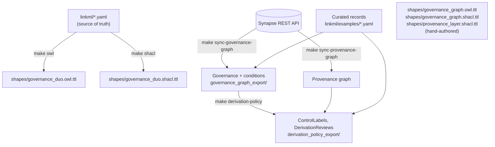

# Governance graph design

This page is the guide to the governance knowledge graph as a whole: what it
represents, how its layers fit together, how it is built and validated, how Sage
Brain uses it, and how it lines up with sagebrain-infra's relationship-based access
control (ReBAC). It describes the design as it stands; the other pages go deeper
on individual parts, and the [schema reference](reference/index.md) lists every
class and slot.

## 1. What the graph is for

Synapse already records who may access what: access control lists (ACLs) grant
permissions to users and teams, and Access Requirements (ARs) add conditions a user
must satisfy first. Sage Brain turns Synapse metadata and derived scientific content
into a knowledge graph, and a knowledge graph is built to be traversed — so access
decisions can no longer stop at "may this user download this file?". They have to
answer three questions:

1. **Direct access.** Which principals hold which permissions on a Synapse entity,
   and which Access Requirements (with which data-use conditions) govern it?
2. **Conditions.** What does an Access Requirement actually demand, expressed as
   Data Use Ontology (DUO) terms a machine can reason over?
3. **Derived access.** When content in the graph was computed from controlled data,
   which Access Requirements does it inherit, and does combining independently
   approved sources create a risk neither approval covered?

The governance graph answers these as RDF, in the same store and on the same IRIs as
the rest of Sage Brain's graph, so a query layer can decide what a requester may see
or traverse.

What it deliberately does **not** do: it doesn't enforce anything at query time, it
doesn't judge whether a derived artifact is safe to publish (small-cell suppression,
aggregation thresholds), and it doesn't settle what revocation of an AR should mean
for content derived while it was active. It records the facts those decisions need —
grants, conditions, lineage, precomputed labels — and leaves the decisions to the
policy and query layers (see section 7).

## 2. Where it sits in Sage Brain

```mermaid
flowchart LR
    subgraph synapse["Synapse (source of truth)"]
        acl["ACLs, Access Requirements,<br/>submissions, approvals"]
        prov["Provenance records<br/>(Activity / used / generatedBy)"]
    end
    curators["Curator-authored AR records<br/>(DUO conditions, data tier)"]

    subgraph gduo["governanceDUO (this repo)"]
        sync["sync_governance_graph.py<br/>sync_provenance_graph.py"]
        derive["build_derivation_policy.py"]
        artifacts["Published TBox + shapes<br/>(shapes/*.ttl, versioned)"]
    end

    subgraph sbm["sagebrain-model"]
        domain["Domain ontology<br/>(genes, samples, associations)"]
    end

    subgraph neptune["Neptune (sagebrain-infra)"]
        graph[("Governance graph<br/>+ domain graph<br/>joined on syn: IRIs")]
    end

    subgraph infra["sagebrain-infra"]
        query["Query API<br/>(src/lambda/query.py)"]
        authz["ReBAC authorizer<br/>(authorize.py + Cedar/AVP)"]
    end

    acl --> sync
    prov --> sync
    curators --> sync
    sync --> derive
    sync --> graph
    derive --> graph
    artifacts -. imported by .-> domain
    domain --> graph
    query --> graph
    query --> authz
    authz --> graph
```

- **Synapse** is the source of truth for ACLs, ARs, submissions, approvals and
  provenance. DUO conditions are the exception: Synapse doesn't store them in a
  structured form, so curators author them (section 5).
- **governanceDUO** (this repository) defines the model in LinkML, builds the graph
  from Synapse and curator records, computes derivation labels, and publishes the
  governance-layer ontology and shapes.
- **sagebrain-model** defines the domain graph (genes, samples, associations). It
  imports this repository's published terms rather than copying them, and bridges
  its own derivation edge into PROV (section 9).
- **Neptune** holds both graphs. They join on shared IRIs: a Synapse entity is
  `syn:syn10081783` in both.
- **sagebrain-infra** serves queries and authorizes them: its ReBAC authorizer reads
  grants and ARs from the governance graph and asks a Cedar policy (Amazon Verified
  Permissions) for the decision (section 7).

## 3. The layers

The graph has four layers. Each is a set of classes with its own source and builder;
together they form one graph because they share IRIs.

| Layer | Answers | Classes | Source | Built by |
|---|---|---|---|---|
| **Governance** | Who holds which permission; which ARs govern an entity; submissions and approvals | `SynapseEntity`, `Principal` (`User`/`Team`), `AccessGrant`, `AccessRequirement` (stub), `AccessRequirementAssociation`, `DataAccessRequest`, `DataAccessSubmission`, `AccessApproval`, `ResearchProject`, `Site`, `Program`, `AccessRequirementTemplate`, `IRBRequirement` | Synapse REST API | `sync_governance_graph.py` (live) / `build_governance_graph.py` (examples) |
| **Conditions** | What an AR demands, as DUO terms | `Condition` | Curator-authored AR records | same builders, from `GovernanceMixin` data |
| **Provenance** | What was computed from what, by which tool | `prov:Activity`, `prov:Usage` | Synapse provenance API | `sync_provenance_graph.py` |
| **Derivation policy** | Which ARs a derived entity inherits; which combinations need review | `ControlLabel`, `DerivationReview` (`DerivationRule` as configuration) | Computed from the three layers above | `build_derivation_policy.py` |

Alongside the graph, the LinkML **records** (`linkml/examples/*.example.yaml`,
serialized under `governanceduo:`) are the curated source data — AR records with
their DUO conditions and data tier, studies, resources. The graph points at them
(`gov:AR-42 owl:sameAs governanceduo:access_requirement.42`) rather than
duplicating them.

## 4. The model

### Governance layer

The core is Synapse's own two-part access model:

- An **`AccessGrant`** is one ACL entry: a `principal` holds one or more `permission`s
  on a `resource`. Permissions are Synapse's `ACCESS_TYPE` values minted as IRIs
  (`gov:READ`, `gov:DOWNLOAD`, ...). A grant with `DOWNLOAD` also carries the derived
  `gov:ACCESS`, the action SageBrain's authorizer checks (section 7).
- An **`AccessRequirementAssociation`** binds an AR to a resource.
- Both carry a **`bindingType`**: `gov:Direct` when the ACL or AR is set on the entity
  itself, `gov:Inherited` when the entity inherits it from an ancestor (its
  *benefactor*). Inherited bindings are materialized onto each entity, so one lookup
  on the entity finds everything that governs it.
- Two derived convenience edges make that lookup a single hop:
  `syn:<entity> gov:hasACL <grant>` and `syn:<entity> gov:hasAccessRequirement <AR>`.

Effective access needs both halves: a matching grant **and** every governing AR
satisfied. AR satisfaction is recorded as an **`AccessApproval`** (`gov:heldBy` the
principal, `gov:satisfies` the AR, with `gov:status` and `gov:expiresAt`), plus a
convenience edge `gov:hasApproval` from the principal to the AR while the approval
is `APPROVED`. The workflow behind an approval is recorded too:
**`DataAccessRequest`** → **`DataAccessSubmission`** (with its `state`), linked to
the **`ResearchProject`** it serves and the requester's **`Site`**.

**`AccessRequirement`** nodes in the graph are stubs: `gov:AR-42` stands for the
curated record `governanceduo:access_requirement.42` and is linked to it with
`owl:sameAs`. The stub carries the graph-facing facts (its conditions); the record
carries the curated detail. In the schema the stub is `AccessRequirementReference`,
keyed by the real AR's id.

The target ontology proposed for sagebrain-infra also models how ARs are organized:
an **`AccessRequirementTemplate`** is a reusable set of conditions for a domain; an
**`IRBRequirement`** extends a template for one `Program` and `Site`
(`gov:extendsTemplate`, `gov:scopedToProgram`, `gov:scopedToSite`).

### Conditions layer

A **`Condition`** is one data-use condition on an AR: `gov:AR-42 gov:hasCondition
gov:AR-42-condition-DUO-0000007`. Its `gov:duoCode` is the term's IRI —
`obo:DUO_0000007` for real DUO terms, the same IRIs sagebrain-model imports, and
`gov:DUOPlus1`–`7` for Sage's local extensions (source geography, data tier,
license, attribution, ...). `gov:conditionType` carries the DUO shorthand (`DS`,
`GRU`, ...), and `gov:conditionDetail` the companion value the condition needs (for
`DS`, the disease's MONDO id). A curation placeholder such as "Pending Annotation" is
not a condition and mints no node.

### Provenance layer

This layer uses PROV-O directly, mirroring Synapse's provenance feature:

- A **`prov:Activity`** is one pipeline run: `prov:generated` its output entities
  (one or more — Synapse allows an Activity to generate several) and
  `prov:qualifiedUsage` its inputs.
- A **`prov:Usage`** is either a Synapse entity (`prov:entity`, optionally
  `gov:entityVersionNumber`) or an external resource (`gov:url` + `gov:name`, e.g. a
  workflow release page). `gov:wasExecuted` distinguishes the tool that ran from the
  data it consumed.
- `prov:wasDerivedFrom` is derived from the two: every output was derived from every
  non-executed input.

### Derivation policy layer

This layer is this repository's own vocabulary, not a PROV-O extension:

- A **`ControlLabel`** is precomputed per entity: the highest data tier across the
  entity's own AR bindings and its whole derivation ancestry, plus every AR that
  contributed (`gov:sourceAccessRequirements`) and the Activity it was computed from.
  Tiers rank `Anonymous` < `Open` < `Controlled` < `Private` < `Unclassified`. An AR
  with no curated tier contributes `Unclassified`, so unknown fails closed rather
  than reading as unrestricted.
- A **`DerivationReview`** is minted, `Flagged`, for any Activity whose inputs' labels
  cite disjoint sets of ARs — two independently approved sources combined — or whose
  tier combination a rule marks for review. It records the case for a person to
  review; it decides nothing.
- A **`DerivationRule`** is curator configuration: for a combination of input tiers,
  whether deriving from them is permitted, what tier the result carries, and whether
  it needs review. No Synapse source enumerates these today; the shipped rule is
  illustrative.

Labels are computed once, when content is built, and stored on the graph — not
re-derived by walking ancestry on every query.

### A worked example

The example graph (`governance_graph_export/governance_graph.ttl`) describes one
raw sequencing file under a study, governed by one AR:

```turtle
syn:syn10081783 a gov:SynapseEntity ;
    gov:name "HS01_CUDC907_Run1_S2_R1_001.fastq" ;
    gov:parentId syn:syn2343195 ;
    gov:hasACL gov:grant-001 ;
    gov:hasAccessRequirement gov:AR-42 .

gov:grant-001 a gov:AccessGrant ;
    gov:resource syn:syn10081783 ;
    gov:principal gov:principal-9000001 ;          # a Team
    gov:permission gov:DOWNLOAD, gov:ACCESS ;      # ACCESS derived from DOWNLOAD
    gov:bindingType gov:Direct ;
    gov:source gov:Synapse .

gov:ar-association-001 a gov:AccessRequirementAssociation ;
    gov:resource syn:syn10081783 ;
    gov:accessRequirement gov:AR-42 ;
    gov:bindingType gov:Inherited .                # set on the study, inherited

gov:AR-42 a gov:AccessRequirement ;
    owl:sameAs governanceduo:access_requirement.42 ;
    gov:hasCondition gov:AR-42-condition-DUO-0000007 .

gov:AR-42-condition-DUO-0000007 a gov:Condition ;
    gov:duoCode <http://purl.obolibrary.org/obo/DUO_0000007> ;  # disease-specific
    gov:conditionType "DS" ;
    gov:conditionDetail "MONDO:0004975" .                        # Alzheimer disease

gov:access-approval-9001 a gov:AccessApproval ;
    gov:heldBy gov:principal-2000001 ;             # a User
    gov:satisfies gov:AR-42 ;
    gov:status gov:APPROVED .
```

Team 9000001 holds `DOWNLOAD` on the file; the file inherits AR-42, which restricts
use to Alzheimer disease research; user 2000001 is approved for AR-42. The
provenance examples then derive a QC summary (`syn:syn30000001`) from this file, and
the derivation builder labels the summary with the file's tier and AR-42.

## 5. Identifiers and namespaces

Every node has one IRI, and the same thing gets the same IRI in every graph that
mentions it. That is what makes the layers — and sagebrain-model's graph — one
graph.

| Namespace | Used for | Examples |
|---|---|---|
| `gov:` = `https://sagebionetworks.org/governance/` | Governance-layer terms and graph instances, shaped `<kind>-<id>` | `gov:AccessGrant`, `gov:AR-42`, `gov:principal-2000001`, `gov:grant-001`, `gov:activity-1001`, `gov:control-label-syn10081783` |
| `syn:` = `https://www.synapse.org/Synapse:` | Synapse entities | `syn:syn10081783` |
| `governanceduo:` = `https://w3id.org/sage-bionetworks/governance-duo/` | Schema terms and LinkML record ids | `governanceduo:access_requirement.42` |
| External vocabularies, by their own IRIs | Terms reused, never re-minted | `prov:Activity`, `obo:DUO_0000007`, `dcterms:identifier` |

In the LinkML schema `gov:` is registered as `sagegov:` (another vocabulary already
claims the `gov` prefix); both resolve to the same IRIs. `scripts/graph_iris.py`
implements the policy for records written into the graph. All references are
absolute IRIs, which Neptune's bulk loader requires; a bare id would become a
relative IRI that joins nothing.

## 6. How the graph is built



### The model and its generated artifacts

`linkml/governance_duo.linkml.yaml` is the entry point. It imports one file per area:
`governance_graph.yaml` (governance and conditions), `provenance.yaml`,
`derivation_policy.yaml`, and the DUO core (`access_requirement.yaml`, `mixins.yaml`,
...). Every graph-facing class and slot declares its `class_uri`/`slot_uri`, and the
builders resolve predicates from those declarations at runtime, so the schema, not
the scripts, decides the graph's vocabulary.

- `make owl` (`scripts/build_owl.py`) generates the OWL. It uses the real
  `class_uri`/`slot_uri` IRIs, so the ontology describes the data. It also leaves
  out the DUO conditional `rules:`, which LinkML's OWL generator translates into
  wrong axioms; `linkml-validate` enforces them instead. A small schema-derived
  repair pass fills generator gaps. The output is stable byte for byte and passes
  the OWL 2 DL profile.
- `make shacl` generates per-slot shapes. Three hand-authored files cover what
  generation can't:
  - `governance_graph.owl.ttl`: the TBox of the governance graph as built;
  - `governance_graph.shacl.ttl`: its shapes;
  - `provenance_layer.shacl.ttl`: a Usage is exactly one of an entity or a URL.

### From Synapse

`scripts/sync_governance_graph.py` builds the governance and conditions layers for
explicitly listed Synapse entities. For each one it resolves the entity's benefactor
and effective ACL, the ARs that apply (direct or inherited), and each AR's
submissions and approvals, looking up principals as it goes. It merges in each AR's
curated record for the DUO conditions, because Synapse doesn't hold them. Calls that
can fail for reasons outside the script (an entity with no submissions, an endpoint
the credential can't reach) warn and skip rather than abort. The credential needs
Access and Compliance Team (ACT) access for the submission and approval endpoints.
The full source map is in
[`plans/governance_graph_ingestion.md`](https://github.com/mc2-center/governanceDUO/blob/main/plans/governance_graph_ingestion.md).

`scripts/sync_provenance_graph.py` fetches each entity's Activity
(`GET /entity/{id}/generatedBy`) and builds each Activity once with all of its
requested outputs. Synapse provenance is opt-in, so most entities have none; they are
skipped with a warning.

`scripts/build_governance_graph.py` builds the same layers from the hand-written
examples in `linkml/examples/governance_graph/` (`make governance-graph`). The sync
script reuses its graph-assembly functions, so both paths emit identical shapes of
data.

### Derivation labels

`scripts/build_derivation_policy.py` reads a provenance graph, a governance graph and
the curated AR records, computes a ControlLabel per entity, then flags
DerivationReviews. Ancestry follows `prov:wasDerivedFrom` and every property declared
a sub-property of it. Pass sagebrain-model's graphs with `--extra-graph`, and labels
follow its `sagebrain:derived_from` edges to its Associations and Samples.

### Validation

`make validate-all`, which CI runs on every pull request, checks:

- every example ABox and the built governance graph against their SHACL shapes
  (pyshacl, inference off);
- the sync script, offline against a fake Synapse client (`make sync-provenance-check`);
- the derivation builder, against a committed fixture that includes label
  inheritance into a sagebrain-shaped Association (`make derivation-policy-check`);
- the exported graph, against sagebrain-infra's authorizer query
  (`make infra-contract-check`);
- the OWL, against the OWL 2 DL profile, alone and merged with the hand-authored
  TBox, and its `prov:` terms against the types W3C PROV-O declares
  (`make owl-profile`).

`make sagebrain-contract-check SAGEBRAIN_MODEL=<path>` checks the layer inside
sagebrain-model's graph. It's opt-in because it needs that checkout.

### Release

The published artifacts are `shapes/governance_duo.owl.ttl`,
`shapes/governance_graph.owl.ttl`, `shapes/governance_graph.shacl.ttl` and
`shapes/provenance_layer.shacl.ttl`. Each carries an `owl:versionIRI`/
`owl:versionInfo` taken from `VERSION` in the `Makefile`. `make release-check`
verifies they agree before tagging. Consumers pin a tag, or a commit hash until one
exists.

## 7. ReBAC alignment

sagebrain-infra authorizes queries with a Neptune + Cedar pattern. The graph supplies
the governance facts; a Cedar policy in Amazon Verified Permissions (AVP) makes the
decision.

### The authorization flow

1. The query API runs a query and collects the Synapse ids in its results.
2. It asks the authorizer (`POST /authorize`) whether the requesting user may take
   the action `ACCESS` on those resources.
3. For each resource, the authorizer queries the governance graph:

   ```sparql
   PREFIX gov: <https://sagebionetworks.org/governance/>
   SELECT ?grant ?grantPrincipal ?permission ?bindingType ?accessRequirement
   WHERE {
     VALUES ?resource { <https://www.synapse.org/Synapse:syn10081783> }
     OPTIONAL { ?resource gov:hasAccessRequirement ?accessRequirement . }
     OPTIONAL {
       ?resource gov:hasACL ?grant .
       ?grant a gov:AccessGrant ;
              gov:principal ?grantPrincipal ;
              gov:permission ?permission ;
              gov:bindingType ?bindingType .
     }
   }
   ```

4. It keeps the grants whose principal IRI ends in `principal-<user id>` and whose
   permission's local name equals the action.
5. For each such grant it calls AVP with context flags (`governanceEvidencePresent`,
   `principalMatchesGrant`, `permissionMatchesGrant`, `arSatisfied`,
   `hasInferredGrant`, `inferredAllSatisfied`, `inferredEdgeMode`). It then merges
   direct and inherited decisions (`intersection`: direct allow and every inherited
   allow; `union`: any allow).
6. On Neptune or AVP errors it denies, returning `authorization_unavailable`.

### What the graph provides for it

- **Resource IRIs** in the `syn:` namespace the authorizer constructs.
- **`gov:hasACL` / `gov:hasAccessRequirement`** on every entity, with inherited
  bindings materialized, so the query is one hop regardless of hierarchy depth.
- **`gov:bindingType`** on every grant and association, which feeds the direct vs.
  inherited merge.
- **Principal IRIs** shaped `gov:principal-<Synapse id>`, which the authorizer
  matches by suffix.
- **`gov:ACCESS`** on every grant carrying Synapse `DOWNLOAD`. Synapse has no ACCESS
  permission; it is SageBrain's Cedar action. It is derived from DOWNLOAD because
  graph answers expose content computed from files, which Synapse gates at DOWNLOAD,
  not READ, so the mapping fails closed. The real Synapse permissions stay alongside
  it.
- **Approvals** (`gov:AccessApproval`, `gov:hasApproval`) and **conditions**
  (`gov:Condition` with DUO IRIs), for evaluating AR satisfaction from the graph.
- **ControlLabels** on derived content, including sagebrain-model nodes, carrying
  the ARs they inherit (`gov:sourceAccessRequirements`), for gating results that
  contain no Synapse id.

`make infra-contract-check` runs the authorizer's query and matching rules against
the exported graph on every build. The query is a pinned copy; set
`SAGEBRAIN_INFRA=<checkout>` to run infra's own code instead. It asserts that a
DOWNLOAD grantee is allowed, and that a READ-only grantee and an unlisted principal
are denied.

### The target ontology

A review of sagebrain-infra's ReBAC concept (PR #54) proposed a richer governance
vocabulary than the concept's ACL-only query uses. This graph implements it:

| Proposed | Here |
|---|---|
| `gov:AccessRequirementTemplate`, `gov:extendsTemplate` | `AccessRequirementTemplate`, `IRBRequirement.extendsTemplate` |
| `gov:Condition`, `gov:hasCondition`, `gov:conditionType`, `gov:duoCode` | `Condition`, with `duoCode` as DUO IRIs |
| `gov:IRBRequirement`, `gov:scopedToProgram`, `gov:scopedToSite` | `IRBRequirement` |
| `gov:Program`, `gov:Site`, `gov:affiliatedWith` | `Program`, `Site`, `affiliatedWith` on principals, requests and projects |
| `gov:Approval`, `gov:satisfies`, `gov:heldBy`, `gov:status`, `gov:expiresAt` | `AccessApproval` (Synapse's own name for the object) |

The authorizer's current query reads only the grant and AR edges. The richer nodes are
in the graph for policies that evaluate AR satisfaction and conditions directly; see
[`plans/rebac_governance_graph_alignment.md`](https://github.com/mc2-center/governanceDUO/blob/main/plans/rebac_governance_graph_alignment.md).

## 8. Using the graph

These queries run against the example graphs as written.

**What governs an entity, and what do its ARs require?**

```sparql
PREFIX gov: <https://sagebionetworks.org/governance/>
PREFIX syn: <https://www.synapse.org/Synapse:>
SELECT ?ar ?binding ?duoCode ?type ?detail WHERE {
  ?assoc gov:resource syn:syn10081783 ;
         gov:accessRequirement ?ar ;
         gov:bindingType ?binding .
  ?ar gov:hasCondition ?c .
  ?c gov:duoCode ?duoCode ;
     gov:conditionType ?type .
  OPTIONAL { ?c gov:conditionDetail ?detail }
}
```

**Which principals hold which permissions on an entity?**

```sparql
PREFIX gov: <https://sagebionetworks.org/governance/>
PREFIX syn: <https://www.synapse.org/Synapse:>
SELECT ?principal ?type ?permission ?binding WHERE {
  syn:syn10081783 gov:hasACL ?grant .
  ?grant gov:principal ?principal ;
         gov:permission ?permission ;
         gov:bindingType ?binding .
  ?principal a ?type .
  FILTER(?type IN (gov:User, gov:Team))
}
```

**Which of an entity's ARs has a principal been approved for?**

```sparql
PREFIX gov: <https://sagebionetworks.org/governance/>
PREFIX syn: <https://www.synapse.org/Synapse:>
SELECT ?ar ?approved WHERE {
  syn:syn10081783 gov:hasAccessRequirement ?ar .
  BIND(EXISTS { gov:principal-2000001 gov:hasApproval ?ar } AS ?approved)
}
```

**What was an entity derived from?** Run this over the provenance graph, after
`prov:wasDerivedFrom` has been materialized (the derivation builder and
`sync_provenance_graph.py` both add it):

```sparql
PREFIX prov: <http://www.w3.org/ns/prov#>
PREFIX syn: <https://www.synapse.org/Synapse:>
SELECT ?source WHERE { syn:syn30000001 prov:wasDerivedFrom+ ?source }
```

**Which ARs does a derived entity inherit?**

```sparql
PREFIX gov: <https://sagebionetworks.org/governance/>
PREFIX syn: <https://www.synapse.org/Synapse:>
SELECT ?tier ?ar ?activity WHERE {
  ?label a gov:ControlLabel ;
         gov:subject syn:syn30000001 ;
         gov:dataTier ?tier ;
         gov:sourceAccessRequirements ?ar .
  OPTIONAL { ?label gov:computedFrom ?activity }
}
```

## 9. Relationship to sagebrain-model

The governance graph is a layer of sagebrain-model's graph, not a separate graph:

- **Ownership.** This repository owns every `gov:` term and the governance-layer
  shapes, and publishes them versioned. sagebrain-model imports them (extracting only
  the terms it uses) instead of keeping copies, so the two can't drift.
- **Joins.** sagebrain-model's `sagebrain:derived_from` points its Associations and
  Samples at `gov:SynapseEntity` nodes by the same `syn:` IRIs, and DUO terms join on
  `obo:DUO_` IRIs.
- **The bridge.** sagebrain-model declares
  `sagebrain:derived_from rdfs:subPropertyOf prov:wasDerivedFrom` in its governance
  module. That one axiom makes its knowledge nodes part of the derivation ancestry,
  so ControlLabels reach them.
- **The check.** `make sagebrain-contract-check` verifies, against a sagebrain-model
  checkout:
  - the union of both ontologies is OWL 2 DL;
  - every `prov:` term this repository declares has the type sagebrain-model's
    vendored `prov.ttl` gives it (the union leaves `prov.ttl` out, for PROV-O's
    own puns);
  - a worked example joining both repositories' data conforms to both repositories'
    shapes;
  - a label reaches `association:apoe-expr-samp01`.

## 10. Other integrations

The same DUO-based records feed two other systems, each with its own page:

- [Policy Fabric](policy-fabric.md): AR records deployed as registered assets with
  enforceable policies (operational, manually triggered).
- [DRS interoperability](drs-interop.md): a design-only crosswalk to the GA4GH Data
  Repository Service authorization model.

## 11. What's operational today

| Part | Status |
|---|---|
| Model, generated OWL/SHACL, validation and contract checks | Operational; run in CI |
| Governance graph from examples (`make governance-graph`) | Operational; the worked example is illustrative data |
| Live governance and provenance sync | Implemented; tested offline, not yet run against live Synapse |
| DUO conditions | Curator-authored; one real AR record in this repository |
| Derivation labels and reviews | Implemented and tested against a fixture; `DerivationRule` content is illustrative |
| Consumption by sagebrain-model and sagebrain-infra | Contract-checked here; integration handled in those repositories |

## Where to look next

| For | See |
|---|---|
| Module layout and LinkML conventions | [The LinkML model](linkml-model.md) |
| The RDF artifacts and how each is validated | [Knowledge graph representation](knowledge-graph.md) |
| Data sources and the submission pipeline | [Use cases](use-cases.md) |
| Every class, slot and enum | [Schema reference](reference/index.md) |
| Design history and decisions | [`plans/`](https://github.com/mc2-center/governanceDUO/tree/main/plans), especially `governance_graph_ingestion.md`, `rebac_governance_graph_alignment.md`, `prov_o_integration.md` and `sagebrain_contract_and_owl_dl_fixes.md` |
