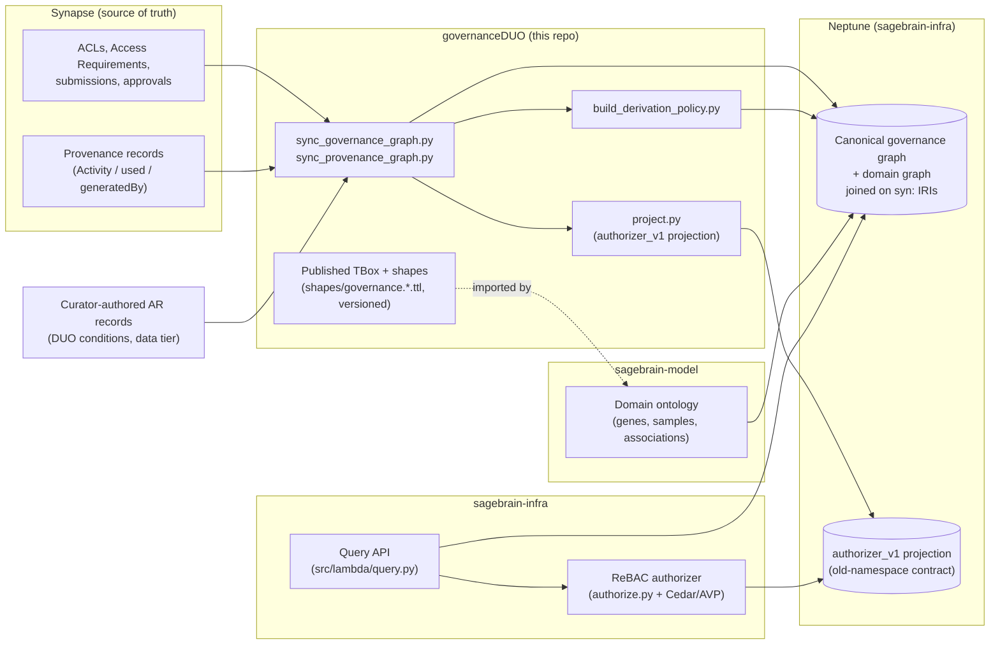

# Governance graph design

This page is the complete guide to the governance knowledge graph: what it
represents, how it's structured, how it's built and validated, how it's used, and
how it lines up with sagebrain-model and sagebrain-infra's relationship-based
access control (ReBAC). Reading this page front to back should leave you with
everything you need to reason about the graph — no predicate names, IRIs or code
required.

For the same material at full technical depth — exact classes and predicates, the
build pipeline's scripts and Makefile targets, the literal SPARQL — see
[Technical implementation](graph-design-implementation.md). For the RDF artifacts
themselves, file by file, see [Knowledge graph representation](knowledge-graph.md).
The [schema reference](reference/index.md) lists every class and slot.

## 1. What the graph is for

Synapse already records who may access what: access control lists (ACLs) grant
permissions to users and teams, and Access Requirements (ARs) add conditions a user
must satisfy first. Sage Brain turns Synapse metadata and derived scientific content
into a knowledge graph, and a knowledge graph is built to be traversed — so access
decisions can no longer stop at "may this user download this file?". They have to
answer three questions:

1. **Direct access.** Which principals hold which permissions on a Synapse entity,
   and which Access Requirements (with which data use/access conditions) govern it?
2. **Conditions.** What does an Access Requirement actually demand, expressed as
   Data Use Ontology (DUO) terms a machine can reason over?
3. **Derived access.** When content in the graph was computed from controlled data,
   which Access Requirements does it inherit, and does combining independently
   approved sources create a risk neither approval covered?

The governance graph answers these as RDF, in the same store and on the same IRIs as
the rest of Sage Brain's graph, so a query layer can decide what a requester may see
or traverse. It records the facts those decisions need — grants, conditions,
lineage, precomputed labels — and leaves the decisions to the policy and query
layers (section 7).

What it deliberately does **not** do:

1. It doesn't enforce anything at query time.
2. It doesn't judge whether a derived artifact is safe to publish (small-cell
   suppression, aggregation thresholds).
3. It doesn't settle what revocation of an AR should mean for content derived while
   it was active.

## 2. Where it sits in Sage Brain

| Party | Role |
|---|---|
| **Synapse** | Source of truth for ACLs, ARs, submissions, approvals and provenance. |
| **Curators** | Author the one thing Synapse doesn't store structurally: DUO conditions and data tier for each AR (section 4). |
| **governanceDUO** (this repo) | Defines the model, builds the canonical graph from Synapse and curator records, computes derivation labels, derives sagebrain-infra's authorizer contract as a projection, and publishes the versioned governance-layer ontology and shapes. |
| **sagebrain-model** | Defines the domain graph (genes, samples, associations); imports this repository's published terms rather than copying them, and bridges its own derivation edge into PROV (section 8). |
| **Neptune** | Holds the canonical graph, the domain graph and the projected authorizer contract together. The canonical and domain graphs join on shared IRIs; the projection is a separate, derived export in its own (old) namespace. |
| **sagebrain-infra** | Serves queries and authorizes them: its ReBAC authorizer reads the projected `authorizer_v1` contract — unchanged from before the refactor — and asks a Cedar policy (Amazon Verified Permissions) for the decision (section 7). |

## 3. The four layers, at a glance

The graph has four content layers, one LinkML schema, each layer a set of classes
sharing that schema's IRIs. A fifth, non-canonical export — projections — sits on
top of all four.

| Layer | Answers | Ontology basis | Built by |
|---|---|---|---|
| **Governance** | Who holds which permission; which ARs govern an entity, direct or through the container hierarchy; submissions and approvals | W3C Web Access Control + vCard (ACLs, teams); this repo's own vocabulary for everything else | Synced from Synapse (live), or the illustrative canonical example |
| **Conditions** | What an AR demands, as DUO terms | Data Use Ontology (DUO) | Merged in from curator-authored AR records today; adopted direction is annotating the AR directly (`plans/ar_level_duo_annotations.md`), pending a confirmed Synapse mechanism |
| **Provenance** | What was computed from what, by which tool | W3C PROV-O | Synced from Synapse's own provenance feature |
| **Derivation policy** | Which ARs a derived entity inherits; which combinations need review | This repository's own vocabulary | Computed from the three layers above |

Alongside the graph, a separate **record layer** holds curated AR/Study records —
DUO conditions and data tier, studies, resources. A curated Access Requirement
record and its graph node share one IRI: there is no stub class or bridging
relationship between them, just more facts about the same thing. Record-layer
vocabulary that would otherwise duplicate the graph's (permissions, data tiers, DUO
terms) was retired in favor of importing the graph's own vocabulary directly, so the
two schemas can't drift apart.

A fifth, non-canonical layer sits on top: **projections**, which derive whatever a
consumer needs precomputed — per-entity inherited grants, flattened team
membership, "is this approval still active" — from the canonical graph, without the
canonical graph storing any of it. One projection is what sagebrain-infra reads
today (sections 6 and 7).

## 4. The model

Four things make up the graph's actual content:

- **Governance** answers "who may do what, and under what conditions." It's built on
  standard vocabularies rather than a bespoke grant model: ACLs are W3C Web Access
  Control, teams are vCard groups, and an Access Requirement attaches directly to
  the one entity it's actually set on rather than being copied onto every
  descendant — inheritance (of both ACLs and ARs) is something an evaluator
  *walks*, not something the canonical graph stores redundantly. Effective access
  needs both halves: a matching ACL grant **and** every governing Access Requirement
  satisfied (recorded as an approval, whatever its status, so history is never
  lost).
- **Conditions** answers "what does an Access Requirement actually demand?" — each
  condition is a Data Use Ontology (DUO) term, or a Sage-local extension of one, with
  whatever parameters a curator recorded (a disease, a region, a time limit). This
  is the one layer Synapse itself has no structured place for, which is why curators
  author it directly.
- **Provenance** answers "what was this computed from?", using the W3C PROV-O
  vocabulary directly: an activity used some inputs and generated some outputs; which
  input was the tool that ran versus the data it consumed is the one fact this layer
  adds on top of bare PROV-O.
- **Derivation policy** answers "what does derived content inherit, and does
  combining sources create a risk neither input covered?" — a precomputed label per
  entity (its data tier, and every Access Requirement it inherits, direct or through
  derivation ancestry), computed once and stored rather than re-walked on every
  query, plus a flagged review for any risky combination. Unknown fails closed: an
  Access Requirement with no recorded tier, or an entity with no computed label at
  all, is never read as unrestricted.

**For example:** a team holds `DOWNLOAD` on a sequencing file through its own ACL; a
member of that team is individually approved for the Access Requirement attached to
the file's parent study (which the file inherits, not restates); that requirement
restricts use to Alzheimer disease research. A QC summary later computed from the
file inherits that same requirement, at the same sensitivity tier, without anyone
having to re-derive the chain by hand. The full worked example, in RDF, is in
[Technical implementation, section 2](graph-design-implementation.md#2-the-model-in-full).

## 5. How the graph is built

The graph comes from three kinds of sources, described by one shared builder,
checked before anything is trusted:

- **Curators** author the one thing Synapse doesn't track in structured form today:
  DUO conditions and a data tier for each Access Requirement. The adopted direction
  is for ACT to annotate the Access Requirement directly instead, once a Synapse
  mechanism for it is confirmed (`plans/ar_level_duo_annotations.md`) — curators
  stay the source until then.
- **Synapse itself** is queried for everything else — ACLs, Access Requirements,
  submissions, approvals, and provenance — by scripts that describe what they
  found; they never invent facts or materialize inheritance themselves. A stale
  submission or approval (made against an Access Requirement version that has since
  changed) is flagged, not silently corrected.
- A **derivation builder** then computes, once, a precomputed sensitivity label for
  every entity: the tier and every Access Requirement it inherits, direct or through
  however many steps of derivation, plus a flag for any risky combination of
  independently approved inputs.
- A **projection** step derives, from the canonical graph, exactly the shape of data
  sagebrain-infra's authorizer already expects — so the authorizer doesn't need to
  change even though the canonical model underneath it does.

Everything generated this way is checked before it's trusted: every export
validates against a machine-generated set of constraints (so the constraints can't
quietly drift out of sync with the model that produced them), a committed fixture
exercises the derivation logic end to end, and a standing contract check runs
against sagebrain-model's own checkout to catch the two repositories drifting apart
— which has actually happened once already (section 8). The model and its generated
constraints are versioned and released independently from the curated records that
fill them in.

The exact scripts, Makefile targets and generated files are in
[Technical implementation, section 3](graph-design-implementation.md#3-how-the-graph-is-built).

## 6. How the graph is used

Once built, the graph answers a fixed set of questions — the same ones section 1
opened with, now concretely:

| Question | Answered by |
|---|---|
| What ACL governs this entity? | Walking up to its benefactor (the nearest ancestor with its own ACL) |
| Which Access Requirements govern it? | Walking up its container hierarchy for every attached requirement |
| What does a given requirement actually demand? | Its recorded DUO conditions |
| Has a given principal satisfied a requirement? | Whether they hold a currently-valid approval for it |
| What was a piece of derived content computed from? | Following its recorded derivation ancestry |
| What does derived content inherit, and is any combination flagged? | Its precomputed sensitivity label and any linked review |

Two different consumers ask these questions in two different ways. Anyone exploring
the canonical graph directly — a person, a script, sagebrain-model's own domain
layer — walks it live, one hop at a time. sagebrain-infra's authorizer, by
contrast, never touches the canonical graph at query time: it reads the precomputed
projection built specifically to match the exact contract it already had (section 7),
so nothing changed on its side when the canonical model did.

The literal queries — SPARQL, runnable as written against the canonical example —
are in [Technical implementation, section 5](graph-design-implementation.md#5-using-the-graph-query-cookbook).

## 7. ReBAC alignment

sagebrain-infra decides access with a Neptune + Cedar pattern: the graph supplies the
facts, a Cedar policy in Amazon Verified Permissions (AVP) makes the decision. The
one subtlety worth understanding at this level: the authorizer doesn't query the
canonical graph directly. It queries a projection, `authorizer_v1`, purpose-built
to reproduce the exact contract sagebrain-infra already had — the same query, the
same old namespace, the same per-entity materialized grants. That's what let the
canonical model move to better conventions internally without any change on
sagebrain-infra's side.

The full query, the matching algorithm, and exactly what the canonical graph
records versus what the projection computes for it are in
[Technical implementation, section 4](graph-design-implementation.md#4-rebac-implementation-detail).

## 8. Relationship to sagebrain-model

The governance graph is a layer of sagebrain-model's graph, not a separate graph:

- **Ownership.** This repository owns every governance-layer term and shape, and
  publishes them versioned. sagebrain-model imports only the terms it actually uses
  rather than keeping copies, so the two can't drift out from under each other —
  provided sagebrain-model re-runs that import whenever this repository's schema
  moves.
- **Joins.** sagebrain-model's own domain nodes (an association, a sample) point at
  Synapse entities by the same IRIs the governance graph uses, and DUO terms join the
  same way.
- **The bridge.** One axiom on sagebrain-model's side — declaring its own derivation
  edge as a sub-property of PROV-O's derivation relationship — is what lets a
  derivation-policy label reach sagebrain-model's own nodes, not just Synapse files.

The two sides can still drift apart between a refactor here and sagebrain-model
catching up — that has actually happened once already — which is exactly what a
standing contract check between the two repositories exists to catch. The check's
specifics, and what actually broke and was fixed, are in
[Technical implementation, section 6](graph-design-implementation.md#6-sagebrain-model-the-contract-check).

## 9. Other integrations

The same DUO-based records feed two other systems, each with its own page:

- [Policy Fabric](policy-fabric.md): AR records deployed as registered assets with
  enforceable policies (operational, manually triggered).
- [DRS interoperability](drs-interop.md): a design-only crosswalk to the GA4GH Data
  Repository Service authorization model.

## 10. What's operational today

| Part | Status |
|---|---|
| Graph-layer model, generated OWL/SHACL, validation and contract checks | Operational; run in CI |
| Governance graph from examples | Operational; the canonical example is illustrative data |
| Live governance and provenance sync | Implemented; tested offline, not yet run against live Synapse |
| DUO conditions | Curator-authored; one real AR record in this repository |
| Derivation labels and reviews | Implemented and tested against a fixture; rule content is illustrative |
| Projections (`authorizer_v1`/`authorizer_v1_teams`) | Operational; reproduces sagebrain-infra's existing authorizer contract unchanged |
| Consumption by sagebrain-model and sagebrain-infra | Contract-checked here; see section 8 for the current check status |

## Where to look next

| For | See |
|---|---|
| Every class, predicate, IRI, script and Makefile target — the same material as this page, at full technical depth | [Technical implementation](graph-design-implementation.md) |
| The RDF artifacts themselves, file by file: what generates each one and what validates it | [Knowledge graph representation](knowledge-graph.md) |
| Module layout and LinkML conventions | [The LinkML model](linkml-model.md) |
| Data sources and the submission pipeline | [Use cases](use-cases.md) |
| Every class, slot and enum | [Schema reference](reference/index.md) |
| Changes identified for other repositories, not made here | [Downstream changes](downstream_changes.md) |
| The graph-layer refactor itself: what changed, why, and its verification | [`plans/model_refactor.md`](https://github.com/mc2-center/governanceDUO/blob/main/plans/model_refactor.md), [`plans/model_refactor_report.md`](https://github.com/mc2-center/governanceDUO/blob/main/plans/model_refactor_report.md) |
| Earlier design history and decisions | [`plans/`](https://github.com/mc2-center/governanceDUO/tree/main/plans), especially `governance_graph_ingestion.md`, `rebac_governance_graph_alignment.md`, `prov_o_integration.md` and `sagebrain_contract_and_owl_dl_fixes.md` |
