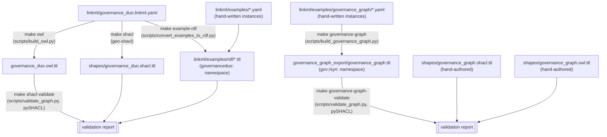

# Knowledge graph representation

"The knowledge graph" for governanceDUO is not one artifact — it's **three distinct
RDF outputs**, each generated a different way, for a different purpose. Confusing
them (e.g. expecting `governance_graph.ttl` to be a superset of the OWL/SHACL export)
leads to wrong assumptions, so this page lays out the split explicitly before going
into any one of them.



## 1. OWL/SHACL — the schema-level TBox

`make owl` (`scripts/build_owl.py`, wrapping LinkML's `OwlSchemaGenerator`) and
`make shacl` (LinkML's stock `gen-shacl`) both generate directly from the schema
itself — no instance data. `governance_duo.owl.ttl` carries classes and properties;
`shapes/governance_duo.shacl.ttl` carries the cardinality/datatype/pattern constraints
those classes and slots imply. `build_owl.py` additionally stamps the 8 real DUO terms
this schema reuses by IRI with `skos:scopeNote`/`owl:versionInfo`, mirroring
sagebrain-model's convention for external terms it doesn't mint itself.

**What's actually in `shapes/governance_duo.shacl.ttl`.** One `sh:NodeShape` per
LinkML class (and mixin), each `sh:targetClass`-scoped to that class's `governanceduo:`
IRI, with `sh:closed false` and an explicit `sh:ignoredProperties` list (so the shape
documents the full set of properties a class *could* carry — inherited via mixins —
without hard-failing on unknown ones). Per slot, `gen-shacl` compiles:

- **cardinality** — `sh:minCount`/`sh:maxCount` from `required`/`multivalued`
- **datatype** — `sh:datatype xsd:string`/`xsd:integer`/etc., or `sh:nodeKind sh:Literal`
- **enum membership** — `sh:in (...)`, e.g. `dataTier`'s `sh:in ("Anonymous" "Open" "Controlled" "Private")`
- **regex patterns** — `sh:pattern`, e.g. `diseaseSpecificResearch`'s `sh:pattern "MONDO:\\d{7}"`

It does **not** compile `GovernanceMixin`'s conditional `rules:` (the DUO-code-triggers-
required-slot logic from [The LinkML model](linkml-model.md)) — confirmed by inspecting
the file, which has no `sh:xone`/`sh:not` construct tied to `dataUseModifiers`. That
logic is covered separately by `linkml-validate` (compiled into JSON Schema
`allOf`/`if`/`then`). `make shacl-validate`'s SHACL pass covers everything else:
required fields, enum membership, regex patterns, and datatypes.

## 2. `example-rdf` — a generic instance ABox

`make example-rdf` (`scripts/convert_examples_to_rdf.py`) is a faithful, generic
LinkML-instance-to-RDF dump of `linkml/examples/*.example.yaml`, using
`RDFLibDumper`/`SchemaView` and the schema's own `governanceduo:` namespace. Every
slot value becomes a literal property on an individual typed with the matching class.
Taking the `Study` example from [The LinkML model](linkml-model.md):

```turtle
@prefix governanceduo: <https://w3id.org/sage-bionetworks/governance-duo/> .
@prefix xsd: <http://www.w3.org/2001/XMLSchema#> .

governanceduo:study.mc2-jax-5xfad a governanceduo:Study ;
    governanceduo:dataUseModifiers "DUOPlus1" ;
    governanceduo:grantNumber "U54AG079754" ;
    governanceduo:sourceGeography "US" ;
    governanceduo:studyDbgapAccessionId "phs000123" ;
    governanceduo:studyDeidentificationType "SafeHarbor" ;
    governanceduo:studyDescription "Pilot investigation into tumor microenvironment signaling in a genetically engineered mouse model cohort." ;
    governanceduo:studyInvestigator "Jane Doe" ;
    governanceduo:studyName "MC2 Center Pilot Study" ;
    governanceduo:studyParticipantNumber "25.0"^^xsd:float ;
    governanceduo:studySampleNumber "40.0"^^xsd:float .
```

(the `id.md` slot's regex `pattern` in `slot_usage` is what lets the dumper turn the
bare dotted id `study.mc2-jax-5xfad` into the CURIE-based subject URI above — see the
README for the workaround this needed). The per-class `.ttl` files plus a merged
`linkml/examples/rdf/all_examples.ttl` land in `linkml/examples/rdf/`, and this merged
file is what `make shacl-validate` checks against the SHACL shapes.

## 3. `governance-graph` — a bespoke, hand-mapped ABox

`make governance-graph` (`scripts/build_governance_graph.py`) is **not** a generic
LinkML dump. It reads the hand-written instances in
`linkml/examples/governance_graph/*.example.yaml` and emits Turtle in its own
`gov:`/`syn:` namespaces, using a bespoke per-class mapping function, deliberately
shaped to match the worked examples in the "SageBrain-Governance Graph Design" doc
(e.g. it only emits `gov:hasApproval` when a submission's state is `APPROVED`). This
lets `governance_graph.yaml`'s classes model the design doc's central distinction:

- **`AccessGrant`** answers *"who has which permission on this resource?"* (an ACL
  grant — mirrors `ACL`/`ACL_RESOURCE_ACCESS`).
- **`AccessRequirementAssociation`** + **`DataAccessSubmission`**/
  **`DataAccessSubmissionStatus`** answer *"what additional conditions must be
  satisfied, and has this user satisfied them?"* — the existing `AccessRequirement`
  class plus its binding and a user's application against it.

Effective access = ACL permits **AND** applicable Access Requirements are satisfied.

### Worked example

[`access_grant.example.yaml`](../linkml/examples/governance_graph/access_grant.example.yaml)
and
[`synapse_entity_file.example.yaml`](../linkml/examples/governance_graph/synapse_entity_file.example.yaml):

```yaml
# access_grant.example.yaml
id: grant.001
resource: syn10081783
principal: 9000001
permission:
  - DOWNLOAD
source: Synapse
bindingType: Direct
createdOn: 1755100000000
sourceAclId: 42001
sourceAclResourceAccessId: 42101
```

```yaml
# synapse_entity_file.example.yaml
id: syn10081783
name: HS01_CUDC907_Run1_S2_R1_001.fastq
nodeType: file
parentId: syn2343195
etag: 3f9c9b8a-1a2b-4c3d-9e5f-6a7b8c9d0e1f
createdBy: 1000001
createdOn: 1755000000000
```

produce these triples in `governance_graph_export/governance_graph.ttl`:

```turtle
@prefix gov: <https://sagebionetworks.org/governance/> .
@prefix syn: <https://www.synapse.org/Synapse:> .

gov:grant-001 a gov:AccessGrant ;
    gov:bindingType gov:Direct ;
    gov:createdOn "1755100000000"^^<http://www.w3.org/2001/XMLSchema#long> ;
    gov:permission gov:DOWNLOAD ;
    gov:principal gov:principal-9000001 ;
    gov:resource syn:syn10081783 ;
    gov:source gov:Synapse ;
    gov:sourceAclId 42001 ;
    gov:sourceAclResourceAccessId 42101 .

syn:syn10081783 a gov:SynapseEntity ;
    gov:createdByUserId 1000001 ;
    gov:createdOn "1755000000000"^^<http://www.w3.org/2001/XMLSchema#long> ;
    gov:etag "3f9c9b8a-1a2b-4c3d-9e5f-6a7b8c9d0e1f" ;
    gov:hasACL gov:grant-001 ;
    gov:hasAccessRequirement gov:AR-123 ;
    gov:name "HS01_CUDC907_Run1_S2_R1_001.fastq" ;
    gov:nodeType "file" ;
    gov:parentId syn:syn2343195 .
```

Note the id reshaping: `grant.001` → `gov:grant-001`, and `syn10081783` gets an
explicit `rdf:type gov:SynapseEntity` plus an inbound `gov:hasACL` edge pointing back
at the grant — this is the "reshape to match the design doc" behavior that makes this
pipeline different from `example-rdf`'s straight dump.

## Validation

### The `governanceduo:` namespace: `make shacl-validate`

Runs `scripts/validate_graph.py` (pySHACL) against `governance_duo.owl.ttl` (as both
data and ontology graph) and `linkml/examples/rdf/all_examples.ttl` (as instance
data), using `shapes/governance_duo.shacl.ttl`.

### The `gov:`/`syn:` namespace: `make governance-graph-validate`

`governance_graph_export/governance_graph.ttl` uses different namespaces than
`shapes/governance_duo.shacl.ttl` was generated against, so the generic shapes above
can't validate it — a shape targeting `governanceduo:AccessGrant` simply never matches
a `gov:AccessGrant` individual. This isn't just a namespace swap either: the ABox has
structural quirks `gen-shacl` has no way to know about —

- `Principal` individuals are typed `gov:Team`/`gov:User`, with an explicit
  `gov:Principal` type also asserted directly (so a plain `?x a gov:Principal` query
  works without relying on `rdfs:subClassOf` reasoning) — `gov:Team`/`gov:User` are
  still declared `rdfs:subClassOf gov:Principal` in the TBox too, as a robustness net
- `DataAccessSubmissionStatus`'s `state`/`reason`/`createdBy`/`createdOn`/`modifiedBy`/
  `modifiedOn` are merged onto the `DataAccessSubmission` individual, not a separate
  node — the last four via their own `gov:statusCreatedBy`/`gov:statusCreatedOn`/
  `gov:statusModifiedBy`/`gov:statusModifiedOn` predicates, kept distinct from
  `DataAccessSubmission`'s own `gov:createdBy`/`gov:createdOn` since a submission and
  its status can have different creators (e.g. an ACT reviewer vs. the requester)
- `gov:createdBy` is always an IRI reference to a `gov:Principal` node
  (`DataAccessSubmission`, and now `gov:statusCreatedBy`/`gov:statusModifiedBy`);
  `SynapseEntity`'s raw Synapse user id is a separate literal predicate,
  `gov:createdByUserId`, so `gov:createdBy` itself never mixes literals and IRIs
- `gov:accessRequirement` is reused as the predicate for both
  `AccessRequirementAssociation.accessRequirement` and
  `DataAccessSubmission.accessRequirementId`

So `shapes/governance_graph.shacl.ttl` is a **hand-authored** SHACL shapes file
(not `gen-shacl` output) that validates what the script actually emits, documenting
each divergence above inline. It needs its own **ontology graph** too — a hand-authored
`shapes/governance_graph.owl.ttl` declaring the `gov:`/`syn:` classes and properties,
including `gov:Team rdfs:subClassOf gov:Principal` / `gov:User rdfs:subClassOf
gov:Principal` (SHACL's `sh:targetClass` selection follows `rdfs:subClassOf`, so this
is what lets a single `PrincipalShape` targeting `gov:Principal` catch individuals
typed `gov:Team`/`gov:User`, on top of the explicit `gov:Principal` type they now also
carry directly).

**Is there a Governance Graph TBox?** Before this pass, no — only the `governanceduo:`
OWL file existed, and it describes `governance_graph.yaml`'s classes under
`governanceduo:` IRIs that the ABox doesn't actually use. `shapes/governance_graph.owl.ttl`
is the first TBox for the real `gov:`/`syn:` namespace the ABox is written in. It's
intentionally small (just enough class/subclass/domain/range structure for the SHACL
shapes above to work and for the namespace to be self-describing) rather than a full
parallel ontology — `governance_graph.yaml` remains the authoritative schema; this file
just gives its bespoke serialization namespace the same kind of TBox the
`governanceduo:` namespace already has.

```sh
make governance-graph-validate
```

runs `scripts/build_governance_graph.py` then `scripts/validate_graph.py --data
governance_graph_export/governance_graph.ttl --shapes
shapes/governance_graph.shacl.ttl --ont shapes/governance_graph.owl.ttl`. `make
validate-all` runs both this and `shacl-validate`.

For the full class/slot/enum reference of `governance_graph.yaml` (the LinkML schema,
under `governanceduo:` IRIs), see the [schema reference](reference/index.md) — e.g.
[`AccessGrant`](reference/classes/AccessGrant.md), [`SynapseEntity`](reference/classes/SynapseEntity.md),
[`DataAccessSubmission`](reference/classes/DataAccessSubmission.md). For the `gov:`/`syn:`
namespace's own TBox, read [`shapes/governance_graph.owl.ttl`](../shapes/governance_graph.owl.ttl)
directly — it's short.
