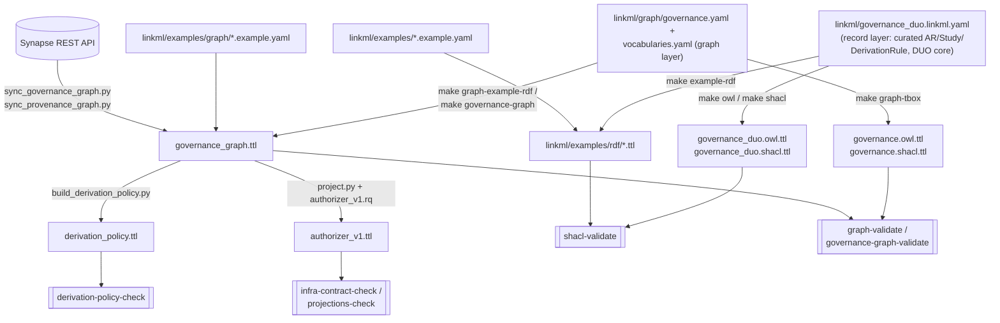

# Knowledge graph representation

"The knowledge graph" for governanceDUO is not one artifact — it's RDF generated
from **two independent LinkML schemas**, plus a **projections layer** built on top
of one of them. Confusing them (e.g. expecting the record layer's OWL to describe
`gov:ControlLabel`, or the graph layer's canonical export to be what
sagebrain-infra's authorizer reads) leads to wrong assumptions, so this page walks
through each concrete RDF output before going into any one of them. For the design
reasoning behind this split, see [Governance graph design](graph-design.md); this
page is the "what's actually in each file" companion to it.



## 1. Record layer: `governance_duo.owl.ttl` / `.shacl.ttl`

`make owl` (`scripts/build_owl.py`, wrapping LinkML's `OwlSchemaGenerator`) and
`make shacl` (LinkML's stock `gen-shacl`) both generate directly from
`linkml/governance_duo.linkml.yaml` — no instance data. Since the graph-layer
refactor, this schema holds only the **record layer**: curated `AccessRequirement`,
`Study` and `DerivationRule` records and the DUO core (`GovernanceMixin`'s
`dataUseModifiers` and its companion fields). It no longer contains
`ControlLabel`/`DerivationReview` or any `prov:` class — those moved to the graph
layer (`linkml/graph/governance.yaml`) in the refactor
(`plans/model_refactor.md`), and `check_prov_alignment.py` now checks
`shapes/governance.owl.ttl` instead of this file.

`build_owl.py` uses each class's and slot's own `class_uri`/`slot_uri`
(`governanceduo:AccessRequirement`, `governanceduo:dataTier`, ...), so the OWL
describes the IRIs the data actually uses, and it passes the OWL 2 DL profile on
its own (`make owl-profile`, run in CI) — there's no merged-TBox profile check
left to run, since this schema no longer shares any `gov:` term with the graph
layer to merge against. Two reused-vocabulary conventions worth knowing about:

- **Real DUO terms.** Every `DataUseModifierEnum` permissible value with a
  `meaning:` CURIE and a description gets `skos:scopeNote` (not `rdfs:comment`,
  which is reserved for terms this schema mints itself) plus `owl:versionInfo` —
  the same "not ours to give" convention `scripts/build_graph_tbox.py` now applies
  to the graph layer's reused terms (see section 3). The term list is derived from
  the schema at build time, not hardcoded, so it can't silently under-cover a term
  the schema later adds curation text for.
- **Graph vocabulary enums.** `mixins.yaml` imports `linkml/graph/vocabularies.yaml`
  directly, so a record-layer slot ranging over `Permission`/`AccessRequirementType`/
  `DataTier` (`accessType`, `concreteType`, `dataTier`) pulls those SKOS
  vocabularies into this merged build. They're owned and fully declared once, by
  `shapes/governance.owl.ttl` — this generator skips per-value class generation for
  any enum marked `implements: [skos:Concept]`/`[owl:Class]` and declares only the
  bare concept class, so a slot's `rdfs:range` still resolves without this file
  re-asserting the graph TBox's own structure.

  **One enum stayed its own, deliberately: `DataUseModifierEnum`.** It is *not*
  unified with the graph layer's `DataUseTerm` — it keeps its own Sage-local
  `DUOPlus1`–`7` extensions and the "Pending Annotation" curation placeholder,
  which curators still need and which have no place in the graph layer's own
  vocabulary (a curation state isn't a data-use condition). Its `DUOPlus1`–`7`
  values carry `meaning:` IRIs in the **pre-refactor namespace**,
  `sagegov:DUOPlus1`–`7` (`https://sagebionetworks.org/governance/`) — a
  *different* IRI from the graph layer's own `gov:DUOPlus1`–`7`
  (`https://w3id.org/synapse/governance#`, `linkml/graph/vocabularies.yaml`'s
  `DataUseTerm`), which is what a `Condition.dataUseTerm` in the graph actually
  uses. Don't conflate the two: a `Study` or a curated `AccessRequirement`
  record's `dataUseModifiers` slot and a graph `Condition`'s `dataUseTerm` slot
  can both say "DUOPlus1" and mean genuinely different IRIs.

`shapes/governance_duo.shacl.ttl` carries one `sh:NodeShape` per LinkML class (and
mixin), `sh:closed false` with an explicit `sh:ignoredProperties` list (documenting
the full set of properties a class *could* carry via mixins, without hard-failing
on unknown ones), and the usual per-slot cardinality/datatype/pattern constraints.
It does **not** compile `GovernanceMixin`'s conditional `rules:` (the
DUO-code-triggers-required-slot logic — see [The LinkML model](linkml-model.md));
those are enforced separately by `linkml-validate` (`make linkml-validate-examples`),
because LinkML's SHACL and OWL generators can't correctly express a rule's
`equals_string` precondition.

## 2. Record-layer example ABox: `linkml/examples/rdf/*.ttl`

`make example-rdf` (`scripts/convert_examples_to_rdf.py`) is a faithful, generic
LinkML-instance-to-RDF dump of `linkml/examples/*.example.yaml` — record examples
only (`AccessRequirement`, `Study`, `DerivationRule`; the pre-refactor governance-
graph/provenance/derivation-review examples are gone, their facts folded into the
graph layer's own canonical example). Subjects are minted through
`graph_iris.record_iri()`: every record keeps the record namespace
(`governanceduo:<id>`) **except a curated Access Requirement, which lands on its
graph node's own IRI** (R5 of `plans/model_refactor.md`) — no `owl:sameAs` bridge,
no stub class, just more triples on the same subject:

```turtle
@prefix DUO: <http://purl.obolibrary.org/obo/DUO_> .
@prefix governanceduo: <https://w3id.org/sage-bionetworks/governance-duo/> .

<https://w3id.org/synapse/governance/ar/42> a governanceduo:AccessRequirement ;
    governanceduo:StudyKey "study.mc2-jax-5xfad" ;
    governanceduo:contributionDate "2026-01-15" ;
    governanceduo:contributorName "Jane Doe" ;
    governanceduo:dataUseModifiers DUO:0000007 ;
    governanceduo:diseaseSpecificResearch "MONDO:0004975" ;
    governanceduo:entityIdList "syn12345678" .
```

That subject IRI, `https://w3id.org/synapse/governance/ar/42`, is *exactly* the
graph layer's own `govid:ar/42` (section 4) — the same node, described from two
angles in two files. A `Study` record, by contrast, has no graph-layer
counterpart, so it keeps the plain record namespace:

```turtle
@prefix governanceduo: <https://w3id.org/sage-bionetworks/governance-duo/> .
@prefix sagegov: <https://sagebionetworks.org/governance/> .

governanceduo:study.mc2-jax-5xfad a governanceduo:Study ;
    governanceduo:dataUseModifiers sagegov:DUOPlus1 ;
    governanceduo:grantNumber "U54AG079754" ;
    governanceduo:studyDbgapAccessionId "phs000123" ;
    governanceduo:studyName "MC2 Center Pilot Study" .
```

(note `sagegov:DUOPlus1` here — the record layer's own, pre-refactor-namespace
term, per section 1's warning above, not the graph layer's `gov:DUOPlus1`.) This
merged file, `linkml/examples/rdf/all_examples.ttl`, is what `make shacl-validate`
checks against `shapes/governance_duo.shacl.ttl`.

## 3. Graph layer TBox/SHACL: `governance.owl.ttl` / `.shacl.ttl`

`make graph-tbox` (`scripts/build_graph_tbox.py`) generates the **one** TBox and
shape set for all four graph-layer content areas — governance, conditions,
provenance and derivation policy — from `linkml/graph/governance.yaml` (importing
`linkml/graph/vocabularies.yaml`). This single pair replaces what used to be four
separate files (the record layer's partial coverage, plus
`governance_graph.owl.ttl`, `governance_graph.shacl.ttl` and
`provenance_layer.shacl.ttl`, all hand-authored and all deleted in the refactor).
Both come from LinkML's own generators (owlgen, shaclgen); this script applies the
layer's conventions on top:

- **SKOS vocabularies.** An enum marked `implements: [skos:Concept]` (`Permission`,
  `ApprovalStatus`, `SubmissionState`, `AccessRequirementType`, `DataTier`,
  `DerivationReviewStatus`) becomes a concept class with a `<enum_uri>Scheme`
  `skos:ConceptScheme`; each value is a concept with `skos:prefLabel`/
  `skos:notation` (the exact Synapse or DUO code)/`skos:definition`/
  `skos:inScheme`, and `gov:rank` where the value has one (`DataTier`). A value's
  `implements:` becomes `rdfs:subClassOf` — a `Permission` like `DOWNLOAD` is both
  a concept and a subclass of the WAC mode it amounts to (`acl:Read`), which OWL 2
  DL allows (punning).
- **Reused terms get a `skos:scopeNote`, not a definition.** The same "not ours to
  give" rule as the record layer (section 1): a term outside `gov:`
  (`acl:Authorization`, `vcard:Group`, `prov:Activity`, `prov:Usage`, a real DUO
  term, `foaf:Agent`) gets only a bare declaration by default. Where this schema
  itself wrote a description of one — a class whose `class_uri` is external (e.g.
  `Team`'s `vcard:Group`), a reused property (`vcard:hasMember`), or a
  class-valued enum's permissible value (a DUO term, `AgentClass`'s `PUBLIC`) —
  that description becomes `skos:scopeNote`: this schema's own note on how it uses
  the term, not a claim about what the term means:

  ```turtle
  vcard:Group a owl:Class ;
      skos:scopeNote "A Synapse team, identified by its team URL. Membership is recorded, so an evaluator can resolve a team grant to its members." .

  DUO:0000007 a owl:Class ;
      skos:scopeNote "Disease Specific Research - This data use permission indicates that use is allowed provided it is related to the specified disease. ..." .
  ```

- **Every `gov:` term gets `owl:versionInfo`** (the schema's own `GRAPH_VERSION`),
  not just the ontology header — a class, a property, a vocabulary concept and its
  scheme, and a `gov:`-owned class-valued enum value (`gov:DUOPlus1`–`7`).
- **Domain/range are generated**, a union when a property is shared across
  classes, since Neptune doesn't infer and the data is validated against closed
  shapes generated from the same schema — so these can't disagree with the data.
- **Shapes live in their own namespace**, `<ns>shapes#<Class>Shape`
  (`https://w3id.org/synapse/governance/shapes#SynapseEntityShape`), not the class
  IRI, so a shape declaration doesn't collide with the vocabulary it targets.
- **`sh:xone` mutual exclusion is generated, not left to shaclgen.** shaclgen drops
  LinkML's `exactly_one_of` entirely; `add_exactly_one_of()` builds it, with one
  property-shape group per alternative that also asserts `sh:maxCount 0` on every
  slot belonging to a *different* alternative — otherwise a node satisfying one
  branch's `sh:minCount` while also setting another branch's slots would still
  pass `sh:xone` with exactly one match. This is what makes `Usage` genuinely
  "exactly one of an entity reference or a url+name pair," and `Authorization`
  genuinely "exactly one of agent/agentGroup/agentClass."

`scripts/check_graph.py` (`make graph-validate`) checks these conventions hold —
every vocabulary concept has one label/notation/at-most-one-definition and is in a
scheme, no axiom is asserted about a term outside `gov:` (a bare declaration or a
`skos:scopeNote` only), every `gov:` class/property has a label, the only blank
nodes are domain unions, and nothing refers to the pre-refactor namespace — plus
eight deliberate defects in the canonical example, each caught by its intended
shape (`sh:in`, `sh:xone` ×2, `sh:closed`, `sh:minCount`, `sh:class`, `sh:datatype`).

## 4. Graph layer canonical export: `governance_graph.ttl`

`make governance-graph` and `make graph-example-rdf` (`scripts/graph_rdf.py`) write
`governance_graph_export/governance_graph.ttl` and
`linkml/examples/graph/rdf/governance_graph.ttl` respectively, both from the same
source: `linkml/examples/graph/*.example.yaml`. Unlike the pre-refactor
`build_governance_graph.py`, this is a **fully generic** LinkML-object-to-RDF dump —
`graph_rdf.to_rdf()` calls `RDFLibDumper` on every member of the schema's
`GovernanceGraph` container and concatenates the result; there is no hand-rolled
Python control flow reshaping ids or deriving convenience edges. (Those
convenience edges — `gov:hasACL`, `gov:hasAccessRequirement`, `gov:hasApproval`,
`Direct`/`Inferred` binding — don't exist on the canonical graph at all any more;
they're what the projection derives, section 6.) The same builder
(`build_graph.GraphBuilder`) and emitter back the Synapse syncs, so a live sync and
the illustrative example are structurally identical in shape, differing only in
their data source.

```turtle
@prefix gov: <https://w3id.org/synapse/governance#> .
@prefix syn: <https://www.synapse.org/Synapse:> .
@prefix synuser: <https://www.synapse.org/Profile:> .
@prefix prov: <http://www.w3.org/ns/prov#> .

<https://w3id.org/synapse/governance/activity/1001> a prov:Activity ;
    prov:generated syn:syn30000001 ;
    prov:qualifiedUsage <https://w3id.org/synapse/governance/activity/1001/usage/1>,
        <https://w3id.org/synapse/governance/activity/1001/usage/2> ;
    gov:name "Derive per-sample QC summary" .

<https://w3id.org/synapse/governance/activity/1001/usage/1> a prov:Usage ;
    prov:entity syn:syn10081783 ;
    gov:wasExecuted false .

<https://w3id.org/synapse/governance/activity/1001/usage/2> a prov:Usage ;
    prov:entity syn:syn40000002 ;
    gov:wasExecuted true .
```

`syn10081783` is the non-executed input (data that was read); `syn40000002` is the
executed one (the tool that ran), distinguished by `gov:wasExecuted`, exactly the
`Usage` shape's `sh:xone` from section 3. Note there is no `prov:wasDerivedFrom`
here at all — the canonical graph records only what was queried from Synapse (the
qualified usages); the implied derivation edge is a projection
(`projections/provenance.rq`, used internally by the derivation builder, section
5).

`make governance-graph-validate` and `make graph-validate` both check this export
against `shapes/governance.shacl.ttl` with `shapes/governance.owl.ttl` as the
ontology graph (pySHACL, inference off).

## 5. Derivation policy output: `derivation_policy.ttl`

`make derivation-policy` (`scripts/build_derivation_policy.py`) reads one or more
canonical graphs (`--graph`, repeatable — the governance and provenance content
share one graph now, not two), computes a `ControlLabel` per entity by walking
`gov:parent+`/`gov:requiresAR` for Access Requirements and
`projections/provenance.rq`'s derived `prov:wasDerivedFrom` (plus every declared
sub-property of it) for ancestry, then flags `DerivationReview`s. Output is built
through the same `GraphBuilder`/`graph_rdf.to_rdf` path as everything else,
written to `derivation_policy_export/derivation_policy.ttl`:

```turtle
@prefix gov: <https://w3id.org/synapse/governance#> .
@prefix syn: <https://www.synapse.org/Synapse:> .

<https://w3id.org/synapse/governance/control-label/syn30000001> a gov:ControlLabel ;
    gov:computedFrom <https://w3id.org/synapse/governance/activity/1001> ;
    gov:dataTier gov:UnclassifiedTier ;
    gov:sourceAccessRequirements <https://w3id.org/synapse/governance/ar/42> ;
    gov:subject syn:syn30000001 .
```

`gov:dataTier` is a `DataTier` *concept IRI*, not a string — here
`gov:UnclassifiedTier`, because the canonical example's `govid:ar/42` carries no
curated `dataTier` in this illustrative fixture, and an Access Requirement with no
recorded tier fails closed to `Unclassified` (ranked above `Private`) rather than
reading as unrestricted. `gov:computedFrom` names the Activity the label traces to,
and `gov:sourceAccessRequirements` every AR that contributed — this is what lets a
query answer "which ARs does this derived file inherit?" without re-walking
ancestry (section 8 of [Governance graph design](graph-design.md)).

`make derivation-policy-check` runs this over a committed fixture
(`linkml/examples/derivation_policy/fixture/`) and asserts 13 assertions on the
output, including that a sagebrain-shaped Association inherits a label through
`sagebrain:derived_from` — and that the output, merged with its inputs, conforms to
`shapes/governance.shacl.ttl`.

## 6. Projections: `authorizer_v1.ttl`

`make projections` (`scripts/project.py`, running `projections/authorizer_v1.rq`
as a SPARQL `CONSTRUCT`) writes
`governance_graph_export/authorizer_v1.ttl` — the **one artifact deliberately in
the pre-refactor namespace**, `https://sagebionetworks.org/governance/`, because
it exists to reproduce sagebrain-infra's existing (commit `fc6de51`) authorizer
contract unchanged, while the canonical graph itself moves to WAC and the new
namespace underneath it:

```turtle
@prefix gov: <https://sagebionetworks.org/governance/> .
@prefix syn: <https://www.synapse.org/Synapse:> .

gov:principal-2000001 gov:hasApproval gov:AR-42 .

syn:syn10081783 gov:hasACL gov:grant-syn10081783-9000001 ;
    gov:hasAccessRequirement gov:AR-42 .

syn:syn2343195 gov:hasAccessRequirement gov:AR-42 .

gov:grant-syn10081783-9000001 a gov:AccessGrant ;
    gov:bindingType gov:Direct ;
    gov:permission gov:ACCESS, gov:DOWNLOAD ;
    gov:principal gov:principal-9000001 ;
    gov:source gov:Synapse .
```

None of this is stored on the canonical graph: `gov:hasACL`/`gov:hasAccessRequirement`
are materialized here over `gov:benefactor`/`gov:parent*`; `gov:bindingType` is
computed from whether the entity is its own benefactor; `gov:principal-<id>` is
minted fresh for the projection's own suffix-matching contract;
`gov:ACCESS` is derived on every grant that also carries `DOWNLOAD` (Synapse has no
such permission — it's SageBrain's Cedar action); and `gov:hasApproval` only
appears for an `Approval` that's `Approved` and not past `expiresAt` as of the
projection's `--as-of` time (bound through SPARQL `initBindings`, never spliced
into the query text). Team grants stay at the team's own principal id here — member
expansion is the separate, opt-in `authorizer_v1_teams.rq` (`make projections
TEAMS=1`), which carries `gov:viaTeam` and copies its source grant's binding type
rather than re-deriving it.

`make projections-check` (`scripts/check_projections.py`) runs a golden diff
against `tests/golden/governance_graph.ttl` restricted to authorizer-relevant
facts (the only allowed differences are `Inherited`→`Inferred` and an extra
`hasAccessRequirement` edge on an AR's own subject), plus approval expiry,
team-member-only-via-teams-projection, and descendant-grant-is-`Inferred`.
`make infra-contract-check` (`scripts/check_infra_contract.py`) then runs
sagebrain-infra's own pinned query (`tests/infra_contract/authorize_query.rq`)
against this file, asserting a DOWNLOAD grantee is allowed and a READ-only or
unlisted principal is denied.

## Validation summary

| Artifact | Generator | Validated by |
|---|---|---|
| `governance_duo.owl.ttl` / `.shacl.ttl` | `make owl` / `make shacl` | `make owl-profile` (OWL 2 DL) |
| `linkml/examples/rdf/*.ttl` | `make example-rdf` | `make shacl-validate` |
| `governance.owl.ttl` / `.shacl.ttl` | `make graph-tbox` | `make graph-validate` (`check_graph.py`), `make graph-owl-profile` (OWL 2 DL, alone and with every ABox) |
| `governance_graph.ttl` (canonical export) | `make governance-graph` / `graph-example-rdf` | `make governance-graph-validate` / `graph-validate` |
| `derivation_policy.ttl` | `make derivation-policy` | `make derivation-policy-check` |
| `authorizer_v1.ttl` (+ `_teams.ttl`) | `make projections` | `make projections-check`, `make infra-contract-check` |
| Live sync output (`*_synced.ttl`) | `make sync-governance-graph` / `sync-provenance-graph` | offline, against fake Synapse clients: `make sync-governance-check` / `sync-provenance-check` |
| All of the above, together | — | `make validate-all` (CI on every PR), `make artifact-drift-check` (committed artifacts match a fresh regeneration), `make sagebrain-contract-check SAGEBRAIN_MODEL=<path>` (opt-in) |

## Where to look next

| For | See |
|---|---|
| Why the model is split this way, and how sagebrain-infra/sagebrain-model consume it | [Governance graph design](graph-design.md) |
| Every class, slot and enum in both schemas | [Schema reference](reference/index.md) |
| LinkML conventions (mixins, rules, DUO shorthand) | [The LinkML model](linkml-model.md) |
| Changes identified for other repositories, not made here | [Downstream changes](downstream_changes.md) |
| The refactor itself: decisions, phases, verification | [`plans/model_refactor.md`](https://github.com/mc2-center/governanceDUO/blob/main/plans/model_refactor.md), [`plans/model_refactor_report.md`](https://github.com/mc2-center/governanceDUO/blob/main/plans/model_refactor_report.md) |
