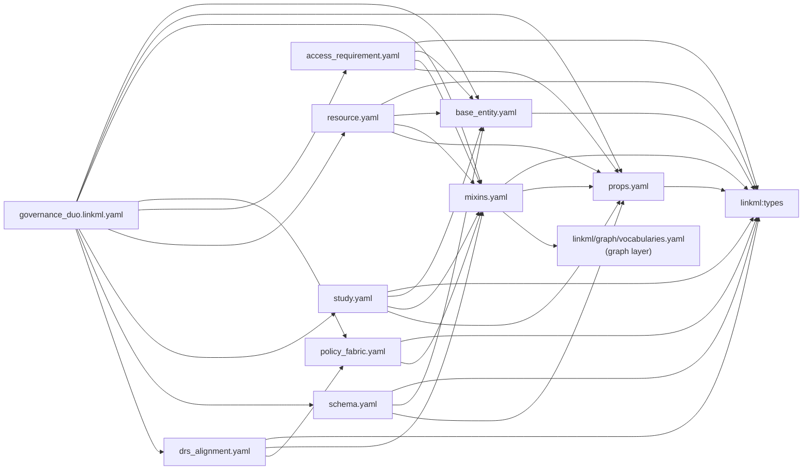

# The LinkML model

This page covers the **record layer**: `linkml/governance_duo.linkml.yaml`, the
single entry point that imports every other record-layer module and declares the
union of all prefixes. Import an individual module instead if you only need part of
the model. The **graph layer** (`linkml/graph/governance.yaml` +
`vocabularies.yaml`) is a separate, independently-versioned schema, covered in
[Governance graph design](graph-design.md) and
[Technical implementation](graph-design-implementation.md) instead.

## Import graph

`base_entity.yaml` and `props.yaml` are deliberately leaves, importing only
`linkml:types`. `mixins.yaml` imports `props` and, since the graph-layer refactor
(`plans/model_refactor.md`), also `linkml/graph/vocabularies.yaml` directly — see
below. None of the three import one of the four entity files, so they can never
form an import cycle with them.



**The graph layer is a second, independent schema tree, not part of this import
graph.** `linkml/graph/governance.yaml` (importing `linkml/graph/vocabularies.yaml`)
is its own schema, versioned and released separately from
`governance_duo.linkml.yaml` above — it is never imported by the umbrella, and
nothing in this diagram imports it except `mixins.yaml`'s one link to
`vocabularies.yaml`, which exists so record-layer slots like `accessType` and
`dataTier` can range over the graph's own vocabulary instead of a duplicate local
enum (see the module table below). For the graph layer's own classes, predicates and
build pipeline, see [Governance graph design](graph-design.md) and
[Technical implementation](graph-design-implementation.md); this page covers only
the record layer (`governance_duo.linkml.yaml` and its imports).

## Module-by-module

| File | Role | Key classes / slots / enums |
| --- | --- | --- |
| [`base_entity.yaml`](https://github.com/mc2-center/governanceDUO/blob/main/linkml/base_entity.yaml) | Shared abstract root | `BaseEntity` (one `id` slot, `slot_uri: dcterms:identifier`, narrowed per class via `slot_usage`) |
| [`props.yaml`](https://github.com/mc2-center/governanceDUO/blob/main/linkml/props.yaml) | Cross-class slots/enums reused by ≥2 entity classes | `AccessRequirementKey`, `StudyKey`; `GeographicalRegionEnum` (ISO 3166-1 alpha-2), `DeidentificationTypeEnum` |
| [`mixins.yaml`](https://github.com/mc2-center/governanceDUO/blob/main/linkml/mixins.yaml) | Cross-cutting slots, the DUO vocabulary, and conditional-requirement rules | `GovernanceMixin`, `ContributionMixin`, `PolicyFabricMixin`, `AssetBinding`, `SynapseAccessRequirementMixin`; `DataUseModifierEnum`, `DataPermissionEnum`, `LicenseEnum`. `accessType`/`concreteType`/`dataTier` range over `linkml/graph/vocabularies.yaml`'s own `Permission`/`AccessRequirementType`/`DataTier` (imported directly; there is no separate `AccessTypeEnum`/`AccessRequirementConcreteTypeEnum`/`DataTierEnum` any more) |
| [`access_requirement.yaml`](https://github.com/mc2-center/governanceDUO/blob/main/linkml/access_requirement.yaml) | `AccessRequirement` | `is_a BaseEntity` + all 4 mixins above; id pattern `^access_requirement\.\d+$` |
| [`resource.yaml`](https://github.com/mc2-center/governanceDUO/blob/main/linkml/resource.yaml) | `Resource` | `is_a BaseEntity` + `GovernanceMixin`; id pattern `^resource\.[A-Za-z0-9]+$` |
| [`study.yaml`](https://github.com/mc2-center/governanceDUO/blob/main/linkml/study.yaml) | `Study` | `is_a BaseEntity` + `GovernanceMixin`; id pattern `^study\.[A-Za-z0-9_-]+$`; several slots carry caDSR `cde_id` annotations |
| [`schema.yaml`](https://github.com/mc2-center/governanceDUO/blob/main/linkml/schema.yaml) | `Schema` (registered JSON-schema records) | `is_a BaseEntity`; id pattern `^schema\.[A-Za-z0-9_-]+$` |
| [`policy_fabric.yaml`](https://github.com/mc2-center/governanceDUO/blob/main/linkml/policy_fabric.yaml) | Policy Fabric crosswalk schema — see [Policy Fabric integration](policy-fabric.md) | `PolicyCardBinding`, `CredentialRequirement`, `ReferenceValueSource`, `CredentialTypeEnum` |
| [`drs_alignment.yaml`](https://github.com/mc2-center/governanceDUO/blob/main/linkml/drs_alignment.yaml) | Design-only GA4GH DRS interoperability crosswalk — see [DRS interoperability](drs-interop.md) | `DrsObjectMapping`, `DrsAuthorizationBinding`, `DrsAuthTypeEnum` |

*(`governance_graph.yaml` and `provenance.yaml`, formerly listed here, were retired
in the graph-layer refactor — their classes moved to the separate
`linkml/graph/governance.yaml` schema above.)*

Full per-class/slot/enum detail (including an auto-drawn Mermaid diagram and, where
one exists, an embedded example) is in the [schema reference](reference/index.md).

## DUO term reuse and other ontology mappings

Real DUO terms are reused **by IRI**, not re-minted: `DataUseModifierEnum`'s
permissible values carry `meaning: DUO:0000007` (etc.) pointing at the actual
`obo:DUO_<n>` IRI. The 7 Sage-local extensions (`DUOPlus1`–`DUOPlus7`) have no DUO IRI
to reuse, so they're marked `annotations.sage_extension: true` instead.

Beyond DUO, individual slots carry `exact_mappings` (a real ontology term is a precise
match — e.g. `dcterms:conformsTo`, `dcterms:creator`, `NCIT:C175887`) or
`close_mappings` (the shape differs — e.g. `prov:wasAttributedTo` for
`contributorName`, which holds a literal name rather than an Agent reference), always
with a `comments:` entry explaining the choice. `study.yaml`'s slots additionally carry
`annotations.cde_id` linking them to NCI caDSR Common Data Elements — a separate
crosswalk axis from the ontology mappings.

## id patterns as URI minting

Every class's `id` slot carries a regex `pattern` in its `slot_usage` (e.g.
`^study\.[A-Za-z0-9_-]+$`, `^access_requirement\.\d+$`). Combined with
`identifier: true` + `slot_uri: dcterms:identifier` on `base_entity.yaml`'s shared
`id` slot, this is what turns an instance's `id` value into its RDF subject URI
(`governanceduo:<id>`) when dumped to RDF — see
[Knowledge graph representation](knowledge-graph.md). A curated `AccessRequirement`
is the one exception: its record shares the graph layer's own IRI rather than
minting a `governanceduo:` one (R5 of `plans/model_refactor.md`). The graph layer's
own classes (`SynapseEntity` among them) don't use this record-layer pattern
mechanism at all — every graph-layer IRI is minted by `scripts/graph_iris.py`; see
[Technical implementation, section 1](graph-design-implementation.md#1-identifiers-and-namespaces).

## `GovernanceMixin`'s conditional rules

`GovernanceMixin` carries the DUO data-use-modifier vocabulary (`dataUseModifiers`)
plus ~35 `rules:` entries that make companion slots required whenever a specific DUO
code is present. For example:

```yaml
rules:
  - preconditions:
      slot_conditions:
        dataUseModifiers:
          equals_string: DUO:0000022
    postconditions:
      slot_conditions:
        geographicalRestriction:
          required: true
```

reads as: if `dataUseModifiers` contains `DUO:0000022` ("Geographical Restriction"),
`geographicalRestriction` becomes required. These rules are LinkML conditional
requirements, checked by `linkml-validate`/generated JSON Schema `if/then` — SHACL
validation (`make shacl-validate`) does not cover them, and they are deliberately left
out of the generated OWL (see `scripts/build_owl.py`).

## A concrete instance

[`linkml/examples/study.example.yaml`](https://github.com/mc2-center/governanceDUO/blob/main/linkml/examples/study.example.yaml):

```yaml
id: study.mc2-jax-5xfad
grantNumber:
  - U54AG079754
studyName: MC2 Center Pilot Study
studyDescription: >-
  Pilot investigation into tumor microenvironment signaling in a genetically
  engineered mouse model cohort.
studyInvestigator: Jane Doe
studyParticipantNumber: 25
studySampleNumber: 40
studyDeidentificationType:
  - SafeHarbor
studyDbgapAccessionId: phs000123
dataUseModifiers:
  - DUOPlus1
sourceGeography:
  - US
```

`dataUseModifiers` contains `DUOPlus1` ("Source geography is relevant to governance
decisions"), so `GovernanceMixin`'s rule for `DUOPlus1` requires `sourceGeography` —
present here as `US`. See this same instance rendered as RDF, and as an entry in the
[schema reference](reference/classes/Study.md)'s embedded example, in
[Knowledge graph representation](knowledge-graph.md).
