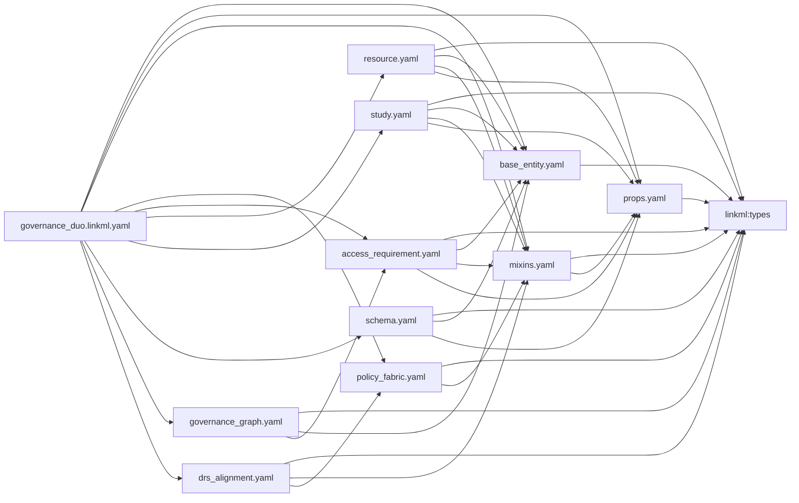

# The LinkML model

`linkml/governance_duo.linkml.yaml` is the single entry point — it imports every other
module and declares the union of all prefixes. Import an individual module instead if
you only need part of the model.

## Import graph

`base_entity.yaml`, `props.yaml`, and `mixins.yaml` are deliberately leaves: they
import only `linkml:types` (and, for `mixins.yaml`, `props`), never one of the four
entity files, so they can never form an import cycle with them.



`governance_graph.yaml` depends on `mixins.yaml` transitively, through
`access_requirement.yaml` — this is why Synapse-native slots shared between
`AccessRequirement` and `SynapseEntity` (`name`, `etag`, `createdBy`, `createdOn`,
`currentRevNum`) live in `mixins.yaml` rather than `governance_graph.yaml`: putting
them there would create a cycle (`governance_graph.yaml` already reaches `mixins.yaml`
through `access_requirement.yaml`).

## Module-by-module

| File | Role | Key classes / slots / enums |
| --- | --- | --- |
| [`base_entity.yaml`](../linkml/base_entity.yaml) | Shared abstract root | `BaseEntity` (one `id` slot, `slot_uri: dcterms:identifier`, narrowed per class via `slot_usage`) |
| [`props.yaml`](../linkml/props.yaml) | Cross-class slots/enums reused by ≥2 entity classes | `AccessRequirementKey`, `StudyKey`; `GeographicalRegionEnum` (ISO 3166-1 alpha-2), `DeidentificationTypeEnum` |
| [`mixins.yaml`](../linkml/mixins.yaml) | Cross-cutting slots, the DUO vocabulary, and conditional-requirement rules | `GovernanceMixin`, `ContributionMixin`, `PolicyFabricMixin`, `AssetBinding`, `SynapseAccessRequirementMixin`; `DataUseModifierEnum`, `AccessTypeEnum`, `AccessRequirementConcreteTypeEnum`, `DataPermissionEnum`, `DataTierEnum`, `LicenseEnum` |
| [`access_requirement.yaml`](../linkml/access_requirement.yaml) | `AccessRequirement` | `is_a BaseEntity` + all 4 mixins above; id pattern `^access_requirement\.\d+$` |
| [`resource.yaml`](../linkml/resource.yaml) | `Resource` | `is_a BaseEntity` + `GovernanceMixin`; id pattern `^resource\.[A-Za-z0-9]+$` |
| [`study.yaml`](../linkml/study.yaml) | `Study` | `is_a BaseEntity` + `GovernanceMixin`; id pattern `^study\.[A-Za-z0-9_-]+$`; several slots carry caDSR `cde_id` annotations |
| [`schema.yaml`](../linkml/schema.yaml) | `Schema` (registered JSON-schema records) | `is_a BaseEntity`; id pattern `^schema\.[A-Za-z0-9_-]+$` |
| [`governance_graph.yaml`](../linkml/governance_graph.yaml) | RDF/graph representation of the SageBrain "Governance Graph" design — see [Knowledge graph representation](knowledge-graph.md) | `SynapseEntity`, `Principal`, `AccessGrant`, `AccessRequirementAssociation`, `DataAccessSubmission`, `DataAccessSubmissionStatus` |
| [`policy_fabric.yaml`](../linkml/policy_fabric.yaml) | Policy Fabric crosswalk schema — see [Policy Fabric integration](policy-fabric.md) | `PolicyCardBinding`, `CredentialRequirement`, `ReferenceValueSource`, `CredentialTypeEnum` |
| [`drs_alignment.yaml`](../linkml/drs_alignment.yaml) | Design-only GA4GH DRS interoperability crosswalk — see [DRS interoperability](drs-interop.md) | `DrsObjectMapping`, `DrsAuthorizationBinding`, `DrsAuthTypeEnum` |

Full per-class/slot/enum detail (including an auto-drawn Mermaid diagram and, where
one exists, an embedded example) is in the [schema reference](reference/index.md).

## DUO term reuse and other ontology mappings

Real DUO terms are reused **by IRI**, not re-minted: `DataUseModifierEnum`'s
permissible values carry `meaning: DUO:0000007` (etc.) pointing at the actual
`obo:DUO_<n>` IRI. The 7 Sage-local extensions (`DUOPlus1`–`DUOPlus7`) have no DUO IRI
to reuse, so they're marked `annotations.sage_extension: true` instead.

Beyond DUO, individual slots carry `exact_mappings` (a real ontology term is a precise
match — e.g. `dcterms:conformsTo`, `dcterms:creator`, `NCIT:C175887`) or
`close_mappings` (the shape differs — e.g. `prov:wasAttributedTo` for
`contributorName`, which holds a literal name rather than an Agent reference), always
with a `comments:` entry explaining the choice. `study.yaml`'s slots additionally carry
`annotations.cde_id` linking them to NCI caDSR Common Data Elements — a separate
crosswalk axis from the ontology mappings.

## id patterns as URI minting

Every class's `id` slot carries a regex `pattern` in its `slot_usage` (e.g.
`^study\.[A-Za-z0-9_-]+$`, `^access_requirement\.\d+$`, `^syn\d+$` for
`SynapseEntity`). Combined with `identifier: true` + `slot_uri: dcterms:identifier` on
`base_entity.yaml`'s shared `id` slot, this is what turns an instance's `id` value into
its RDF subject URI (`governanceduo:<id>`) when dumped to RDF — see
[Knowledge graph representation](knowledge-graph.md).

## `GovernanceMixin`'s conditional rules

`GovernanceMixin` carries the DUO data-use-modifier vocabulary (`dataUseModifiers`)
plus ~35 `rules:` entries that make companion slots required whenever a specific DUO
code is present. For example:

```yaml
rules:
  - preconditions:
      slot_conditions:
        dataUseModifiers:
          equals_string: DUO:0000022
    postconditions:
      slot_conditions:
        geographicalRestriction:
          required: true
```

reads as: if `dataUseModifiers` contains `DUO:0000022` ("Geographical Restriction"),
`geographicalRestriction` becomes required. These rules are LinkML conditional
requirements, checked by `linkml-validate`/generated JSON Schema `if/then` — SHACL
validation (`make shacl-validate`) does not cover them.

## A concrete instance

[`linkml/examples/study.example.yaml`](../linkml/examples/study.example.yaml):

```yaml
id: study.mc2-jax-5xfad
grantNumber:
  - U54AG079754
studyName: MC2 Center Pilot Study
studyDescription: >-
  Pilot investigation into tumor microenvironment signaling in a genetically
  engineered mouse model cohort.
studyInvestigator: Jane Doe
studyParticipantNumber: 25
studySampleNumber: 40
studyDeidentificationType:
  - SafeHarbor
studyDbgapAccessionId: phs000123
dataUseModifiers:
  - DUOPlus1
sourceGeography:
  - US
```

`dataUseModifiers` contains `DUOPlus1` ("Source geography is relevant to governance
decisions"), so `GovernanceMixin`'s rule for `DUOPlus1` requires `sourceGeography` —
present here as `US`. See this same instance rendered as RDF, and as an entry in the
[schema reference](reference/classes/Study.md)'s embedded example, in
[Knowledge graph representation](knowledge-graph.md).
