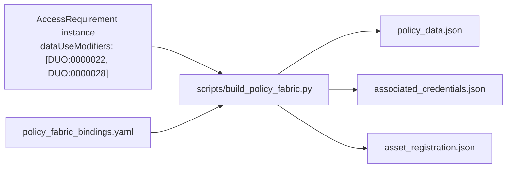

# Policy Fabric integration

[Policy Fabric](https://github.com/hasan7n/tmp-policies) (reference implementation of
"A Technical Policy Blueprint for Trustworthy Decentralized AI") separates a **Policy
Engine** — which executes Rego/OPA "policy objects" against a requester's W3C
Verifiable Credentials — from an **Asset Guardian**, which enforces capability access
to a registered asset. Its `policy_cards/` are authored **one per DUO code**, each
pairing a "Reference Values Schema" (owner-configured values, e.g. `allowedCountries`)
with a set of required Verifiable Credential types/claims.

That's the same axis governanceDUO's `DataUseModifierEnum` already encodes via
`meaning: DUO:0000xx`. `linkml/policy_fabric.yaml` and `linkml/policy_fabric_bindings.yaml`
turn that alignment into machine-usable inputs for the real system: a `PolicyCardBinding`
per verified `policy_cards/<name>/` folder, and a script that walks an
`AccessRequirement` instance's `dataUseModifiers` to build Policy Fabric's actual
`policy_data.json`, credential list, and Asset registration record. See
[`plans/policy_fabric_alignment.md`](../plans/policy_fabric_alignment.md) for the full
design rationale; this page covers the resulting schema and a worked example.

## Schema vs. data

- **`policy_fabric.yaml`** (schema) defines `PolicyCardBinding` — the shape of one
  binding row — plus `CredentialRequirement`, `ReferenceValueSource`, and the 14-value
  `CredentialTypeEnum` (the Verifiable Credential types defined in
  `tmp-policies/credentials/*.schema.json`). It imports `mixins.yaml` for
  `DataUseModifierEnum`.
- **`policy_fabric_bindings.yaml`** is *data*, not schema: 21 `PolicyCardBinding` rows
  — one per verified `policy_cards/<name>/` folder — validated against
  `PolicyCardBindingCollection` (the `tree_root` container class).

Two real rows, verified directly from `tmp-policies`' own `policy.rego`/
`policy_data_schema.json` files:

```yaml
- dataUseModifier: DUO:0000022
  policyCardName: geographical-restriction
  referenceValueKeys:
    - allowedCountries
  referenceValueSources:
    - referenceValueKey: allowedCountries
      sourceSlot: geographicalRestriction
      keyIsMultivalued: true
  requiredCredentials:
    - credentialType: LocationCredential
      requiredClaims: [locatedAt.country]
    - credentialType: publicKeyCredential
      requiredClaims: [key]
  capabilityOperation: do_download

- dataUseModifier: DUO:0000028
  policyCardName: institution-specific-restriction
  referenceValueKeys:
    - allowedInstitutions
  referenceValueSources:
    - referenceValueKey: allowedInstitutions
      sourceSlot: institutionDids
      keyIsMultivalued: true
  requiredCredentials:
    - credentialType: AffiliationCredential
      requiredClaims: [isMemberOf]
    - credentialType: publicKeyCredential
      requiredClaims: [key]
  capabilityOperation: do_download
```

The second row is why `institutionDids` exists as a *separate* slot from the
pre-existing, ROR-patterned `institutionSpecificRestriction`: Policy Fabric's
`AffiliationCredential.isMemberOf` claim and its `allowedInstitutions` reference value
both expect organization **DIDs**, not ROR ids, and no standard ROR→DID resolution
exists yet. The two slots are kept side by side rather than reinterpreting one as the
other — see `mixins.yaml`'s `institutionDids` description for the full rationale.

## `PolicyFabricMixin`

Applied only to `AccessRequirement` — it already carries `entityIdList` (the concrete
Synapse containers governed) and `dataUseModifiers` (which DUO codes/`policy_cards`
apply), making it the natural analog of Policy Fabric's Asset + exposed-policy
pairing. All fields are optional; a governanceDUO record can exist before, or without
ever, being deployed into Policy Fabric:

| Slot | Purpose |
| --- | --- |
| `assetDids` | Policy Fabric Asset-registry DID(s), order-aligned with `entityIdList` |
| `guardianDataSource` | The data path/source configured for this asset's Guardian |
| `guardianUrl` | The deployed Guardian service URL for this asset |
| `policyContractDid` | DID of the deployed `rego_policy_agent`/`rego_token` contract pair once this AR's DUO codes are exposed as a policy |
| `trustedIssuerDids` | DID(s) of the Verifiable Credential issuer(s) this AR's owner trusts — varies per record, unlike `PolicyCardBinding.requiredCredentials` |

## End-to-end worked example

[`linkml/examples/access_requirement_policy_fabric.example.yaml`](../linkml/examples/access_requirement_policy_fabric.example.yaml):

```yaml
id: access_requirement.101
contributorName: Jane Doe
contributionDate: "2026-01-15"
StudyKey:
  - study.mc2-jax-5xfad
entityIdList:
  - syn98765432
dataUseModifiers:
  - DUO:0000022
  - DUO:0000028
geographicalRestriction:
  - US
institutionDids:
  - did:example:best_university
assetDids:
  - did:example:asset123
guardianDataSource: /tmp/asset_data.txt
trustedIssuerDids:
  - did:example:sage_bionetworks_issuer
```



Running `make policy-fabric` (`scripts/build_policy_fabric.py`, looking up each DUO
code in `dataUseModifiers` against `policy_fabric_bindings.yaml` and pulling values
from the named `sourceSlot`) produces, in `policy_fabric_export/`:

```json
// policy_data.json — merged reference values across both DUO codes
{
  "allowedCountries": ["US"],
  "allowedInstitutions": ["did:example:best_university"]
}
```

```json
// associated_credentials.json — deduplicated credential/claim list
[
  {"credentialType": "LocationCredential", "requiredClaims": ["locatedAt.country"]},
  {"credentialType": "publicKeyCredential", "requiredClaims": ["key"]},
  {"credentialType": "AffiliationCredential", "requiredClaims": ["isMemberOf"]}
]
```

```json
// asset_registration.json — mirrors the real Django Asset model (name, did, metadata)
{
  "name": "access_requirement.101",
  "did": "did:example:asset123",
  "metadata": {
    "data_source": "/tmp/asset_data.txt",
    "guardian_url": null
  }
}
```

`policy_data.json`'s two keys come straight from the two bindings above:
`allowedCountries` from `geographicalRestriction`, `allowedInstitutions` from
`institutionDids` — exactly the tutorial's expected
`{"allowedCountries": ["US"], "allowedInstitutions": ["did:example:best_university"]}`
shape. `asset_registration.json`'s `did` is `assetDids[0]`, and `guardian_url` is
`null` because this example doesn't set `guardianUrl`.

## Open items

- No ROR→DID resolution standard exists, so `institutionSpecificRestriction` (ROR) and
  `institutionDids` (DID) remain separate, parallel slots rather than one.
- Upstream, Policy Fabric has no formal Policy Card JSON Schema — it's a Markdown
  convention. Only `policy_data_schema.json` and `policy.rego` per `policy_cards/`
  folder are real machine-readable artifacts, and `PolicyCardBinding` rows were
  verified directly against those, folder by folder.

See [`PolicyCardBinding`](reference/classes/PolicyCardBinding.md) and
[`PolicyFabricMixin`](reference/classes/PolicyFabricMixin.md) in the
[schema reference](reference/index.md) for the full slot listing.
