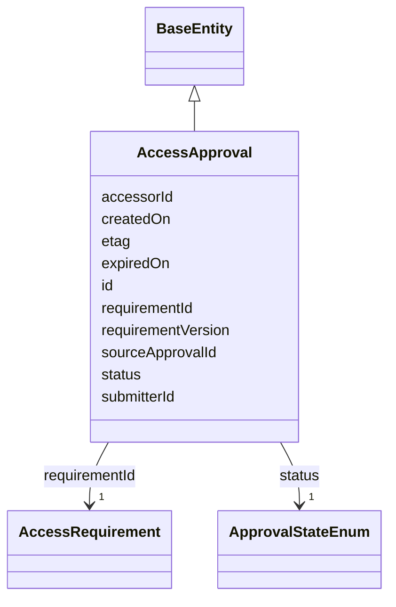

---
search:
  boost: 10.0
---

# Class: AccessApproval 


_Records that a Principal has been approved for access under an AccessRequirement. Mirrors Synapse's real AccessApproval REST object (org.sagebionetworks.repo.model.AccessApproval) -- a *separate* object from DataAccessSubmission/DataAccessSubmissionStatus (the workflow/audit trail that produces one), verified directly against rest-docs.synapse.org and the OpenAPI spec. Maps onto the target ontology (proposed in review on sagebrain-infra PR #54) as gov:Approval: gov:satisfies (requirementId), gov:heldBy (accessorId), gov:status (this class's own status slot -- range ApprovalStateEnum, deliberately not the shared "state" slot, which ranges over the unrelated SubmissionStateEnum), gov:expiresAt (expiredOn)._

_gov:hasApproval (Principal -> AccessRequirement) is re-derived from this class (status == APPROVED) as the primary source going forward -- see add_access_approval() in build_governance_graph.py. The existing DataAccessSubmissionStatus-sourced gov:hasApproval edge is left as-is, not replaced (authorize.py's SPARQL contract touches neither). See plans/governance_graph_open_questions.md Section B._


<div data-search-exclude markdown="1">


URI: [sagegov:AccessApproval](https://sagebionetworks.org/governance/AccessApproval)





## Inheritance
* [BaseEntity](../classes/BaseEntity.md)
    * **AccessApproval**


## Class Properties

| Property | Value |
| --- | --- |
| Class URI | [sagegov:AccessApproval](https://sagebionetworks.org/governance/AccessApproval) |


## Slots

| Name | Cardinality and Range | Description | Inheritance |
| ---  | --- | --- | --- |
| [requirementId](../slots/requirementId.md) | 1 <br/> [AccessRequirement](../classes/AccessRequirement.md) | The AccessRequirement this approval satisfies (AccessApproval | direct |
| [requirementVersion](../slots/requirementVersion.md) | 0..1 <br/> [Integer](../types/Integer.md) | The version of the AccessRequirement this approval satisfies (AccessApproval | direct |
| [submitterId](../slots/submitterId.md) | 0..1 <br/> [Integer](../types/Integer.md) | Synapse numeric user id of who performed the actions to gain this approval (A... | direct |
| [accessorId](../slots/accessorId.md) | 1 <br/> [Integer](../types/Integer.md) | Synapse numeric id of the Principal approved for access (AccessApproval | direct |
| [status](../slots/status.md) | 1 <br/> [ApprovalStateEnum](../enums/ApprovalStateEnum.md) | The state of this approval (AccessApproval | direct |
| [expiredOn](../slots/expiredOn.md) | 0..1 <br/> [Integer](../types/Integer.md) | When this approval will expire (epoch milliseconds; AccessApproval | direct |
| [createdOn](../slots/createdOn.md) | 0..1 <br/> [Integer](../types/Integer.md) | When the record was created (epoch milliseconds in the source Synapse tables) | direct |
| [sourceApprovalId](../slots/sourceApprovalId.md) | 0..1 <br/> [Integer](../types/Integer.md) | Traceability back to the literal AccessApproval | direct |
| [etag](../slots/etag.md) | 0..1 <br/> [String](../types/String.md) | Entity tag for optimistic concurrency control (a 36-character UUID) | direct |
| [id](../slots/id.md) | 1 <br/> [String](../types/String.md) | A synthetic identifier for this approval record (Synapse's real AccessApprova... | [BaseEntity](../classes/BaseEntity.md) |


## Identifier and Mapping Information


### Schema Source


* from schema: https://w3id.org/sage-bionetworks/governance-duo/governance_duo


## Mappings

| Mapping Type | Mapped Value |
| ---  | ---  |
| self | sagegov:AccessApproval |
| native | governanceduo:AccessApproval |


## LinkML Source

<!-- TODO: investigate https://stackoverflow.com/questions/37606292/how-to-create-tabbed-code-blocks-in-mkdocs-or-sphinx -->

### Direct

<details>
```yaml
name: AccessApproval
description: 'Records that a Principal has been approved for access under an AccessRequirement.
  Mirrors Synapse''s real AccessApproval REST object (org.sagebionetworks.repo.model.AccessApproval)
  -- a *separate* object from DataAccessSubmission/DataAccessSubmissionStatus (the
  workflow/audit trail that produces one), verified directly against rest-docs.synapse.org
  and the OpenAPI spec. Maps onto the target ontology (proposed in review on sagebrain-infra
  PR #54) as gov:Approval: gov:satisfies (requirementId), gov:heldBy (accessorId),
  gov:status (this class''s own status slot -- range ApprovalStateEnum, deliberately
  not the shared "state" slot, which ranges over the unrelated SubmissionStateEnum),
  gov:expiresAt (expiredOn).

  gov:hasApproval (Principal -> AccessRequirement) is re-derived from this class (status
  == APPROVED) as the primary source going forward -- see add_access_approval() in
  build_governance_graph.py. The existing DataAccessSubmissionStatus-sourced gov:hasApproval
  edge is left as-is, not replaced (authorize.py''s SPARQL contract touches neither).
  See plans/governance_graph_open_questions.md Section B.'
from_schema: https://w3id.org/sage-bionetworks/governance-duo/governance_duo
is_a: BaseEntity
slots:
- requirementId
- requirementVersion
- submitterId
- accessorId
- status
- expiredOn
- createdOn
- sourceApprovalId
- etag
slot_usage:
  id:
    name: id
    description: A synthetic identifier for this approval record (Synapse's real AccessApproval.id,
      traced via sourceApprovalId below, has no dotted-string form of its own -- mirrors
      this repo's id convention for every other BaseEntity here).
    examples:
    - value: access_approval.9001
    pattern: ^access_approval\.\d+$
  createdOn:
    name: createdOn
    slot_uri: sagegov:createdOn
  etag:
    name: etag
    slot_uri: sagegov:etag
class_uri: sagegov:AccessApproval

```
</details>

### Induced

<details>
```yaml
name: AccessApproval
description: 'Records that a Principal has been approved for access under an AccessRequirement.
  Mirrors Synapse''s real AccessApproval REST object (org.sagebionetworks.repo.model.AccessApproval)
  -- a *separate* object from DataAccessSubmission/DataAccessSubmissionStatus (the
  workflow/audit trail that produces one), verified directly against rest-docs.synapse.org
  and the OpenAPI spec. Maps onto the target ontology (proposed in review on sagebrain-infra
  PR #54) as gov:Approval: gov:satisfies (requirementId), gov:heldBy (accessorId),
  gov:status (this class''s own status slot -- range ApprovalStateEnum, deliberately
  not the shared "state" slot, which ranges over the unrelated SubmissionStateEnum),
  gov:expiresAt (expiredOn).

  gov:hasApproval (Principal -> AccessRequirement) is re-derived from this class (status
  == APPROVED) as the primary source going forward -- see add_access_approval() in
  build_governance_graph.py. The existing DataAccessSubmissionStatus-sourced gov:hasApproval
  edge is left as-is, not replaced (authorize.py''s SPARQL contract touches neither).
  See plans/governance_graph_open_questions.md Section B.'
from_schema: https://w3id.org/sage-bionetworks/governance-duo/governance_duo
is_a: BaseEntity
slot_usage:
  id:
    name: id
    description: A synthetic identifier for this approval record (Synapse's real AccessApproval.id,
      traced via sourceApprovalId below, has no dotted-string form of its own -- mirrors
      this repo's id convention for every other BaseEntity here).
    examples:
    - value: access_approval.9001
    pattern: ^access_approval\.\d+$
  createdOn:
    name: createdOn
    slot_uri: sagegov:createdOn
  etag:
    name: etag
    slot_uri: sagegov:etag
attributes:
  requirementId:
    name: requirementId
    description: The AccessRequirement this approval satisfies (AccessApproval.requirementId
      in Synapse's live REST API). Distinct LinkML slot from AccessRequirementAssociation.accessRequirement/
      DataAccessSubmission.accessRequirementId (which share sagegov:accessRequirement)
      -- this one maps onto the target ontology's gov:satisfies predicate instead,
      since AccessApproval specifically represents *satisfaction* of a requirement,
      not just a binding or an application against it.
    from_schema: https://w3id.org/sage-bionetworks/governance-duo/governance_duo
    rank: 1000
    slot_uri: sagegov:satisfies
    owner: AccessApproval
    domain_of:
    - AccessApproval
    range: AccessRequirement
    required: true
  requirementVersion:
    name: requirementVersion
    description: The version of the AccessRequirement this approval satisfies (AccessApproval.requirementVersion).
    from_schema: https://w3id.org/sage-bionetworks/governance-duo/governance_duo
    rank: 1000
    slot_uri: sagegov:requirementVersion
    owner: AccessApproval
    domain_of:
    - AccessApproval
    range: integer
  submitterId:
    name: submitterId
    description: Synapse numeric user id of who performed the actions to gain this
      approval (AccessApproval.submitterId). Reuses DataAccessSubmission's sagegov:submittedBy
      predicate -- same real-world concept (who acted on the governance workflow),
      emitted as an IRI reference to a sagegov:Principal node, not a literal.
    from_schema: https://w3id.org/sage-bionetworks/governance-duo/governance_duo
    rank: 1000
    slot_uri: sagegov:submittedBy
    owner: AccessApproval
    domain_of:
    - AccessApproval
    range: integer
  accessorId:
    name: accessorId
    description: Synapse numeric id of the Principal approved for access (AccessApproval.accessorId).
      Emitted as an IRI reference to a sagegov:Principal node, mapping onto the target
      ontology's gov:heldBy predicate.
    from_schema: https://w3id.org/sage-bionetworks/governance-duo/governance_duo
    rank: 1000
    slot_uri: sagegov:heldBy
    owner: AccessApproval
    domain_of:
    - AccessApproval
    range: integer
    required: true
  status:
    name: status
    description: The state of this approval (AccessApproval.state in Synapse's live
      REST API -- renamed to "status" here specifically to avoid colliding with DataAccessSubmission/Status's
      own "state" slot, which ranges over the unrelated SubmissionStateEnum). Maps
      onto the target ontology's gov:status.
    from_schema: https://w3id.org/sage-bionetworks/governance-duo/governance_duo
    rank: 1000
    slot_uri: sagegov:status
    owner: AccessApproval
    domain_of:
    - AccessApproval
    range: ApprovalStateEnum
    required: true
  expiredOn:
    name: expiredOn
    description: When this approval will expire (epoch milliseconds; AccessApproval.expiredOn
      in Synapse's live REST API). Maps onto the target ontology's gov:expiresAt --
      the real field plans/rebac_governance_graph_alignment.md's first draft was wrong
      to call an unsourceable gap; see that plan's corrected Grounding section.
    from_schema: https://w3id.org/sage-bionetworks/governance-duo/governance_duo
    rank: 1000
    slot_uri: sagegov:expiresAt
    owner: AccessApproval
    domain_of:
    - AccessApproval
    range: integer
  createdOn:
    name: createdOn
    description: When the record was created (epoch milliseconds in the source Synapse
      tables). Shared the same way as `name` above. Distinct from ContributionMixin's
      contributionDate for the same reason as createdBy above.
    from_schema: https://w3id.org/sage-bionetworks/governance-duo/governance_duo
    exact_mappings:
    - dcterms:created
    rank: 1000
    slot_uri: sagegov:createdOn
    owner: AccessApproval
    domain_of:
    - SynapseAccessRequirementMixin
    - SynapseEntity
    - AccessGrant
    - AccessApproval
    - ResearchProject
    range: integer
  sourceApprovalId:
    name: sourceApprovalId
    description: Traceability back to the literal AccessApproval.id row this record
      was derived from.
    from_schema: https://w3id.org/sage-bionetworks/governance-duo/governance_duo
    rank: 1000
    slot_uri: sagegov:sourceApprovalId
    owner: AccessApproval
    domain_of:
    - AccessApproval
    range: integer
  etag:
    name: etag
    description: Entity tag for optimistic concurrency control (a 36-character UUID).
      Shared the same way as `name` above, by SynapseAccessRequirementMixin (ACCESS_REQUIREMENT.ETAG)
      and SynapseEntity/DataAccessSubmission (NODE.ETAG/DATA_ACCESS_SUBMISSION.ETAG)
      in governance_graph.yaml.
    from_schema: https://w3id.org/sage-bionetworks/governance-duo/governance_duo
    rank: 1000
    slot_uri: sagegov:etag
    owner: AccessApproval
    domain_of:
    - SynapseAccessRequirementMixin
    - SynapseEntity
    - DataAccessSubmission
    - AccessApproval
    - ResearchProject
    range: string
  id:
    name: id
    description: A synthetic identifier for this approval record (Synapse's real AccessApproval.id,
      traced via sourceApprovalId below, has no dotted-string form of its own -- mirrors
      this repo's id convention for every other BaseEntity here).
    examples:
    - value: access_approval.9001
    from_schema: https://w3id.org/sage-bionetworks/governance-duo/governance_duo
    rank: 1000
    slot_uri: dcterms:identifier
    identifier: true
    owner: AccessApproval
    domain_of:
    - BaseEntity
    range: string
    required: true
    pattern: ^access_approval\.\d+$
class_uri: sagegov:AccessApproval

```
</details></div>