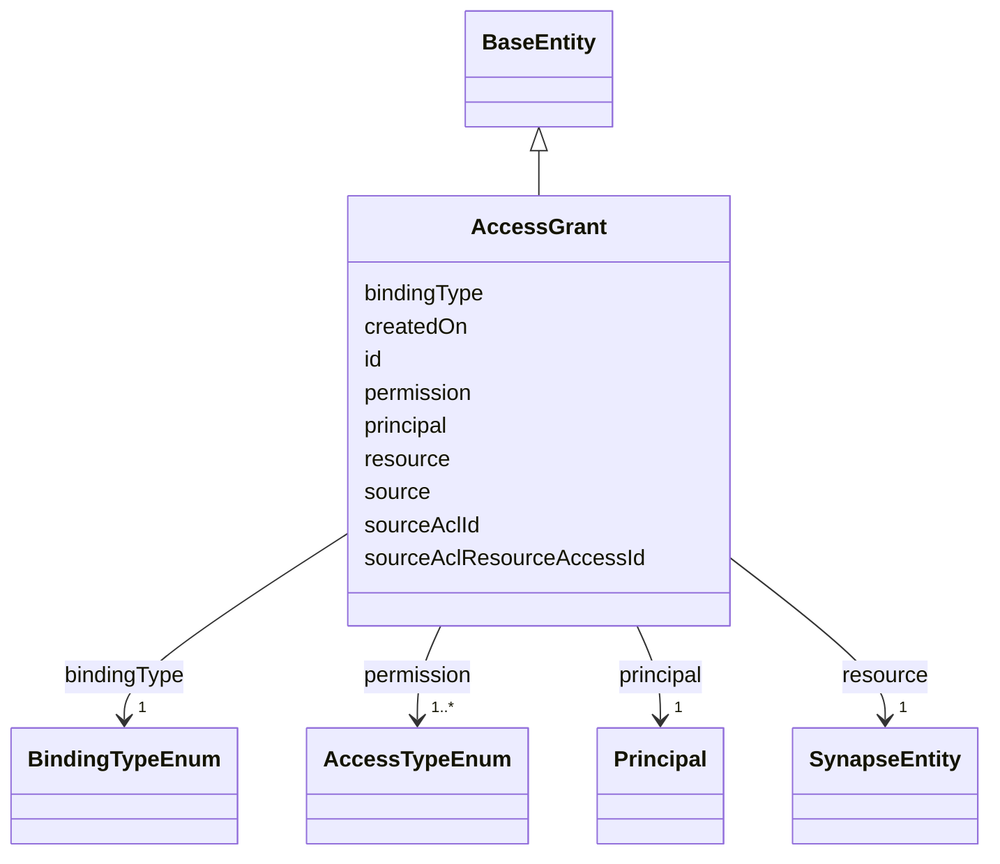

---
search:
  boost: 10.0
---

# Class: AccessGrant 


_A first-class ACL grant: resource, principal, permission(s), source, and whether the grant is direct or inherited. Mirrors ACL + ACL_RESOURCE_ACCESS + ACL_RESOURCE_ACCESS_TYPE. Answers "who has which permission on this resource?" — distinct from AccessRequirementAssociation, which answers "what additional conditions must be satisfied?" (the design doc's central ACL-vs-AR distinction)._


<div data-search-exclude markdown="1">


URI: [sagegov:AccessGrant](https://sagebionetworks.org/governance/AccessGrant)





## Inheritance
* [BaseEntity](../classes/BaseEntity.md)
    * **AccessGrant**


## Class Properties

| Property | Value |
| --- | --- |
| Class URI | [sagegov:AccessGrant](https://sagebionetworks.org/governance/AccessGrant) |


## Slots

| Name | Cardinality and Range | Description | Inheritance |
| ---  | --- | --- | --- |
| [resource](../slots/resource.md) | 1 <br/> [SynapseEntity](../classes/SynapseEntity.md) | The SynapseEntity this grant/association applies to | direct |
| [principal](../slots/principal.md) | 1 <br/> [Principal](../classes/Principal.md) | The user or team this grant applies to | direct |
| [permission](../slots/permission.md) | 1..* <br/> [AccessTypeEnum](../enums/AccessTypeEnum.md) | The permission(s) granted (ACL_RESOURCE_ACCESS_TYPE | direct |
| [source](../slots/source.md) | 0..1 <br/> [String](../types/String.md) | The system this grant/association was derived from, e | direct |
| [bindingType](../slots/bindingType.md) | 1 <br/> [BindingTypeEnum](../enums/BindingTypeEnum.md) |  | direct |
| [createdOn](../slots/createdOn.md) | 0..1 <br/> [Integer](../types/Integer.md) | When the record was created (epoch milliseconds in the source Synapse tables) | direct |
| [sourceAclId](../slots/sourceAclId.md) | 0..1 <br/> [Integer](../types/Integer.md) | Traceability back to the literal ACL | direct |
| [sourceAclResourceAccessId](../slots/sourceAclResourceAccessId.md) | 0..1 <br/> [Integer](../types/Integer.md) | Traceability back to the literal ACL_RESOURCE_ACCESS | direct |
| [id](../slots/id.md) | 1 <br/> [String](../types/String.md) | A synthetic identifier for this grant record (Synapse's ACL/ ACL_RESOURCE_ACC... | [BaseEntity](../classes/BaseEntity.md) |


## Identifier and Mapping Information


### Schema Source


* from schema: https://w3id.org/sage-bionetworks/governance-duo/governance_duo


## Mappings

| Mapping Type | Mapped Value |
| ---  | ---  |
| self | sagegov:AccessGrant |
| native | governanceduo:AccessGrant |
| close | schema:DigitalDocumentPermissionType, dpv:AuthorisationProtocols |


## Examples
### Example: AccessGrant-001

```yaml
id: grant.001
resource: syn10081783
principal: 9000001
permission:
  - DOWNLOAD
source: Synapse
bindingType: Direct
createdOn: 1755100000000
sourceAclId: 42001
sourceAclResourceAccessId: 42101

```


## LinkML Source

<!-- TODO: investigate https://stackoverflow.com/questions/37606292/how-to-create-tabbed-code-blocks-in-mkdocs-or-sphinx -->

### Direct

<details>
```yaml
name: AccessGrant
description: 'A first-class ACL grant: resource, principal, permission(s), source,
  and whether the grant is direct or inherited. Mirrors ACL + ACL_RESOURCE_ACCESS
  + ACL_RESOURCE_ACCESS_TYPE. Answers "who has which permission on this resource?"
  — distinct from AccessRequirementAssociation, which answers "what additional conditions
  must be satisfied?" (the design doc''s central ACL-vs-AR distinction).'
from_schema: https://w3id.org/sage-bionetworks/governance-duo/governance_duo
close_mappings:
- schema:DigitalDocumentPermissionType
- dpv:AuthorisationProtocols
is_a: BaseEntity
slots:
- resource
- principal
- permission
- source
- bindingType
- createdOn
- sourceAclId
- sourceAclResourceAccessId
slot_usage:
  id:
    name: id
    description: A synthetic identifier for this grant record (Synapse's ACL/ ACL_RESOURCE_ACCESS
      tables have their own internal numeric ids, traced via sourceAclId/sourceAclResourceAccessId
      below, but no single natural key for "this grant" as a first-class thing — the
      design doc itself mints one, e.g. gov:grant-001).
    examples:
    - value: grant.001
    pattern: ^grant\.[A-Za-z0-9_-]+$
  createdOn:
    name: createdOn
    slot_uri: sagegov:createdOn
class_uri: sagegov:AccessGrant

```
</details>

### Induced

<details>
```yaml
name: AccessGrant
description: 'A first-class ACL grant: resource, principal, permission(s), source,
  and whether the grant is direct or inherited. Mirrors ACL + ACL_RESOURCE_ACCESS
  + ACL_RESOURCE_ACCESS_TYPE. Answers "who has which permission on this resource?"
  — distinct from AccessRequirementAssociation, which answers "what additional conditions
  must be satisfied?" (the design doc''s central ACL-vs-AR distinction).'
from_schema: https://w3id.org/sage-bionetworks/governance-duo/governance_duo
close_mappings:
- schema:DigitalDocumentPermissionType
- dpv:AuthorisationProtocols
is_a: BaseEntity
slot_usage:
  id:
    name: id
    description: A synthetic identifier for this grant record (Synapse's ACL/ ACL_RESOURCE_ACCESS
      tables have their own internal numeric ids, traced via sourceAclId/sourceAclResourceAccessId
      below, but no single natural key for "this grant" as a first-class thing — the
      design doc itself mints one, e.g. gov:grant-001).
    examples:
    - value: grant.001
    pattern: ^grant\.[A-Za-z0-9_-]+$
  createdOn:
    name: createdOn
    slot_uri: sagegov:createdOn
attributes:
  resource:
    name: resource
    description: The SynapseEntity this grant/association applies to.
    from_schema: https://w3id.org/sage-bionetworks/governance-duo/governance_duo
    rank: 1000
    slot_uri: sagegov:resource
    owner: AccessGrant
    domain_of:
    - AccessGrant
    - AccessRequirementAssociation
    range: SynapseEntity
    required: true
  principal:
    name: principal
    description: The user or team this grant applies to.
    from_schema: https://w3id.org/sage-bionetworks/governance-duo/governance_duo
    close_mappings:
    - prov:agent
    rank: 1000
    slot_uri: sagegov:principal
    owner: AccessGrant
    domain_of:
    - AccessGrant
    range: Principal
    required: true
  permission:
    name: permission
    description: 'The permission(s) granted (ACL_RESOURCE_ACCESS_TYPE.STRING_ELE).
      Multivalued: a single ACL_RESOURCE_ACCESS row can carry more than one permission
      type.'
    from_schema: https://w3id.org/sage-bionetworks/governance-duo/governance_duo
    rank: 1000
    slot_uri: sagegov:permission
    owner: AccessGrant
    domain_of:
    - AccessGrant
    range: AccessTypeEnum
    required: true
    multivalued: true
  source:
    name: source
    description: The system this grant/association was derived from, e.g. "Synapse".
    from_schema: https://w3id.org/sage-bionetworks/governance-duo/governance_duo
    exact_mappings:
    - dcterms:source
    rank: 1000
    slot_uri: sagegov:source
    owner: AccessGrant
    domain_of:
    - AccessGrant
    - AccessRequirementAssociation
    range: string
  bindingType:
    name: bindingType
    from_schema: https://w3id.org/sage-bionetworks/governance-duo/governance_duo
    rank: 1000
    slot_uri: sagegov:bindingType
    owner: AccessGrant
    domain_of:
    - AccessGrant
    - AccessRequirementAssociation
    range: BindingTypeEnum
    required: true
  createdOn:
    name: createdOn
    description: When the record was created (epoch milliseconds in the source Synapse
      tables). Shared the same way as `name` above. Distinct from ContributionMixin's
      contributionDate for the same reason as createdBy above.
    from_schema: https://w3id.org/sage-bionetworks/governance-duo/governance_duo
    exact_mappings:
    - dcterms:created
    rank: 1000
    slot_uri: sagegov:createdOn
    owner: AccessGrant
    domain_of:
    - SynapseAccessRequirementMixin
    - SynapseEntity
    - AccessGrant
    range: integer
  sourceAclId:
    name: sourceAclId
    description: Traceability back to the literal ACL.ID row this grant was derived
      from.
    from_schema: https://w3id.org/sage-bionetworks/governance-duo/governance_duo
    rank: 1000
    slot_uri: sagegov:sourceAclId
    owner: AccessGrant
    domain_of:
    - AccessGrant
    range: integer
  sourceAclResourceAccessId:
    name: sourceAclResourceAccessId
    description: Traceability back to the literal ACL_RESOURCE_ACCESS.ID row this
      grant was derived from.
    from_schema: https://w3id.org/sage-bionetworks/governance-duo/governance_duo
    rank: 1000
    slot_uri: sagegov:sourceAclResourceAccessId
    owner: AccessGrant
    domain_of:
    - AccessGrant
    range: integer
  id:
    name: id
    description: A synthetic identifier for this grant record (Synapse's ACL/ ACL_RESOURCE_ACCESS
      tables have their own internal numeric ids, traced via sourceAclId/sourceAclResourceAccessId
      below, but no single natural key for "this grant" as a first-class thing — the
      design doc itself mints one, e.g. gov:grant-001).
    examples:
    - value: grant.001
    from_schema: https://w3id.org/sage-bionetworks/governance-duo/governance_duo
    rank: 1000
    slot_uri: dcterms:identifier
    identifier: true
    owner: AccessGrant
    domain_of:
    - BaseEntity
    range: string
    required: true
    pattern: ^grant\.[A-Za-z0-9_-]+$
class_uri: sagegov:AccessGrant

```
</details></div>