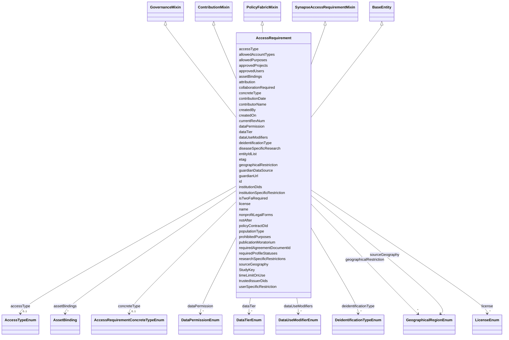

---
search:
  boost: 10.0
---

# Class: AccessRequirement 


_Representation of a Synapse Access Requirement and its relationships to entities, grants, and projects._


<div data-search-exclude markdown="1">


URI: [governanceduo:class/AccessRequirement](https://w3id.org/sage-bionetworks/governance-duo/class/AccessRequirement)





## Inheritance
* [BaseEntity](../classes/BaseEntity.md)
    * **AccessRequirement** [ [GovernanceMixin](../classes/GovernanceMixin.md) [ContributionMixin](../classes/ContributionMixin.md) [PolicyFabricMixin](../classes/PolicyFabricMixin.md) [SynapseAccessRequirementMixin](../classes/SynapseAccessRequirementMixin.md)]


## Class Properties

| Property | Value |
| --- | --- |
| Tree Root | Yes |


## Slots

| Name | Cardinality and Range | Description | Inheritance |
| ---  | --- | --- | --- |
| [StudyKey](../slots/StudyKey.md) | * <br/> [String](../types/String.md) | The Study id(s) associated with this object | direct |
| [entityIdList](../slots/entityIdList.md) | * <br/> [String](../types/String.md) | Synapse ID(s) for Synapse container(s) (e | direct |
| [dataUseModifiers](../slots/dataUseModifiers.md) | * <br/> [DataUseModifierEnum](../enums/DataUseModifierEnum.md) | A list of data use modifiers that apply to the access requirement | [GovernanceMixin](../classes/GovernanceMixin.md) |
| [collaborationRequired](../slots/collaborationRequired.md) | 0..1 <br/> [String](../types/String.md) | If collaboration is required for the access requirement, provide the PI email... | [GovernanceMixin](../classes/GovernanceMixin.md) |
| [diseaseSpecificResearch](../slots/diseaseSpecificResearch.md) | * <br/> [String](../types/String.md) | The type(s) of disease research allowed by this access requirement | [GovernanceMixin](../classes/GovernanceMixin.md) |
| [geographicalRestriction](../slots/geographicalRestriction.md) | * <br/> [GeographicalRegionEnum](../enums/GeographicalRegionEnum.md) | The specific geographic region(s) to which use is limited by the access requi... | [GovernanceMixin](../classes/GovernanceMixin.md) |
| [institutionSpecificRestriction](../slots/institutionSpecificRestriction.md) | * <br/> [String](../types/String.md) | Institutions with specific restrictions associated with the access requiremen... | [GovernanceMixin](../classes/GovernanceMixin.md) |
| [institutionDids](../slots/institutionDids.md) | * <br/> [String](../types/String.md) | Institutions with specific restrictions associated with the access requiremen... | [GovernanceMixin](../classes/GovernanceMixin.md) |
| [publicationMoratorium](../slots/publicationMoratorium.md) | 0..1 <br/> [String](../types/String.md) | End date of the publication moratorium associated with the access requirement | [GovernanceMixin](../classes/GovernanceMixin.md) |
| [researchSpecificRestrictions](../slots/researchSpecificRestrictions.md) | 0..1 <br/> [String](../types/String.md) | Research-specific restrictions associated with the access requirement | [GovernanceMixin](../classes/GovernanceMixin.md) |
| [timeLimitOnUse](../slots/timeLimitOnUse.md) | 0..1 <br/> [Float](../types/Float.md) | Time limit on the use of the data associated with the access requirement | [GovernanceMixin](../classes/GovernanceMixin.md) |
| [userSpecificRestriction](../slots/userSpecificRestriction.md) | 0..1 <br/> [String](../types/String.md) | The user-specific restrictions associated with the access requirement | [GovernanceMixin](../classes/GovernanceMixin.md) |
| [sourceGeography](../slots/sourceGeography.md) | * <br/> [GeographicalRegionEnum](../enums/GeographicalRegionEnum.md) | The geographical source of the data associated with the access requirement | [GovernanceMixin](../classes/GovernanceMixin.md) |
| [populationType](../slots/populationType.md) | 0..1 <br/> [String](../types/String.md) | The population studied in the research associated with the access requirement | [GovernanceMixin](../classes/GovernanceMixin.md) |
| [deidentificationType](../slots/deidentificationType.md) | * <br/> [DeidentificationTypeEnum](../enums/DeidentificationTypeEnum.md) | The type of de-identification applied to the data associated with the access ... | [GovernanceMixin](../classes/GovernanceMixin.md) |
| [dataPermission](../slots/dataPermission.md) | * <br/> [DataPermissionEnum](../enums/DataPermissionEnum.md) | The permissions associated with the data under the access requirement | [GovernanceMixin](../classes/GovernanceMixin.md) |
| [dataTier](../slots/dataTier.md) | * <br/> [DataTierEnum](../enums/DataTierEnum.md) | The tier of data access associated with the access requirement | [GovernanceMixin](../classes/GovernanceMixin.md) |
| [license](../slots/license.md) | * <br/> [LicenseEnum](../enums/LicenseEnum.md) | The license under which the data associated with the access requirement is sh... | [GovernanceMixin](../classes/GovernanceMixin.md) |
| [attribution](../slots/attribution.md) | 0..1 <br/> [String](../types/String.md) | The attribution statement for the data associated with the access requirement | [GovernanceMixin](../classes/GovernanceMixin.md) |
| [requiredAgreementDocumentId](../slots/requiredAgreementDocumentId.md) | 0..1 <br/> [String](../types/String.md) | DID of the terms/agreement document the requester must accept before this acc... | [GovernanceMixin](../classes/GovernanceMixin.md) |
| [notAfter](../slots/notAfter.md) | 0..1 <br/> [String](../types/String.md) | ISO-8601 datetime after which use is no longer permitted | [GovernanceMixin](../classes/GovernanceMixin.md) |
| [allowedPurposes](../slots/allowedPurposes.md) | * <br/> [String](../types/String.md) | Research purpose term(s) for which use is allowed | [GovernanceMixin](../classes/GovernanceMixin.md) |
| [prohibitedPurposes](../slots/prohibitedPurposes.md) | * <br/> [String](../types/String.md) | Research purpose term(s) for which use is explicitly disallowed | [GovernanceMixin](../classes/GovernanceMixin.md) |
| [nonprofitLegalForms](../slots/nonprofitLegalForms.md) | * <br/> [String](../types/String.md) | Legal entity form(s) qualifying as not-for-profit, coded per ISO 20275:2017 (... | [GovernanceMixin](../classes/GovernanceMixin.md) |
| [approvedProjects](../slots/approvedProjects.md) | * <br/> [String](../types/String.md) | DID(s) of project(s) approved to use the data under this access requirement | [GovernanceMixin](../classes/GovernanceMixin.md) |
| [approvedUsers](../slots/approvedUsers.md) | * <br/> [String](../types/String.md) | Identifier(s) of specifically approved users | [GovernanceMixin](../classes/GovernanceMixin.md) |
| [allowedAccountTypes](../slots/allowedAccountTypes.md) | * <br/> [String](../types/String.md) | Account type(s) permitted to access the data (checked against UserPlatformCre... | [GovernanceMixin](../classes/GovernanceMixin.md) |
| [requiredProfileStatuses](../slots/requiredProfileStatuses.md) | * <br/> [String](../types/String.md) | Profile status value(s) a requester's account must have (checked against User... | [GovernanceMixin](../classes/GovernanceMixin.md) |
| [contributorName](../slots/contributorName.md) | 1 <br/> [String](../types/String.md) | The name of the person who added this access requirement | [ContributionMixin](../classes/ContributionMixin.md) |
| [contributionDate](../slots/contributionDate.md) | 1 <br/> [String](../types/String.md) | The date on which the access requirement was added | [ContributionMixin](../classes/ContributionMixin.md) |
| [assetBindings](../slots/assetBindings.md) | * <br/> [AssetBinding](../classes/AssetBinding.md) | Policy Fabric Asset-registry DID(s), each paired with the Synapse entity id i... | [PolicyFabricMixin](../classes/PolicyFabricMixin.md) |
| [guardianDataSource](../slots/guardianDataSource.md) | 0..1 <br/> [String](../types/String.md) | The data path/source configured for this asset's Guardian | [PolicyFabricMixin](../classes/PolicyFabricMixin.md) |
| [guardianUrl](../slots/guardianUrl.md) | 0..1 <br/> [String](../types/String.md) | The deployed Guardian service URL for this asset | [PolicyFabricMixin](../classes/PolicyFabricMixin.md) |
| [policyContractDid](../slots/policyContractDid.md) | 0..1 <br/> [String](../types/String.md) | The DID of the deployed rego_policy_agent/rego_token contract pair once this ... | [PolicyFabricMixin](../classes/PolicyFabricMixin.md) |
| [trustedIssuerDids](../slots/trustedIssuerDids.md) | * <br/> [String](../types/String.md) | DID(s) of the Verifiable Credential issuer(s) this AccessRequirement's owner ... | [PolicyFabricMixin](../classes/PolicyFabricMixin.md) |
| [name](../slots/name.md) | 0..1 <br/> [String](../types/String.md) | A Synapse-native display name | [SynapseAccessRequirementMixin](../classes/SynapseAccessRequirementMixin.md) |
| [etag](../slots/etag.md) | 0..1 <br/> [String](../types/String.md) | Entity tag for optimistic concurrency control (a 36-character UUID) | [SynapseAccessRequirementMixin](../classes/SynapseAccessRequirementMixin.md) |
| [currentRevNum](../slots/currentRevNum.md) | 0..1 <br/> [Integer](../types/Integer.md) | The current revision number of the record | [SynapseAccessRequirementMixin](../classes/SynapseAccessRequirementMixin.md) |
| [accessType](../slots/accessType.md) | 0..1 <br/> [AccessTypeEnum](../enums/AccessTypeEnum.md) | The kind of access this Access Requirement governs (ACCESS_REQUIREMENT | [SynapseAccessRequirementMixin](../classes/SynapseAccessRequirementMixin.md) |
| [concreteType](../slots/concreteType.md) | 0..1 <br/> [AccessRequirementConcreteTypeEnum](../enums/AccessRequirementConcreteTypeEnum.md) | Which kind of Access Requirement this is (ACCESS_REQUIREMENT | [SynapseAccessRequirementMixin](../classes/SynapseAccessRequirementMixin.md) |
| [isTwoFaRequired](../slots/isTwoFaRequired.md) | 0..1 <br/> [Boolean](../types/Boolean.md) | Whether two-factor authentication is required (ACCESS_REQUIREMENT | [SynapseAccessRequirementMixin](../classes/SynapseAccessRequirementMixin.md) |
| [createdBy](../slots/createdBy.md) | 0..1 <br/> [Integer](../types/Integer.md) | Synapse numeric user id of the record's creator | [SynapseAccessRequirementMixin](../classes/SynapseAccessRequirementMixin.md) |
| [createdOn](../slots/createdOn.md) | 0..1 <br/> [Integer](../types/Integer.md) | When the record was created (epoch milliseconds in the source Synapse tables) | [SynapseAccessRequirementMixin](../classes/SynapseAccessRequirementMixin.md) |
| [id](../slots/id.md) | 1 <br/> [String](../types/String.md) | A unique identifier for the access requirement (schematic source attribute: A... | [BaseEntity](../classes/BaseEntity.md) |


## Usages

| used by | used in | type | used |
| ---  | --- | --- | --- |
| [AccessRequirementAssociation](../classes/AccessRequirementAssociation.md) | [accessRequirement](../slots/accessRequirement.md) | range | [AccessRequirement](../classes/AccessRequirement.md) |
| [DataAccessSubmission](../classes/DataAccessSubmission.md) | [accessRequirementId](../slots/accessRequirementId.md) | range | [AccessRequirement](../classes/AccessRequirement.md) |
| [AccessApproval](../classes/AccessApproval.md) | [requirementId](../slots/requirementId.md) | range | [AccessRequirement](../classes/AccessRequirement.md) |


## Identifier and Mapping Information


### Schema Source


* from schema: https://w3id.org/sage-bionetworks/governance-duo/governance_duo


## Mappings

| Mapping Type | Mapped Value |
| ---  | ---  |
| self | governanceduo:AccessRequirement |
| native | governanceduo:AccessRequirement |


## Examples
### Example: AccessRequirement-001

```yaml
id: access_requirement.42
contributorName: Jane Doe
contributionDate: "2026-01-15"
StudyKey:
  - study.mc2-jax-5xfad
entityIdList:
  - syn12345678
dataUseModifiers:
  - DUO:0000007
diseaseSpecificResearch:
  - MONDO:0004975

```
### Example: AccessRequirement-002-policy-fabric

```yaml
id: access_requirement.101
contributorName: Jane Doe
contributionDate: "2026-01-15"
StudyKey:
  - study.mc2-jax-5xfad
entityIdList:
  - syn98765432
dataUseModifiers:
  - DUO:0000022
  - DUO:0000028
geographicalRestriction:
  - US
institutionDids:
  - did:example:best_university
assetBindings:
  - synapseId: syn98765432
    assetDid: did:example:asset123
guardianDataSource: /tmp/asset_data.txt
trustedIssuerDids:
  - did:example:sage_bionetworks_issuer

```


## LinkML Source

<!-- TODO: investigate https://stackoverflow.com/questions/37606292/how-to-create-tabbed-code-blocks-in-mkdocs-or-sphinx -->

### Direct

<details>
```yaml
name: AccessRequirement
description: Representation of a Synapse Access Requirement and its relationships
  to entities, grants, and projects.
from_schema: https://w3id.org/sage-bionetworks/governance-duo/governance_duo
is_a: BaseEntity
mixins:
- GovernanceMixin
- ContributionMixin
- PolicyFabricMixin
- SynapseAccessRequirementMixin
slots:
- StudyKey
- entityIdList
slot_usage:
  id:
    name: id
    description: 'A unique identifier for the access requirement (schematic source
      attribute: AccessRequirement_id — the numeric Synapse access-requirement identifier).'
    examples:
    - value: access_requirement.42
    pattern: ^access_requirement\.\d+$
tree_root: true

```
</details>

### Induced

<details>
```yaml
name: AccessRequirement
description: Representation of a Synapse Access Requirement and its relationships
  to entities, grants, and projects.
from_schema: https://w3id.org/sage-bionetworks/governance-duo/governance_duo
is_a: BaseEntity
mixins:
- GovernanceMixin
- ContributionMixin
- PolicyFabricMixin
- SynapseAccessRequirementMixin
slot_usage:
  id:
    name: id
    description: 'A unique identifier for the access requirement (schematic source
      attribute: AccessRequirement_id — the numeric Synapse access-requirement identifier).'
    examples:
    - value: access_requirement.42
    pattern: ^access_requirement\.\d+$
attributes:
  StudyKey:
    name: StudyKey
    annotations:
      foreign_key:
        tag: foreign_key
        value: true
    description: The Study id(s) associated with this object. Provide multiple values
      as a comma-separated list.
    from_schema: https://w3id.org/sage-bionetworks/governance-duo/governance_duo
    rank: 1000
    owner: AccessRequirement
    domain_of:
    - AccessRequirement
    - Resource
    - Schema
    range: string
    multivalued: true
  entityIdList:
    name: entityIdList
    description: Synapse ID(s) for Synapse container(s) (e.g. Project, Dataset, Folder,
      Table, etc.) with which the Access Requirement is expected to be associated.
      Provide multiple values as a comma-separated list.
    from_schema: https://w3id.org/sage-bionetworks/governance-duo/governance_duo
    rank: 1000
    owner: AccessRequirement
    domain_of:
    - AccessRequirement
    range: string
    multivalued: true
    pattern: ^syn\d+$
  dataUseModifiers:
    name: dataUseModifiers
    description: A list of data use modifiers that apply to the access requirement.
      Includes real Data Use Ontology (DUO) terms plus Sage-local DUOPlus1-7 extensions
      (see README) and the literal value "Pending Annotation".
    from_schema: https://w3id.org/sage-bionetworks/governance-duo/governance_duo
    rank: 1000
    owner: AccessRequirement
    domain_of:
    - GovernanceMixin
    range: DataUseModifierEnum
    multivalued: true
  collaborationRequired:
    name: collaborationRequired
    description: If collaboration is required for the access requirement, provide
      the PI email address. Provide multiple as a comma-separated list.
    comments:
    - Required when dataUseModifiers contains DUO:0000020 — see GovernanceMixin rules.
    - NCIT:C221739 "Consent for Use Requires Collaboration Agreement" carries the
      synonyms "COL"/"Collaboration required", the same shorthand this repo already
      uses for DUO:0000020 — verified live and non-obsolete via the OLS4 API.
    from_schema: https://w3id.org/sage-bionetworks/governance-duo/governance_duo
    exact_mappings:
    - NCIT:C221739
    rank: 1000
    owner: AccessRequirement
    domain_of:
    - GovernanceMixin
    range: string
  diseaseSpecificResearch:
    name: diseaseSpecificResearch
    description: 'The type(s) of disease research allowed by this access requirement.
      Provide the MONDO ID in format MONDO:id. Provide multiple values as a comma-separated
      list. MONDO terms can be found here: https://ols.monarchinitiative.org/ontologies/mondo'
    comments:
    - Required when dataUseModifiers contains DUO:0000007 — see GovernanceMixin rules.
    from_schema: https://w3id.org/sage-bionetworks/governance-duo/governance_duo
    rank: 1000
    owner: AccessRequirement
    domain_of:
    - GovernanceMixin
    range: string
    multivalued: true
    pattern: MONDO:\d{7}
  geographicalRestriction:
    name: geographicalRestriction
    description: The specific geographic region(s) to which use is limited by the
      access requirement.
    comments:
    - Required when dataUseModifiers contains DUO:0000022 — see GovernanceMixin rules.
    from_schema: https://w3id.org/sage-bionetworks/governance-duo/governance_duo
    rank: 1000
    owner: AccessRequirement
    domain_of:
    - GovernanceMixin
    range: GeographicalRegionEnum
    multivalued: true
  institutionSpecificRestriction:
    name: institutionSpecificRestriction
    description: 'Institutions with specific restrictions associated with the access
      requirement. Provide the institution ROR ID in format ROR:id. Provide multiple
      entries as a comma-separated list. ROR IDs can be found here: https://ror.org/search'
    comments:
    - Required when dataUseModifiers contains DUO:0000028 — see GovernanceMixin rules.
    from_schema: https://w3id.org/sage-bionetworks/governance-duo/governance_duo
    rank: 1000
    owner: AccessRequirement
    domain_of:
    - GovernanceMixin
    range: string
    multivalued: true
    pattern: ROR:[a-z0-9]{9}
  institutionDids:
    name: institutionDids
    description: Institutions with specific restrictions associated with the access
      requirement, as decentralized identifiers (DIDs) rather than ROR ids. Policy
      Fabric (https://github.com/hasan7n/tmp-policies)'s institution-specific-restriction
      policy_card expects its allowedInstitutions reference values, and the AffiliationCredential.isMemberOf
      claim it checks against them, to both be organization DIDs — not ROR ids. No
      standard ROR-to-DID resolution exists yet, so this is a separate, companion
      slot rather than a reinterpretation of institutionSpecificRestriction's existing
      pattern.
    from_schema: https://w3id.org/sage-bionetworks/governance-duo/governance_duo
    rank: 1000
    owner: AccessRequirement
    domain_of:
    - GovernanceMixin
    range: string
    multivalued: true
    pattern: ^did:[a-z0-9]+:.+$
  publicationMoratorium:
    name: publicationMoratorium
    description: End date of the publication moratorium associated with the access
      requirement.
    comments:
    - 'schematic Format: date'
    - Required when dataUseModifiers contains DUO:0000024 — see GovernanceMixin rules.
    from_schema: https://w3id.org/sage-bionetworks/governance-duo/governance_duo
    rank: 1000
    owner: AccessRequirement
    domain_of:
    - GovernanceMixin
    range: string
  researchSpecificRestrictions:
    name: researchSpecificRestrictions
    description: Research-specific restrictions associated with the access requirement.
    comments:
    - Required when dataUseModifiers contains DUO:0000012 — see GovernanceMixin rules.
    from_schema: https://w3id.org/sage-bionetworks/governance-duo/governance_duo
    rank: 1000
    owner: AccessRequirement
    domain_of:
    - GovernanceMixin
    range: string
  timeLimitOnUse:
    name: timeLimitOnUse
    description: Time limit on the use of the data associated with the access requirement.
    comments:
    - Required when dataUseModifiers contains DUO:0000025 — see GovernanceMixin rules.
    from_schema: https://w3id.org/sage-bionetworks/governance-duo/governance_duo
    rank: 1000
    owner: AccessRequirement
    domain_of:
    - GovernanceMixin
    range: float
  userSpecificRestriction:
    name: userSpecificRestriction
    description: The user-specific restrictions associated with the access requirement.
    comments:
    - Required when dataUseModifiers contains DUO:0000026 — see GovernanceMixin rules.
    from_schema: https://w3id.org/sage-bionetworks/governance-duo/governance_duo
    rank: 1000
    owner: AccessRequirement
    domain_of:
    - GovernanceMixin
    range: string
  sourceGeography:
    name: sourceGeography
    description: The geographical source of the data associated with the access requirement.
      Equivalent to DUOPlus1.
    comments:
    - Required when dataUseModifiers contains DUOPlus1 — see GovernanceMixin rules.
    from_schema: https://w3id.org/sage-bionetworks/governance-duo/governance_duo
    rank: 1000
    owner: AccessRequirement
    domain_of:
    - GovernanceMixin
    range: GeographicalRegionEnum
    multivalued: true
  populationType:
    name: populationType
    description: The population studied in the research associated with the access
      requirement. Equivalent to DUOPlus2.
    comments:
    - Required when dataUseModifiers contains DUOPlus2 — see GovernanceMixin rules.
    from_schema: https://w3id.org/sage-bionetworks/governance-duo/governance_duo
    rank: 1000
    owner: AccessRequirement
    domain_of:
    - GovernanceMixin
    range: string
  deidentificationType:
    name: deidentificationType
    description: The type of de-identification applied to the data associated with
      the access requirement. Equivalent to DUOPlus3.
    comments:
    - Required when dataUseModifiers contains DUOPlus3 — see GovernanceMixin rules.
    - T4FS:0000414 "de-identification" (Terminology for Food Safety, but the term
      itself is a generic privacy concept) is a close, not exact, match — this slot
      names one of a specific set of methods (HIPPA_LDS/SafeHarbor/etc.), the OLS
      term describes the general technique.
    from_schema: https://w3id.org/sage-bionetworks/governance-duo/governance_duo
    close_mappings:
    - T4FS:0000414
    rank: 1000
    owner: AccessRequirement
    domain_of:
    - GovernanceMixin
    range: DeidentificationTypeEnum
    multivalued: true
  dataPermission:
    name: dataPermission
    description: The permissions associated with the data under the access requirement.
      Equivalent to DUOPlus4.
    comments:
    - Required when dataUseModifiers contains DUOPlus4 — see GovernanceMixin rules.
    from_schema: https://w3id.org/sage-bionetworks/governance-duo/governance_duo
    rank: 1000
    owner: AccessRequirement
    domain_of:
    - GovernanceMixin
    range: DataPermissionEnum
    multivalued: true
  dataTier:
    name: dataTier
    description: The tier of data access associated with the access requirement. Equivalent
      to DUOPlus5.
    comments:
    - Required when dataUseModifiers contains DUOPlus5 — see GovernanceMixin rules.
    - 'NCIT:C175887 "Open or Controlled Data Access Indicator" (synonym: "Data Access
      Level") is defined as "Specifies whether the data in a repository is open access
      or controlled access" — a direct match for this slot''s Anonymous/Open/Controlled/Private
      tiers.'
    from_schema: https://w3id.org/sage-bionetworks/governance-duo/governance_duo
    exact_mappings:
    - NCIT:C175887
    rank: 1000
    owner: AccessRequirement
    domain_of:
    - GovernanceMixin
    range: DataTierEnum
    multivalued: true
  license:
    name: license
    description: The license under which the data associated with the access requirement
      is shared. Equivalent to DUOPlus6.
    comments:
    - Required when dataUseModifiers contains DUOPlus6 — see GovernanceMixin rules.
    from_schema: https://w3id.org/sage-bionetworks/governance-duo/governance_duo
    rank: 1000
    owner: AccessRequirement
    domain_of:
    - GovernanceMixin
    range: LicenseEnum
    multivalued: true
  attribution:
    name: attribution
    description: The attribution statement for the data associated with the access
      requirement. Equivalent to DUOPlus7.
    comments:
    - Required when dataUseModifiers contains DUOPlus7 — see GovernanceMixin rules.
    - SWO:9000006 "Attribution clause" (Software Ontology term, reused via the mcro
      ontology) — a license-clause-shaped close mapping; this slot instead holds the
      free-text statement itself, not the clause concept.
    from_schema: https://w3id.org/sage-bionetworks/governance-duo/governance_duo
    close_mappings:
    - ebiswo:9000006
    rank: 1000
    owner: AccessRequirement
    domain_of:
    - GovernanceMixin
    range: string
  requiredAgreementDocumentId:
    name: requiredAgreementDocumentId
    description: 'DID of the terms/agreement document the requester must accept before
      this access requirement''s data use modifiers are satisfied. Added to close
      a Policy Fabric (https://github.com/hasan7n/tmp-policies) gap: its general-research-use,
      publication-moratorium, return-to-database-or-resource, and time-limit-on-use
      policy_cards all key their Reference Values Schema on a single requiredDocumentID,
      which no existing slot held — publicationMoratorium and timeLimitOnUse hold
      a date/duration, not a document identifier, so this is a new, distinct slot
      rather than a reinterpretation of either.'
    comments:
    - Required when dataUseModifiers contains DUO:0000042, DUO:0000024, DUO:0000029,
      or DUO:0000025 — see GovernanceMixin rules.
    from_schema: https://w3id.org/sage-bionetworks/governance-duo/governance_duo
    rank: 1000
    owner: AccessRequirement
    domain_of:
    - GovernanceMixin
    range: string
    pattern: ^did:[a-z0-9]+:.+$
  notAfter:
    name: notAfter
    description: 'ISO-8601 datetime after which use is no longer permitted. Added
      to close a Policy Fabric gap: time-limit-on-use''s Reference Values Schema key
      notAfter is an absolute datetime, whereas the existing timeLimitOnUse slot holds
      a number of months — a different shape entirely, so this is a new, distinct
      slot.'
    comments:
    - Required when dataUseModifiers contains DUO:0000025 — see GovernanceMixin rules.
    from_schema: https://w3id.org/sage-bionetworks/governance-duo/governance_duo
    rank: 1000
    owner: AccessRequirement
    domain_of:
    - GovernanceMixin
    range: string
  allowedPurposes:
    name: allowedPurposes
    description: 'Research purpose term(s) for which use is allowed. Added to close
      a Policy Fabric gap: genetic-studies-only, health-or-medical-or-biomedical-research,
      population-origins-or-ancestry-research-only, and research-specific-restrictions
      all key their Reference Values Schema on a multivalued allowedPurposes list;
      the existing researchSpecificRestrictions slot is free text and not multivalued,
      so this is a new, distinct slot rather than a reinterpretation of it (the two
      can coexist — one is a human-readable narrative, this one is the structured,
      machine-checkable list Policy Fabric''s Rego logic actually reads).'
    comments:
    - Required when dataUseModifiers contains DUO:0000016, DUO:0000006, DUO:0000011,
      or DUO:0000012 — see GovernanceMixin rules.
    from_schema: https://w3id.org/sage-bionetworks/governance-duo/governance_duo
    rank: 1000
    owner: AccessRequirement
    domain_of:
    - GovernanceMixin
    range: string
    multivalued: true
  prohibitedPurposes:
    name: prohibitedPurposes
    description: 'Research purpose term(s) for which use is explicitly disallowed.
      Added to close a Policy Fabric gap: health-or-medical-or-biomedical-research,
      no-general-methods-research, non-commercial-use-only, not-for-profit-non-commercial-use-only,
      and population-origins-or-ancestry-research-prohibited all key their Reference
      Values Schema on a multivalued prohibitedPurposes list, which no existing slot
      held.'
    comments:
    - Required when dataUseModifiers contains DUO:0000006, DUO:0000015, DUO:0000046,
      DUO:0000018, or DUO:0000044 — see GovernanceMixin rules.
    from_schema: https://w3id.org/sage-bionetworks/governance-duo/governance_duo
    rank: 1000
    owner: AccessRequirement
    domain_of:
    - GovernanceMixin
    range: string
    multivalued: true
  nonprofitLegalForms:
    name: nonprofitLegalForms
    description: 'Legal entity form(s) qualifying as not-for-profit, coded per ISO
      20275:2017 (Entity Legal Form Code List). Added to close a Policy Fabric gap:
      not-for-profit-organisation-use-only and not-for-profit-non-commercial-use-only
      both key their Reference Values Schema on a multivalued nonprofitLegalForms
      list, which no existing slot held.'
    comments:
    - Required when dataUseModifiers contains DUO:0000045 or DUO:0000018 — see GovernanceMixin
      rules.
    from_schema: https://w3id.org/sage-bionetworks/governance-duo/governance_duo
    rank: 1000
    owner: AccessRequirement
    domain_of:
    - GovernanceMixin
    range: string
    multivalued: true
  approvedProjects:
    name: approvedProjects
    description: 'DID(s) of project(s) approved to use the data under this access
      requirement. Added to close a Policy Fabric gap: project-specific-restriction
      keys its Reference Values Schema on a multivalued approvedProjects list of DIDs,
      which no existing slot held.'
    comments:
    - Required when dataUseModifiers contains DUO:0000027 — see GovernanceMixin rules.
    from_schema: https://w3id.org/sage-bionetworks/governance-duo/governance_duo
    rank: 1000
    owner: AccessRequirement
    domain_of:
    - GovernanceMixin
    range: string
    multivalued: true
    pattern: ^did:[a-z0-9]+:.+$
  approvedUsers:
    name: approvedUsers
    description: 'Identifier(s) of specifically approved users. Added to close a Policy
      Fabric gap: user-specific-restriction keys part of its Reference Values Schema
      on a multivalued approvedUsers list, checked against UserPlatformCredential.userId
      — the existing userSpecificRestriction slot is free text describing the restriction,
      not a structured list of identifiers, so this is a new, distinct slot (userSpecificRestriction,
      allowedAccountTypes, and requiredProfileStatuses together cover the three separate
      keys this one policy_card''s Reference Values Schema defines).'
    comments:
    - Required when dataUseModifiers contains DUO:0000026 — see GovernanceMixin rules.
    from_schema: https://w3id.org/sage-bionetworks/governance-duo/governance_duo
    rank: 1000
    owner: AccessRequirement
    domain_of:
    - GovernanceMixin
    range: string
    multivalued: true
  allowedAccountTypes:
    name: allowedAccountTypes
    description: Account type(s) permitted to access the data (checked against UserPlatformCredential.accountType).
      Added to close the same user-specific-restriction gap as approvedUsers.
    comments:
    - Required when dataUseModifiers contains DUO:0000026 — see GovernanceMixin rules.
    from_schema: https://w3id.org/sage-bionetworks/governance-duo/governance_duo
    rank: 1000
    owner: AccessRequirement
    domain_of:
    - GovernanceMixin
    range: string
    multivalued: true
  requiredProfileStatuses:
    name: requiredProfileStatuses
    description: Profile status value(s) a requester's account must have (checked
      against UserPlatformCredential.profileStatus). Added to close the same user-specific-restriction
      gap as approvedUsers.
    comments:
    - Required when dataUseModifiers contains DUO:0000026 — see GovernanceMixin rules.
    from_schema: https://w3id.org/sage-bionetworks/governance-duo/governance_duo
    rank: 1000
    owner: AccessRequirement
    domain_of:
    - GovernanceMixin
    range: string
    multivalued: true
  contributorName:
    name: contributorName
    description: The name of the person who added this access requirement.
    comments:
    - prov:wasAttributedTo relates a prov:Entity to a prov:Agent; this slot holds
      a literal name rather than an Agent reference, so the mapping is close, not
      exact.
    from_schema: https://w3id.org/sage-bionetworks/governance-duo/governance_duo
    close_mappings:
    - prov:wasAttributedTo
    rank: 1000
    owner: AccessRequirement
    domain_of:
    - ContributionMixin
    range: string
    required: true
  contributionDate:
    name: contributionDate
    description: The date on which the access requirement was added.
    comments:
    - 'schematic Format: date'
    - prov:generatedAtTime ("The time at which an entity was completely created and
      is available for use") matches this slot's semantics closely, treating the AccessRequirement
      record itself as the generated prov:Entity.
    from_schema: https://w3id.org/sage-bionetworks/governance-duo/governance_duo
    close_mappings:
    - prov:generatedAtTime
    rank: 1000
    owner: AccessRequirement
    domain_of:
    - ContributionMixin
    range: string
    required: true
  assetBindings:
    name: assetBindings
    description: Policy Fabric Asset-registry DID(s), each paired with the Synapse
      entity id it registers. Replaces a pair of positionally order-aligned lists
      (dataUseModifiers-adjacent entityIdList and a since-removed flat assetDids list)
      with an explicit pairing, so which DID belongs to which Synapse entity is structural
      rather than convention-only. Each synapseId here should also appear in the containing
      record's entityIdList (documented, not schema-enforced). GovernanceMixin's own
      `rules:` are cross-slot too, but only in the simpler "value X on slot A requires
      slot B to be present" sense; this would need the harder kind -- a positional/arity
      correspondence between two multivalued lists -- which LinkML's `rules:` preconditions/postconditions
      don't express, so it's left as a documented, not enforced, invariant.
    from_schema: https://w3id.org/sage-bionetworks/governance-duo/governance_duo
    rank: 1000
    owner: AccessRequirement
    domain_of:
    - PolicyFabricMixin
    range: AssetBinding
    multivalued: true
    inlined: true
    inlined_as_list: true
  guardianDataSource:
    name: guardianDataSource
    description: The data path/source configured for this asset's Guardian. Mirrors
      Asset.metadata.data_source, set by convention (not schema) in tmp-policies/tools/pdo_client
      at asset-setup time.
    from_schema: https://w3id.org/sage-bionetworks/governance-duo/governance_duo
    rank: 1000
    owner: AccessRequirement
    domain_of:
    - PolicyFabricMixin
    range: string
  guardianUrl:
    name: guardianUrl
    description: The deployed Guardian service URL for this asset. Mirrors Asset.metadata.guardian_url,
      set by the same asset-setup convention.
    from_schema: https://w3id.org/sage-bionetworks/governance-duo/governance_duo
    rank: 1000
    owner: AccessRequirement
    domain_of:
    - PolicyFabricMixin
    range: string
  policyContractDid:
    name: policyContractDid
    description: The DID of the deployed rego_policy_agent/rego_token contract pair
      once this AccessRequirement's selected DUO codes have been "exposed" as a policy
      in Policy Fabric. Mirrors Asset.metadata.policy_contract.
    from_schema: https://w3id.org/sage-bionetworks/governance-duo/governance_duo
    rank: 1000
    owner: AccessRequirement
    domain_of:
    - PolicyFabricMixin
    range: string
    pattern: ^did:[a-z0-9]+:.+$
  trustedIssuerDids:
    name: trustedIssuerDids
    description: DID(s) of the Verifiable Credential issuer(s) this AccessRequirement's
      owner trusts to attest the claims its selected DUO codes require (see policy_fabric_bindings.yaml's
      requiredCredentials per code). Unlike PolicyCardBinding.requiredCredentials
      (a static, per-DUO-code fact), this varies per AccessRequirement — different
      owners may trust different institutional VC issuers — so it lives here, not
      in the policy_fabric.yaml lookup schema.
    from_schema: https://w3id.org/sage-bionetworks/governance-duo/governance_duo
    rank: 1000
    owner: AccessRequirement
    domain_of:
    - PolicyFabricMixin
    range: string
    multivalued: true
    pattern: ^did:[a-z0-9]+:.+$
  name:
    name: name
    description: A Synapse-native display name. Shared by SynapseAccessRequirementMixin
      (ACCESS_REQUIREMENT.NAME) and, via the transitive import chain governance_graph.yaml
      -> access_requirement.yaml -> mixins.yaml, SynapseEntity (NODE.NAME) in governance_graph.yaml
      — defined once here rather than in governance_graph.yaml itself, since mixins.yaml
      cannot import governance_graph.yaml back without creating a cycle (governance_graph.yaml
      already depends on mixins.yaml through access_requirement.yaml).
    from_schema: https://w3id.org/sage-bionetworks/governance-duo/governance_duo
    rank: 1000
    owner: AccessRequirement
    domain_of:
    - SynapseAccessRequirementMixin
    - SynapseEntity
    range: string
  etag:
    name: etag
    description: Entity tag for optimistic concurrency control (a 36-character UUID).
      Shared the same way as `name` above, by SynapseAccessRequirementMixin (ACCESS_REQUIREMENT.ETAG)
      and SynapseEntity/DataAccessSubmission (NODE.ETAG/DATA_ACCESS_SUBMISSION.ETAG)
      in governance_graph.yaml.
    from_schema: https://w3id.org/sage-bionetworks/governance-duo/governance_duo
    rank: 1000
    owner: AccessRequirement
    domain_of:
    - SynapseAccessRequirementMixin
    - SynapseEntity
    - DataAccessSubmission
    - AccessApproval
    range: string
  currentRevNum:
    name: currentRevNum
    description: The current revision number of the record. Shared the same way as
      `name` above, by SynapseAccessRequirementMixin (ACCESS_REQUIREMENT.CURRENT_REV_NUM)
      and SynapseEntity (NODE.CURRENT_REV_NUM).
    from_schema: https://w3id.org/sage-bionetworks/governance-duo/governance_duo
    rank: 1000
    owner: AccessRequirement
    domain_of:
    - SynapseAccessRequirementMixin
    - SynapseEntity
    range: integer
  accessType:
    name: accessType
    description: The kind of access this Access Requirement governs (ACCESS_REQUIREMENT.ACCESS_TYPE).
      Range is the same AccessTypeEnum used by AccessGrant.permission in governance_graph.yaml
      — one real Synapse ACCESS_TYPE type backs both an ACL grant's permission and
      an Access Requirement's own governed access kind.
    from_schema: https://w3id.org/sage-bionetworks/governance-duo/governance_duo
    rank: 1000
    owner: AccessRequirement
    domain_of:
    - SynapseAccessRequirementMixin
    range: AccessTypeEnum
  concreteType:
    name: concreteType
    description: Which kind of Access Requirement this is (ACCESS_REQUIREMENT.CONCRETE_TYPE).
      The real Synapse column stores the full Java class name (e.g. "org.sagebionetworks.repo.model.ManagedACTAccessRequirement");
      this enum uses the short class name for readability.
    from_schema: https://w3id.org/sage-bionetworks/governance-duo/governance_duo
    rank: 1000
    owner: AccessRequirement
    domain_of:
    - SynapseAccessRequirementMixin
    range: AccessRequirementConcreteTypeEnum
  isTwoFaRequired:
    name: isTwoFaRequired
    description: Whether two-factor authentication is required (ACCESS_REQUIREMENT.IS_TWO_FA_REQUIRED).
    from_schema: https://w3id.org/sage-bionetworks/governance-duo/governance_duo
    rank: 1000
    owner: AccessRequirement
    domain_of:
    - SynapseAccessRequirementMixin
    range: boolean
  createdBy:
    name: createdBy
    description: Synapse numeric user id of the record's creator. Shared the same
      way as `name` above. Distinct from ContributionMixin's contributorName, which
      is this repo's own free-text curator-provenance field, not Synapse's own numeric
      CREATED_BY column — both coexist on AccessRequirement without collision.
    comments:
    - 'scripts/build_governance_graph.py emits this integer two different ways depending
      on which class it''s on: as an IRI reference to a gov:Principal node (gov:createdBy)
      on DataAccessSubmission -- since a submission''s creator can be looked up as
      a first-class Principal individual -- but as a plain literal (gov:createdByUserId,
      a distinct predicate, not gov:createdBy) on SynapseEntity, which has no corresponding
      Principal record to link to. This divergence is deliberate and documented in
      shapes/governance_graph.owl.ttl, not a schema/export mismatch to fix.'
    from_schema: https://w3id.org/sage-bionetworks/governance-duo/governance_duo
    exact_mappings:
    - dcterms:creator
    rank: 1000
    owner: AccessRequirement
    domain_of:
    - SynapseAccessRequirementMixin
    - SynapseEntity
    range: integer
  createdOn:
    name: createdOn
    description: When the record was created (epoch milliseconds in the source Synapse
      tables). Shared the same way as `name` above. Distinct from ContributionMixin's
      contributionDate for the same reason as createdBy above.
    from_schema: https://w3id.org/sage-bionetworks/governance-duo/governance_duo
    exact_mappings:
    - dcterms:created
    rank: 1000
    owner: AccessRequirement
    domain_of:
    - SynapseAccessRequirementMixin
    - SynapseEntity
    - AccessGrant
    - AccessApproval
    range: integer
  id:
    name: id
    description: 'A unique identifier for the access requirement (schematic source
      attribute: AccessRequirement_id — the numeric Synapse access-requirement identifier).'
    examples:
    - value: access_requirement.42
    from_schema: https://w3id.org/sage-bionetworks/governance-duo/governance_duo
    rank: 1000
    slot_uri: dcterms:identifier
    identifier: true
    owner: AccessRequirement
    domain_of:
    - BaseEntity
    range: string
    required: true
    pattern: ^access_requirement\.\d+$
tree_root: true

```
</details></div>