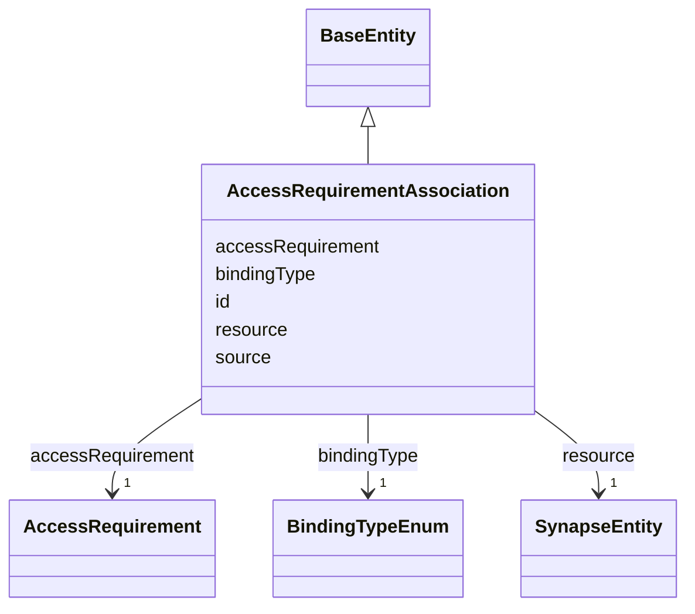

---
search:
  boost: 10.0
---

# Class: AccessRequirementAssociation 


_Binds an AccessRequirement to a resource, recording whether the binding is direct or inherited. Mirrors ACCESS_REQUIREMENT_PROJECT, extended with the design doc's explicit direct/inherited distinction — ACCESS_REQUIREMENT_PROJECT itself has no binding-type column; that inheritance concept is this repo's own addition to capture what the design doc calls for (see BindingTypeEnum)._


<div data-search-exclude markdown="1">


URI: [governanceduo:class/AccessRequirementAssociation](https://w3id.org/sage-bionetworks/governance-duo/class/AccessRequirementAssociation)





## Inheritance
* [BaseEntity](../classes/BaseEntity.md)
    * **AccessRequirementAssociation**


## Slots

| Name | Cardinality and Range | Description | Inheritance |
| ---  | --- | --- | --- |
| [resource](../slots/resource.md) | 1 <br/> [SynapseEntity](../classes/SynapseEntity.md) | The SynapseEntity this grant/association applies to | direct |
| [accessRequirement](../slots/accessRequirement.md) | 1 <br/> [AccessRequirement](../classes/AccessRequirement.md) | The AccessRequirement this association binds to the resource | direct |
| [source](../slots/source.md) | 0..1 <br/> [String](../types/String.md) | The system this grant/association was derived from, e | direct |
| [bindingType](../slots/bindingType.md) | 1 <br/> [BindingTypeEnum](../enums/BindingTypeEnum.md) |  | direct |
| [id](../slots/id.md) | 1 <br/> [String](../types/String.md) | A synthetic identifier for this association record | [BaseEntity](../classes/BaseEntity.md) |


## Identifier and Mapping Information


### Schema Source


* from schema: https://w3id.org/sage-bionetworks/governance-duo/governance_duo


## Mappings

| Mapping Type | Mapped Value |
| ---  | ---  |
| self | governanceduo:AccessRequirementAssociation |
| native | governanceduo:AccessRequirementAssociation |


## Examples
### Example: AccessRequirementAssociation-001

```yaml
id: ar_association.001
resource: syn10081783
accessRequirement: access_requirement.123
source: Synapse
bindingType: Inherited

```


## LinkML Source

<!-- TODO: investigate https://stackoverflow.com/questions/37606292/how-to-create-tabbed-code-blocks-in-mkdocs-or-sphinx -->

### Direct

<details>
```yaml
name: AccessRequirementAssociation
description: Binds an AccessRequirement to a resource, recording whether the binding
  is direct or inherited. Mirrors ACCESS_REQUIREMENT_PROJECT, extended with the design
  doc's explicit direct/inherited distinction — ACCESS_REQUIREMENT_PROJECT itself
  has no binding-type column; that inheritance concept is this repo's own addition
  to capture what the design doc calls for (see BindingTypeEnum).
from_schema: https://w3id.org/sage-bionetworks/governance-duo/governance_duo
is_a: BaseEntity
slots:
- resource
- accessRequirement
- source
- bindingType
slot_usage:
  id:
    name: id
    description: A synthetic identifier for this association record. ACCESS_REQUIREMENT_PROJECT
      is a pure join table (AR_ID, PROJECT_ID — no id column of its own), so this
      mirrors the design doc's own gov:ar-association-001 naming rather than a real
      Synapse column.
    examples:
    - value: ar_association.001
    pattern: ^ar_association\.[A-Za-z0-9_-]+$

```
</details>

### Induced

<details>
```yaml
name: AccessRequirementAssociation
description: Binds an AccessRequirement to a resource, recording whether the binding
  is direct or inherited. Mirrors ACCESS_REQUIREMENT_PROJECT, extended with the design
  doc's explicit direct/inherited distinction — ACCESS_REQUIREMENT_PROJECT itself
  has no binding-type column; that inheritance concept is this repo's own addition
  to capture what the design doc calls for (see BindingTypeEnum).
from_schema: https://w3id.org/sage-bionetworks/governance-duo/governance_duo
is_a: BaseEntity
slot_usage:
  id:
    name: id
    description: A synthetic identifier for this association record. ACCESS_REQUIREMENT_PROJECT
      is a pure join table (AR_ID, PROJECT_ID — no id column of its own), so this
      mirrors the design doc's own gov:ar-association-001 naming rather than a real
      Synapse column.
    examples:
    - value: ar_association.001
    pattern: ^ar_association\.[A-Za-z0-9_-]+$
attributes:
  resource:
    name: resource
    description: The SynapseEntity this grant/association applies to.
    from_schema: https://w3id.org/sage-bionetworks/governance-duo/governance_duo
    rank: 1000
    owner: AccessRequirementAssociation
    domain_of:
    - AccessGrant
    - AccessRequirementAssociation
    range: SynapseEntity
    required: true
  accessRequirement:
    name: accessRequirement
    description: The AccessRequirement this association binds to the resource.
    from_schema: https://w3id.org/sage-bionetworks/governance-duo/governance_duo
    close_mappings:
    - dcterms:requires
    rank: 1000
    owner: AccessRequirementAssociation
    domain_of:
    - AccessRequirementAssociation
    range: AccessRequirement
    required: true
  source:
    name: source
    description: The system this grant/association was derived from, e.g. "Synapse".
    from_schema: https://w3id.org/sage-bionetworks/governance-duo/governance_duo
    exact_mappings:
    - dcterms:source
    rank: 1000
    owner: AccessRequirementAssociation
    domain_of:
    - AccessGrant
    - AccessRequirementAssociation
    range: string
  bindingType:
    name: bindingType
    from_schema: https://w3id.org/sage-bionetworks/governance-duo/governance_duo
    rank: 1000
    owner: AccessRequirementAssociation
    domain_of:
    - AccessGrant
    - AccessRequirementAssociation
    range: BindingTypeEnum
    required: true
  id:
    name: id
    description: A synthetic identifier for this association record. ACCESS_REQUIREMENT_PROJECT
      is a pure join table (AR_ID, PROJECT_ID — no id column of its own), so this
      mirrors the design doc's own gov:ar-association-001 naming rather than a real
      Synapse column.
    examples:
    - value: ar_association.001
    from_schema: https://w3id.org/sage-bionetworks/governance-duo/governance_duo
    rank: 1000
    slot_uri: dcterms:identifier
    identifier: true
    owner: AccessRequirementAssociation
    domain_of:
    - BaseEntity
    range: string
    required: true
    pattern: ^ar_association\.[A-Za-z0-9_-]+$

```
</details></div>