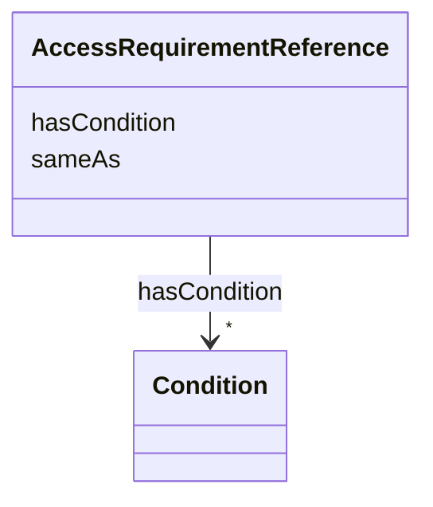

---
search:
  boost: 10.0
---

# Class: AccessRequirementReference 


_The gov:AR-<n> stub build_governance_graph.py's add_access_requirement_association() mints for every real AccessRequirement it encounters -- a local, gov:-namespace node standing in for the real governanceduo:AccessRequirement (defined in access_requirement.yaml, which this file imports -- not the other way around), bridged to it via this class's own sameAs slot rather than sharing its type. Every slot elsewhere in this schema that actually holds this stub's IRI (AccessRequirementAssociation. accessRequirement, the shared accessRequirementId, AccessApproval.requirementId) ranges over this class, not the real AccessRequirement -- see plans/access_requirement_reference_class.md for why keeping the two types separate, rather than giving the real AccessRequirement this class's class_uri directly, is deliberate. Not `is_a: BaseEntity`: like Condition/ DataAccessSubmissionStatus, it has no independent identifier of its own -- it's a re-serialization of the real AccessRequirement's own id via gov_id(), not a new entity._


<div data-search-exclude markdown="1">


URI: [sagegov:AccessRequirement](https://sagebionetworks.org/governance/AccessRequirement)





<!-- no inheritance hierarchy -->

## Class Properties

| Property | Value |
| --- | --- |
| Class URI | [sagegov:AccessRequirement](https://sagebionetworks.org/governance/AccessRequirement) |


## Slots

| Name | Cardinality and Range | Description | Inheritance |
| ---  | --- | --- | --- |
| [sameAs](../slots/sameAs.md) | 1 <br/> [Uriorcurie](../types/Uriorcurie.md) | Bridges this AccessRequirementReference stub to the real governanceduo:Access... | direct |
| [hasCondition](../slots/hasCondition.md) | * <br/> [Condition](../classes/Condition.md) | The DUO-backed Conditions this attaches to -- gov:Condition individuals add_a... | direct |


## Usages

| used by | used in | type | used |
| ---  | --- | --- | --- |
| [AccessRequirementAssociation](../classes/AccessRequirementAssociation.md) | [accessRequirement](../slots/accessRequirement.md) | range | [AccessRequirementReference](../classes/AccessRequirementReference.md) |
| [DataAccessSubmission](../classes/DataAccessSubmission.md) | [accessRequirementId](../slots/accessRequirementId.md) | range | [AccessRequirementReference](../classes/AccessRequirementReference.md) |
| [AccessApproval](../classes/AccessApproval.md) | [requirementId](../slots/requirementId.md) | range | [AccessRequirementReference](../classes/AccessRequirementReference.md) |
| [ResearchProject](../classes/ResearchProject.md) | [accessRequirementId](../slots/accessRequirementId.md) | range | [AccessRequirementReference](../classes/AccessRequirementReference.md) |
| [DataAccessRequest](../classes/DataAccessRequest.md) | [accessRequirementId](../slots/accessRequirementId.md) | range | [AccessRequirementReference](../classes/AccessRequirementReference.md) |


## Identifier and Mapping Information


### Schema Source


* from schema: https://w3id.org/sage-bionetworks/governance-duo/governance_duo


## Mappings

| Mapping Type | Mapped Value |
| ---  | ---  |
| self | sagegov:AccessRequirement |
| native | governanceduo:AccessRequirementReference |


## LinkML Source

<!-- TODO: investigate https://stackoverflow.com/questions/37606292/how-to-create-tabbed-code-blocks-in-mkdocs-or-sphinx -->

### Direct

<details>
```yaml
name: AccessRequirementReference
description: 'The gov:AR-<n> stub build_governance_graph.py''s add_access_requirement_association()
  mints for every real AccessRequirement it encounters -- a local, gov:-namespace
  node standing in for the real governanceduo:AccessRequirement (defined in access_requirement.yaml,
  which this file imports -- not the other way around), bridged to it via this class''s
  own sameAs slot rather than sharing its type. Every slot elsewhere in this schema
  that actually holds this stub''s IRI (AccessRequirementAssociation. accessRequirement,
  the shared accessRequirementId, AccessApproval.requirementId) ranges over this class,
  not the real AccessRequirement -- see plans/access_requirement_reference_class.md
  for why keeping the two types separate, rather than giving the real AccessRequirement
  this class''s class_uri directly, is deliberate. Not `is_a: BaseEntity`: like Condition/
  DataAccessSubmissionStatus, it has no independent identifier of its own -- it''s
  a re-serialization of the real AccessRequirement''s own id via gov_id(), not a new
  entity.'
from_schema: https://w3id.org/sage-bionetworks/governance-duo/governance_duo
slots:
- sameAs
- hasCondition
class_uri: sagegov:AccessRequirement

```
</details>

### Induced

<details>
```yaml
name: AccessRequirementReference
description: 'The gov:AR-<n> stub build_governance_graph.py''s add_access_requirement_association()
  mints for every real AccessRequirement it encounters -- a local, gov:-namespace
  node standing in for the real governanceduo:AccessRequirement (defined in access_requirement.yaml,
  which this file imports -- not the other way around), bridged to it via this class''s
  own sameAs slot rather than sharing its type. Every slot elsewhere in this schema
  that actually holds this stub''s IRI (AccessRequirementAssociation. accessRequirement,
  the shared accessRequirementId, AccessApproval.requirementId) ranges over this class,
  not the real AccessRequirement -- see plans/access_requirement_reference_class.md
  for why keeping the two types separate, rather than giving the real AccessRequirement
  this class''s class_uri directly, is deliberate. Not `is_a: BaseEntity`: like Condition/
  DataAccessSubmissionStatus, it has no independent identifier of its own -- it''s
  a re-serialization of the real AccessRequirement''s own id via gov_id(), not a new
  entity.'
from_schema: https://w3id.org/sage-bionetworks/governance-duo/governance_duo
attributes:
  sameAs:
    name: sameAs
    description: 'Bridges this AccessRequirementReference stub to the real governanceduo:AccessRequirement
      individual with the same underlying id -- add_access_requirement_association()
      mints both from the same source id via gov_id()/the plain dotted form respectively.
      range is the untyped uriorcurie, not AccessRequirement itself, for the same
      reason IRBRequirement.studyId uses it: the referenced individual is never asserted
      (type or otherwise) in this ABox -- its full definition lives only in the separately-built
      linkml/examples/rdf/ graph -- so an sh:class AccessRequirement constraint would
      fail against this graph alone even when the reference is entirely correct.'
    from_schema: https://w3id.org/sage-bionetworks/governance-duo/governance_duo
    rank: 1000
    slot_uri: owl:sameAs
    owner: AccessRequirementReference
    domain_of:
    - AccessRequirementReference
    range: uriorcurie
    required: true
  hasCondition:
    name: hasCondition
    description: The DUO-backed Conditions this attaches to -- gov:Condition individuals
      add_access_requirement() mints from real dataUseModifiers data (see plans/rebac_governance_graph_alignment.md).
      Shared by AccessRequirementReference (the AR stub these Conditions are minted
      onto in the first place) and AccessRequirementTemplate (which reuses the same
      real Condition nodes).
    from_schema: https://w3id.org/sage-bionetworks/governance-duo/governance_duo
    rank: 1000
    slot_uri: sagegov:hasCondition
    owner: AccessRequirementReference
    domain_of:
    - AccessRequirementReference
    - AccessRequirementTemplate
    range: Condition
    multivalued: true
class_uri: sagegov:AccessRequirement

```
</details></div>