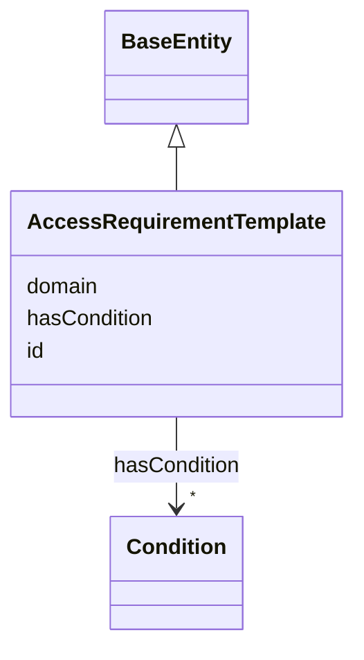

---
search:
  boost: 10.0
---

# Class: AccessRequirementTemplate 


_A reusable set of DUO-backed Conditions an IRBRequirement can extend. **Honest grounding note**: no real Synapse or repo data source exists for AR-template reuse itself -- verified directly that Synapse's AccessRequirement has no template/inheritance mechanism at all, only subjectIds. This class ships as structural capability, populated with one illustrative example that reuses real Condition data (see hasCondition below), not presented as sourced from a specific real AR. `is_a: BaseEntity` for a synthetic dotted id, same reasoning as AccessGrant/AccessRequirementAssociation: no single natural key exists for "this template" as a first-class thing. See plans/governance_graph_open_questions.md Section C.2._


<div data-search-exclude markdown="1">


URI: [sagegov:AccessRequirementTemplate](https://sagebionetworks.org/governance/AccessRequirementTemplate)





## Inheritance
* [BaseEntity](../classes/BaseEntity.md)
    * **AccessRequirementTemplate**


## Class Properties

| Property | Value |
| --- | --- |
| Class URI | [sagegov:AccessRequirementTemplate](https://sagebionetworks.org/governance/AccessRequirementTemplate) |
| Tree Root | Yes |


## Slots

| Name | Cardinality and Range | Description | Inheritance |
| ---  | --- | --- | --- |
| [domain](../slots/domain.md) | 0..1 <br/> [String](../types/String.md) | Free-text research domain this template applies to, e | direct |
| [hasCondition](../slots/hasCondition.md) | * <br/> [Condition](../classes/Condition.md) | The DUO-backed Conditions this attaches to -- gov:Condition individuals add_a... | direct |
| [id](../slots/id.md) | 1 <br/> [String](../types/String.md) | A synthetic identifier for this template | [BaseEntity](../classes/BaseEntity.md) |


## Usages

| used by | used in | type | used |
| ---  | --- | --- | --- |
| [IRBRequirement](../classes/IRBRequirement.md) | [extendsTemplate](../slots/extendsTemplate.md) | range | [AccessRequirementTemplate](../classes/AccessRequirementTemplate.md) |


## Identifier and Mapping Information


### Schema Source


* from schema: https://w3id.org/sage-bionetworks/governance-duo/governance_duo


## Mappings

| Mapping Type | Mapped Value |
| ---  | ---  |
| self | sagegov:AccessRequirementTemplate |
| native | governanceduo:AccessRequirementTemplate |


## LinkML Source

<!-- TODO: investigate https://stackoverflow.com/questions/37606292/how-to-create-tabbed-code-blocks-in-mkdocs-or-sphinx -->

### Direct

<details>
```yaml
name: AccessRequirementTemplate
description: 'A reusable set of DUO-backed Conditions an IRBRequirement can extend.
  **Honest grounding note**: no real Synapse or repo data source exists for AR-template
  reuse itself -- verified directly that Synapse''s AccessRequirement has no template/inheritance
  mechanism at all, only subjectIds. This class ships as structural capability, populated
  with one illustrative example that reuses real Condition data (see hasCondition
  below), not presented as sourced from a specific real AR. `is_a: BaseEntity` for
  a synthetic dotted id, same reasoning as AccessGrant/AccessRequirementAssociation:
  no single natural key exists for "this template" as a first-class thing. See plans/governance_graph_open_questions.md
  Section C.2.'
from_schema: https://w3id.org/sage-bionetworks/governance-duo/governance_duo
is_a: BaseEntity
slots:
- domain
- hasCondition
slot_usage:
  id:
    name: id
    description: A synthetic identifier for this template.
    examples:
    - value: access_requirement_template.ar-genomics
    pattern: ^access_requirement_template\.[A-Za-z0-9_-]+$
class_uri: sagegov:AccessRequirementTemplate
tree_root: true

```
</details>

### Induced

<details>
```yaml
name: AccessRequirementTemplate
description: 'A reusable set of DUO-backed Conditions an IRBRequirement can extend.
  **Honest grounding note**: no real Synapse or repo data source exists for AR-template
  reuse itself -- verified directly that Synapse''s AccessRequirement has no template/inheritance
  mechanism at all, only subjectIds. This class ships as structural capability, populated
  with one illustrative example that reuses real Condition data (see hasCondition
  below), not presented as sourced from a specific real AR. `is_a: BaseEntity` for
  a synthetic dotted id, same reasoning as AccessGrant/AccessRequirementAssociation:
  no single natural key exists for "this template" as a first-class thing. See plans/governance_graph_open_questions.md
  Section C.2.'
from_schema: https://w3id.org/sage-bionetworks/governance-duo/governance_duo
is_a: BaseEntity
slot_usage:
  id:
    name: id
    description: A synthetic identifier for this template.
    examples:
    - value: access_requirement_template.ar-genomics
    pattern: ^access_requirement_template\.[A-Za-z0-9_-]+$
attributes:
  domain:
    name: domain
    description: Free-text research domain this template applies to, e.g. "genomics".
    from_schema: https://w3id.org/sage-bionetworks/governance-duo/governance_duo
    rank: 1000
    slot_uri: sagegov:domain
    owner: AccessRequirementTemplate
    domain_of:
    - AccessRequirementTemplate
    range: string
  hasCondition:
    name: hasCondition
    description: The DUO-backed Conditions this attaches to -- gov:Condition individuals
      add_access_requirement() mints from real dataUseModifiers data (see plans/rebac_governance_graph_alignment.md).
      Shared by AccessRequirementReference (the AR stub these Conditions are minted
      onto in the first place) and AccessRequirementTemplate (which reuses the same
      real Condition nodes).
    from_schema: https://w3id.org/sage-bionetworks/governance-duo/governance_duo
    rank: 1000
    slot_uri: sagegov:hasCondition
    owner: AccessRequirementTemplate
    domain_of:
    - AccessRequirementReference
    - AccessRequirementTemplate
    range: Condition
    multivalued: true
  id:
    name: id
    description: A synthetic identifier for this template.
    examples:
    - value: access_requirement_template.ar-genomics
    from_schema: https://w3id.org/sage-bionetworks/governance-duo/governance_duo
    rank: 1000
    slot_uri: dcterms:identifier
    identifier: true
    owner: AccessRequirementTemplate
    domain_of:
    - BaseEntity
    range: string
    required: true
    pattern: ^access_requirement_template\.[A-Za-z0-9_-]+$
class_uri: sagegov:AccessRequirementTemplate
tree_root: true

```
</details></div>