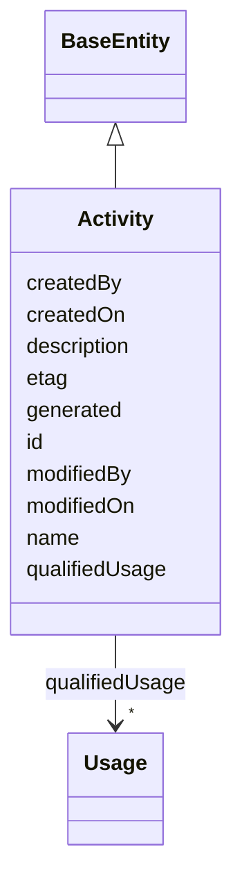

---
search:
  boost: 10.0
---

# Class: Activity 


_Mirrors Synapse's real Activity object (org.sagebionetworks.repo.model.provenance.Activity — id/name/description/ etag/createdOn/modifiedOn/createdBy/modifiedBy/used — verified directly against rest-docs.synapse.org). Returned by GET /entity/{id}/generatedBy and GET /entity/{id}/version/{versionNumber}/generatedBy (both confirmed to exist, both OAuth `view` scope — the same auth tier scripts/sync_governance_graph.py already requires, no new credential type needed). See plans/prov_o_integration.md Section 1._


<div data-search-exclude markdown="1">


URI: [prov:Activity](http://www.w3.org/ns/prov#Activity)





## Inheritance
* [BaseEntity](../classes/BaseEntity.md)
    * **Activity**


## Class Properties

| Property | Value |
| --- | --- |
| Class URI | [prov:Activity](http://www.w3.org/ns/prov#Activity) |


## Slots

| Name | Cardinality and Range | Description | Inheritance |
| ---  | --- | --- | --- |
| [name](../slots/name.md) | 0..1 <br/> [String](../types/String.md) | A Synapse-native display name | direct |
| [description](../slots/description.md) | 0..1 <br/> [String](../types/String.md) | Human-readable description of this condition, taken directly from DataUseModi... | direct |
| [etag](../slots/etag.md) | 0..1 <br/> [String](../types/String.md) | Entity tag for optimistic concurrency control (a 36-character UUID) | direct |
| [createdOn](../slots/createdOn.md) | 0..1 <br/> [Integer](../types/Integer.md) | When the record was created (epoch milliseconds in the source Synapse tables) | direct |
| [modifiedOn](../slots/modifiedOn.md) | 0..1 <br/> [Integer](../types/Integer.md) | When this record was last modified (epoch milliseconds) | direct |
| [createdBy](../slots/createdBy.md) | 0..1 <br/> [Integer](../types/Integer.md) | Synapse numeric user id of the record's creator | direct |
| [modifiedBy](../slots/modifiedBy.md) | 0..1 <br/> [Integer](../types/Integer.md) | Synapse numeric user id of who last modified this record | direct |
| [generated](../slots/generated.md) | 0..1 <br/> [Uriorcurie](../types/Uriorcurie.md) | The SynapseEntity this Activity produced | direct |
| [qualifiedUsage](../slots/qualifiedUsage.md) | * <br/> [Usage](../classes/Usage.md) | The Usage records (mirroring Activity | direct |
| [id](../slots/id.md) | 1 <br/> [String](../types/String.md) | A unique identifier for this activity (schematic-schema-style dotted string w... | [BaseEntity](../classes/BaseEntity.md) |


## Identifier and Mapping Information


### Schema Source


* from schema: https://w3id.org/sage-bionetworks/governance-duo/governance_duo


## Mappings

| Mapping Type | Mapped Value |
| ---  | ---  |
| self | prov:Activity |
| native | governanceduo:Activity |


## LinkML Source

<!-- TODO: investigate https://stackoverflow.com/questions/37606292/how-to-create-tabbed-code-blocks-in-mkdocs-or-sphinx -->

### Direct

<details>
```yaml
name: Activity
description: Mirrors Synapse's real Activity object (org.sagebionetworks.repo.model.provenance.Activity
  — id/name/description/ etag/createdOn/modifiedOn/createdBy/modifiedBy/used — verified
  directly against rest-docs.synapse.org). Returned by GET /entity/{id}/generatedBy
  and GET /entity/{id}/version/{versionNumber}/generatedBy (both confirmed to exist,
  both OAuth `view` scope — the same auth tier scripts/sync_governance_graph.py already
  requires, no new credential type needed). See plans/prov_o_integration.md Section
  1.
from_schema: https://w3id.org/sage-bionetworks/governance-duo/governance_duo
is_a: BaseEntity
slots:
- name
- description
- etag
- createdOn
- modifiedOn
- createdBy
- modifiedBy
- generated
- qualifiedUsage
slot_usage:
  id:
    name: id
    description: A unique identifier for this activity (schematic-schema-style dotted
      string wrapping Synapse's own string Activity.id, same id convention as DataAccessSubmission/ResearchProject
      in governance_graph.yaml).
    examples:
    - value: activity.1001
    pattern: ^activity\.[A-Za-z0-9_-]+$
class_uri: prov:Activity

```
</details>

### Induced

<details>
```yaml
name: Activity
description: Mirrors Synapse's real Activity object (org.sagebionetworks.repo.model.provenance.Activity
  — id/name/description/ etag/createdOn/modifiedOn/createdBy/modifiedBy/used — verified
  directly against rest-docs.synapse.org). Returned by GET /entity/{id}/generatedBy
  and GET /entity/{id}/version/{versionNumber}/generatedBy (both confirmed to exist,
  both OAuth `view` scope — the same auth tier scripts/sync_governance_graph.py already
  requires, no new credential type needed). See plans/prov_o_integration.md Section
  1.
from_schema: https://w3id.org/sage-bionetworks/governance-duo/governance_duo
is_a: BaseEntity
slot_usage:
  id:
    name: id
    description: A unique identifier for this activity (schematic-schema-style dotted
      string wrapping Synapse's own string Activity.id, same id convention as DataAccessSubmission/ResearchProject
      in governance_graph.yaml).
    examples:
    - value: activity.1001
    pattern: ^activity\.[A-Za-z0-9_-]+$
attributes:
  name:
    name: name
    description: A Synapse-native display name. Shared by SynapseAccessRequirementMixin
      (ACCESS_REQUIREMENT.NAME) and, via the transitive import chain governance_graph.yaml
      -> access_requirement.yaml -> mixins.yaml, SynapseEntity (NODE.NAME) in governance_graph.yaml
      — defined once here rather than in governance_graph.yaml itself, since mixins.yaml
      cannot import governance_graph.yaml back without creating a cycle (governance_graph.yaml
      already depends on mixins.yaml through access_requirement.yaml).
    from_schema: https://w3id.org/sage-bionetworks/governance-duo/governance_duo
    rank: 1000
    owner: Activity
    domain_of:
    - SynapseAccessRequirementMixin
    - SynapseEntity
    - Program
    - Activity
    - Usage
    range: string
  description:
    name: description
    description: 'Human-readable description of this condition, taken directly from
      DataUseModifierEnum.permissible_values[code]''s own description: text, not re-authored
      here.'
    from_schema: https://w3id.org/sage-bionetworks/governance-duo/governance_duo
    exact_mappings:
    - dcterms:description
    rank: 1000
    slot_uri: sagegov:description
    owner: Activity
    domain_of:
    - Condition
    - Activity
    range: string
  etag:
    name: etag
    description: Entity tag for optimistic concurrency control (a 36-character UUID).
      Shared the same way as `name` above, by SynapseAccessRequirementMixin (ACCESS_REQUIREMENT.ETAG)
      and SynapseEntity/DataAccessSubmission (NODE.ETAG/DATA_ACCESS_SUBMISSION.ETAG)
      in governance_graph.yaml.
    from_schema: https://w3id.org/sage-bionetworks/governance-duo/governance_duo
    rank: 1000
    owner: Activity
    domain_of:
    - SynapseAccessRequirementMixin
    - SynapseEntity
    - DataAccessSubmission
    - AccessApproval
    - ResearchProject
    - DataAccessRequest
    - Activity
    range: string
  createdOn:
    name: createdOn
    description: When the record was created (epoch milliseconds in the source Synapse
      tables). Shared the same way as `name` above. Distinct from ContributionMixin's
      contributionDate for the same reason as createdBy above.
    from_schema: https://w3id.org/sage-bionetworks/governance-duo/governance_duo
    exact_mappings:
    - dcterms:created
    rank: 1000
    owner: Activity
    domain_of:
    - SynapseAccessRequirementMixin
    - SynapseEntity
    - AccessGrant
    - AccessApproval
    - ResearchProject
    - DataAccessRequest
    - Activity
    range: integer
  modifiedOn:
    name: modifiedOn
    description: When this record was last modified (epoch milliseconds). On DataAccessSubmissionStatus
      this is emitted under the distinct gov:statusModifiedOn predicate instead (a
      bare constant in build_governance_graph.py, not resolved via this slot_uri --
      see that class's own description); DataAccessRequest resolves it via this slot's
      own sagegov:modifiedOn directly.
    from_schema: https://w3id.org/sage-bionetworks/governance-duo/governance_duo
    exact_mappings:
    - dcterms:modified
    rank: 1000
    slot_uri: sagegov:modifiedOn
    owner: Activity
    domain_of:
    - DataAccessSubmissionStatus
    - DataAccessRequest
    - Activity
    range: integer
  createdBy:
    name: createdBy
    description: Synapse numeric user id of the record's creator. Shared the same
      way as `name` above. Distinct from ContributionMixin's contributorName, which
      is this repo's own free-text curator-provenance field, not Synapse's own numeric
      CREATED_BY column — both coexist on AccessRequirement without collision.
    comments:
    - 'scripts/build_governance_graph.py emits this integer two different ways depending
      on which class it''s on: as an IRI reference to a gov:Principal node (gov:createdBy)
      on DataAccessSubmission -- since a submission''s creator can be looked up as
      a first-class Principal individual -- but as a plain literal (gov:createdByUserId,
      a distinct predicate, not gov:createdBy) on SynapseEntity, which has no corresponding
      Principal record to link to. This divergence is deliberate and documented in
      shapes/governance_graph.owl.ttl, not a schema/export mismatch to fix.'
    from_schema: https://w3id.org/sage-bionetworks/governance-duo/governance_duo
    exact_mappings:
    - dcterms:creator
    rank: 1000
    owner: Activity
    domain_of:
    - SynapseAccessRequirementMixin
    - SynapseEntity
    - ResearchProject
    - DataAccessRequest
    - Activity
    range: integer
  modifiedBy:
    name: modifiedBy
    description: Synapse numeric user id of who last modified this record. On DataAccessSubmission,
      this is `Submission.modifiedBy` in Synapse's live REST API (moved here from
      DataAccessSubmissionStatus, which does not carry this field live; see DataAccessSubmissionStatus's
      own description); on DataAccessRequest, it's `RequestInterface.modifiedBy`.
      Emitted as an IRI reference to a sagegov:Principal node, not a literal, mirroring
      submittedBy above.
    from_schema: https://w3id.org/sage-bionetworks/governance-duo/governance_duo
    close_mappings:
    - dcterms:contributor
    rank: 1000
    slot_uri: sagegov:modifiedBy
    owner: Activity
    domain_of:
    - DataAccessSubmission
    - DataAccessRequest
    - Activity
    range: integer
  generated:
    name: generated
    description: The SynapseEntity this Activity produced. range is the untyped uriorcurie,
      not SynapseEntity itself — see this schema's own description for why (the referenced
      individual is never asserted in this schema's own example-rdf ABox).
    from_schema: https://w3id.org/sage-bionetworks/governance-duo/governance_duo
    rank: 1000
    slot_uri: prov:generated
    owner: Activity
    domain_of:
    - Activity
    range: uriorcurie
  qualifiedUsage:
    name: qualifiedUsage
    description: The Usage records (mirroring Activity.used) describing what this
      Activity consumed, and whether each was executed rather than merely used as
      input data.
    from_schema: https://w3id.org/sage-bionetworks/governance-duo/governance_duo
    rank: 1000
    slot_uri: prov:qualifiedUsage
    owner: Activity
    domain_of:
    - Activity
    range: Usage
    multivalued: true
  id:
    name: id
    description: A unique identifier for this activity (schematic-schema-style dotted
      string wrapping Synapse's own string Activity.id, same id convention as DataAccessSubmission/ResearchProject
      in governance_graph.yaml).
    examples:
    - value: activity.1001
    from_schema: https://w3id.org/sage-bionetworks/governance-duo/governance_duo
    rank: 1000
    slot_uri: dcterms:identifier
    identifier: true
    owner: Activity
    domain_of:
    - BaseEntity
    range: string
    required: true
    pattern: ^activity\.[A-Za-z0-9_-]+$
class_uri: prov:Activity

```
</details></div>