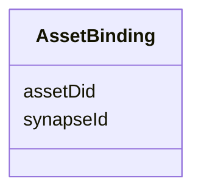

---
search:
  boost: 10.0
---

# Class: AssetBinding 


_One (Synapse entity id -> Policy Fabric Asset DID) pairing. Mirrors the Django Asset model's `did` field (unique per Asset) in tmp-policies/tools/asset_registry. A plain string, not a typed `range: SynapseEntity`, for synapseId: importing governance_graph.yaml (where SynapseEntity is defined) into this leaf file would create the same import cycle base_entity.yaml/props.yaml/mixins.yaml are designed to avoid (governance_graph.yaml already depends on mixins.yaml transitively, through access_requirement.yaml)._


<div data-search-exclude markdown="1">


URI: [governanceduo:class/AssetBinding](https://w3id.org/sage-bionetworks/governance-duo/class/AssetBinding)





<!-- no inheritance hierarchy -->

## Slots

| Name | Cardinality and Range | Description | Inheritance |
| ---  | --- | --- | --- |
| [synapseId](../slots/synapseId.md) | 1 <br/> [String](../types/String.md) | A Synapse entity id | direct |
| [assetDid](../slots/assetDid.md) | 1 <br/> [String](../types/String.md) | The Policy Fabric Asset-registry DID for synapseId | direct |


## Usages

| used by | used in | type | used |
| ---  | --- | --- | --- |
| [PolicyFabricMixin](../classes/PolicyFabricMixin.md) | [assetBindings](../slots/assetBindings.md) | range | [AssetBinding](../classes/AssetBinding.md) |
| [AccessRequirement](../classes/AccessRequirement.md) | [assetBindings](../slots/assetBindings.md) | range | [AssetBinding](../classes/AssetBinding.md) |


## Identifier and Mapping Information


### Schema Source


* from schema: https://w3id.org/sage-bionetworks/governance-duo/governance_duo


## Mappings

| Mapping Type | Mapped Value |
| ---  | ---  |
| self | governanceduo:AssetBinding |
| native | governanceduo:AssetBinding |


## LinkML Source

<!-- TODO: investigate https://stackoverflow.com/questions/37606292/how-to-create-tabbed-code-blocks-in-mkdocs-or-sphinx -->

### Direct

<details>
```yaml
name: AssetBinding
description: 'One (Synapse entity id -> Policy Fabric Asset DID) pairing. Mirrors
  the Django Asset model''s `did` field (unique per Asset) in tmp-policies/tools/asset_registry.
  A plain string, not a typed `range: SynapseEntity`, for synapseId: importing governance_graph.yaml
  (where SynapseEntity is defined) into this leaf file would create the same import
  cycle base_entity.yaml/props.yaml/mixins.yaml are designed to avoid (governance_graph.yaml
  already depends on mixins.yaml transitively, through access_requirement.yaml).'
from_schema: https://w3id.org/sage-bionetworks/governance-duo/governance_duo
slots:
- synapseId
- assetDid

```
</details>

### Induced

<details>
```yaml
name: AssetBinding
description: 'One (Synapse entity id -> Policy Fabric Asset DID) pairing. Mirrors
  the Django Asset model''s `did` field (unique per Asset) in tmp-policies/tools/asset_registry.
  A plain string, not a typed `range: SynapseEntity`, for synapseId: importing governance_graph.yaml
  (where SynapseEntity is defined) into this leaf file would create the same import
  cycle base_entity.yaml/props.yaml/mixins.yaml are designed to avoid (governance_graph.yaml
  already depends on mixins.yaml transitively, through access_requirement.yaml).'
from_schema: https://w3id.org/sage-bionetworks/governance-duo/governance_duo
attributes:
  synapseId:
    name: synapseId
    description: 'A Synapse entity id. Reused across contexts that reference one specific
      Synapse entity: an AssetBinding registering it as a Policy Fabric Asset (this
      file), or a DrsObjectMapping crosswalking it to a DRS DrsObject (drs_alignment.yaml).'
    from_schema: https://w3id.org/sage-bionetworks/governance-duo/governance_duo
    rank: 1000
    owner: AssetBinding
    domain_of:
    - AssetBinding
    - DrsObjectMapping
    range: string
    required: true
    pattern: ^syn\d+$
  assetDid:
    name: assetDid
    description: The Policy Fabric Asset-registry DID for synapseId.
    from_schema: https://w3id.org/sage-bionetworks/governance-duo/governance_duo
    rank: 1000
    owner: AssetBinding
    domain_of:
    - AssetBinding
    range: string
    required: true
    pattern: ^did:[a-z0-9]+:.+$

```
</details></div>