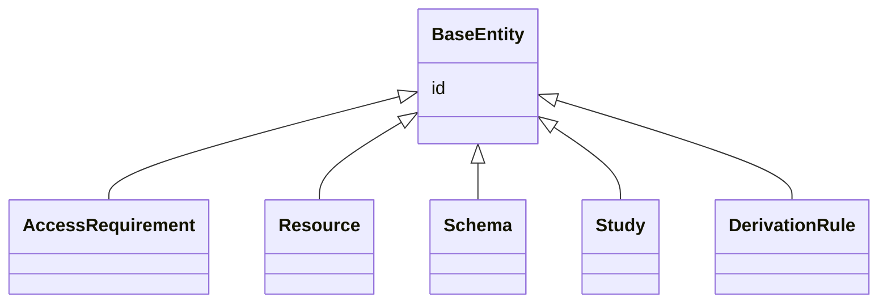

---
search:
  boost: 10.0
---

# Class: BaseEntity 


_Abstract root shared by every governanceDUO class._


<div data-search-exclude markdown="1">


* __NOTE__: this is an abstract class and should not be instantiated directly


URI: [governanceduo:class/BaseEntity](https://w3id.org/sage-bionetworks/governance-duo/class/BaseEntity)





## Inheritance
* **BaseEntity**
    * [AccessRequirement](../classes/AccessRequirement.md) [ [GovernanceMixin](../classes/GovernanceMixin.md) [ContributionMixin](../classes/ContributionMixin.md) [PolicyFabricMixin](../classes/PolicyFabricMixin.md) [SynapseAccessRequirementMixin](../classes/SynapseAccessRequirementMixin.md)]
    * [Resource](../classes/Resource.md) [ [GovernanceMixin](../classes/GovernanceMixin.md)]
    * [Schema](../classes/Schema.md)
    * [Study](../classes/Study.md) [ [GovernanceMixin](../classes/GovernanceMixin.md)]
    * [DerivationRule](../classes/DerivationRule.md)


## Slots

| Name | Cardinality and Range | Description | Inheritance |
| ---  | --- | --- | --- |
| [id](../slots/id.md) | 1 <br/> [String](../types/String.md) | A unique identifier for this record | direct |


## Identifier and Mapping Information


### Schema Source


* from schema: https://w3id.org/sage-bionetworks/governance-duo/governance_duo


## Mappings

| Mapping Type | Mapped Value |
| ---  | ---  |
| self | governanceduo:BaseEntity |
| native | governanceduo:BaseEntity |


## LinkML Source

<!-- TODO: investigate https://stackoverflow.com/questions/37606292/how-to-create-tabbed-code-blocks-in-mkdocs-or-sphinx -->

### Direct

<details>
```yaml
name: BaseEntity
description: Abstract root shared by every governanceDUO class.
from_schema: https://w3id.org/sage-bionetworks/governance-duo/governance_duo
abstract: true
slots:
- id

```
</details>

### Induced

<details>
```yaml
name: BaseEntity
description: Abstract root shared by every governanceDUO class.
from_schema: https://w3id.org/sage-bionetworks/governance-duo/governance_duo
abstract: true
attributes:
  id:
    name: id
    description: 'A unique identifier for this record. Narrowed per class via `slot_usage`
      in access_requirement.yaml/resource.yaml/schema.yaml/study.yaml -- the record
      layer''s own four curated classes. (The graph layer''s classes, e.g. SynapseEntity,
      aren''t part of this: they mint IRIs a completely different way, via scripts/graph_iris.py,
      not a slot_usage id pattern -- see plans/model_refactor.md.) The archived schematic
      CSV source (archive/model/*.model.csv) kept class-prefixed attribute names (AccessRequirement_id,
      Resource_id, Schema_id, Study_id) instead: schematic''s model CSV has one flat,
      global Attribute namespace with no per-class scoping equivalent to slot_usage,
      so four classes couldn''t share a bare "id" attribute there without colliding.'
    from_schema: https://w3id.org/sage-bionetworks/governance-duo/governance_duo
    rank: 1000
    slot_uri: dcterms:identifier
    identifier: true
    owner: BaseEntity
    domain_of:
    - BaseEntity
    range: string
    required: true

```
</details></div>