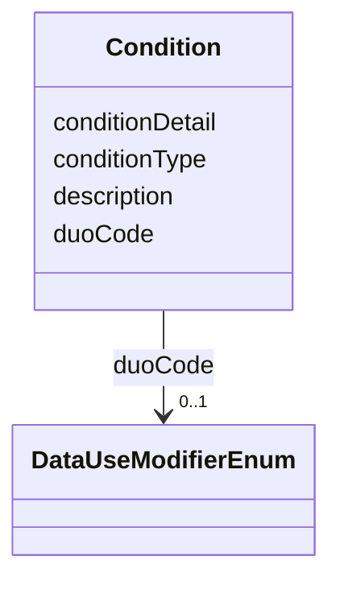

---
search:
  boost: 10.0
---

# Class: Condition 


_A single DUO-code-backed condition on an AccessRequirement, surfacing GovernanceMixin's dataUseModifiers/companion-slot data -- already present in this repo's AccessRequirement examples -- as a first-class graph node instead of leaving it invisible on the gov:AccessRequirement stub (see scripts/build_governance_graph.py's TYPE("AccessRequirement") comment for why that stub has its own, separate node). Mirrors the shape of a gov:Condition example proposed in review on sagebrain-infra PR #54 (thomasyu888, https://github.com/Sage-Bionetworks-IT/sagebrain-infra/pull/54#discussion_r3926030399), built from real data already in this repo, not a new source of truth -- see plans/rebac_governance_graph_alignment.md for the full rationale. Not `is_a: BaseEntity`: like DataAccessSubmissionStatus, it has no independent identifier of its own in Synapse's schema -- it's keyed structurally by (AccessRequirement, duoCode/conditionType), not a synthesized dotted id._


<div data-search-exclude markdown="1">


URI: [sagegov:Condition](https://sagebionetworks.org/governance/Condition)





<!-- no inheritance hierarchy -->

## Class Properties

| Property | Value |
| --- | --- |
| Class URI | [sagegov:Condition](https://sagebionetworks.org/governance/Condition) |


## Slots

| Name | Cardinality and Range | Description | Inheritance |
| ---  | --- | --- | --- |
| [conditionType](../slots/conditionType.md) | 0..1 <br/> [String](../types/String.md) | A short label for this condition | direct |
| [duoCode](../slots/duoCode.md) | 0..1 <br/> [DataUseModifierEnum](../enums/DataUseModifierEnum.md) | The real DUO CURIE this condition represents, when one exists | direct |
| [description](../slots/description.md) | 0..1 <br/> [String](../types/String.md) | Human-readable description of this condition, taken directly from DataUseModi... | direct |
| [conditionDetail](../slots/conditionDetail.md) | * <br/> [String](../types/String.md) | Zero or more companion-slot values from the source AccessRequirement, one per... | direct |


## Usages

| used by | used in | type | used |
| ---  | --- | --- | --- |
| [AccessRequirementReference](../classes/AccessRequirementReference.md) | [hasCondition](../slots/hasCondition.md) | range | [Condition](../classes/Condition.md) |
| [AccessRequirementTemplate](../classes/AccessRequirementTemplate.md) | [hasCondition](../slots/hasCondition.md) | range | [Condition](../classes/Condition.md) |


## Identifier and Mapping Information


### Schema Source


* from schema: https://w3id.org/sage-bionetworks/governance-duo/governance_duo


## Mappings

| Mapping Type | Mapped Value |
| ---  | ---  |
| self | sagegov:Condition |
| native | governanceduo:Condition |


## LinkML Source

<!-- TODO: investigate https://stackoverflow.com/questions/37606292/how-to-create-tabbed-code-blocks-in-mkdocs-or-sphinx -->

### Direct

<details>
```yaml
name: Condition
description: 'A single DUO-code-backed condition on an AccessRequirement, surfacing
  GovernanceMixin''s dataUseModifiers/companion-slot data -- already present in this
  repo''s AccessRequirement examples -- as a first-class graph node instead of leaving
  it invisible on the gov:AccessRequirement stub (see scripts/build_governance_graph.py''s
  TYPE("AccessRequirement") comment for why that stub has its own, separate node).
  Mirrors the shape of a gov:Condition example proposed in review on sagebrain-infra
  PR #54 (thomasyu888, https://github.com/Sage-Bionetworks-IT/sagebrain-infra/pull/54#discussion_r3926030399),
  built from real data already in this repo, not a new source of truth -- see plans/rebac_governance_graph_alignment.md
  for the full rationale. Not `is_a: BaseEntity`: like DataAccessSubmissionStatus,
  it has no independent identifier of its own in Synapse''s schema -- it''s keyed
  structurally by (AccessRequirement, duoCode/conditionType), not a synthesized dotted
  id.'
from_schema: https://w3id.org/sage-bionetworks/governance-duo/governance_duo
slots:
- conditionType
- duoCode
- description
- conditionDetail
class_uri: sagegov:Condition

```
</details>

### Induced

<details>
```yaml
name: Condition
description: 'A single DUO-code-backed condition on an AccessRequirement, surfacing
  GovernanceMixin''s dataUseModifiers/companion-slot data -- already present in this
  repo''s AccessRequirement examples -- as a first-class graph node instead of leaving
  it invisible on the gov:AccessRequirement stub (see scripts/build_governance_graph.py''s
  TYPE("AccessRequirement") comment for why that stub has its own, separate node).
  Mirrors the shape of a gov:Condition example proposed in review on sagebrain-infra
  PR #54 (thomasyu888, https://github.com/Sage-Bionetworks-IT/sagebrain-infra/pull/54#discussion_r3926030399),
  built from real data already in this repo, not a new source of truth -- see plans/rebac_governance_graph_alignment.md
  for the full rationale. Not `is_a: BaseEntity`: like DataAccessSubmissionStatus,
  it has no independent identifier of its own in Synapse''s schema -- it''s keyed
  structurally by (AccessRequirement, duoCode/conditionType), not a synthesized dotted
  id.'
from_schema: https://w3id.org/sage-bionetworks/governance-duo/governance_duo
attributes:
  conditionType:
    name: conditionType
    description: 'A short label for this condition. For the 24 real DUO codes in DataUseModifierEnum,
      this is that code''s own duo_shorthand annotation (e.g. "GRU", "COL"); the 7
      Sage-local DUOPlus1-7 extensions have no duo_shorthand/meaning: CURIE at all,
      so their bare enum key (e.g. "DUOPlus1") is used instead -- see scripts/build_governance_graph.py.'
    from_schema: https://w3id.org/sage-bionetworks/governance-duo/governance_duo
    rank: 1000
    slot_uri: sagegov:conditionType
    owner: Condition
    domain_of:
    - Condition
    range: string
  duoCode:
    name: duoCode
    description: 'The real DUO CURIE this condition represents, when one exists. Deliberately
      not required: the 7 Sage-local DUOPlus1-7 extensions in DataUseModifierEnum
      have no meaning: CURIE at all -- see conditionType above for how those are represented
      instead.'
    from_schema: https://w3id.org/sage-bionetworks/governance-duo/governance_duo
    rank: 1000
    slot_uri: sagegov:duoCode
    owner: Condition
    domain_of:
    - Condition
    range: DataUseModifierEnum
  description:
    name: description
    description: 'Human-readable description of this condition, taken directly from
      DataUseModifierEnum.permissible_values[code]''s own description: text, not re-authored
      here.'
    from_schema: https://w3id.org/sage-bionetworks/governance-duo/governance_duo
    exact_mappings:
    - dcterms:description
    rank: 1000
    slot_uri: sagegov:description
    owner: Condition
    domain_of:
    - Condition
    range: string
  conditionDetail:
    name: conditionDetail
    description: Zero or more companion-slot values from the source AccessRequirement,
      one per GovernanceMixin.rules entry whose precondition matches this condition's
      duoCode/conditionType and whose postcondition slot is actually populated on
      the instance (e.g. the geographicalRestriction value(s) for DUO:0000022). Multivalued
      because GovernanceMixin.rules is genuinely many-to-many -- some codes have multiple
      companion slots, some companion slots serve multiple codes -- not because any
      single condition's own detail is inherently list-valued. See scripts/build_governance_graph.py.
    from_schema: https://w3id.org/sage-bionetworks/governance-duo/governance_duo
    rank: 1000
    slot_uri: sagegov:conditionDetail
    owner: Condition
    domain_of:
    - Condition
    range: string
    multivalued: true
class_uri: sagegov:Condition

```
</details></div>