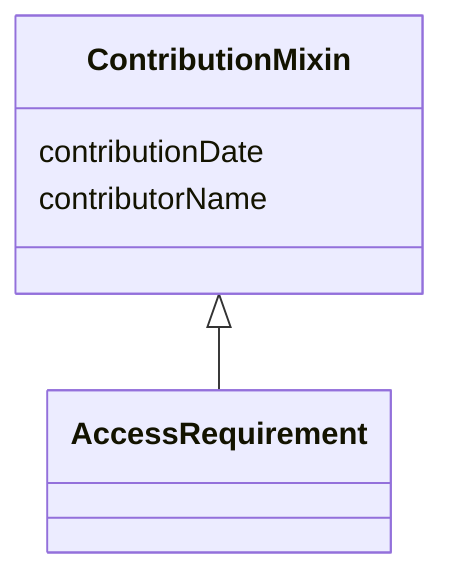

---
search:
  boost: 10.0
---

# Class: ContributionMixin 


_Contribution/authorship tracking. Only AccessRequirement uses this today, but it is factored out here (rather than inlined) so any class that later needs the same fields reuses it instead of duplicating — mirroring SageCommonDataModel's practice of factoring cross-cutting concerns out of individual entity files even before a second consumer exists._


<div data-search-exclude markdown="1">


URI: [governanceduo:class/ContributionMixin](https://w3id.org/sage-bionetworks/governance-duo/class/ContributionMixin)





<!-- no inheritance hierarchy -->

## Class Properties

| Property | Value |
| --- | --- |
| Mixin | Yes |


## Slots

| Name | Cardinality and Range | Description | Inheritance |
| ---  | --- | --- | --- |
| [contributorName](../slots/contributorName.md) | 1 <br/> [String](../types/String.md) | The name of the person who added this access requirement | direct |
| [contributionDate](../slots/contributionDate.md) | 1 <br/> [String](../types/String.md) | The date on which the access requirement was added | direct |


## Mixin Usage

| mixed into | description |
| --- | --- |
| [AccessRequirement](../classes/AccessRequirement.md) | Representation of a Synapse Access Requirement and its relationships to entit... |


## Identifier and Mapping Information


### Schema Source


* from schema: https://w3id.org/sage-bionetworks/governance-duo/governance_duo


## Mappings

| Mapping Type | Mapped Value |
| ---  | ---  |
| self | governanceduo:ContributionMixin |
| native | governanceduo:ContributionMixin |


## LinkML Source

<!-- TODO: investigate https://stackoverflow.com/questions/37606292/how-to-create-tabbed-code-blocks-in-mkdocs-or-sphinx -->

### Direct

<details>
```yaml
name: ContributionMixin
description: Contribution/authorship tracking. Only AccessRequirement uses this today,
  but it is factored out here (rather than inlined) so any class that later needs
  the same fields reuses it instead of duplicating — mirroring SageCommonDataModel's
  practice of factoring cross-cutting concerns out of individual entity files even
  before a second consumer exists.
from_schema: https://w3id.org/sage-bionetworks/governance-duo/governance_duo
mixin: true
slots:
- contributorName
- contributionDate
slot_usage:
  contributorName:
    name: contributorName
    required: true
  contributionDate:
    name: contributionDate
    required: true

```
</details>

### Induced

<details>
```yaml
name: ContributionMixin
description: Contribution/authorship tracking. Only AccessRequirement uses this today,
  but it is factored out here (rather than inlined) so any class that later needs
  the same fields reuses it instead of duplicating — mirroring SageCommonDataModel's
  practice of factoring cross-cutting concerns out of individual entity files even
  before a second consumer exists.
from_schema: https://w3id.org/sage-bionetworks/governance-duo/governance_duo
mixin: true
slot_usage:
  contributorName:
    name: contributorName
    required: true
  contributionDate:
    name: contributionDate
    required: true
attributes:
  contributorName:
    name: contributorName
    description: The name of the person who added this access requirement.
    comments:
    - prov:wasAttributedTo relates a prov:Entity to a prov:Agent; this slot holds
      a literal name rather than an Agent reference, so the mapping is close, not
      exact.
    from_schema: https://w3id.org/sage-bionetworks/governance-duo/governance_duo
    close_mappings:
    - prov:wasAttributedTo
    rank: 1000
    owner: ContributionMixin
    domain_of:
    - ContributionMixin
    range: string
    required: true
  contributionDate:
    name: contributionDate
    description: The date on which the access requirement was added.
    comments:
    - 'schematic Format: date'
    - prov:generatedAtTime ("The time at which an entity was completely created and
      is available for use") matches this slot's semantics closely, treating the AccessRequirement
      record itself as the generated prov:Entity.
    from_schema: https://w3id.org/sage-bionetworks/governance-duo/governance_duo
    close_mappings:
    - prov:generatedAtTime
    rank: 1000
    owner: ContributionMixin
    domain_of:
    - ContributionMixin
    range: string
    required: true

```
</details></div>