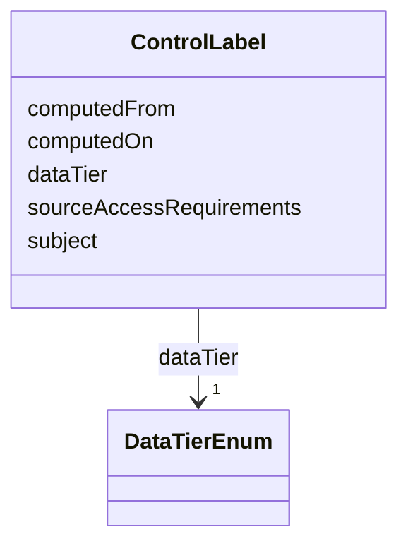

---
search:
  boost: 10.0
---

# Class: ControlLabel 


_A precomputed, per-SynapseEntity sensitivity label — the max DataTierEnum rank across an entity's full derivation ancestry, computed once when the entity is created/derived rather than re-walked live on every query (the note's own paragraph-18 design: "a control label computed once... stored as an attribute on the node, not recomputed live on every query"). Not `is_a: BaseEntity`: has no independent Synapse-sourced identifier of its own, same reasoning as Condition — like Condition, scripts/build_derivation_policy.py mints a real, stable per-subject IRI node for it at the script level even though the LinkML schema itself has no `id` slot to hang one off of._


<div data-search-exclude markdown="1">


URI: [governanceduo:ControlLabel](https://w3id.org/sage-bionetworks/governance-duo/ControlLabel)





<!-- no inheritance hierarchy -->

## Class Properties

| Property | Value |
| --- | --- |
| Class URI | [governanceduo:ControlLabel](https://w3id.org/sage-bionetworks/governance-duo/ControlLabel) |


## Slots

| Name | Cardinality and Range | Description | Inheritance |
| ---  | --- | --- | --- |
| [subject](../slots/subject.md) | 1 <br/> [Uriorcurie](../types/Uriorcurie.md) | The SynapseEntity this ControlLabel labels | direct |
| [dataTier](../slots/dataTier.md) | 1 <br/> [DataTierEnum](../enums/DataTierEnum.md) | Reuses GovernanceMixin's shared dataTier slot (mixins | direct |
| [sourceAccessRequirements](../slots/sourceAccessRequirements.md) | * <br/> [Uriorcurie](../types/Uriorcurie.md) | Every AccessRequirement contributing to this label's dataTier, across the sub... | direct |
| [computedFrom](../slots/computedFrom.md) | 0..1 <br/> [Uriorcurie](../types/Uriorcurie.md) | The Activity this label was (re)computed from | direct |
| [computedOn](../slots/computedOn.md) | 0..1 <br/> [Integer](../types/Integer.md) | When this ControlLabel was (re)computed (epoch milliseconds) | direct |


## Usages

| used by | used in | type | used |
| ---  | --- | --- | --- |
| [DerivationReview](../classes/DerivationReview.md) | [inputLabels](../slots/inputLabels.md) | range | [ControlLabel](../classes/ControlLabel.md) |


## Identifier and Mapping Information


### Schema Source


* from schema: https://w3id.org/sage-bionetworks/governance-duo/governance_duo


## Mappings

| Mapping Type | Mapped Value |
| ---  | ---  |
| self | governanceduo:ControlLabel |
| native | governanceduo:ControlLabel |


## LinkML Source

<!-- TODO: investigate https://stackoverflow.com/questions/37606292/how-to-create-tabbed-code-blocks-in-mkdocs-or-sphinx -->

### Direct

<details>
```yaml
name: ControlLabel
description: 'A precomputed, per-SynapseEntity sensitivity label — the max DataTierEnum
  rank across an entity''s full derivation ancestry, computed once when the entity
  is created/derived rather than re-walked live on every query (the note''s own paragraph-18
  design: "a control label computed once... stored as an attribute on the node, not
  recomputed live on every query"). Not `is_a: BaseEntity`: has no independent Synapse-sourced
  identifier of its own, same reasoning as Condition — like Condition, scripts/build_derivation_policy.py
  mints a real, stable per-subject IRI node for it at the script level even though
  the LinkML schema itself has no `id` slot to hang one off of.'
from_schema: https://w3id.org/sage-bionetworks/governance-duo/governance_duo
slots:
- subject
- dataTier
- sourceAccessRequirements
- computedFrom
- computedOn
slot_usage:
  dataTier:
    name: dataTier
    description: 'Reuses GovernanceMixin''s shared dataTier slot (mixins.yaml) — the
      same "tier of data access associated with" concept, computed here rather than
      declared. Narrowed to single-valued (GovernanceMixin''s own dataTier is multivalued,
      since a single AccessRequirement can name more than one tier) since a ControlLabel
      carries exactly one, precomputed rank. slot_uri set explicitly here: the base
      dataTier slot (mixins.yaml) declares none of its own, and scripts/build_derivation_policy.py''s
      PREDICATE() reuse (from build_governance_graph.py) requires one.'
    slot_uri: governanceduo:dataTier
    required: true
    multivalued: false
class_uri: governanceduo:ControlLabel

```
</details>

### Induced

<details>
```yaml
name: ControlLabel
description: 'A precomputed, per-SynapseEntity sensitivity label — the max DataTierEnum
  rank across an entity''s full derivation ancestry, computed once when the entity
  is created/derived rather than re-walked live on every query (the note''s own paragraph-18
  design: "a control label computed once... stored as an attribute on the node, not
  recomputed live on every query"). Not `is_a: BaseEntity`: has no independent Synapse-sourced
  identifier of its own, same reasoning as Condition — like Condition, scripts/build_derivation_policy.py
  mints a real, stable per-subject IRI node for it at the script level even though
  the LinkML schema itself has no `id` slot to hang one off of.'
from_schema: https://w3id.org/sage-bionetworks/governance-duo/governance_duo
slot_usage:
  dataTier:
    name: dataTier
    description: 'Reuses GovernanceMixin''s shared dataTier slot (mixins.yaml) — the
      same "tier of data access associated with" concept, computed here rather than
      declared. Narrowed to single-valued (GovernanceMixin''s own dataTier is multivalued,
      since a single AccessRequirement can name more than one tier) since a ControlLabel
      carries exactly one, precomputed rank. slot_uri set explicitly here: the base
      dataTier slot (mixins.yaml) declares none of its own, and scripts/build_derivation_policy.py''s
      PREDICATE() reuse (from build_governance_graph.py) requires one.'
    slot_uri: governanceduo:dataTier
    required: true
    multivalued: false
attributes:
  subject:
    name: subject
    description: The SynapseEntity this ControlLabel labels. range is uriorcurie,
      not SynapseEntity — see this schema's own description.
    from_schema: https://w3id.org/sage-bionetworks/governance-duo/governance_duo
    rank: 1000
    slot_uri: governanceduo:subject
    owner: ControlLabel
    domain_of:
    - ControlLabel
    range: uriorcurie
    required: true
  dataTier:
    name: dataTier
    description: 'Reuses GovernanceMixin''s shared dataTier slot (mixins.yaml) — the
      same "tier of data access associated with" concept, computed here rather than
      declared. Narrowed to single-valued (GovernanceMixin''s own dataTier is multivalued,
      since a single AccessRequirement can name more than one tier) since a ControlLabel
      carries exactly one, precomputed rank. slot_uri set explicitly here: the base
      dataTier slot (mixins.yaml) declares none of its own, and scripts/build_derivation_policy.py''s
      PREDICATE() reuse (from build_governance_graph.py) requires one.'
    comments:
    - Required when dataUseModifiers contains DUOPlus5 — see GovernanceMixin rules.
    - 'NCIT:C175887 "Open or Controlled Data Access Indicator" (synonym: "Data Access
      Level") is defined as "Specifies whether the data in a repository is open access
      or controlled access" — a direct match for this slot''s Anonymous/Open/Controlled/Private
      tiers.'
    from_schema: https://w3id.org/sage-bionetworks/governance-duo/governance_duo
    exact_mappings:
    - NCIT:C175887
    rank: 1000
    slot_uri: governanceduo:dataTier
    owner: ControlLabel
    domain_of:
    - GovernanceMixin
    - ControlLabel
    range: DataTierEnum
    required: true
    multivalued: false
  sourceAccessRequirements:
    name: sourceAccessRequirements
    description: Every AccessRequirement contributing to this label's dataTier, across
      the subject's full derivation ancestry — what lets a later composite-risk check
      tell whether two ControlLabels trace back to the same AR or to genuinely different
      ones (the note's paragraph-12 case). range is uriorcurie, not AccessRequirementReference
      — see this schema's own description.
    from_schema: https://w3id.org/sage-bionetworks/governance-duo/governance_duo
    rank: 1000
    slot_uri: governanceduo:sourceAccessRequirements
    owner: ControlLabel
    domain_of:
    - ControlLabel
    range: uriorcurie
    multivalued: true
  computedFrom:
    name: computedFrom
    description: 'The Activity this label was (re)computed from. range is uriorcurie,
      not Activity — see this schema''s own description. Also the staleness signal
      Section 7 of plans/prov_o_integration.md relies on: if an AR named in sourceAccessRequirements
      is later revoked, any label computed before that point is provably stale.'
    from_schema: https://w3id.org/sage-bionetworks/governance-duo/governance_duo
    rank: 1000
    slot_uri: governanceduo:computedFrom
    owner: ControlLabel
    domain_of:
    - ControlLabel
    range: uriorcurie
  computedOn:
    name: computedOn
    description: When this ControlLabel was (re)computed (epoch milliseconds).
    from_schema: https://w3id.org/sage-bionetworks/governance-duo/governance_duo
    rank: 1000
    slot_uri: governanceduo:computedOn
    owner: ControlLabel
    domain_of:
    - ControlLabel
    range: integer
class_uri: governanceduo:ControlLabel

```
</details></div>