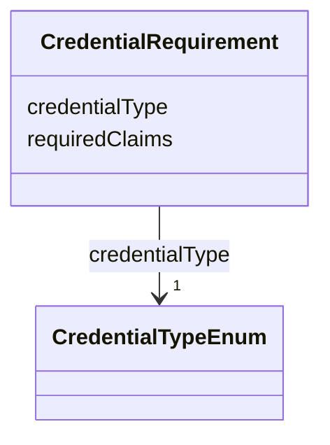

---
search:
  boost: 10.0
---

# Class: CredentialRequirement 


_One credential type a Policy Fabric policy_card requires the requester to present, and the specific claim path(s) it checks — verified from the folder's actual policy.rego, not inferred from the credential's schema alone (a credential type can be required without every one of its claims being read by a given policy)._


<div data-search-exclude markdown="1">


URI: [governanceduo:class/CredentialRequirement](https://w3id.org/sage-bionetworks/governance-duo/class/CredentialRequirement)





<!-- no inheritance hierarchy -->

## Slots

| Name | Cardinality and Range | Description | Inheritance |
| ---  | --- | --- | --- |
| [credentialType](../slots/credentialType.md) | 1 <br/> [CredentialTypeEnum](../enums/CredentialTypeEnum.md) |  | direct |
| [requiredClaims](../slots/requiredClaims.md) | 1..* <br/> [String](../types/String.md) | Dot-path claim name(s) this policy_card's Rego logic actually reads, e | direct |


## Usages

| used by | used in | type | used |
| ---  | --- | --- | --- |
| [PolicyCardBinding](../classes/PolicyCardBinding.md) | [requiredCredentials](../slots/requiredCredentials.md) | range | [CredentialRequirement](../classes/CredentialRequirement.md) |


## Identifier and Mapping Information


### Schema Source


* from schema: https://w3id.org/sage-bionetworks/governance-duo/governance_duo


## Mappings

| Mapping Type | Mapped Value |
| ---  | ---  |
| self | governanceduo:CredentialRequirement |
| native | governanceduo:CredentialRequirement |


## LinkML Source

<!-- TODO: investigate https://stackoverflow.com/questions/37606292/how-to-create-tabbed-code-blocks-in-mkdocs-or-sphinx -->

### Direct

<details>
```yaml
name: CredentialRequirement
description: One credential type a Policy Fabric policy_card requires the requester
  to present, and the specific claim path(s) it checks — verified from the folder's
  actual policy.rego, not inferred from the credential's schema alone (a credential
  type can be required without every one of its claims being read by a given policy).
from_schema: https://w3id.org/sage-bionetworks/governance-duo/governance_duo
slots:
- credentialType
- requiredClaims

```
</details>

### Induced

<details>
```yaml
name: CredentialRequirement
description: One credential type a Policy Fabric policy_card requires the requester
  to present, and the specific claim path(s) it checks — verified from the folder's
  actual policy.rego, not inferred from the credential's schema alone (a credential
  type can be required without every one of its claims being read by a given policy).
from_schema: https://w3id.org/sage-bionetworks/governance-duo/governance_duo
attributes:
  credentialType:
    name: credentialType
    from_schema: https://w3id.org/sage-bionetworks/governance-duo/governance_duo
    rank: 1000
    owner: CredentialRequirement
    domain_of:
    - CredentialRequirement
    range: CredentialTypeEnum
    required: true
  requiredClaims:
    name: requiredClaims
    description: Dot-path claim name(s) this policy_card's Rego logic actually reads,
      e.g. "locatedAt.country".
    from_schema: https://w3id.org/sage-bionetworks/governance-duo/governance_duo
    rank: 1000
    owner: CredentialRequirement
    domain_of:
    - CredentialRequirement
    range: string
    required: true
    multivalued: true

```
</details></div>