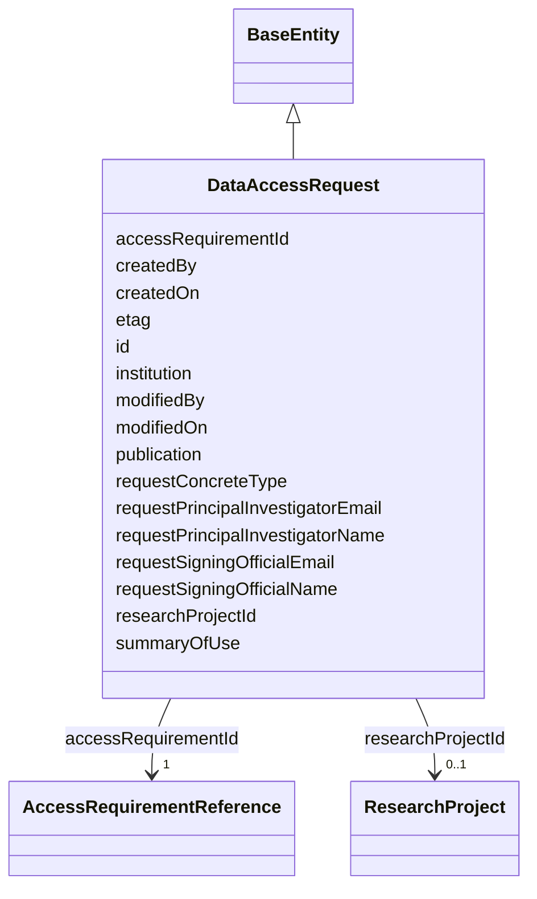

---
search:
  boost: 10.0
---

# Class: DataAccessRequest 


_A user's draft/submitted request against an AccessRequirement, behind a DataAccessSubmission. Mirrors Synapse's real RequestInterface/Request/ Renewal REST objects (org.sagebionetworks.repo.model.dataaccess), verified against the OpenAPI spec directly -- rest-docs.synapse.org's page for this object 403'd, so the spec was the only source (see plans/governance_graph_open_questions.md Section C.1). Field names deliberately differ from DataAccessSubmission's (corrected) ones: RequestInterface genuinely uses createdBy/createdOn/modifiedBy/ modifiedOn, not submittedBy/submittedOn -- these are two different real Synapse objects, not the same field-naming convention applied twice._

_`principalInvestigator`/`signingOfficial` are real nested sub-objects in the live API (userId/name/institutionalEmail and name/institutionalEmail respectively), flattened here into literal slots rather than given their own nested classes: neither has an independent identifier of its own, and nothing else in this graph needs to reference them individually. `signingOfficial` in particular is a plausible seed for richer Site-level-authority modeling later, noted as future work rather than built now that Principal.company/ gov:affiliatedWith covers the more general per-Principal case with real data already._


<div data-search-exclude markdown="1">


URI: [sagegov:DataAccessRequest](https://sagebionetworks.org/governance/DataAccessRequest)





## Inheritance
* [BaseEntity](../classes/BaseEntity.md)
    * **DataAccessRequest**


## Class Properties

| Property | Value |
| --- | --- |
| Class URI | [sagegov:DataAccessRequest](https://sagebionetworks.org/governance/DataAccessRequest) |


## Slots

| Name | Cardinality and Range | Description | Inheritance |
| ---  | --- | --- | --- |
| [accessRequirementId](../slots/accessRequirementId.md) | 1 <br/> [AccessRequirementReference](../classes/AccessRequirementReference.md) | The AccessRequirement this submission is an application against (DATA_ACCESS_... | direct |
| [researchProjectId](../slots/researchProjectId.md) | 0..1 <br/> [ResearchProject](../classes/ResearchProject.md) | The research project this submission/request is associated with (DATA_ACCESS_... | direct |
| [institution](../slots/institution.md) | 0..1 <br/> [String](../types/String.md) | Institution/company name, verbatim from Synapse (ResearchProject | direct |
| [requestPrincipalInvestigatorName](../slots/requestPrincipalInvestigatorName.md) | 0..1 <br/> [String](../types/String.md) | Flattened from the live API's nested principalInvestigator | direct |
| [requestPrincipalInvestigatorEmail](../slots/requestPrincipalInvestigatorEmail.md) | 0..1 <br/> [String](../types/String.md) | Flattened from the live API's nested principalInvestigator | direct |
| [requestSigningOfficialName](../slots/requestSigningOfficialName.md) | 0..1 <br/> [String](../types/String.md) | Flattened from the live API's nested signingOfficial | direct |
| [requestSigningOfficialEmail](../slots/requestSigningOfficialEmail.md) | 0..1 <br/> [String](../types/String.md) | Flattened from the live API's nested signingOfficial | direct |
| [createdBy](../slots/createdBy.md) | 0..1 <br/> [Integer](../types/Integer.md) | Synapse numeric user id of the record's creator | direct |
| [createdOn](../slots/createdOn.md) | 0..1 <br/> [Integer](../types/Integer.md) | When the record was created (epoch milliseconds in the source Synapse tables) | direct |
| [modifiedBy](../slots/modifiedBy.md) | 0..1 <br/> [Integer](../types/Integer.md) | Synapse numeric user id of who last modified this record | direct |
| [modifiedOn](../slots/modifiedOn.md) | 0..1 <br/> [Integer](../types/Integer.md) | When this record was last modified (epoch milliseconds) | direct |
| [etag](../slots/etag.md) | 0..1 <br/> [String](../types/String.md) | Entity tag for optimistic concurrency control (a 36-character UUID) | direct |
| [requestConcreteType](../slots/requestConcreteType.md) | 0..1 <br/> [String](../types/String.md) | Which kind of request this is -- literally "Request" or "Renewal" (RequestInt... | direct |
| [publication](../slots/publication.md) | 0..1 <br/> [String](../types/String.md) | Link(s) to publications that used the controlled data (Renewal | direct |
| [summaryOfUse](../slots/summaryOfUse.md) | 0..1 <br/> [String](../types/String.md) | Summary of how the data has been used (Renewal | direct |
| [id](../slots/id.md) | 1 <br/> [String](../types/String.md) | A unique identifier for this request (schematic-schema-style dotted string wr... | [BaseEntity](../classes/BaseEntity.md) |


## Usages

| used by | used in | type | used |
| ---  | --- | --- | --- |
| [DataAccessSubmission](../classes/DataAccessSubmission.md) | [requestId](../slots/requestId.md) | range | [DataAccessRequest](../classes/DataAccessRequest.md) |


## Identifier and Mapping Information


### Schema Source


* from schema: https://w3id.org/sage-bionetworks/governance-duo/governance_duo


## Mappings

| Mapping Type | Mapped Value |
| ---  | ---  |
| self | sagegov:DataAccessRequest |
| native | governanceduo:DataAccessRequest |


## LinkML Source

<!-- TODO: investigate https://stackoverflow.com/questions/37606292/how-to-create-tabbed-code-blocks-in-mkdocs-or-sphinx -->

### Direct

<details>
```yaml
name: DataAccessRequest
description: 'A user''s draft/submitted request against an AccessRequirement, behind
  a DataAccessSubmission. Mirrors Synapse''s real RequestInterface/Request/ Renewal
  REST objects (org.sagebionetworks.repo.model.dataaccess), verified against the OpenAPI
  spec directly -- rest-docs.synapse.org''s page for this object 403''d, so the spec
  was the only source (see plans/governance_graph_open_questions.md Section C.1).
  Field names deliberately differ from DataAccessSubmission''s (corrected) ones: RequestInterface
  genuinely uses createdBy/createdOn/modifiedBy/ modifiedOn, not submittedBy/submittedOn
  -- these are two different real Synapse objects, not the same field-naming convention
  applied twice.

  `principalInvestigator`/`signingOfficial` are real nested sub-objects in the live
  API (userId/name/institutionalEmail and name/institutionalEmail respectively), flattened
  here into literal slots rather than given their own nested classes: neither has
  an independent identifier of its own, and nothing else in this graph needs to reference
  them individually. `signingOfficial` in particular is a plausible seed for richer
  Site-level-authority modeling later, noted as future work rather than built now
  that Principal.company/ gov:affiliatedWith covers the more general per-Principal
  case with real data already.'
from_schema: https://w3id.org/sage-bionetworks/governance-duo/governance_duo
is_a: BaseEntity
slots:
- accessRequirementId
- researchProjectId
- institution
- requestPrincipalInvestigatorName
- requestPrincipalInvestigatorEmail
- requestSigningOfficialName
- requestSigningOfficialEmail
- createdBy
- createdOn
- modifiedBy
- modifiedOn
- etag
- requestConcreteType
- publication
- summaryOfUse
slot_usage:
  id:
    name: id
    description: A unique identifier for this request (schematic-schema-style dotted
      string wrapping Synapse's own string RequestInterface.id, same id convention
      as DataAccessSubmission/ResearchProject).
    examples:
    - value: data_access_request.7001
    pattern: ^data_access_request\.\d+$
  createdBy:
    name: createdBy
    comments:
    - Reuses ResearchProject's sagegov:createdBy predicate -- both are the "who authored
      this record" concept, emitted as an IRI reference to a sagegov:Principal node.
    slot_uri: sagegov:createdBy
  createdOn:
    name: createdOn
    slot_uri: sagegov:createdOn
  etag:
    name: etag
    slot_uri: sagegov:etag
class_uri: sagegov:DataAccessRequest

```
</details>

### Induced

<details>
```yaml
name: DataAccessRequest
description: 'A user''s draft/submitted request against an AccessRequirement, behind
  a DataAccessSubmission. Mirrors Synapse''s real RequestInterface/Request/ Renewal
  REST objects (org.sagebionetworks.repo.model.dataaccess), verified against the OpenAPI
  spec directly -- rest-docs.synapse.org''s page for this object 403''d, so the spec
  was the only source (see plans/governance_graph_open_questions.md Section C.1).
  Field names deliberately differ from DataAccessSubmission''s (corrected) ones: RequestInterface
  genuinely uses createdBy/createdOn/modifiedBy/ modifiedOn, not submittedBy/submittedOn
  -- these are two different real Synapse objects, not the same field-naming convention
  applied twice.

  `principalInvestigator`/`signingOfficial` are real nested sub-objects in the live
  API (userId/name/institutionalEmail and name/institutionalEmail respectively), flattened
  here into literal slots rather than given their own nested classes: neither has
  an independent identifier of its own, and nothing else in this graph needs to reference
  them individually. `signingOfficial` in particular is a plausible seed for richer
  Site-level-authority modeling later, noted as future work rather than built now
  that Principal.company/ gov:affiliatedWith covers the more general per-Principal
  case with real data already.'
from_schema: https://w3id.org/sage-bionetworks/governance-duo/governance_duo
is_a: BaseEntity
slot_usage:
  id:
    name: id
    description: A unique identifier for this request (schematic-schema-style dotted
      string wrapping Synapse's own string RequestInterface.id, same id convention
      as DataAccessSubmission/ResearchProject).
    examples:
    - value: data_access_request.7001
    pattern: ^data_access_request\.\d+$
  createdBy:
    name: createdBy
    comments:
    - Reuses ResearchProject's sagegov:createdBy predicate -- both are the "who authored
      this record" concept, emitted as an IRI reference to a sagegov:Principal node.
    slot_uri: sagegov:createdBy
  createdOn:
    name: createdOn
    slot_uri: sagegov:createdOn
  etag:
    name: etag
    slot_uri: sagegov:etag
attributes:
  accessRequirementId:
    name: accessRequirementId
    description: The AccessRequirement this submission is an application against (DATA_ACCESS_SUBMISSION.ACCESS_REQUIREMENT_ID).
      range is AccessRequirementReference (the gov:AR-<n> stub), not the real AccessRequirement
      itself -- see that class's own description.
    comments:
    - slot_uri intentionally reuses sagegov:accessRequirement, the same predicate
      AccessRequirementAssociation.accessRequirement uses, even though this is a differently-named
      LinkML slot -- so "what AccessRequirement does this concern?" is a uniform gov:accessRequirement
      query regardless of subject class. See scripts/build_governance_graph.py.
    from_schema: https://w3id.org/sage-bionetworks/governance-duo/governance_duo
    close_mappings:
    - dcterms:requires
    rank: 1000
    slot_uri: sagegov:accessRequirement
    owner: DataAccessRequest
    domain_of:
    - DataAccessSubmission
    - ResearchProject
    - DataAccessRequest
    range: AccessRequirementReference
    required: true
  researchProjectId:
    name: researchProjectId
    description: The research project this submission/request is associated with (DATA_ACCESS_SUBMISSION.RESEARCH_PROJECT_ID
      / RequestInterface.researchProjectId). Range is now `ResearchProject` (was a
      bare integer literal until that class existed -- see plans/governance_graph_open_questions.md
      Section C) -- emitted as an IRI reference to the real `gov:research-project-<n>`
      node. Shared predicate across DataAccessSubmission and DataAccessRequest, both
      of which reference the same real-world ResearchProject.
    comments:
    - DATA_ACCESS_SUBMISSION.SUBMISSION_SERIALIZED (a BINARY blob, presumably the
      full submission form data) is not modeled as a structured field.
    from_schema: https://w3id.org/sage-bionetworks/governance-duo/governance_duo
    rank: 1000
    slot_uri: sagegov:researchProject
    owner: DataAccessRequest
    domain_of:
    - DataAccessSubmission
    - DataAccessRequest
    range: ResearchProject
  institution:
    name: institution
    description: Institution/company name, verbatim from Synapse (ResearchProject.institution
      / DataAccessRequest.institution -- both real fields hold the same free-text
      shape as UserProfile.company above). On ResearchProject/DataAccessRequest, consumed
      by site_node_for() to derive a gov:affiliatedWith edge, not independently re-emitted;
      on Site itself, this is the node's own display name and IS emitted directly.
    from_schema: https://w3id.org/sage-bionetworks/governance-duo/governance_duo
    rank: 1000
    slot_uri: sagegov:institution
    owner: DataAccessRequest
    domain_of:
    - ResearchProject
    - Site
    - DataAccessRequest
    - IRBRequirement
    range: string
  requestPrincipalInvestigatorName:
    name: requestPrincipalInvestigatorName
    description: Flattened from the live API's nested principalInvestigator.name (org.sagebionetworks.repo.model.dataaccess.PrincipalInvestigator)
      -- see DataAccessRequest's own class description for why this is flattened rather
      than given a nested class.
    from_schema: https://w3id.org/sage-bionetworks/governance-duo/governance_duo
    rank: 1000
    slot_uri: sagegov:requestPrincipalInvestigatorName
    owner: DataAccessRequest
    domain_of:
    - DataAccessRequest
    range: string
  requestPrincipalInvestigatorEmail:
    name: requestPrincipalInvestigatorEmail
    description: Flattened from the live API's nested principalInvestigator.institutionalEmail.
    from_schema: https://w3id.org/sage-bionetworks/governance-duo/governance_duo
    rank: 1000
    slot_uri: sagegov:requestPrincipalInvestigatorEmail
    owner: DataAccessRequest
    domain_of:
    - DataAccessRequest
    range: string
  requestSigningOfficialName:
    name: requestSigningOfficialName
    description: Flattened from the live API's nested signingOfficial.name (org.sagebionetworks.repo.model.dataaccess.SigningOfficial).
    from_schema: https://w3id.org/sage-bionetworks/governance-duo/governance_duo
    rank: 1000
    slot_uri: sagegov:requestSigningOfficialName
    owner: DataAccessRequest
    domain_of:
    - DataAccessRequest
    range: string
  requestSigningOfficialEmail:
    name: requestSigningOfficialEmail
    description: Flattened from the live API's nested signingOfficial.institutionalEmail.
    from_schema: https://w3id.org/sage-bionetworks/governance-duo/governance_duo
    rank: 1000
    slot_uri: sagegov:requestSigningOfficialEmail
    owner: DataAccessRequest
    domain_of:
    - DataAccessRequest
    range: string
  createdBy:
    name: createdBy
    description: Synapse numeric user id of the record's creator. Shared the same
      way as `name` above. Distinct from ContributionMixin's contributorName, which
      is this repo's own free-text curator-provenance field, not Synapse's own numeric
      CREATED_BY column — both coexist on AccessRequirement without collision.
    comments:
    - Reuses ResearchProject's sagegov:createdBy predicate -- both are the "who authored
      this record" concept, emitted as an IRI reference to a sagegov:Principal node.
    from_schema: https://w3id.org/sage-bionetworks/governance-duo/governance_duo
    exact_mappings:
    - dcterms:creator
    rank: 1000
    slot_uri: sagegov:createdBy
    owner: DataAccessRequest
    domain_of:
    - SynapseAccessRequirementMixin
    - SynapseEntity
    - ResearchProject
    - DataAccessRequest
    range: integer
  createdOn:
    name: createdOn
    description: When the record was created (epoch milliseconds in the source Synapse
      tables). Shared the same way as `name` above. Distinct from ContributionMixin's
      contributionDate for the same reason as createdBy above.
    from_schema: https://w3id.org/sage-bionetworks/governance-duo/governance_duo
    exact_mappings:
    - dcterms:created
    rank: 1000
    slot_uri: sagegov:createdOn
    owner: DataAccessRequest
    domain_of:
    - SynapseAccessRequirementMixin
    - SynapseEntity
    - AccessGrant
    - AccessApproval
    - ResearchProject
    - DataAccessRequest
    range: integer
  modifiedBy:
    name: modifiedBy
    description: Synapse numeric user id of who last modified this record. On DataAccessSubmission,
      this is `Submission.modifiedBy` in Synapse's live REST API (moved here from
      DataAccessSubmissionStatus, which does not carry this field live; see DataAccessSubmissionStatus's
      own description); on DataAccessRequest, it's `RequestInterface.modifiedBy`.
      Emitted as an IRI reference to a sagegov:Principal node, not a literal, mirroring
      submittedBy above.
    from_schema: https://w3id.org/sage-bionetworks/governance-duo/governance_duo
    close_mappings:
    - dcterms:contributor
    rank: 1000
    slot_uri: sagegov:modifiedBy
    owner: DataAccessRequest
    domain_of:
    - DataAccessSubmission
    - DataAccessRequest
    range: integer
  modifiedOn:
    name: modifiedOn
    description: When this record was last modified (epoch milliseconds). On DataAccessSubmissionStatus
      this is emitted under the distinct gov:statusModifiedOn predicate instead (a
      bare constant in build_governance_graph.py, not resolved via this slot_uri --
      see that class's own description); DataAccessRequest resolves it via this slot's
      own sagegov:modifiedOn directly.
    from_schema: https://w3id.org/sage-bionetworks/governance-duo/governance_duo
    exact_mappings:
    - dcterms:modified
    rank: 1000
    slot_uri: sagegov:modifiedOn
    owner: DataAccessRequest
    domain_of:
    - DataAccessSubmissionStatus
    - DataAccessRequest
    range: integer
  etag:
    name: etag
    description: Entity tag for optimistic concurrency control (a 36-character UUID).
      Shared the same way as `name` above, by SynapseAccessRequirementMixin (ACCESS_REQUIREMENT.ETAG)
      and SynapseEntity/DataAccessSubmission (NODE.ETAG/DATA_ACCESS_SUBMISSION.ETAG)
      in governance_graph.yaml.
    from_schema: https://w3id.org/sage-bionetworks/governance-duo/governance_duo
    rank: 1000
    slot_uri: sagegov:etag
    owner: DataAccessRequest
    domain_of:
    - SynapseAccessRequirementMixin
    - SynapseEntity
    - DataAccessSubmission
    - AccessApproval
    - ResearchProject
    - DataAccessRequest
    range: string
  requestConcreteType:
    name: requestConcreteType
    description: Which kind of request this is -- literally "Request" or "Renewal"
      (RequestInterface.concreteType in Synapse's live REST API). Deliberately not
      named/typed the same as AccessRequirement's own concreteType slot (mixins.yaml,
      range AccessRequirementConcreteTypeEnum) -- these are two unrelated real Synapse
      concreteType fields on two different objects.
    from_schema: https://w3id.org/sage-bionetworks/governance-duo/governance_duo
    rank: 1000
    slot_uri: sagegov:requestConcreteType
    owner: DataAccessRequest
    domain_of:
    - DataAccessRequest
    range: string
  publication:
    name: publication
    description: Link(s) to publications that used the controlled data (Renewal.publication
      in Synapse's live REST API). Only present on renewal instances (requestConcreteType
      == "Renewal").
    from_schema: https://w3id.org/sage-bionetworks/governance-duo/governance_duo
    rank: 1000
    slot_uri: sagegov:publication
    owner: DataAccessRequest
    domain_of:
    - DataAccessRequest
    range: string
  summaryOfUse:
    name: summaryOfUse
    description: Summary of how the data has been used (Renewal.summaryOfUse in Synapse's
      live REST API). Only present on renewal instances (requestConcreteType == "Renewal").
    from_schema: https://w3id.org/sage-bionetworks/governance-duo/governance_duo
    rank: 1000
    slot_uri: sagegov:summaryOfUse
    owner: DataAccessRequest
    domain_of:
    - DataAccessRequest
    range: string
  id:
    name: id
    description: A unique identifier for this request (schematic-schema-style dotted
      string wrapping Synapse's own string RequestInterface.id, same id convention
      as DataAccessSubmission/ResearchProject).
    examples:
    - value: data_access_request.7001
    from_schema: https://w3id.org/sage-bionetworks/governance-duo/governance_duo
    rank: 1000
    slot_uri: dcterms:identifier
    identifier: true
    owner: DataAccessRequest
    domain_of:
    - BaseEntity
    range: string
    required: true
    pattern: ^data_access_request\.\d+$
class_uri: sagegov:DataAccessRequest

```
</details></div>