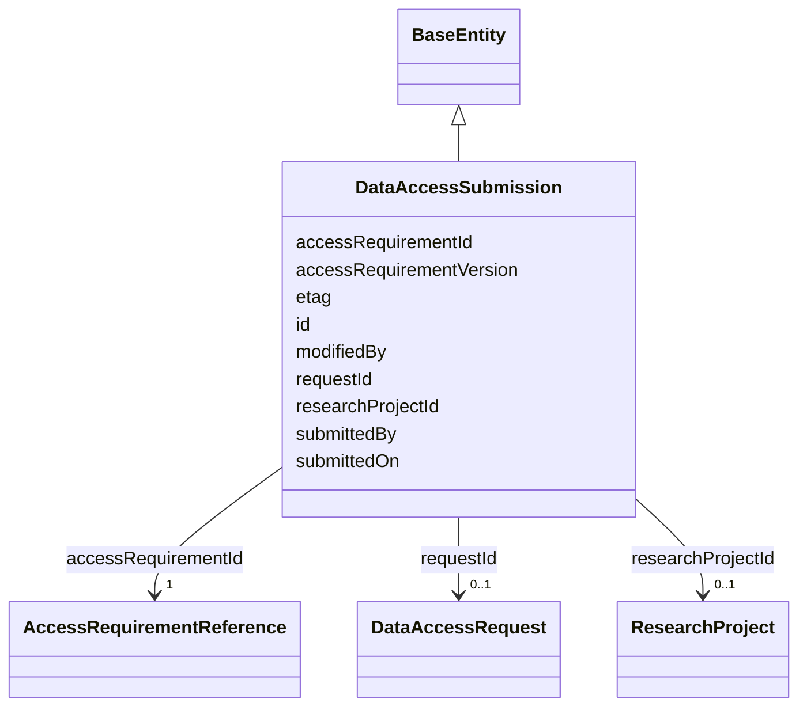

---
search:
  boost: 10.0
---

# Class: DataAccessSubmission 


_A user's application against an AccessRequirement. Mirrors DATA_ACCESS_SUBMISSION. Represents the design doc's "user satisfaction" side of an Access Requirement (gov:hasSignedAgreement / gov:hasApproval) as an explicit, auditable record rather than a precomputed boolean._

_Field names below were corrected to match Synapse's live REST API object (`org.sagebionetworks.repo.model.dataaccess.Submission`, per the OpenAPI spec), not just the original DATA_ACCESS_SUBMISSION table-column guess: the live API names the submitter/timestamp fields `submittedBy`/ `submittedOn` (not `createdBy`/`createdOn`), the originating request `requestId` (not `dataAccessRequestId`), and exposes `modifiedBy` directly on Submission itself -- moved here from DataAccessSubmissionStatus, which does not carry it in the live API (see that class's own description)._


<div data-search-exclude markdown="1">


URI: [sagegov:DataAccessSubmission](https://sagebionetworks.org/governance/DataAccessSubmission)





## Inheritance
* [BaseEntity](../classes/BaseEntity.md)
    * **DataAccessSubmission**


## Class Properties

| Property | Value |
| --- | --- |
| Class URI | [sagegov:DataAccessSubmission](https://sagebionetworks.org/governance/DataAccessSubmission) |


## Slots

| Name | Cardinality and Range | Description | Inheritance |
| ---  | --- | --- | --- |
| [accessRequirementId](../slots/accessRequirementId.md) | 1 <br/> [AccessRequirementReference](../classes/AccessRequirementReference.md) | The AccessRequirement this submission is an application against (DATA_ACCESS_... | direct |
| [accessRequirementVersion](../slots/accessRequirementVersion.md) | 0..1 <br/> [Integer](../types/Integer.md) | The version of the AccessRequirement this submission was made against (DATA_A... | direct |
| [requestId](../slots/requestId.md) | 0..1 <br/> [DataAccessRequest](../classes/DataAccessRequest.md) | The originating data access request | direct |
| [researchProjectId](../slots/researchProjectId.md) | 0..1 <br/> [ResearchProject](../classes/ResearchProject.md) | The research project this submission/request is associated with (DATA_ACCESS_... | direct |
| [submittedBy](../slots/submittedBy.md) | 0..1 <br/> [Integer](../types/Integer.md) | Synapse numeric user id of who submitted this record (`Submission | direct |
| [submittedOn](../slots/submittedOn.md) | 0..1 <br/> [Integer](../types/Integer.md) | When this record was submitted (epoch milliseconds; `Submission | direct |
| [modifiedBy](../slots/modifiedBy.md) | 0..1 <br/> [Integer](../types/Integer.md) | Synapse numeric user id of who last modified this record | direct |
| [etag](../slots/etag.md) | 0..1 <br/> [String](../types/String.md) | Entity tag for optimistic concurrency control (a 36-character UUID) | direct |
| [id](../slots/id.md) | 1 <br/> [String](../types/String.md) | A unique identifier for this submission (schematic-schema-style dotted string... | [BaseEntity](../classes/BaseEntity.md) |


## Usages

| used by | used in | type | used |
| ---  | --- | --- | --- |
| [DataAccessSubmissionStatus](../classes/DataAccessSubmissionStatus.md) | [submissionId](../slots/submissionId.md) | range | [DataAccessSubmission](../classes/DataAccessSubmission.md) |


## Identifier and Mapping Information


### Schema Source


* from schema: https://w3id.org/sage-bionetworks/governance-duo/governance_duo


## Mappings

| Mapping Type | Mapped Value |
| ---  | ---  |
| self | sagegov:DataAccessSubmission |
| native | governanceduo:DataAccessSubmission |


## Examples
### Example: DataAccessSubmission-001

```yaml
id: data_access_submission.555
accessRequirementId: access_requirement.42
accessRequirementVersion: 1
requestId: data_access_request.7001
researchProjectId: research_project.8001
submittedBy: 2000001
submittedOn: 1755200000000
modifiedBy: 2000001
etag: 1c2d3e4f-5a6b-4c7d-8e9f-0a1b2c3d4e5f

```


## LinkML Source

<!-- TODO: investigate https://stackoverflow.com/questions/37606292/how-to-create-tabbed-code-blocks-in-mkdocs-or-sphinx -->

### Direct

<details>
```yaml
name: DataAccessSubmission
description: 'A user''s application against an AccessRequirement. Mirrors DATA_ACCESS_SUBMISSION.
  Represents the design doc''s "user satisfaction" side of an Access Requirement (gov:hasSignedAgreement
  / gov:hasApproval) as an explicit, auditable record rather than a precomputed boolean.

  Field names below were corrected to match Synapse''s live REST API object (`org.sagebionetworks.repo.model.dataaccess.Submission`,
  per the OpenAPI spec), not just the original DATA_ACCESS_SUBMISSION table-column
  guess: the live API names the submitter/timestamp fields `submittedBy`/ `submittedOn`
  (not `createdBy`/`createdOn`), the originating request `requestId` (not `dataAccessRequestId`),
  and exposes `modifiedBy` directly on Submission itself -- moved here from DataAccessSubmissionStatus,
  which does not carry it in the live API (see that class''s own description).'
from_schema: https://w3id.org/sage-bionetworks/governance-duo/governance_duo
is_a: BaseEntity
slots:
- accessRequirementId
- accessRequirementVersion
- requestId
- researchProjectId
- submittedBy
- submittedOn
- modifiedBy
- etag
slot_usage:
  id:
    name: id
    description: A unique identifier for this submission (schematic-schema-style dotted
      string, per this repo's id convention — see base_entity.yaml — wrapping Synapse's
      own numeric DATA_ACCESS_SUBMISSION.ID).
    examples:
    - value: data_access_submission.555
    pattern: ^data_access_submission\.\d+$
  etag:
    name: etag
    slot_uri: sagegov:etag
class_uri: sagegov:DataAccessSubmission

```
</details>

### Induced

<details>
```yaml
name: DataAccessSubmission
description: 'A user''s application against an AccessRequirement. Mirrors DATA_ACCESS_SUBMISSION.
  Represents the design doc''s "user satisfaction" side of an Access Requirement (gov:hasSignedAgreement
  / gov:hasApproval) as an explicit, auditable record rather than a precomputed boolean.

  Field names below were corrected to match Synapse''s live REST API object (`org.sagebionetworks.repo.model.dataaccess.Submission`,
  per the OpenAPI spec), not just the original DATA_ACCESS_SUBMISSION table-column
  guess: the live API names the submitter/timestamp fields `submittedBy`/ `submittedOn`
  (not `createdBy`/`createdOn`), the originating request `requestId` (not `dataAccessRequestId`),
  and exposes `modifiedBy` directly on Submission itself -- moved here from DataAccessSubmissionStatus,
  which does not carry it in the live API (see that class''s own description).'
from_schema: https://w3id.org/sage-bionetworks/governance-duo/governance_duo
is_a: BaseEntity
slot_usage:
  id:
    name: id
    description: A unique identifier for this submission (schematic-schema-style dotted
      string, per this repo's id convention — see base_entity.yaml — wrapping Synapse's
      own numeric DATA_ACCESS_SUBMISSION.ID).
    examples:
    - value: data_access_submission.555
    pattern: ^data_access_submission\.\d+$
  etag:
    name: etag
    slot_uri: sagegov:etag
attributes:
  accessRequirementId:
    name: accessRequirementId
    description: The AccessRequirement this submission is an application against (DATA_ACCESS_SUBMISSION.ACCESS_REQUIREMENT_ID).
      range is AccessRequirementReference (the gov:AR-<n> stub), not the real AccessRequirement
      itself -- see that class's own description.
    comments:
    - slot_uri intentionally reuses sagegov:accessRequirement, the same predicate
      AccessRequirementAssociation.accessRequirement uses, even though this is a differently-named
      LinkML slot -- so "what AccessRequirement does this concern?" is a uniform gov:accessRequirement
      query regardless of subject class. See scripts/build_governance_graph.py.
    from_schema: https://w3id.org/sage-bionetworks/governance-duo/governance_duo
    close_mappings:
    - dcterms:requires
    rank: 1000
    slot_uri: sagegov:accessRequirement
    owner: DataAccessSubmission
    domain_of:
    - DataAccessSubmission
    - ResearchProject
    - DataAccessRequest
    range: AccessRequirementReference
    required: true
  accessRequirementVersion:
    name: accessRequirementVersion
    description: The version of the AccessRequirement this submission was made against
      (DATA_ACCESS_SUBMISSION.ACCESS_REQUIREMENT_VERSION).
    from_schema: https://w3id.org/sage-bionetworks/governance-duo/governance_duo
    rank: 1000
    owner: DataAccessSubmission
    domain_of:
    - DataAccessSubmission
    range: integer
  requestId:
    name: requestId
    description: The originating data access request. Synapse's live API names this
      field `requestId` (`org.sagebionetworks.repo.model.dataaccess.Submission`),
      not `dataAccessRequestId`; the underlying DB column is DATA_ACCESS_SUBMISSION.DATA_ACCESS_REQUEST_ID.
      Range is now `DataAccessRequest` (was a bare integer literal until that class
      existed -- see plans/governance_graph_open_questions.md Section C.1) -- emitted
      as an IRI reference to the real `gov:DataAccessRequest-<n>` node.
    from_schema: https://w3id.org/sage-bionetworks/governance-duo/governance_duo
    rank: 1000
    slot_uri: sagegov:requestId
    owner: DataAccessSubmission
    domain_of:
    - DataAccessSubmission
    range: DataAccessRequest
  researchProjectId:
    name: researchProjectId
    description: The research project this submission/request is associated with (DATA_ACCESS_SUBMISSION.RESEARCH_PROJECT_ID
      / RequestInterface.researchProjectId). Range is now `ResearchProject` (was a
      bare integer literal until that class existed -- see plans/governance_graph_open_questions.md
      Section C) -- emitted as an IRI reference to the real `gov:research-project-<n>`
      node. Shared predicate across DataAccessSubmission and DataAccessRequest, both
      of which reference the same real-world ResearchProject.
    comments:
    - DATA_ACCESS_SUBMISSION.SUBMISSION_SERIALIZED (a BINARY blob, presumably the
      full submission form data) is not modeled as a structured field.
    from_schema: https://w3id.org/sage-bionetworks/governance-duo/governance_duo
    rank: 1000
    slot_uri: sagegov:researchProject
    owner: DataAccessSubmission
    domain_of:
    - DataAccessSubmission
    - DataAccessRequest
    range: ResearchProject
  submittedBy:
    name: submittedBy
    description: Synapse numeric user id of who submitted this record (`Submission.submittedBy`
      in Synapse's live REST API). Emitted as an IRI reference to a sagegov:Principal
      node (looked up by this numeric id), not a literal -- see scripts/build_governance_graph.py.
    from_schema: https://w3id.org/sage-bionetworks/governance-duo/governance_duo
    rank: 1000
    slot_uri: sagegov:submittedBy
    owner: DataAccessSubmission
    domain_of:
    - DataAccessSubmission
    range: integer
  submittedOn:
    name: submittedOn
    description: When this record was submitted (epoch milliseconds; `Submission.submittedOn`
      in Synapse's live REST API).
    from_schema: https://w3id.org/sage-bionetworks/governance-duo/governance_duo
    rank: 1000
    slot_uri: sagegov:submittedOn
    owner: DataAccessSubmission
    domain_of:
    - DataAccessSubmission
    range: integer
  modifiedBy:
    name: modifiedBy
    description: Synapse numeric user id of who last modified this record. On DataAccessSubmission,
      this is `Submission.modifiedBy` in Synapse's live REST API (moved here from
      DataAccessSubmissionStatus, which does not carry this field live; see DataAccessSubmissionStatus's
      own description); on DataAccessRequest, it's `RequestInterface.modifiedBy`.
      Emitted as an IRI reference to a sagegov:Principal node, not a literal, mirroring
      submittedBy above.
    from_schema: https://w3id.org/sage-bionetworks/governance-duo/governance_duo
    close_mappings:
    - dcterms:contributor
    rank: 1000
    slot_uri: sagegov:modifiedBy
    owner: DataAccessSubmission
    domain_of:
    - DataAccessSubmission
    - DataAccessRequest
    range: integer
  etag:
    name: etag
    description: Entity tag for optimistic concurrency control (a 36-character UUID).
      Shared the same way as `name` above, by SynapseAccessRequirementMixin (ACCESS_REQUIREMENT.ETAG)
      and SynapseEntity/DataAccessSubmission (NODE.ETAG/DATA_ACCESS_SUBMISSION.ETAG)
      in governance_graph.yaml.
    from_schema: https://w3id.org/sage-bionetworks/governance-duo/governance_duo
    rank: 1000
    slot_uri: sagegov:etag
    owner: DataAccessSubmission
    domain_of:
    - SynapseAccessRequirementMixin
    - SynapseEntity
    - DataAccessSubmission
    - AccessApproval
    - ResearchProject
    - DataAccessRequest
    range: string
  id:
    name: id
    description: A unique identifier for this submission (schematic-schema-style dotted
      string, per this repo's id convention — see base_entity.yaml — wrapping Synapse's
      own numeric DATA_ACCESS_SUBMISSION.ID).
    examples:
    - value: data_access_submission.555
    from_schema: https://w3id.org/sage-bionetworks/governance-duo/governance_duo
    rank: 1000
    slot_uri: dcterms:identifier
    identifier: true
    owner: DataAccessSubmission
    domain_of:
    - BaseEntity
    range: string
    required: true
    pattern: ^data_access_submission\.\d+$
class_uri: sagegov:DataAccessSubmission

```
</details></div>