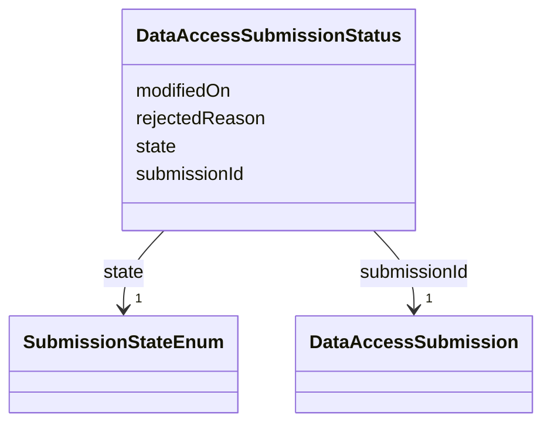

---
search:
  boost: 10.0
---

# Class: DataAccessSubmissionStatus 


_The approval-workflow state of a DataAccessSubmission. Mirrors DATA_ACCESS_SUBMISSION_STATUS, which has no independent identifier of its own in Synapse's schema (only a SUBMISSION_ID foreign key) — modeled here as a plain class keyed by submissionId, not a BaseEntity subclass, for the same reason._

_Slots corrected against Synapse's live `SubmissionStatus` REST object (`org.sagebionetworks.repo.model.dataaccess.SubmissionStatus`): it carries only `submissionId`/`submittedBy`/`rejectedReason`/`state`/`modifiedOn` -- no `createdBy`/`createdOn`/`modifiedBy` at all (those were this schema's earlier, DB-table-column-based guess; `modifiedBy` is real but lives on `Submission` itself -- see DataAccessSubmission above). `submittedBy` is intentionally not re-declared here even though the live object carries it: it would be redundant with DataAccessSubmission.submittedBy on the same merged RDF subject (see scripts/build_governance_graph.py's merge design)._


<div data-search-exclude markdown="1">


URI: [governanceduo:class/DataAccessSubmissionStatus](https://w3id.org/sage-bionetworks/governance-duo/class/DataAccessSubmissionStatus)





<!-- no inheritance hierarchy -->

## Slots

| Name | Cardinality and Range | Description | Inheritance |
| ---  | --- | --- | --- |
| [submissionId](../slots/submissionId.md) | 1 <br/> [DataAccessSubmission](../classes/DataAccessSubmission.md) | The DataAccessSubmission this status record applies to (DATA_ACCESS_SUBMISSIO... | direct |
| [state](../slots/state.md) | 1 <br/> [SubmissionStateEnum](../enums/SubmissionStateEnum.md) |  | direct |
| [rejectedReason](../slots/rejectedReason.md) | 0..1 <br/> [String](../types/String.md) | The reason this submission was rejected, if it was | direct |
| [modifiedOn](../slots/modifiedOn.md) | 0..1 <br/> [Integer](../types/Integer.md) | When this record was last modified (epoch milliseconds) | direct |


## Identifier and Mapping Information


### Schema Source


* from schema: https://w3id.org/sage-bionetworks/governance-duo/governance_duo


## Mappings

| Mapping Type | Mapped Value |
| ---  | ---  |
| self | governanceduo:DataAccessSubmissionStatus |
| native | governanceduo:DataAccessSubmissionStatus |


## Examples
### Example: DataAccessSubmissionStatus-001

```yaml
submissionId: data_access_submission.555
state: SUBMITTED
modifiedOn: 1755200000000

```


## LinkML Source

<!-- TODO: investigate https://stackoverflow.com/questions/37606292/how-to-create-tabbed-code-blocks-in-mkdocs-or-sphinx -->

### Direct

<details>
```yaml
name: DataAccessSubmissionStatus
description: 'The approval-workflow state of a DataAccessSubmission. Mirrors DATA_ACCESS_SUBMISSION_STATUS,
  which has no independent identifier of its own in Synapse''s schema (only a SUBMISSION_ID
  foreign key) — modeled here as a plain class keyed by submissionId, not a BaseEntity
  subclass, for the same reason.

  Slots corrected against Synapse''s live `SubmissionStatus` REST object (`org.sagebionetworks.repo.model.dataaccess.SubmissionStatus`):
  it carries only `submissionId`/`submittedBy`/`rejectedReason`/`state`/`modifiedOn`
  -- no `createdBy`/`createdOn`/`modifiedBy` at all (those were this schema''s earlier,
  DB-table-column-based guess; `modifiedBy` is real but lives on `Submission` itself
  -- see DataAccessSubmission above). `submittedBy` is intentionally not re-declared
  here even though the live object carries it: it would be redundant with DataAccessSubmission.submittedBy
  on the same merged RDF subject (see scripts/build_governance_graph.py''s merge design).'
from_schema: https://w3id.org/sage-bionetworks/governance-duo/governance_duo
slots:
- submissionId
- state
- rejectedReason
- modifiedOn

```
</details>

### Induced

<details>
```yaml
name: DataAccessSubmissionStatus
description: 'The approval-workflow state of a DataAccessSubmission. Mirrors DATA_ACCESS_SUBMISSION_STATUS,
  which has no independent identifier of its own in Synapse''s schema (only a SUBMISSION_ID
  foreign key) — modeled here as a plain class keyed by submissionId, not a BaseEntity
  subclass, for the same reason.

  Slots corrected against Synapse''s live `SubmissionStatus` REST object (`org.sagebionetworks.repo.model.dataaccess.SubmissionStatus`):
  it carries only `submissionId`/`submittedBy`/`rejectedReason`/`state`/`modifiedOn`
  -- no `createdBy`/`createdOn`/`modifiedBy` at all (those were this schema''s earlier,
  DB-table-column-based guess; `modifiedBy` is real but lives on `Submission` itself
  -- see DataAccessSubmission above). `submittedBy` is intentionally not re-declared
  here even though the live object carries it: it would be redundant with DataAccessSubmission.submittedBy
  on the same merged RDF subject (see scripts/build_governance_graph.py''s merge design).'
from_schema: https://w3id.org/sage-bionetworks/governance-duo/governance_duo
attributes:
  submissionId:
    name: submissionId
    description: The DataAccessSubmission this status record applies to (DATA_ACCESS_SUBMISSION_STATUS.SUBMISSION_ID).
    from_schema: https://w3id.org/sage-bionetworks/governance-duo/governance_duo
    rank: 1000
    owner: DataAccessSubmissionStatus
    domain_of:
    - DataAccessSubmissionStatus
    range: DataAccessSubmission
    required: true
  state:
    name: state
    from_schema: https://w3id.org/sage-bionetworks/governance-duo/governance_duo
    rank: 1000
    slot_uri: sagegov:state
    owner: DataAccessSubmissionStatus
    domain_of:
    - DataAccessSubmissionStatus
    range: SubmissionStateEnum
    required: true
  rejectedReason:
    name: rejectedReason
    description: The reason this submission was rejected, if it was. Synapse's live
      API names this field `rejectedReason` (`org.sagebionetworks.repo.model.dataaccess.SubmissionStatus`),
      not `reason`; stored as DATA_ACCESS_SUBMISSION_STATUS.REASON (a BINARY column)
      in the underlying table.
    from_schema: https://w3id.org/sage-bionetworks/governance-duo/governance_duo
    rank: 1000
    slot_uri: sagegov:rejectedReason
    owner: DataAccessSubmissionStatus
    domain_of:
    - DataAccessSubmissionStatus
    range: string
  modifiedOn:
    name: modifiedOn
    description: When this record was last modified (epoch milliseconds). On DataAccessSubmissionStatus
      this is emitted under the distinct gov:statusModifiedOn predicate instead (a
      bare constant in build_governance_graph.py, not resolved via this slot_uri --
      see that class's own description); DataAccessRequest resolves it via this slot's
      own sagegov:modifiedOn directly.
    from_schema: https://w3id.org/sage-bionetworks/governance-duo/governance_duo
    exact_mappings:
    - dcterms:modified
    rank: 1000
    slot_uri: sagegov:modifiedOn
    owner: DataAccessSubmissionStatus
    domain_of:
    - DataAccessSubmissionStatus
    range: integer

```
</details></div>