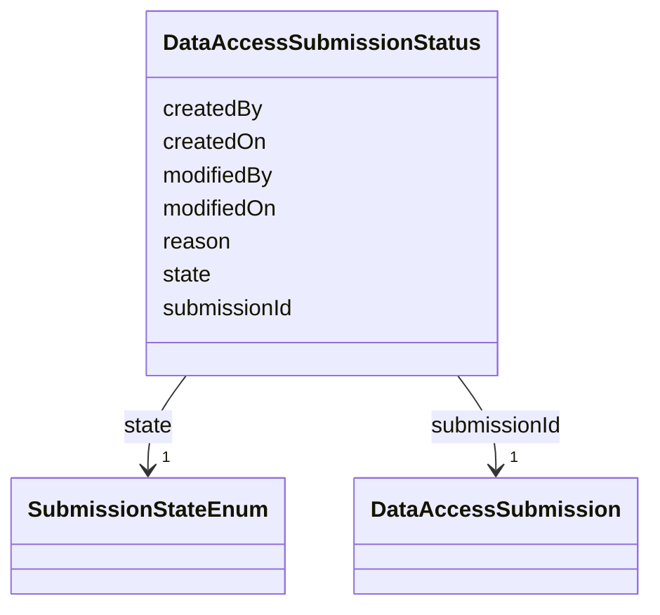

---
search:
  boost: 10.0
---

# Class: DataAccessSubmissionStatus 


_The approval-workflow state of a DataAccessSubmission. Mirrors DATA_ACCESS_SUBMISSION_STATUS, which has no independent identifier of its own in Synapse's schema (only a SUBMISSION_ID foreign key) — modeled here as a plain class keyed by submissionId, not a BaseEntity subclass, for the same reason._


<div data-search-exclude markdown="1">


URI: [governanceduo:class/DataAccessSubmissionStatus](https://w3id.org/sage-bionetworks/governance-duo/class/DataAccessSubmissionStatus)





<!-- no inheritance hierarchy -->

## Slots

| Name | Cardinality and Range | Description | Inheritance |
| ---  | --- | --- | --- |
| [submissionId](../slots/submissionId.md) | 1 <br/> [DataAccessSubmission](../classes/DataAccessSubmission.md) | The DataAccessSubmission this status record applies to (DATA_ACCESS_SUBMISSIO... | direct |
| [state](../slots/state.md) | 1 <br/> [SubmissionStateEnum](../enums/SubmissionStateEnum.md) |  | direct |
| [reason](../slots/reason.md) | 0..1 <br/> [String](../types/String.md) | The reason for the current state (e | direct |
| [createdBy](../slots/createdBy.md) | 0..1 <br/> [Integer](../types/Integer.md) | Synapse numeric user id of the record's creator | direct |
| [createdOn](../slots/createdOn.md) | 0..1 <br/> [Integer](../types/Integer.md) | When the record was created (epoch milliseconds in the source Synapse tables) | direct |
| [modifiedBy](../slots/modifiedBy.md) | 0..1 <br/> [Integer](../types/Integer.md) | Synapse numeric user id of who last modified this status record | direct |
| [modifiedOn](../slots/modifiedOn.md) | 0..1 <br/> [Integer](../types/Integer.md) | When this status record was last modified (epoch milliseconds) | direct |


## Identifier and Mapping Information


### Schema Source


* from schema: https://w3id.org/sage-bionetworks/governance-duo/governance_duo


## Mappings

| Mapping Type | Mapped Value |
| ---  | ---  |
| self | governanceduo:DataAccessSubmissionStatus |
| native | governanceduo:DataAccessSubmissionStatus |


## Examples
### Example: DataAccessSubmissionStatus-001

```yaml
submissionId: data_access_submission.555
state: SUBMITTED
createdBy: 2000001
createdOn: 1755200000000
modifiedBy: 2000001
modifiedOn: 1755200000000

```


## LinkML Source

<!-- TODO: investigate https://stackoverflow.com/questions/37606292/how-to-create-tabbed-code-blocks-in-mkdocs-or-sphinx -->

### Direct

<details>
```yaml
name: DataAccessSubmissionStatus
description: The approval-workflow state of a DataAccessSubmission. Mirrors DATA_ACCESS_SUBMISSION_STATUS,
  which has no independent identifier of its own in Synapse's schema (only a SUBMISSION_ID
  foreign key) — modeled here as a plain class keyed by submissionId, not a BaseEntity
  subclass, for the same reason.
from_schema: https://w3id.org/sage-bionetworks/governance-duo/governance_duo
slots:
- submissionId
- state
- reason
- createdBy
- createdOn
- modifiedBy
- modifiedOn

```
</details>

### Induced

<details>
```yaml
name: DataAccessSubmissionStatus
description: The approval-workflow state of a DataAccessSubmission. Mirrors DATA_ACCESS_SUBMISSION_STATUS,
  which has no independent identifier of its own in Synapse's schema (only a SUBMISSION_ID
  foreign key) — modeled here as a plain class keyed by submissionId, not a BaseEntity
  subclass, for the same reason.
from_schema: https://w3id.org/sage-bionetworks/governance-duo/governance_duo
attributes:
  submissionId:
    name: submissionId
    description: The DataAccessSubmission this status record applies to (DATA_ACCESS_SUBMISSION_STATUS.SUBMISSION_ID).
    from_schema: https://w3id.org/sage-bionetworks/governance-duo/governance_duo
    rank: 1000
    owner: DataAccessSubmissionStatus
    domain_of:
    - DataAccessSubmissionStatus
    range: DataAccessSubmission
    required: true
  state:
    name: state
    from_schema: https://w3id.org/sage-bionetworks/governance-duo/governance_duo
    rank: 1000
    slot_uri: sagegov:state
    owner: DataAccessSubmissionStatus
    domain_of:
    - DataAccessSubmissionStatus
    range: SubmissionStateEnum
    required: true
  reason:
    name: reason
    description: The reason for the current state (e.g. a rejection reason). Stored
      as DATA_ACCESS_SUBMISSION_STATUS.REASON, a BINARY column in Synapse; modeled
      here as a plain string.
    from_schema: https://w3id.org/sage-bionetworks/governance-duo/governance_duo
    rank: 1000
    slot_uri: sagegov:reason
    owner: DataAccessSubmissionStatus
    domain_of:
    - DataAccessSubmissionStatus
    range: string
  createdBy:
    name: createdBy
    description: Synapse numeric user id of the record's creator. Shared the same
      way as `name` above. Distinct from ContributionMixin's contributorName, which
      is this repo's own free-text curator-provenance field, not Synapse's own numeric
      CREATED_BY column — both coexist on AccessRequirement without collision.
    comments:
    - 'scripts/build_governance_graph.py emits this integer two different ways depending
      on which class it''s on: as an IRI reference to a gov:Principal node (gov:createdBy)
      on DataAccessSubmission -- since a submission''s creator can be looked up as
      a first-class Principal individual -- but as a plain literal (gov:createdByUserId,
      a distinct predicate, not gov:createdBy) on SynapseEntity, which has no corresponding
      Principal record to link to. This divergence is deliberate and documented in
      shapes/governance_graph.owl.ttl, not a schema/export mismatch to fix.'
    from_schema: https://w3id.org/sage-bionetworks/governance-duo/governance_duo
    exact_mappings:
    - dcterms:creator
    rank: 1000
    owner: DataAccessSubmissionStatus
    domain_of:
    - SynapseAccessRequirementMixin
    - SynapseEntity
    - DataAccessSubmission
    - DataAccessSubmissionStatus
    range: integer
  createdOn:
    name: createdOn
    description: When the record was created (epoch milliseconds in the source Synapse
      tables). Shared the same way as `name` above. Distinct from ContributionMixin's
      contributionDate for the same reason as createdBy above.
    from_schema: https://w3id.org/sage-bionetworks/governance-duo/governance_duo
    exact_mappings:
    - dcterms:created
    rank: 1000
    owner: DataAccessSubmissionStatus
    domain_of:
    - SynapseAccessRequirementMixin
    - SynapseEntity
    - AccessGrant
    - DataAccessSubmission
    - DataAccessSubmissionStatus
    range: integer
  modifiedBy:
    name: modifiedBy
    description: Synapse numeric user id of who last modified this status record.
    from_schema: https://w3id.org/sage-bionetworks/governance-duo/governance_duo
    close_mappings:
    - dcterms:contributor
    rank: 1000
    owner: DataAccessSubmissionStatus
    domain_of:
    - DataAccessSubmissionStatus
    range: integer
  modifiedOn:
    name: modifiedOn
    description: When this status record was last modified (epoch milliseconds).
    from_schema: https://w3id.org/sage-bionetworks/governance-duo/governance_duo
    exact_mappings:
    - dcterms:modified
    rank: 1000
    owner: DataAccessSubmissionStatus
    domain_of:
    - DataAccessSubmissionStatus
    range: integer

```
</details></div>