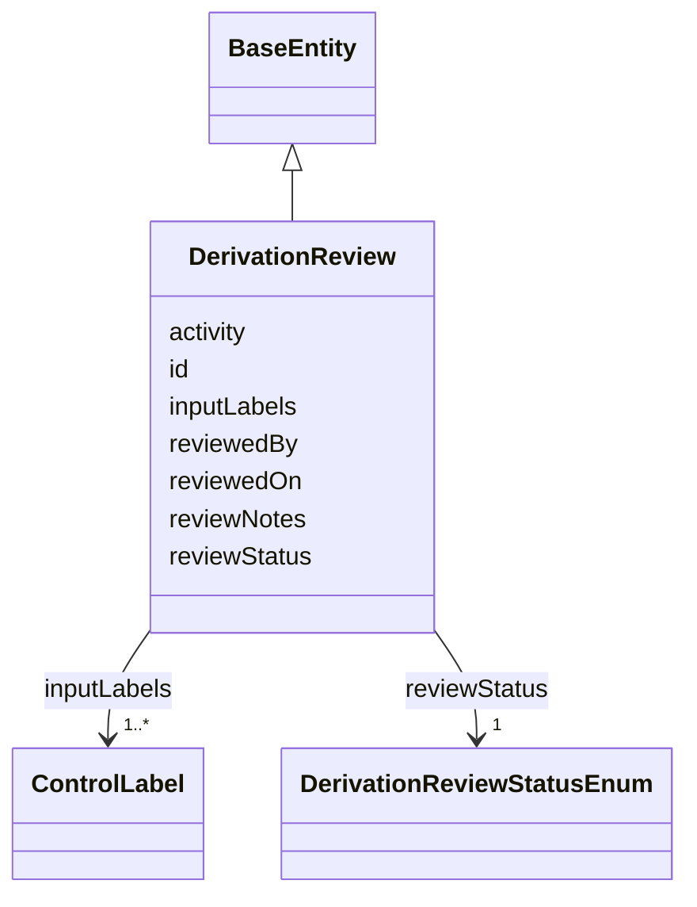

---
search:
  boost: 10.0
---

# Class: DerivationReview 


_An auditable record minted whenever a derivation Activity's inputs carry ControlLabels citing disjoint sourceAccessRequirements sets — the note's own paragraph-12 "composite risk from independent grants" case, flagged by pattern (scripts/build_derivation_policy.py) rather than inferred, and its own proposed storage mechanism (paragraph 21): "the access rule could then be stored as a node in the graph for later review/retrieval."_


<div data-search-exclude markdown="1">


URI: [governanceduo:DerivationReview](https://w3id.org/sage-bionetworks/governance-duo/DerivationReview)





## Inheritance
* [BaseEntity](../classes/BaseEntity.md)
    * **DerivationReview**


## Class Properties

| Property | Value |
| --- | --- |
| Class URI | [governanceduo:DerivationReview](https://w3id.org/sage-bionetworks/governance-duo/DerivationReview) |


## Slots

| Name | Cardinality and Range | Description | Inheritance |
| ---  | --- | --- | --- |
| [activity](../slots/activity.md) | 1 <br/> [Uriorcurie](../types/Uriorcurie.md) | The derivation Activity being reviewed | direct |
| [inputLabels](../slots/inputLabels.md) | 1..* <br/> [ControlLabel](../classes/ControlLabel.md) | The ControlLabels (one per input entity of the Activity above) whose disjoint... | direct |
| [reviewStatus](../slots/reviewStatus.md) | 1 <br/> [DerivationReviewStatusEnum](../enums/DerivationReviewStatusEnum.md) | This review's workflow state | direct |
| [reviewedBy](../slots/reviewedBy.md) | 0..1 <br/> [Integer](../types/Integer.md) | Synapse numeric user id of who recorded reviewStatus, when it is Reviewed/App... | direct |
| [reviewedOn](../slots/reviewedOn.md) | 0..1 <br/> [Integer](../types/Integer.md) | When reviewStatus was last recorded (epoch milliseconds) | direct |
| [reviewNotes](../slots/reviewNotes.md) | 0..1 <br/> [String](../types/String.md) | Free-text notes from the reviewer | direct |
| [id](../slots/id.md) | 1 <br/> [String](../types/String.md) | A synthetic identifier for this review record | [BaseEntity](../classes/BaseEntity.md) |


## Identifier and Mapping Information


### Schema Source


* from schema: https://w3id.org/sage-bionetworks/governance-duo/governance_duo


## Mappings

| Mapping Type | Mapped Value |
| ---  | ---  |
| self | governanceduo:DerivationReview |
| native | governanceduo:DerivationReview |


## LinkML Source

<!-- TODO: investigate https://stackoverflow.com/questions/37606292/how-to-create-tabbed-code-blocks-in-mkdocs-or-sphinx -->

### Direct

<details>
```yaml
name: DerivationReview
description: 'An auditable record minted whenever a derivation Activity''s inputs
  carry ControlLabels citing disjoint sourceAccessRequirements sets — the note''s
  own paragraph-12 "composite risk from independent grants" case, flagged by pattern
  (scripts/build_derivation_policy.py) rather than inferred, and its own proposed
  storage mechanism (paragraph 21): "the access rule could then be stored as a node
  in the graph for later review/retrieval."'
from_schema: https://w3id.org/sage-bionetworks/governance-duo/governance_duo
is_a: BaseEntity
slots:
- activity
- inputLabels
- reviewStatus
- reviewedBy
- reviewedOn
- reviewNotes
slot_usage:
  id:
    name: id
    description: A synthetic identifier for this review record.
    examples:
    - value: derivation_review.001
    pattern: ^derivation_review\.[A-Za-z0-9_-]+$
class_uri: governanceduo:DerivationReview

```
</details>

### Induced

<details>
```yaml
name: DerivationReview
description: 'An auditable record minted whenever a derivation Activity''s inputs
  carry ControlLabels citing disjoint sourceAccessRequirements sets — the note''s
  own paragraph-12 "composite risk from independent grants" case, flagged by pattern
  (scripts/build_derivation_policy.py) rather than inferred, and its own proposed
  storage mechanism (paragraph 21): "the access rule could then be stored as a node
  in the graph for later review/retrieval."'
from_schema: https://w3id.org/sage-bionetworks/governance-duo/governance_duo
is_a: BaseEntity
slot_usage:
  id:
    name: id
    description: A synthetic identifier for this review record.
    examples:
    - value: derivation_review.001
    pattern: ^derivation_review\.[A-Za-z0-9_-]+$
attributes:
  activity:
    name: activity
    description: The derivation Activity being reviewed. range is uriorcurie, not
      Activity — see this schema's own description.
    from_schema: https://w3id.org/sage-bionetworks/governance-duo/governance_duo
    rank: 1000
    slot_uri: governanceduo:activity
    owner: DerivationReview
    domain_of:
    - DerivationReview
    range: uriorcurie
    required: true
  inputLabels:
    name: inputLabels
    description: The ControlLabels (one per input entity of the Activity above) whose
      disjoint sourceAccessRequirements triggered this review. Inlined, not referenced
      by id — ControlLabel has no independent identifier of its own (see that class's
      own description), so embedding is the only option, not a cross-ABox concern
      the way Activity/SynapseEntity references are.
    from_schema: https://w3id.org/sage-bionetworks/governance-duo/governance_duo
    rank: 1000
    slot_uri: governanceduo:inputLabels
    owner: DerivationReview
    domain_of:
    - DerivationReview
    range: ControlLabel
    required: true
    multivalued: true
  reviewStatus:
    name: reviewStatus
    description: 'This review''s workflow state. Deliberately not named `status`:
      that slot name is already bound to ApprovalStateEnum on AccessApproval in governance_graph.yaml
      — a distinct, unrelated enum; do not conflate.'
    from_schema: https://w3id.org/sage-bionetworks/governance-duo/governance_duo
    rank: 1000
    slot_uri: governanceduo:reviewStatus
    owner: DerivationReview
    domain_of:
    - DerivationReview
    range: DerivationReviewStatusEnum
    required: true
  reviewedBy:
    name: reviewedBy
    description: Synapse numeric user id of who recorded reviewStatus, when it is
      Reviewed/Approved/Denied. range integer, mirroring createdBy/modifiedBy/submittedBy's
      own raw-id convention rather than a typed Principal reference — see provenance.yaml's
      own description for why.
    from_schema: https://w3id.org/sage-bionetworks/governance-duo/governance_duo
    rank: 1000
    slot_uri: governanceduo:reviewedBy
    owner: DerivationReview
    domain_of:
    - DerivationReview
    range: integer
  reviewedOn:
    name: reviewedOn
    description: When reviewStatus was last recorded (epoch milliseconds).
    from_schema: https://w3id.org/sage-bionetworks/governance-duo/governance_duo
    rank: 1000
    slot_uri: governanceduo:reviewedOn
    owner: DerivationReview
    domain_of:
    - DerivationReview
    range: integer
  reviewNotes:
    name: reviewNotes
    description: Free-text notes from the reviewer.
    from_schema: https://w3id.org/sage-bionetworks/governance-duo/governance_duo
    rank: 1000
    slot_uri: governanceduo:reviewNotes
    owner: DerivationReview
    domain_of:
    - DerivationReview
    range: string
  id:
    name: id
    description: A synthetic identifier for this review record.
    examples:
    - value: derivation_review.001
    from_schema: https://w3id.org/sage-bionetworks/governance-duo/governance_duo
    rank: 1000
    slot_uri: dcterms:identifier
    identifier: true
    owner: DerivationReview
    domain_of:
    - BaseEntity
    range: string
    required: true
    pattern: ^derivation_review\.[A-Za-z0-9_-]+$
class_uri: governanceduo:DerivationReview

```
</details></div>