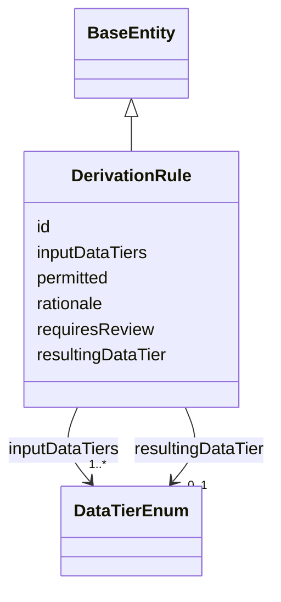

---
search:
  boost: 10.0
---

# Class: DerivationRule 


_A policy row keyed by a combination of DataTierEnum values, answering "may these tiers be joined/derived from together, and if so, what tier does the result carry?" — the note's own paragraph-21 combinatorial question "at a datatype/processing level." See this schema's own "Honest grounding note" above._


<div data-search-exclude markdown="1">


URI: [governanceduo:DerivationRule](https://w3id.org/sage-bionetworks/governance-duo/DerivationRule)





## Inheritance
* [BaseEntity](../classes/BaseEntity.md)
    * **DerivationRule**


## Class Properties

| Property | Value |
| --- | --- |
| Class URI | [governanceduo:DerivationRule](https://w3id.org/sage-bionetworks/governance-duo/DerivationRule) |


## Slots

| Name | Cardinality and Range | Description | Inheritance |
| ---  | --- | --- | --- |
| [inputDataTiers](../slots/inputDataTiers.md) | 1..* <br/> [DataTierEnum](../enums/DataTierEnum.md) | The combination of input DataTierEnum values this rule governs | direct |
| [permitted](../slots/permitted.md) | 1 <br/> [Boolean](../types/Boolean.md) | Whether this combination of inputDataTiers may be joined/derived from togethe... | direct |
| [resultingDataTier](../slots/resultingDataTier.md) | 0..1 <br/> [DataTierEnum](../enums/DataTierEnum.md) | The DataTierEnum the derived output carries when permitted | direct |
| [requiresReview](../slots/requiresReview.md) | 0..1 <br/> [Boolean](../types/Boolean.md) | Whether this combination is only conditionally permitted, pending a human Der... | direct |
| [rationale](../slots/rationale.md) | 0..1 <br/> [String](../types/String.md) | Free-text justification for this rule's permitted/resultingDataTier values | direct |
| [id](../slots/id.md) | 1 <br/> [String](../types/String.md) | A synthetic identifier for this rule | [BaseEntity](../classes/BaseEntity.md) |


## Identifier and Mapping Information


### Schema Source


* from schema: https://w3id.org/sage-bionetworks/governance-duo/governance_duo


## Mappings

| Mapping Type | Mapped Value |
| ---  | ---  |
| self | governanceduo:DerivationRule |
| native | governanceduo:DerivationRule |


## LinkML Source

<!-- TODO: investigate https://stackoverflow.com/questions/37606292/how-to-create-tabbed-code-blocks-in-mkdocs-or-sphinx -->

### Direct

<details>
```yaml
name: DerivationRule
description: A policy row keyed by a combination of DataTierEnum values, answering
  "may these tiers be joined/derived from together, and if so, what tier does the
  result carry?" — the note's own paragraph-21 combinatorial question "at a datatype/processing
  level." See this schema's own "Honest grounding note" above.
from_schema: https://w3id.org/sage-bionetworks/governance-duo/governance_duo
is_a: BaseEntity
slots:
- inputDataTiers
- permitted
- resultingDataTier
- requiresReview
- rationale
slot_usage:
  id:
    name: id
    description: A synthetic identifier for this rule.
    examples:
    - value: derivation_rule.controlled-plus-controlled
    pattern: ^derivation_rule\.[A-Za-z0-9_-]+$
class_uri: governanceduo:DerivationRule

```
</details>

### Induced

<details>
```yaml
name: DerivationRule
description: A policy row keyed by a combination of DataTierEnum values, answering
  "may these tiers be joined/derived from together, and if so, what tier does the
  result carry?" — the note's own paragraph-21 combinatorial question "at a datatype/processing
  level." See this schema's own "Honest grounding note" above.
from_schema: https://w3id.org/sage-bionetworks/governance-duo/governance_duo
is_a: BaseEntity
slot_usage:
  id:
    name: id
    description: A synthetic identifier for this rule.
    examples:
    - value: derivation_rule.controlled-plus-controlled
    pattern: ^derivation_rule\.[A-Za-z0-9_-]+$
attributes:
  inputDataTiers:
    name: inputDataTiers
    description: The combination of input DataTierEnum values this rule governs.
    from_schema: https://w3id.org/sage-bionetworks/governance-duo/governance_duo
    rank: 1000
    slot_uri: governanceduo:inputDataTiers
    owner: DerivationRule
    domain_of:
    - DerivationRule
    range: DataTierEnum
    required: true
    multivalued: true
  permitted:
    name: permitted
    description: Whether this combination of inputDataTiers may be joined/derived
      from together at all.
    from_schema: https://w3id.org/sage-bionetworks/governance-duo/governance_duo
    rank: 1000
    slot_uri: governanceduo:permitted
    owner: DerivationRule
    domain_of:
    - DerivationRule
    range: boolean
    required: true
  resultingDataTier:
    name: resultingDataTier
    description: The DataTierEnum the derived output carries when permitted. Defaults
      to max(inputDataTiers) per the note's own recommendation, but a rule may explicitly
      override it for a specific combination (e.g. an aggregation that demonstrably
      reduces sensitivity below its inputs' max).
    from_schema: https://w3id.org/sage-bionetworks/governance-duo/governance_duo
    rank: 1000
    slot_uri: governanceduo:resultingDataTier
    owner: DerivationRule
    domain_of:
    - DerivationRule
    range: DataTierEnum
  requiresReview:
    name: requiresReview
    description: Whether this combination is only conditionally permitted, pending
      a human DerivationReview, rather than flatly permitted/denied.
    from_schema: https://w3id.org/sage-bionetworks/governance-duo/governance_duo
    rank: 1000
    slot_uri: governanceduo:requiresReview
    owner: DerivationRule
    domain_of:
    - DerivationRule
    range: boolean
  rationale:
    name: rationale
    description: Free-text justification for this rule's permitted/resultingDataTier
      values.
    from_schema: https://w3id.org/sage-bionetworks/governance-duo/governance_duo
    rank: 1000
    slot_uri: governanceduo:rationale
    owner: DerivationRule
    domain_of:
    - DerivationRule
    range: string
  id:
    name: id
    description: A synthetic identifier for this rule.
    examples:
    - value: derivation_rule.controlled-plus-controlled
    from_schema: https://w3id.org/sage-bionetworks/governance-duo/governance_duo
    rank: 1000
    slot_uri: dcterms:identifier
    identifier: true
    owner: DerivationRule
    domain_of:
    - BaseEntity
    range: string
    required: true
    pattern: ^derivation_rule\.[A-Za-z0-9_-]+$
class_uri: governanceduo:DerivationRule

```
</details></div>