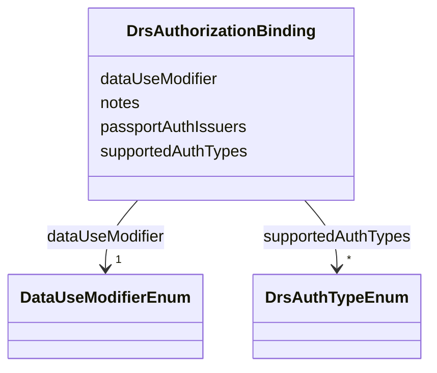

---
search:
  boost: 10.0
---

# Class: DrsAuthorizationBinding 


_Crosswalks one DUO code (or Sage DUOPlus extension) to the shape of the DRS Authorizations record a server would return from `OPTIONS /objects/{object_id}` for an object governed by that code. Mirrors PolicyCardBinding (policy_fabric.yaml) — same dataUseModifier axis, different target system's input shape (DRS's Authorizations discovery record vs. Policy Fabric's policy_data_schema.json)._


<div data-search-exclude markdown="1">


URI: [governanceduo:class/DrsAuthorizationBinding](https://w3id.org/sage-bionetworks/governance-duo/class/DrsAuthorizationBinding)





<!-- no inheritance hierarchy -->

## Slots

| Name | Cardinality and Range | Description | Inheritance |
| ---  | --- | --- | --- |
| [dataUseModifier](../slots/dataUseModifier.md) | 1 <br/> [DataUseModifierEnum](../enums/DataUseModifierEnum.md) | The DUO code (or Sage DUOPlus extension) this binding documents | direct |
| [supportedAuthTypes](../slots/supportedAuthTypes.md) | * <br/> [DrsAuthTypeEnum](../enums/DrsAuthTypeEnum.md) | Mirrors DRS's Authorizations | direct |
| [passportAuthIssuers](../slots/passportAuthIssuers.md) | * <br/> [String](../types/String.md) | Mirrors DRS's Authorizations | direct |
| [notes](../slots/notes.md) | * <br/> [String](../types/String.md) | Free-text notes — used in particular to record why sourceSlot is left unset (... | direct |


## Identifier and Mapping Information


### Schema Source


* from schema: https://w3id.org/sage-bionetworks/governance-duo/governance_duo


## Mappings

| Mapping Type | Mapped Value |
| ---  | ---  |
| self | governanceduo:DrsAuthorizationBinding |
| native | governanceduo:DrsAuthorizationBinding |


## LinkML Source

<!-- TODO: investigate https://stackoverflow.com/questions/37606292/how-to-create-tabbed-code-blocks-in-mkdocs-or-sphinx -->

### Direct

<details>
```yaml
name: DrsAuthorizationBinding
description: Crosswalks one DUO code (or Sage DUOPlus extension) to the shape of the
  DRS Authorizations record a server would return from `OPTIONS /objects/{object_id}`
  for an object governed by that code. Mirrors PolicyCardBinding (policy_fabric.yaml)
  — same dataUseModifier axis, different target system's input shape (DRS's Authorizations
  discovery record vs. Policy Fabric's policy_data_schema.json).
from_schema: https://w3id.org/sage-bionetworks/governance-duo/governance_duo
slots:
- dataUseModifier
- supportedAuthTypes
- passportAuthIssuers
- notes

```
</details>

### Induced

<details>
```yaml
name: DrsAuthorizationBinding
description: Crosswalks one DUO code (or Sage DUOPlus extension) to the shape of the
  DRS Authorizations record a server would return from `OPTIONS /objects/{object_id}`
  for an object governed by that code. Mirrors PolicyCardBinding (policy_fabric.yaml)
  — same dataUseModifier axis, different target system's input shape (DRS's Authorizations
  discovery record vs. Policy Fabric's policy_data_schema.json).
from_schema: https://w3id.org/sage-bionetworks/governance-duo/governance_duo
attributes:
  dataUseModifier:
    name: dataUseModifier
    description: The DUO code (or Sage DUOPlus extension) this binding documents.
    from_schema: https://w3id.org/sage-bionetworks/governance-duo/governance_duo
    rank: 1000
    owner: DrsAuthorizationBinding
    domain_of:
    - PolicyCardBinding
    - DrsAuthorizationBinding
    range: DataUseModifierEnum
    required: true
  supportedAuthTypes:
    name: supportedAuthTypes
    description: Mirrors DRS's Authorizations.supported_types for objects governed
      by this DUO code.
    from_schema: https://w3id.org/sage-bionetworks/governance-duo/governance_duo
    rank: 1000
    ifabsent: PassportAuth
    owner: DrsAuthorizationBinding
    domain_of:
    - DrsAuthorizationBinding
    range: DrsAuthTypeEnum
    multivalued: true
  passportAuthIssuers:
    name: passportAuthIssuers
    description: 'Mirrors DRS''s Authorizations.passport_auth_issuers — the whitelisted
      set of Visa `iss` issuers a client must draw from. Not populated here from a
      fixed value: sourced, per governed AccessRequirement, from that record''s own
      PolicyFabricMixin.trustedIssuerDids (or, for institution-scoped DUO codes, GovernanceMixin.institutionDids)
      — see mixins.yaml. GA4GH Passport Visa issuers are conventionally identified
      as DIDs or URLs the same way those slots already are.'
    from_schema: https://w3id.org/sage-bionetworks/governance-duo/governance_duo
    rank: 1000
    owner: DrsAuthorizationBinding
    domain_of:
    - DrsAuthorizationBinding
    range: string
    multivalued: true
    pattern: ^did:[a-z0-9]+:.+$
  notes:
    name: notes
    description: Free-text notes — used in particular to record why sourceSlot is
      left unset (which governanceDUO slot would need to be added, and its required
      shape) so a gap is documented rather than silently dropped. Reused by drs_alignment.yaml's
      DrsAuthorizationBinding for the same purpose.
    from_schema: https://w3id.org/sage-bionetworks/governance-duo/governance_duo
    rank: 1000
    owner: DrsAuthorizationBinding
    domain_of:
    - PolicyCardBinding
    - DrsAuthorizationBinding
    range: string
    multivalued: true

```
</details></div>