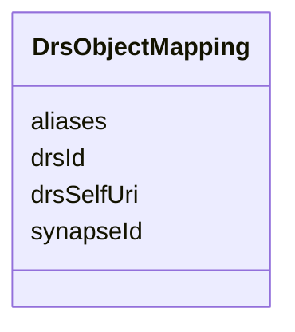

---
search:
  boost: 10.0
---

# Class: DrsObjectMapping 


_How one Synapse entity maps onto a DRS DrsObject's id/self_uri/aliases. One row per governed Synapse entity, not per AccessRequirement (multiple AccessRequirements can govern the same entity; this mapping is per-entity)._


<div data-search-exclude markdown="1">


URI: [governanceduo:class/DrsObjectMapping](https://w3id.org/sage-bionetworks/governance-duo/class/DrsObjectMapping)





<!-- no inheritance hierarchy -->

## Slots

| Name | Cardinality and Range | Description | Inheritance |
| ---  | --- | --- | --- |
| [synapseId](../slots/synapseId.md) | 1 <br/> [String](../types/String.md) | A Synapse entity id | direct |
| [drsId](../slots/drsId.md) | 1 <br/> [String](../types/String.md) | The DRS DrsObject | direct |
| [drsSelfUri](../slots/drsSelfUri.md) | 1 <br/> [String](../types/String.md) | The DRS DrsObject | direct |
| [aliases](../slots/aliases.md) | * <br/> [String](../types/String.md) | Secondary/external identifiers for this same Synapse entity, carried in DRS's... | direct |


## Identifier and Mapping Information


### Schema Source


* from schema: https://w3id.org/sage-bionetworks/governance-duo/governance_duo


## Mappings

| Mapping Type | Mapped Value |
| ---  | ---  |
| self | governanceduo:DrsObjectMapping |
| native | governanceduo:DrsObjectMapping |


## LinkML Source

<!-- TODO: investigate https://stackoverflow.com/questions/37606292/how-to-create-tabbed-code-blocks-in-mkdocs-or-sphinx -->

### Direct

<details>
```yaml
name: DrsObjectMapping
description: How one Synapse entity maps onto a DRS DrsObject's id/self_uri/aliases.
  One row per governed Synapse entity, not per AccessRequirement (multiple AccessRequirements
  can govern the same entity; this mapping is per-entity).
from_schema: https://w3id.org/sage-bionetworks/governance-duo/governance_duo
slots:
- synapseId
- drsId
- drsSelfUri
- aliases

```
</details>

### Induced

<details>
```yaml
name: DrsObjectMapping
description: How one Synapse entity maps onto a DRS DrsObject's id/self_uri/aliases.
  One row per governed Synapse entity, not per AccessRequirement (multiple AccessRequirements
  can govern the same entity; this mapping is per-entity).
from_schema: https://w3id.org/sage-bionetworks/governance-duo/governance_duo
attributes:
  synapseId:
    name: synapseId
    description: 'A Synapse entity id. Reused across contexts that reference one specific
      Synapse entity: an AssetBinding registering it as a Policy Fabric Asset (this
      file), or a DrsObjectMapping crosswalking it to a DRS DrsObject (drs_alignment.yaml).'
    from_schema: https://w3id.org/sage-bionetworks/governance-duo/governance_duo
    rank: 1000
    owner: DrsObjectMapping
    domain_of:
    - AssetBinding
    - DrsObjectMapping
    range: string
    required: true
    pattern: ^syn\d+$
  drsId:
    name: drsId
    description: The DRS DrsObject.id component. Recommended to be identical to synapseId
      — see this schema's own header comment for why a fourth internal identifier
      scheme isn't introduced here.
    from_schema: https://w3id.org/sage-bionetworks/governance-duo/governance_duo
    rank: 1000
    owner: DrsObjectMapping
    domain_of:
    - DrsObjectMapping
    range: string
    required: true
  drsSelfUri:
    name: drsSelfUri
    description: The DRS DrsObject.self_uri — a hostname-based `drs://<hostname>/<drsId>`
      URI (DRS's other addressing style, compact-identifier URIs resolved via identifiers.org/n2t.net,
      is not used here since Synapse ids already resolve directly against a Synapse-operated
      DRS host).
    from_schema: https://w3id.org/sage-bionetworks/governance-duo/governance_duo
    rank: 1000
    owner: DrsObjectMapping
    domain_of:
    - DrsObjectMapping
    range: string
    required: true
    pattern: ^drs://.+$
  aliases:
    name: aliases
    description: 'Secondary/external identifiers for this same Synapse entity, carried
      in DRS''s own sanctioned DrsObject.aliases field — e.g. the governanceDUO dotted
      id(s) that reference this entity via entityIdList/assetBindings[].synapseId
      (see access_requirement.yaml/mixins.yaml), and/or the corresponding gov:-namespace
      SynapseEntity individual (see governance_graph.yaml). This is the DRS-forward-compatible
      resolution of governanceDUO''s three-parallel- identifier-scheme gap (entityIdList
      / assetBindings.synapseId / SynapseEntity.id): rather than inventing a fourth
      internal crosswalk, Synapse''s own id becomes the canonical DRS id and everything
      else rides in aliases.'
    from_schema: https://w3id.org/sage-bionetworks/governance-duo/governance_duo
    rank: 1000
    owner: DrsObjectMapping
    domain_of:
    - DrsObjectMapping
    range: string
    multivalued: true

```
</details></div>