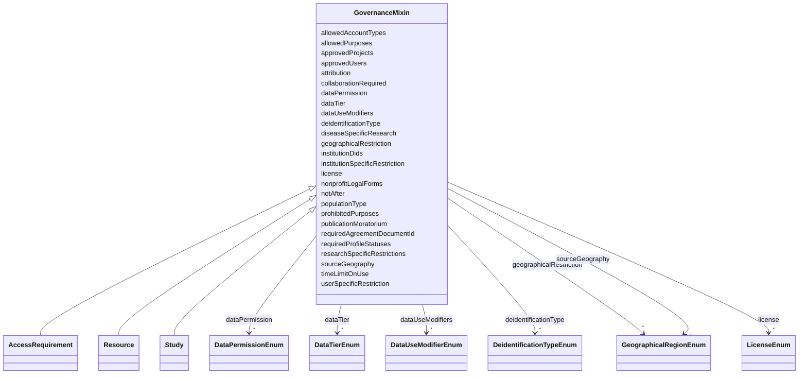

---
search:
  boost: 10.0
---

# Class: GovernanceMixin 


_DUO-based data-use-modifier vocabulary and its conditional-requirement rules, shared by every class whose schematic DependsOn list includes dataUseModifiers (AccessRequirement, Resource, Study — confirmed against the generated sage-ar-model/*.json, which resolves the full field set via schematic's own dependency expansion)._


<div data-search-exclude markdown="1">


URI: [governanceduo:class/GovernanceMixin](https://w3id.org/sage-bionetworks/governance-duo/class/GovernanceMixin)





<!-- no inheritance hierarchy -->

## Class Properties

| Property | Value |
| --- | --- |
| Mixin | Yes |


## Slots

| Name | Cardinality and Range | Description | Inheritance |
| ---  | --- | --- | --- |
| [dataUseModifiers](../slots/dataUseModifiers.md) | * <br/> [DataUseModifierEnum](../enums/DataUseModifierEnum.md) | A list of data use modifiers that apply to the access requirement | direct |
| [collaborationRequired](../slots/collaborationRequired.md) | 0..1 <br/> [String](../types/String.md) | If collaboration is required for the access requirement, provide the PI email... | direct |
| [diseaseSpecificResearch](../slots/diseaseSpecificResearch.md) | * <br/> [String](../types/String.md) | The type(s) of disease research allowed by this access requirement | direct |
| [geographicalRestriction](../slots/geographicalRestriction.md) | * <br/> [GeographicalRegionEnum](../enums/GeographicalRegionEnum.md) | The specific geographic region(s) to which use is limited by the access requi... | direct |
| [institutionSpecificRestriction](../slots/institutionSpecificRestriction.md) | * <br/> [String](../types/String.md) | Institutions with specific restrictions associated with the access requiremen... | direct |
| [institutionDids](../slots/institutionDids.md) | * <br/> [String](../types/String.md) | Institutions with specific restrictions associated with the access requiremen... | direct |
| [publicationMoratorium](../slots/publicationMoratorium.md) | 0..1 <br/> [String](../types/String.md) | End date of the publication moratorium associated with the access requirement | direct |
| [researchSpecificRestrictions](../slots/researchSpecificRestrictions.md) | 0..1 <br/> [String](../types/String.md) | Research-specific restrictions associated with the access requirement | direct |
| [timeLimitOnUse](../slots/timeLimitOnUse.md) | 0..1 <br/> [Float](../types/Float.md) | Time limit on the use of the data associated with the access requirement | direct |
| [userSpecificRestriction](../slots/userSpecificRestriction.md) | 0..1 <br/> [String](../types/String.md) | The user-specific restrictions associated with the access requirement | direct |
| [sourceGeography](../slots/sourceGeography.md) | * <br/> [GeographicalRegionEnum](../enums/GeographicalRegionEnum.md) | The geographical source of the data associated with the access requirement | direct |
| [populationType](../slots/populationType.md) | 0..1 <br/> [String](../types/String.md) | The population studied in the research associated with the access requirement | direct |
| [deidentificationType](../slots/deidentificationType.md) | * <br/> [DeidentificationTypeEnum](../enums/DeidentificationTypeEnum.md) | The type of de-identification applied to the data associated with the access ... | direct |
| [dataPermission](../slots/dataPermission.md) | * <br/> [DataPermissionEnum](../enums/DataPermissionEnum.md) | The permissions associated with the data under the access requirement | direct |
| [dataTier](../slots/dataTier.md) | * <br/> [DataTierEnum](../enums/DataTierEnum.md) | The tier of data access associated with the access requirement | direct |
| [license](../slots/license.md) | * <br/> [LicenseEnum](../enums/LicenseEnum.md) | The license under which the data associated with the access requirement is sh... | direct |
| [attribution](../slots/attribution.md) | 0..1 <br/> [String](../types/String.md) | The attribution statement for the data associated with the access requirement | direct |
| [requiredAgreementDocumentId](../slots/requiredAgreementDocumentId.md) | 0..1 <br/> [String](../types/String.md) | DID of the terms/agreement document the requester must accept before this acc... | direct |
| [notAfter](../slots/notAfter.md) | 0..1 <br/> [String](../types/String.md) | ISO-8601 datetime after which use is no longer permitted | direct |
| [allowedPurposes](../slots/allowedPurposes.md) | * <br/> [String](../types/String.md) | Research purpose term(s) for which use is allowed | direct |
| [prohibitedPurposes](../slots/prohibitedPurposes.md) | * <br/> [String](../types/String.md) | Research purpose term(s) for which use is explicitly disallowed | direct |
| [nonprofitLegalForms](../slots/nonprofitLegalForms.md) | * <br/> [String](../types/String.md) | Legal entity form(s) qualifying as not-for-profit, coded per ISO 20275:2017 (... | direct |
| [approvedProjects](../slots/approvedProjects.md) | * <br/> [String](../types/String.md) | DID(s) of project(s) approved to use the data under this access requirement | direct |
| [approvedUsers](../slots/approvedUsers.md) | * <br/> [String](../types/String.md) | Identifier(s) of specifically approved users | direct |
| [allowedAccountTypes](../slots/allowedAccountTypes.md) | * <br/> [String](../types/String.md) | Account type(s) permitted to access the data (checked against UserPlatformCre... | direct |
| [requiredProfileStatuses](../slots/requiredProfileStatuses.md) | * <br/> [String](../types/String.md) | Profile status value(s) a requester's account must have (checked against User... | direct |


## Mixin Usage

| mixed into | description |
| --- | --- |
| [AccessRequirement](../classes/AccessRequirement.md) | Representation of a Synapse Access Requirement and its relationships to entit... |
| [Resource](../classes/Resource.md) | Information that is relevant to resource access conditions |
| [Study](../classes/Study.md) | Studies associated with a grant |


## Rules


### 

| Rule Applied | Preconditions | Postconditions | Elseconditions |
|--------------|---------------|----------------|----------------|
| slot_conditions |```{'dataUseModifiers': {'equals_string': 'DUO:0000007'}}``` |```{'diseaseSpecificResearch': {'required': True}}``` | |


### 

| Rule Applied | Preconditions | Postconditions | Elseconditions |
|--------------|---------------|----------------|----------------|
| slot_conditions |```{'dataUseModifiers': {'equals_string': 'DUO:0000012'}}``` |```{'researchSpecificRestrictions': {'required': True}}``` | |


### 

| Rule Applied | Preconditions | Postconditions | Elseconditions |
|--------------|---------------|----------------|----------------|
| slot_conditions |```{'dataUseModifiers': {'equals_string': 'DUO:0000020'}}``` |```{'collaborationRequired': {'required': True}}``` | |


### 

| Rule Applied | Preconditions | Postconditions | Elseconditions |
|--------------|---------------|----------------|----------------|
| slot_conditions |```{'dataUseModifiers': {'equals_string': 'DUO:0000022'}}``` |```{'geographicalRestriction': {'required': True}}``` | |


### 

| Rule Applied | Preconditions | Postconditions | Elseconditions |
|--------------|---------------|----------------|----------------|
| slot_conditions |```{'dataUseModifiers': {'equals_string': 'DUO:0000024'}}``` |```{'publicationMoratorium': {'required': True}}``` | |


### 

| Rule Applied | Preconditions | Postconditions | Elseconditions |
|--------------|---------------|----------------|----------------|
| slot_conditions |```{'dataUseModifiers': {'equals_string': 'DUO:0000025'}}``` |```{'timeLimitOnUse': {'required': True}}``` | |


### 

| Rule Applied | Preconditions | Postconditions | Elseconditions |
|--------------|---------------|----------------|----------------|
| slot_conditions |```{'dataUseModifiers': {'equals_string': 'DUO:0000026'}}``` |```{'userSpecificRestriction': {'required': True}}``` | |


### 

| Rule Applied | Preconditions | Postconditions | Elseconditions |
|--------------|---------------|----------------|----------------|
| slot_conditions |```{'dataUseModifiers': {'equals_string': 'DUO:0000028'}}``` |```{'institutionSpecificRestriction': {'required': True}}``` | |


### 

| Rule Applied | Preconditions | Postconditions | Elseconditions |
|--------------|---------------|----------------|----------------|
| slot_conditions |```{'dataUseModifiers': {'equals_string': 'DUOPlus1'}}``` |```{'sourceGeography': {'required': True}}``` | |


### 

| Rule Applied | Preconditions | Postconditions | Elseconditions |
|--------------|---------------|----------------|----------------|
| slot_conditions |```{'dataUseModifiers': {'equals_string': 'DUOPlus2'}}``` |```{'populationType': {'required': True}}``` | |


### 

| Rule Applied | Preconditions | Postconditions | Elseconditions |
|--------------|---------------|----------------|----------------|
| slot_conditions |```{'dataUseModifiers': {'equals_string': 'DUOPlus3'}}``` |```{'deidentificationType': {'required': True}}``` | |


### 

| Rule Applied | Preconditions | Postconditions | Elseconditions |
|--------------|---------------|----------------|----------------|
| slot_conditions |```{'dataUseModifiers': {'equals_string': 'DUOPlus4'}}``` |```{'dataPermission': {'required': True}}``` | |


### 

| Rule Applied | Preconditions | Postconditions | Elseconditions |
|--------------|---------------|----------------|----------------|
| slot_conditions |```{'dataUseModifiers': {'equals_string': 'DUOPlus5'}}``` |```{'dataTier': {'required': True}}``` | |


### 

| Rule Applied | Preconditions | Postconditions | Elseconditions |
|--------------|---------------|----------------|----------------|
| slot_conditions |```{'dataUseModifiers': {'equals_string': 'DUOPlus6'}}``` |```{'license': {'required': True}}``` | |


### 

| Rule Applied | Preconditions | Postconditions | Elseconditions |
|--------------|---------------|----------------|----------------|
| slot_conditions |```{'dataUseModifiers': {'equals_string': 'DUOPlus7'}}``` |```{'attribution': {'required': True}}``` | |


### 

| Rule Applied | Preconditions | Postconditions | Elseconditions |
|--------------|---------------|----------------|----------------|
| slot_conditions |```{'dataUseModifiers': {'equals_string': 'DUO:0000042'}}``` |```{'requiredAgreementDocumentId': {'required': True}}``` | |


### 

| Rule Applied | Preconditions | Postconditions | Elseconditions |
|--------------|---------------|----------------|----------------|
| slot_conditions |```{'dataUseModifiers': {'equals_string': 'DUO:0000024'}}``` |```{'requiredAgreementDocumentId': {'required': True}}``` | |


### 

| Rule Applied | Preconditions | Postconditions | Elseconditions |
|--------------|---------------|----------------|----------------|
| slot_conditions |```{'dataUseModifiers': {'equals_string': 'DUO:0000029'}}``` |```{'requiredAgreementDocumentId': {'required': True}}``` | |


### 

| Rule Applied | Preconditions | Postconditions | Elseconditions |
|--------------|---------------|----------------|----------------|
| slot_conditions |```{'dataUseModifiers': {'equals_string': 'DUO:0000025'}}``` |```{'requiredAgreementDocumentId': {'required': True}}``` | |


### 

| Rule Applied | Preconditions | Postconditions | Elseconditions |
|--------------|---------------|----------------|----------------|
| slot_conditions |```{'dataUseModifiers': {'equals_string': 'DUO:0000025'}}``` |```{'notAfter': {'required': True}}``` | |


### 

| Rule Applied | Preconditions | Postconditions | Elseconditions |
|--------------|---------------|----------------|----------------|
| slot_conditions |```{'dataUseModifiers': {'equals_string': 'DUO:0000016'}}``` |```{'allowedPurposes': {'required': True}}``` | |


### 

| Rule Applied | Preconditions | Postconditions | Elseconditions |
|--------------|---------------|----------------|----------------|
| slot_conditions |```{'dataUseModifiers': {'equals_string': 'DUO:0000006'}}``` |```{'allowedPurposes': {'required': True}}``` | |


### 

| Rule Applied | Preconditions | Postconditions | Elseconditions |
|--------------|---------------|----------------|----------------|
| slot_conditions |```{'dataUseModifiers': {'equals_string': 'DUO:0000006'}}``` |```{'prohibitedPurposes': {'required': True}}``` | |


### 

| Rule Applied | Preconditions | Postconditions | Elseconditions |
|--------------|---------------|----------------|----------------|
| slot_conditions |```{'dataUseModifiers': {'equals_string': 'DUO:0000011'}}``` |```{'allowedPurposes': {'required': True}}``` | |


### 

| Rule Applied | Preconditions | Postconditions | Elseconditions |
|--------------|---------------|----------------|----------------|
| slot_conditions |```{'dataUseModifiers': {'equals_string': 'DUO:0000012'}}``` |```{'allowedPurposes': {'required': True}}``` | |


### 

| Rule Applied | Preconditions | Postconditions | Elseconditions |
|--------------|---------------|----------------|----------------|
| slot_conditions |```{'dataUseModifiers': {'equals_string': 'DUO:0000015'}}``` |```{'prohibitedPurposes': {'required': True}}``` | |


### 

| Rule Applied | Preconditions | Postconditions | Elseconditions |
|--------------|---------------|----------------|----------------|
| slot_conditions |```{'dataUseModifiers': {'equals_string': 'DUO:0000046'}}``` |```{'prohibitedPurposes': {'required': True}}``` | |


### 

| Rule Applied | Preconditions | Postconditions | Elseconditions |
|--------------|---------------|----------------|----------------|
| slot_conditions |```{'dataUseModifiers': {'equals_string': 'DUO:0000018'}}``` |```{'nonprofitLegalForms': {'required': True}}``` | |


### 

| Rule Applied | Preconditions | Postconditions | Elseconditions |
|--------------|---------------|----------------|----------------|
| slot_conditions |```{'dataUseModifiers': {'equals_string': 'DUO:0000018'}}``` |```{'prohibitedPurposes': {'required': True}}``` | |


### 

| Rule Applied | Preconditions | Postconditions | Elseconditions |
|--------------|---------------|----------------|----------------|
| slot_conditions |```{'dataUseModifiers': {'equals_string': 'DUO:0000044'}}``` |```{'prohibitedPurposes': {'required': True}}``` | |


### 

| Rule Applied | Preconditions | Postconditions | Elseconditions |
|--------------|---------------|----------------|----------------|
| slot_conditions |```{'dataUseModifiers': {'equals_string': 'DUO:0000045'}}``` |```{'nonprofitLegalForms': {'required': True}}``` | |


### 

| Rule Applied | Preconditions | Postconditions | Elseconditions |
|--------------|---------------|----------------|----------------|
| slot_conditions |```{'dataUseModifiers': {'equals_string': 'DUO:0000027'}}``` |```{'approvedProjects': {'required': True}}``` | |


### 

| Rule Applied | Preconditions | Postconditions | Elseconditions |
|--------------|---------------|----------------|----------------|
| slot_conditions |```{'dataUseModifiers': {'equals_string': 'DUO:0000026'}}``` |```{'approvedUsers': {'required': True}}``` | |


### 

| Rule Applied | Preconditions | Postconditions | Elseconditions |
|--------------|---------------|----------------|----------------|
| slot_conditions |```{'dataUseModifiers': {'equals_string': 'DUO:0000026'}}``` |```{'allowedAccountTypes': {'required': True}}``` | |


### 

| Rule Applied | Preconditions | Postconditions | Elseconditions |
|--------------|---------------|----------------|----------------|
| slot_conditions |```{'dataUseModifiers': {'equals_string': 'DUO:0000026'}}``` |```{'requiredProfileStatuses': {'required': True}}``` | |


## Identifier and Mapping Information


### Schema Source


* from schema: https://w3id.org/sage-bionetworks/governance-duo/governance_duo


## Mappings

| Mapping Type | Mapped Value |
| ---  | ---  |
| self | governanceduo:GovernanceMixin |
| native | governanceduo:GovernanceMixin |


## LinkML Source

<!-- TODO: investigate https://stackoverflow.com/questions/37606292/how-to-create-tabbed-code-blocks-in-mkdocs-or-sphinx -->

### Direct

<details>
```yaml
name: GovernanceMixin
description: DUO-based data-use-modifier vocabulary and its conditional-requirement
  rules, shared by every class whose schematic DependsOn list includes dataUseModifiers
  (AccessRequirement, Resource, Study — confirmed against the generated sage-ar-model/*.json,
  which resolves the full field set via schematic's own dependency expansion).
from_schema: https://w3id.org/sage-bionetworks/governance-duo/governance_duo
mixin: true
slots:
- dataUseModifiers
- collaborationRequired
- diseaseSpecificResearch
- geographicalRestriction
- institutionSpecificRestriction
- institutionDids
- publicationMoratorium
- researchSpecificRestrictions
- timeLimitOnUse
- userSpecificRestriction
- sourceGeography
- populationType
- deidentificationType
- dataPermission
- dataTier
- license
- attribution
- requiredAgreementDocumentId
- notAfter
- allowedPurposes
- prohibitedPurposes
- nonprofitLegalForms
- approvedProjects
- approvedUsers
- allowedAccountTypes
- requiredProfileStatuses
rules:
- preconditions:
    slot_conditions:
      dataUseModifiers:
        name: dataUseModifiers
        equals_string: DUO:0000007
  postconditions:
    slot_conditions:
      diseaseSpecificResearch:
        name: diseaseSpecificResearch
        required: true
- preconditions:
    slot_conditions:
      dataUseModifiers:
        name: dataUseModifiers
        equals_string: DUO:0000012
  postconditions:
    slot_conditions:
      researchSpecificRestrictions:
        name: researchSpecificRestrictions
        required: true
- preconditions:
    slot_conditions:
      dataUseModifiers:
        name: dataUseModifiers
        equals_string: DUO:0000020
  postconditions:
    slot_conditions:
      collaborationRequired:
        name: collaborationRequired
        required: true
- preconditions:
    slot_conditions:
      dataUseModifiers:
        name: dataUseModifiers
        equals_string: DUO:0000022
  postconditions:
    slot_conditions:
      geographicalRestriction:
        name: geographicalRestriction
        required: true
- preconditions:
    slot_conditions:
      dataUseModifiers:
        name: dataUseModifiers
        equals_string: DUO:0000024
  postconditions:
    slot_conditions:
      publicationMoratorium:
        name: publicationMoratorium
        required: true
- preconditions:
    slot_conditions:
      dataUseModifiers:
        name: dataUseModifiers
        equals_string: DUO:0000025
  postconditions:
    slot_conditions:
      timeLimitOnUse:
        name: timeLimitOnUse
        required: true
- preconditions:
    slot_conditions:
      dataUseModifiers:
        name: dataUseModifiers
        equals_string: DUO:0000026
  postconditions:
    slot_conditions:
      userSpecificRestriction:
        name: userSpecificRestriction
        required: true
- preconditions:
    slot_conditions:
      dataUseModifiers:
        name: dataUseModifiers
        equals_string: DUO:0000028
  postconditions:
    slot_conditions:
      institutionSpecificRestriction:
        name: institutionSpecificRestriction
        required: true
- preconditions:
    slot_conditions:
      dataUseModifiers:
        name: dataUseModifiers
        equals_string: DUOPlus1
  postconditions:
    slot_conditions:
      sourceGeography:
        name: sourceGeography
        required: true
- preconditions:
    slot_conditions:
      dataUseModifiers:
        name: dataUseModifiers
        equals_string: DUOPlus2
  postconditions:
    slot_conditions:
      populationType:
        name: populationType
        required: true
- preconditions:
    slot_conditions:
      dataUseModifiers:
        name: dataUseModifiers
        equals_string: DUOPlus3
  postconditions:
    slot_conditions:
      deidentificationType:
        name: deidentificationType
        required: true
- preconditions:
    slot_conditions:
      dataUseModifiers:
        name: dataUseModifiers
        equals_string: DUOPlus4
  postconditions:
    slot_conditions:
      dataPermission:
        name: dataPermission
        required: true
- preconditions:
    slot_conditions:
      dataUseModifiers:
        name: dataUseModifiers
        equals_string: DUOPlus5
  postconditions:
    slot_conditions:
      dataTier:
        name: dataTier
        required: true
- preconditions:
    slot_conditions:
      dataUseModifiers:
        name: dataUseModifiers
        equals_string: DUOPlus6
  postconditions:
    slot_conditions:
      license:
        name: license
        required: true
- preconditions:
    slot_conditions:
      dataUseModifiers:
        name: dataUseModifiers
        equals_string: DUOPlus7
  postconditions:
    slot_conditions:
      attribution:
        name: attribution
        required: true
- preconditions:
    slot_conditions:
      dataUseModifiers:
        name: dataUseModifiers
        equals_string: DUO:0000042
  postconditions:
    slot_conditions:
      requiredAgreementDocumentId:
        name: requiredAgreementDocumentId
        required: true
- preconditions:
    slot_conditions:
      dataUseModifiers:
        name: dataUseModifiers
        equals_string: DUO:0000024
  postconditions:
    slot_conditions:
      requiredAgreementDocumentId:
        name: requiredAgreementDocumentId
        required: true
- preconditions:
    slot_conditions:
      dataUseModifiers:
        name: dataUseModifiers
        equals_string: DUO:0000029
  postconditions:
    slot_conditions:
      requiredAgreementDocumentId:
        name: requiredAgreementDocumentId
        required: true
- preconditions:
    slot_conditions:
      dataUseModifiers:
        name: dataUseModifiers
        equals_string: DUO:0000025
  postconditions:
    slot_conditions:
      requiredAgreementDocumentId:
        name: requiredAgreementDocumentId
        required: true
- preconditions:
    slot_conditions:
      dataUseModifiers:
        name: dataUseModifiers
        equals_string: DUO:0000025
  postconditions:
    slot_conditions:
      notAfter:
        name: notAfter
        required: true
- preconditions:
    slot_conditions:
      dataUseModifiers:
        name: dataUseModifiers
        equals_string: DUO:0000016
  postconditions:
    slot_conditions:
      allowedPurposes:
        name: allowedPurposes
        required: true
- preconditions:
    slot_conditions:
      dataUseModifiers:
        name: dataUseModifiers
        equals_string: DUO:0000006
  postconditions:
    slot_conditions:
      allowedPurposes:
        name: allowedPurposes
        required: true
- preconditions:
    slot_conditions:
      dataUseModifiers:
        name: dataUseModifiers
        equals_string: DUO:0000006
  postconditions:
    slot_conditions:
      prohibitedPurposes:
        name: prohibitedPurposes
        required: true
- preconditions:
    slot_conditions:
      dataUseModifiers:
        name: dataUseModifiers
        equals_string: DUO:0000011
  postconditions:
    slot_conditions:
      allowedPurposes:
        name: allowedPurposes
        required: true
- preconditions:
    slot_conditions:
      dataUseModifiers:
        name: dataUseModifiers
        equals_string: DUO:0000012
  postconditions:
    slot_conditions:
      allowedPurposes:
        name: allowedPurposes
        required: true
- preconditions:
    slot_conditions:
      dataUseModifiers:
        name: dataUseModifiers
        equals_string: DUO:0000015
  postconditions:
    slot_conditions:
      prohibitedPurposes:
        name: prohibitedPurposes
        required: true
- preconditions:
    slot_conditions:
      dataUseModifiers:
        name: dataUseModifiers
        equals_string: DUO:0000046
  postconditions:
    slot_conditions:
      prohibitedPurposes:
        name: prohibitedPurposes
        required: true
- preconditions:
    slot_conditions:
      dataUseModifiers:
        name: dataUseModifiers
        equals_string: DUO:0000018
  postconditions:
    slot_conditions:
      nonprofitLegalForms:
        name: nonprofitLegalForms
        required: true
- preconditions:
    slot_conditions:
      dataUseModifiers:
        name: dataUseModifiers
        equals_string: DUO:0000018
  postconditions:
    slot_conditions:
      prohibitedPurposes:
        name: prohibitedPurposes
        required: true
- preconditions:
    slot_conditions:
      dataUseModifiers:
        name: dataUseModifiers
        equals_string: DUO:0000044
  postconditions:
    slot_conditions:
      prohibitedPurposes:
        name: prohibitedPurposes
        required: true
- preconditions:
    slot_conditions:
      dataUseModifiers:
        name: dataUseModifiers
        equals_string: DUO:0000045
  postconditions:
    slot_conditions:
      nonprofitLegalForms:
        name: nonprofitLegalForms
        required: true
- preconditions:
    slot_conditions:
      dataUseModifiers:
        name: dataUseModifiers
        equals_string: DUO:0000027
  postconditions:
    slot_conditions:
      approvedProjects:
        name: approvedProjects
        required: true
- preconditions:
    slot_conditions:
      dataUseModifiers:
        name: dataUseModifiers
        equals_string: DUO:0000026
  postconditions:
    slot_conditions:
      approvedUsers:
        name: approvedUsers
        required: true
- preconditions:
    slot_conditions:
      dataUseModifiers:
        name: dataUseModifiers
        equals_string: DUO:0000026
  postconditions:
    slot_conditions:
      allowedAccountTypes:
        name: allowedAccountTypes
        required: true
- preconditions:
    slot_conditions:
      dataUseModifiers:
        name: dataUseModifiers
        equals_string: DUO:0000026
  postconditions:
    slot_conditions:
      requiredProfileStatuses:
        name: requiredProfileStatuses
        required: true

```
</details>

### Induced

<details>
```yaml
name: GovernanceMixin
description: DUO-based data-use-modifier vocabulary and its conditional-requirement
  rules, shared by every class whose schematic DependsOn list includes dataUseModifiers
  (AccessRequirement, Resource, Study — confirmed against the generated sage-ar-model/*.json,
  which resolves the full field set via schematic's own dependency expansion).
from_schema: https://w3id.org/sage-bionetworks/governance-duo/governance_duo
mixin: true
attributes:
  dataUseModifiers:
    name: dataUseModifiers
    description: A list of data use modifiers that apply to the access requirement.
      Includes real Data Use Ontology (DUO) terms plus Sage-local DUOPlus1-7 extensions
      (see README) and the literal value "Pending Annotation".
    from_schema: https://w3id.org/sage-bionetworks/governance-duo/governance_duo
    rank: 1000
    owner: GovernanceMixin
    domain_of:
    - GovernanceMixin
    range: DataUseModifierEnum
    multivalued: true
  collaborationRequired:
    name: collaborationRequired
    description: If collaboration is required for the access requirement, provide
      the PI email address. Provide multiple as a comma-separated list.
    comments:
    - Required when dataUseModifiers contains DUO:0000020 — see GovernanceMixin rules.
    - NCIT:C221739 "Consent for Use Requires Collaboration Agreement" carries the
      synonyms "COL"/"Collaboration required", the same shorthand this repo already
      uses for DUO:0000020 — verified live and non-obsolete via the OLS4 API.
    from_schema: https://w3id.org/sage-bionetworks/governance-duo/governance_duo
    exact_mappings:
    - NCIT:C221739
    rank: 1000
    owner: GovernanceMixin
    domain_of:
    - GovernanceMixin
    range: string
  diseaseSpecificResearch:
    name: diseaseSpecificResearch
    description: 'The type(s) of disease research allowed by this access requirement.
      Provide the MONDO ID in format MONDO:id. Provide multiple values as a comma-separated
      list. MONDO terms can be found here: https://ols.monarchinitiative.org/ontologies/mondo'
    comments:
    - Required when dataUseModifiers contains DUO:0000007 — see GovernanceMixin rules.
    from_schema: https://w3id.org/sage-bionetworks/governance-duo/governance_duo
    rank: 1000
    owner: GovernanceMixin
    domain_of:
    - GovernanceMixin
    range: string
    multivalued: true
    pattern: MONDO:\d{7}
  geographicalRestriction:
    name: geographicalRestriction
    description: The specific geographic region(s) to which use is limited by the
      access requirement.
    comments:
    - Required when dataUseModifiers contains DUO:0000022 — see GovernanceMixin rules.
    from_schema: https://w3id.org/sage-bionetworks/governance-duo/governance_duo
    rank: 1000
    owner: GovernanceMixin
    domain_of:
    - GovernanceMixin
    range: GeographicalRegionEnum
    multivalued: true
  institutionSpecificRestriction:
    name: institutionSpecificRestriction
    description: 'Institutions with specific restrictions associated with the access
      requirement. Provide the institution ROR ID in format ROR:id. Provide multiple
      entries as a comma-separated list. ROR IDs can be found here: https://ror.org/search'
    comments:
    - Required when dataUseModifiers contains DUO:0000028 — see GovernanceMixin rules.
    from_schema: https://w3id.org/sage-bionetworks/governance-duo/governance_duo
    rank: 1000
    owner: GovernanceMixin
    domain_of:
    - GovernanceMixin
    range: string
    multivalued: true
    pattern: ROR:[a-z0-9]{9}
  institutionDids:
    name: institutionDids
    description: Institutions with specific restrictions associated with the access
      requirement, as decentralized identifiers (DIDs) rather than ROR ids. Policy
      Fabric (https://github.com/hasan7n/tmp-policies)'s institution-specific-restriction
      policy_card expects its allowedInstitutions reference values, and the AffiliationCredential.isMemberOf
      claim it checks against them, to both be organization DIDs — not ROR ids. No
      standard ROR-to-DID resolution exists yet, so this is a separate, companion
      slot rather than a reinterpretation of institutionSpecificRestriction's existing
      pattern.
    from_schema: https://w3id.org/sage-bionetworks/governance-duo/governance_duo
    rank: 1000
    owner: GovernanceMixin
    domain_of:
    - GovernanceMixin
    range: string
    multivalued: true
    pattern: ^did:[a-z0-9]+:.+$
  publicationMoratorium:
    name: publicationMoratorium
    description: End date of the publication moratorium associated with the access
      requirement.
    comments:
    - 'schematic Format: date'
    - Required when dataUseModifiers contains DUO:0000024 — see GovernanceMixin rules.
    from_schema: https://w3id.org/sage-bionetworks/governance-duo/governance_duo
    rank: 1000
    owner: GovernanceMixin
    domain_of:
    - GovernanceMixin
    range: string
  researchSpecificRestrictions:
    name: researchSpecificRestrictions
    description: Research-specific restrictions associated with the access requirement.
    comments:
    - Required when dataUseModifiers contains DUO:0000012 — see GovernanceMixin rules.
    from_schema: https://w3id.org/sage-bionetworks/governance-duo/governance_duo
    rank: 1000
    owner: GovernanceMixin
    domain_of:
    - GovernanceMixin
    range: string
  timeLimitOnUse:
    name: timeLimitOnUse
    description: Time limit on the use of the data associated with the access requirement.
    comments:
    - Required when dataUseModifiers contains DUO:0000025 — see GovernanceMixin rules.
    from_schema: https://w3id.org/sage-bionetworks/governance-duo/governance_duo
    rank: 1000
    owner: GovernanceMixin
    domain_of:
    - GovernanceMixin
    range: float
  userSpecificRestriction:
    name: userSpecificRestriction
    description: The user-specific restrictions associated with the access requirement.
    comments:
    - Required when dataUseModifiers contains DUO:0000026 — see GovernanceMixin rules.
    from_schema: https://w3id.org/sage-bionetworks/governance-duo/governance_duo
    rank: 1000
    owner: GovernanceMixin
    domain_of:
    - GovernanceMixin
    range: string
  sourceGeography:
    name: sourceGeography
    description: The geographical source of the data associated with the access requirement.
      Equivalent to DUOPlus1.
    comments:
    - Required when dataUseModifiers contains DUOPlus1 — see GovernanceMixin rules.
    from_schema: https://w3id.org/sage-bionetworks/governance-duo/governance_duo
    rank: 1000
    owner: GovernanceMixin
    domain_of:
    - GovernanceMixin
    range: GeographicalRegionEnum
    multivalued: true
  populationType:
    name: populationType
    description: The population studied in the research associated with the access
      requirement. Equivalent to DUOPlus2.
    comments:
    - Required when dataUseModifiers contains DUOPlus2 — see GovernanceMixin rules.
    from_schema: https://w3id.org/sage-bionetworks/governance-duo/governance_duo
    rank: 1000
    owner: GovernanceMixin
    domain_of:
    - GovernanceMixin
    range: string
  deidentificationType:
    name: deidentificationType
    description: The type of de-identification applied to the data associated with
      the access requirement. Equivalent to DUOPlus3.
    comments:
    - Required when dataUseModifiers contains DUOPlus3 — see GovernanceMixin rules.
    - T4FS:0000414 "de-identification" (Terminology for Food Safety, but the term
      itself is a generic privacy concept) is a close, not exact, match — this slot
      names one of a specific set of methods (HIPPA_LDS/SafeHarbor/etc.), the OLS
      term describes the general technique.
    from_schema: https://w3id.org/sage-bionetworks/governance-duo/governance_duo
    close_mappings:
    - T4FS:0000414
    rank: 1000
    owner: GovernanceMixin
    domain_of:
    - GovernanceMixin
    range: DeidentificationTypeEnum
    multivalued: true
  dataPermission:
    name: dataPermission
    description: The permissions associated with the data under the access requirement.
      Equivalent to DUOPlus4.
    comments:
    - Required when dataUseModifiers contains DUOPlus4 — see GovernanceMixin rules.
    from_schema: https://w3id.org/sage-bionetworks/governance-duo/governance_duo
    rank: 1000
    owner: GovernanceMixin
    domain_of:
    - GovernanceMixin
    range: DataPermissionEnum
    multivalued: true
  dataTier:
    name: dataTier
    description: The tier of data access associated with the access requirement. Equivalent
      to DUOPlus5.
    comments:
    - Required when dataUseModifiers contains DUOPlus5 — see GovernanceMixin rules.
    - 'NCIT:C175887 "Open or Controlled Data Access Indicator" (synonym: "Data Access
      Level") is defined as "Specifies whether the data in a repository is open access
      or controlled access" — a direct match for this slot''s Anonymous/Open/Controlled/Private
      tiers.'
    from_schema: https://w3id.org/sage-bionetworks/governance-duo/governance_duo
    exact_mappings:
    - NCIT:C175887
    rank: 1000
    owner: GovernanceMixin
    domain_of:
    - GovernanceMixin
    range: DataTierEnum
    multivalued: true
  license:
    name: license
    description: The license under which the data associated with the access requirement
      is shared. Equivalent to DUOPlus6.
    comments:
    - Required when dataUseModifiers contains DUOPlus6 — see GovernanceMixin rules.
    from_schema: https://w3id.org/sage-bionetworks/governance-duo/governance_duo
    rank: 1000
    owner: GovernanceMixin
    domain_of:
    - GovernanceMixin
    range: LicenseEnum
    multivalued: true
  attribution:
    name: attribution
    description: The attribution statement for the data associated with the access
      requirement. Equivalent to DUOPlus7.
    comments:
    - Required when dataUseModifiers contains DUOPlus7 — see GovernanceMixin rules.
    - SWO:9000006 "Attribution clause" (Software Ontology term, reused via the mcro
      ontology) — a license-clause-shaped close mapping; this slot instead holds the
      free-text statement itself, not the clause concept.
    from_schema: https://w3id.org/sage-bionetworks/governance-duo/governance_duo
    close_mappings:
    - ebiswo:9000006
    rank: 1000
    owner: GovernanceMixin
    domain_of:
    - GovernanceMixin
    range: string
  requiredAgreementDocumentId:
    name: requiredAgreementDocumentId
    description: 'DID of the terms/agreement document the requester must accept before
      this access requirement''s data use modifiers are satisfied. Added to close
      a Policy Fabric (https://github.com/hasan7n/tmp-policies) gap: its general-research-use,
      publication-moratorium, return-to-database-or-resource, and time-limit-on-use
      policy_cards all key their Reference Values Schema on a single requiredDocumentID,
      which no existing slot held — publicationMoratorium and timeLimitOnUse hold
      a date/duration, not a document identifier, so this is a new, distinct slot
      rather than a reinterpretation of either.'
    comments:
    - Required when dataUseModifiers contains DUO:0000042, DUO:0000024, DUO:0000029,
      or DUO:0000025 — see GovernanceMixin rules.
    from_schema: https://w3id.org/sage-bionetworks/governance-duo/governance_duo
    rank: 1000
    owner: GovernanceMixin
    domain_of:
    - GovernanceMixin
    range: string
    pattern: ^did:[a-z0-9]+:.+$
  notAfter:
    name: notAfter
    description: 'ISO-8601 datetime after which use is no longer permitted. Added
      to close a Policy Fabric gap: time-limit-on-use''s Reference Values Schema key
      notAfter is an absolute datetime, whereas the existing timeLimitOnUse slot holds
      a number of months — a different shape entirely, so this is a new, distinct
      slot.'
    comments:
    - Required when dataUseModifiers contains DUO:0000025 — see GovernanceMixin rules.
    from_schema: https://w3id.org/sage-bionetworks/governance-duo/governance_duo
    rank: 1000
    owner: GovernanceMixin
    domain_of:
    - GovernanceMixin
    range: string
  allowedPurposes:
    name: allowedPurposes
    description: 'Research purpose term(s) for which use is allowed. Added to close
      a Policy Fabric gap: genetic-studies-only, health-or-medical-or-biomedical-research,
      population-origins-or-ancestry-research-only, and research-specific-restrictions
      all key their Reference Values Schema on a multivalued allowedPurposes list;
      the existing researchSpecificRestrictions slot is free text and not multivalued,
      so this is a new, distinct slot rather than a reinterpretation of it (the two
      can coexist — one is a human-readable narrative, this one is the structured,
      machine-checkable list Policy Fabric''s Rego logic actually reads).'
    comments:
    - Required when dataUseModifiers contains DUO:0000016, DUO:0000006, DUO:0000011,
      or DUO:0000012 — see GovernanceMixin rules.
    from_schema: https://w3id.org/sage-bionetworks/governance-duo/governance_duo
    rank: 1000
    owner: GovernanceMixin
    domain_of:
    - GovernanceMixin
    range: string
    multivalued: true
  prohibitedPurposes:
    name: prohibitedPurposes
    description: 'Research purpose term(s) for which use is explicitly disallowed.
      Added to close a Policy Fabric gap: health-or-medical-or-biomedical-research,
      no-general-methods-research, non-commercial-use-only, not-for-profit-non-commercial-use-only,
      and population-origins-or-ancestry-research-prohibited all key their Reference
      Values Schema on a multivalued prohibitedPurposes list, which no existing slot
      held.'
    comments:
    - Required when dataUseModifiers contains DUO:0000006, DUO:0000015, DUO:0000046,
      DUO:0000018, or DUO:0000044 — see GovernanceMixin rules.
    from_schema: https://w3id.org/sage-bionetworks/governance-duo/governance_duo
    rank: 1000
    owner: GovernanceMixin
    domain_of:
    - GovernanceMixin
    range: string
    multivalued: true
  nonprofitLegalForms:
    name: nonprofitLegalForms
    description: 'Legal entity form(s) qualifying as not-for-profit, coded per ISO
      20275:2017 (Entity Legal Form Code List). Added to close a Policy Fabric gap:
      not-for-profit-organisation-use-only and not-for-profit-non-commercial-use-only
      both key their Reference Values Schema on a multivalued nonprofitLegalForms
      list, which no existing slot held.'
    comments:
    - Required when dataUseModifiers contains DUO:0000045 or DUO:0000018 — see GovernanceMixin
      rules.
    from_schema: https://w3id.org/sage-bionetworks/governance-duo/governance_duo
    rank: 1000
    owner: GovernanceMixin
    domain_of:
    - GovernanceMixin
    range: string
    multivalued: true
  approvedProjects:
    name: approvedProjects
    description: 'DID(s) of project(s) approved to use the data under this access
      requirement. Added to close a Policy Fabric gap: project-specific-restriction
      keys its Reference Values Schema on a multivalued approvedProjects list of DIDs,
      which no existing slot held.'
    comments:
    - Required when dataUseModifiers contains DUO:0000027 — see GovernanceMixin rules.
    from_schema: https://w3id.org/sage-bionetworks/governance-duo/governance_duo
    rank: 1000
    owner: GovernanceMixin
    domain_of:
    - GovernanceMixin
    range: string
    multivalued: true
    pattern: ^did:[a-z0-9]+:.+$
  approvedUsers:
    name: approvedUsers
    description: 'Identifier(s) of specifically approved users. Added to close a Policy
      Fabric gap: user-specific-restriction keys part of its Reference Values Schema
      on a multivalued approvedUsers list, checked against UserPlatformCredential.userId
      — the existing userSpecificRestriction slot is free text describing the restriction,
      not a structured list of identifiers, so this is a new, distinct slot (userSpecificRestriction,
      allowedAccountTypes, and requiredProfileStatuses together cover the three separate
      keys this one policy_card''s Reference Values Schema defines).'
    comments:
    - Required when dataUseModifiers contains DUO:0000026 — see GovernanceMixin rules.
    from_schema: https://w3id.org/sage-bionetworks/governance-duo/governance_duo
    rank: 1000
    owner: GovernanceMixin
    domain_of:
    - GovernanceMixin
    range: string
    multivalued: true
  allowedAccountTypes:
    name: allowedAccountTypes
    description: Account type(s) permitted to access the data (checked against UserPlatformCredential.accountType).
      Added to close the same user-specific-restriction gap as approvedUsers.
    comments:
    - Required when dataUseModifiers contains DUO:0000026 — see GovernanceMixin rules.
    from_schema: https://w3id.org/sage-bionetworks/governance-duo/governance_duo
    rank: 1000
    owner: GovernanceMixin
    domain_of:
    - GovernanceMixin
    range: string
    multivalued: true
  requiredProfileStatuses:
    name: requiredProfileStatuses
    description: Profile status value(s) a requester's account must have (checked
      against UserPlatformCredential.profileStatus). Added to close the same user-specific-restriction
      gap as approvedUsers.
    comments:
    - Required when dataUseModifiers contains DUO:0000026 — see GovernanceMixin rules.
    from_schema: https://w3id.org/sage-bionetworks/governance-duo/governance_duo
    rank: 1000
    owner: GovernanceMixin
    domain_of:
    - GovernanceMixin
    range: string
    multivalued: true
rules:
- preconditions:
    slot_conditions:
      dataUseModifiers:
        name: dataUseModifiers
        equals_string: DUO:0000007
  postconditions:
    slot_conditions:
      diseaseSpecificResearch:
        name: diseaseSpecificResearch
        required: true
- preconditions:
    slot_conditions:
      dataUseModifiers:
        name: dataUseModifiers
        equals_string: DUO:0000012
  postconditions:
    slot_conditions:
      researchSpecificRestrictions:
        name: researchSpecificRestrictions
        required: true
- preconditions:
    slot_conditions:
      dataUseModifiers:
        name: dataUseModifiers
        equals_string: DUO:0000020
  postconditions:
    slot_conditions:
      collaborationRequired:
        name: collaborationRequired
        required: true
- preconditions:
    slot_conditions:
      dataUseModifiers:
        name: dataUseModifiers
        equals_string: DUO:0000022
  postconditions:
    slot_conditions:
      geographicalRestriction:
        name: geographicalRestriction
        required: true
- preconditions:
    slot_conditions:
      dataUseModifiers:
        name: dataUseModifiers
        equals_string: DUO:0000024
  postconditions:
    slot_conditions:
      publicationMoratorium:
        name: publicationMoratorium
        required: true
- preconditions:
    slot_conditions:
      dataUseModifiers:
        name: dataUseModifiers
        equals_string: DUO:0000025
  postconditions:
    slot_conditions:
      timeLimitOnUse:
        name: timeLimitOnUse
        required: true
- preconditions:
    slot_conditions:
      dataUseModifiers:
        name: dataUseModifiers
        equals_string: DUO:0000026
  postconditions:
    slot_conditions:
      userSpecificRestriction:
        name: userSpecificRestriction
        required: true
- preconditions:
    slot_conditions:
      dataUseModifiers:
        name: dataUseModifiers
        equals_string: DUO:0000028
  postconditions:
    slot_conditions:
      institutionSpecificRestriction:
        name: institutionSpecificRestriction
        required: true
- preconditions:
    slot_conditions:
      dataUseModifiers:
        name: dataUseModifiers
        equals_string: DUOPlus1
  postconditions:
    slot_conditions:
      sourceGeography:
        name: sourceGeography
        required: true
- preconditions:
    slot_conditions:
      dataUseModifiers:
        name: dataUseModifiers
        equals_string: DUOPlus2
  postconditions:
    slot_conditions:
      populationType:
        name: populationType
        required: true
- preconditions:
    slot_conditions:
      dataUseModifiers:
        name: dataUseModifiers
        equals_string: DUOPlus3
  postconditions:
    slot_conditions:
      deidentificationType:
        name: deidentificationType
        required: true
- preconditions:
    slot_conditions:
      dataUseModifiers:
        name: dataUseModifiers
        equals_string: DUOPlus4
  postconditions:
    slot_conditions:
      dataPermission:
        name: dataPermission
        required: true
- preconditions:
    slot_conditions:
      dataUseModifiers:
        name: dataUseModifiers
        equals_string: DUOPlus5
  postconditions:
    slot_conditions:
      dataTier:
        name: dataTier
        required: true
- preconditions:
    slot_conditions:
      dataUseModifiers:
        name: dataUseModifiers
        equals_string: DUOPlus6
  postconditions:
    slot_conditions:
      license:
        name: license
        required: true
- preconditions:
    slot_conditions:
      dataUseModifiers:
        name: dataUseModifiers
        equals_string: DUOPlus7
  postconditions:
    slot_conditions:
      attribution:
        name: attribution
        required: true
- preconditions:
    slot_conditions:
      dataUseModifiers:
        name: dataUseModifiers
        equals_string: DUO:0000042
  postconditions:
    slot_conditions:
      requiredAgreementDocumentId:
        name: requiredAgreementDocumentId
        required: true
- preconditions:
    slot_conditions:
      dataUseModifiers:
        name: dataUseModifiers
        equals_string: DUO:0000024
  postconditions:
    slot_conditions:
      requiredAgreementDocumentId:
        name: requiredAgreementDocumentId
        required: true
- preconditions:
    slot_conditions:
      dataUseModifiers:
        name: dataUseModifiers
        equals_string: DUO:0000029
  postconditions:
    slot_conditions:
      requiredAgreementDocumentId:
        name: requiredAgreementDocumentId
        required: true
- preconditions:
    slot_conditions:
      dataUseModifiers:
        name: dataUseModifiers
        equals_string: DUO:0000025
  postconditions:
    slot_conditions:
      requiredAgreementDocumentId:
        name: requiredAgreementDocumentId
        required: true
- preconditions:
    slot_conditions:
      dataUseModifiers:
        name: dataUseModifiers
        equals_string: DUO:0000025
  postconditions:
    slot_conditions:
      notAfter:
        name: notAfter
        required: true
- preconditions:
    slot_conditions:
      dataUseModifiers:
        name: dataUseModifiers
        equals_string: DUO:0000016
  postconditions:
    slot_conditions:
      allowedPurposes:
        name: allowedPurposes
        required: true
- preconditions:
    slot_conditions:
      dataUseModifiers:
        name: dataUseModifiers
        equals_string: DUO:0000006
  postconditions:
    slot_conditions:
      allowedPurposes:
        name: allowedPurposes
        required: true
- preconditions:
    slot_conditions:
      dataUseModifiers:
        name: dataUseModifiers
        equals_string: DUO:0000006
  postconditions:
    slot_conditions:
      prohibitedPurposes:
        name: prohibitedPurposes
        required: true
- preconditions:
    slot_conditions:
      dataUseModifiers:
        name: dataUseModifiers
        equals_string: DUO:0000011
  postconditions:
    slot_conditions:
      allowedPurposes:
        name: allowedPurposes
        required: true
- preconditions:
    slot_conditions:
      dataUseModifiers:
        name: dataUseModifiers
        equals_string: DUO:0000012
  postconditions:
    slot_conditions:
      allowedPurposes:
        name: allowedPurposes
        required: true
- preconditions:
    slot_conditions:
      dataUseModifiers:
        name: dataUseModifiers
        equals_string: DUO:0000015
  postconditions:
    slot_conditions:
      prohibitedPurposes:
        name: prohibitedPurposes
        required: true
- preconditions:
    slot_conditions:
      dataUseModifiers:
        name: dataUseModifiers
        equals_string: DUO:0000046
  postconditions:
    slot_conditions:
      prohibitedPurposes:
        name: prohibitedPurposes
        required: true
- preconditions:
    slot_conditions:
      dataUseModifiers:
        name: dataUseModifiers
        equals_string: DUO:0000018
  postconditions:
    slot_conditions:
      nonprofitLegalForms:
        name: nonprofitLegalForms
        required: true
- preconditions:
    slot_conditions:
      dataUseModifiers:
        name: dataUseModifiers
        equals_string: DUO:0000018
  postconditions:
    slot_conditions:
      prohibitedPurposes:
        name: prohibitedPurposes
        required: true
- preconditions:
    slot_conditions:
      dataUseModifiers:
        name: dataUseModifiers
        equals_string: DUO:0000044
  postconditions:
    slot_conditions:
      prohibitedPurposes:
        name: prohibitedPurposes
        required: true
- preconditions:
    slot_conditions:
      dataUseModifiers:
        name: dataUseModifiers
        equals_string: DUO:0000045
  postconditions:
    slot_conditions:
      nonprofitLegalForms:
        name: nonprofitLegalForms
        required: true
- preconditions:
    slot_conditions:
      dataUseModifiers:
        name: dataUseModifiers
        equals_string: DUO:0000027
  postconditions:
    slot_conditions:
      approvedProjects:
        name: approvedProjects
        required: true
- preconditions:
    slot_conditions:
      dataUseModifiers:
        name: dataUseModifiers
        equals_string: DUO:0000026
  postconditions:
    slot_conditions:
      approvedUsers:
        name: approvedUsers
        required: true
- preconditions:
    slot_conditions:
      dataUseModifiers:
        name: dataUseModifiers
        equals_string: DUO:0000026
  postconditions:
    slot_conditions:
      allowedAccountTypes:
        name: allowedAccountTypes
        required: true
- preconditions:
    slot_conditions:
      dataUseModifiers:
        name: dataUseModifiers
        equals_string: DUO:0000026
  postconditions:
    slot_conditions:
      requiredProfileStatuses:
        name: requiredProfileStatuses
        required: true

```
</details></div>