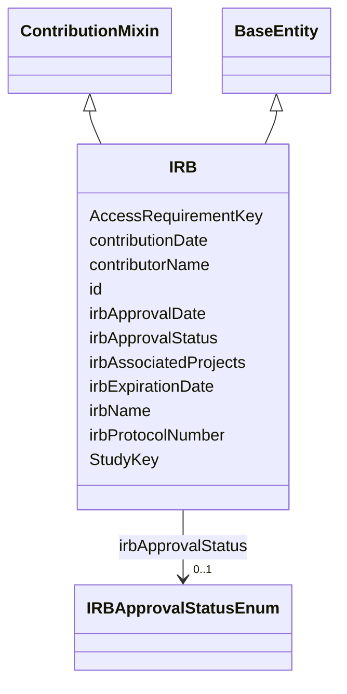

---
search:
  boost: 10.0
---

# Class: IRB 


_An Institutional Review Board (or equivalent Ethics Review Board) approval record: the body that granted it, its protocol identifier, and the studies/projects/access requirements it covers._


<div data-search-exclude markdown="1">


URI: [governanceduo:class/IRB](https://w3id.org/sage-bionetworks/governance-duo/class/IRB)





## Inheritance
* [BaseEntity](../classes/BaseEntity.md)
    * **IRB** [ [ContributionMixin](../classes/ContributionMixin.md)]


## Class Properties

| Property | Value |
| --- | --- |
| Tree Root | Yes |


## Slots

| Name | Cardinality and Range | Description | Inheritance |
| ---  | --- | --- | --- |
| [AccessRequirementKey](../slots/AccessRequirementKey.md) | * <br/> [String](../types/String.md) | The Access Requirement id(s) associated with this object | direct |
| [StudyKey](../slots/StudyKey.md) | * <br/> [String](../types/String.md) | The Study id(s) associated with this object | direct |
| [irbProtocolNumber](../slots/irbProtocolNumber.md) | 1 <br/> [String](../types/String.md) | The IRB's own protocol or registration number for this approval, as assigned ... | direct |
| [irbName](../slots/irbName.md) | 1 <br/> [String](../types/String.md) | The name of the reviewing IRB or Ethics Review Board (e | direct |
| [irbApprovalStatus](../slots/irbApprovalStatus.md) | 0..1 <br/> [IRBApprovalStatusEnum](../enums/IRBApprovalStatusEnum.md) | The current status of this IRB approval | direct |
| [irbApprovalDate](../slots/irbApprovalDate.md) | 0..1 <br/> [String](../types/String.md) | The date this IRB approval was granted | direct |
| [irbExpirationDate](../slots/irbExpirationDate.md) | 0..1 <br/> [String](../types/String.md) | The date this IRB approval expires, if applicable | direct |
| [irbAssociatedProjects](../slots/irbAssociatedProjects.md) | * <br/> [String](../types/String.md) | Synapse Project id(s) this IRB approval covers directly, for cases not alread... | direct |
| [contributorName](../slots/contributorName.md) | 1 <br/> [String](../types/String.md) | The name of the person who added this access requirement | [ContributionMixin](../classes/ContributionMixin.md) |
| [contributionDate](../slots/contributionDate.md) | 1 <br/> [String](../types/String.md) | The date on which the access requirement was added | [ContributionMixin](../classes/ContributionMixin.md) |
| [id](../slots/id.md) | 1 <br/> [String](../types/String.md) | A unique identifier for the IRB approval record | [BaseEntity](../classes/BaseEntity.md) |


## Identifier and Mapping Information


### Schema Source


* from schema: https://w3id.org/sage-bionetworks/governance-duo/governance_duo


## Mappings

| Mapping Type | Mapped Value |
| ---  | ---  |
| self | governanceduo:IRB |
| native | governanceduo:IRB |


## Examples
### Example: IRB-001

```yaml
id: irb.mount-sinai-001
contributorName: Jane Doe
contributionDate: "2026-09-28"
StudyKey: [study.mc2-jax-5xfad]
irbProtocolNumber: MSSM-IRB-2026-0142
irbName: Mount Sinai IRB
irbApprovalStatus: Approved
irbApprovalDate: "2026-01-15"
irbExpirationDate: "2027-01-15"

```


## LinkML Source

<!-- TODO: investigate https://stackoverflow.com/questions/37606292/how-to-create-tabbed-code-blocks-in-mkdocs-or-sphinx -->

### Direct

<details>
```yaml
name: IRB
description: 'An Institutional Review Board (or equivalent Ethics Review Board) approval
  record: the body that granted it, its protocol identifier, and the studies/projects/access
  requirements it covers.'
from_schema: https://w3id.org/sage-bionetworks/governance-duo/governance_duo
is_a: BaseEntity
mixins:
- ContributionMixin
slots:
- AccessRequirementKey
- StudyKey
- irbProtocolNumber
- irbName
- irbApprovalStatus
- irbApprovalDate
- irbExpirationDate
- irbAssociatedProjects
slot_usage:
  id:
    name: id
    description: A unique identifier for the IRB approval record.
    examples:
    - value: irb.mount-sinai-001
    pattern: ^irb\.[A-Za-z0-9_-]+$
tree_root: true

```
</details>

### Induced

<details>
```yaml
name: IRB
description: 'An Institutional Review Board (or equivalent Ethics Review Board) approval
  record: the body that granted it, its protocol identifier, and the studies/projects/access
  requirements it covers.'
from_schema: https://w3id.org/sage-bionetworks/governance-duo/governance_duo
is_a: BaseEntity
mixins:
- ContributionMixin
slot_usage:
  id:
    name: id
    description: A unique identifier for the IRB approval record.
    examples:
    - value: irb.mount-sinai-001
    pattern: ^irb\.[A-Za-z0-9_-]+$
attributes:
  AccessRequirementKey:
    name: AccessRequirementKey
    annotations:
      foreign_key:
        tag: foreign_key
        value: true
    description: The Access Requirement id(s) associated with this object. Provide
      multiple values as a comma-separated list.
    comments:
    - 'Deliberately an untyped string, not range: AccessRequirement: giving it a real
      typed range would require importing access_requirement.yaml into this file,
      but this file (like mixins.yaml) is a leaf that imports only linkml:types specifically
      so it can never import an entity file and risk an import cycle (see the schema-level
      description above). governance_graph.yaml can afford real typed ranges for its
      own cross-references (e.g. accessRequirement: range: AccessRequirement) because
      it is a single, later-loaded file that already imports everything it references
      -- this file cannot follow that pattern without breaking its own leaf-file guarantee.
      Same rationale applies to StudyKey below and to ResourceKey (schema.yaml)/SchemaKey
      (resource.yaml). The pattern above (matching AccessRequirement.id''s own slot_usage
      pattern in access_requirement.yaml) is the cycle-free substitute: it catches
      a malformed id without needing a typed range at all -- the same approach already
      used for entityIdList in that same file. See plans/identifier_update.md.'
    from_schema: https://w3id.org/sage-bionetworks/governance-duo/governance_duo
    rank: 1000
    owner: IRB
    domain_of:
    - Resource
    - Schema
    - Study
    - IRB
    range: string
    multivalued: true
    pattern: ^access_requirement\.\d+$
  StudyKey:
    name: StudyKey
    annotations:
      foreign_key:
        tag: foreign_key
        value: true
    description: The Study id(s) associated with this object. Provide multiple values
      as a comma-separated list.
    from_schema: https://w3id.org/sage-bionetworks/governance-duo/governance_duo
    rank: 1000
    owner: IRB
    domain_of:
    - AccessRequirement
    - Resource
    - Schema
    - IRB
    range: string
    multivalued: true
    pattern: ^study\.[A-Za-z0-9_-]+$
  irbProtocolNumber:
    name: irbProtocolNumber
    description: The IRB's own protocol or registration number for this approval,
      as assigned by the reviewing board.
    from_schema: https://w3id.org/sage-bionetworks/governance-duo/governance_duo
    rank: 1000
    owner: IRB
    domain_of:
    - IRB
    range: string
    required: true
  irbName:
    name: irbName
    description: The name of the reviewing IRB or Ethics Review Board (e.g. "Mount
      Sinai IRB").
    from_schema: https://w3id.org/sage-bionetworks/governance-duo/governance_duo
    rank: 1000
    owner: IRB
    domain_of:
    - IRB
    range: string
    required: true
  irbApprovalStatus:
    name: irbApprovalStatus
    description: The current status of this IRB approval.
    from_schema: https://w3id.org/sage-bionetworks/governance-duo/governance_duo
    rank: 1000
    owner: IRB
    domain_of:
    - IRB
    range: IRBApprovalStatusEnum
  irbApprovalDate:
    name: irbApprovalDate
    description: The date this IRB approval was granted.
    from_schema: https://w3id.org/sage-bionetworks/governance-duo/governance_duo
    rank: 1000
    owner: IRB
    domain_of:
    - IRB
    range: string
  irbExpirationDate:
    name: irbExpirationDate
    description: The date this IRB approval expires, if applicable.
    from_schema: https://w3id.org/sage-bionetworks/governance-duo/governance_duo
    rank: 1000
    owner: IRB
    domain_of:
    - IRB
    range: string
  irbAssociatedProjects:
    name: irbAssociatedProjects
    description: Synapse Project id(s) this IRB approval covers directly, for cases
      not already reachable through a linked Study record. Provide multiple values
      as a comma-separated list.
    from_schema: https://w3id.org/sage-bionetworks/governance-duo/governance_duo
    rank: 1000
    owner: IRB
    domain_of:
    - IRB
    range: string
    multivalued: true
    pattern: ^syn\d+$
  contributorName:
    name: contributorName
    description: The name of the person who added this access requirement.
    comments:
    - prov:wasAttributedTo relates a prov:Entity to a prov:Agent; this slot holds
      a literal name rather than an Agent reference, so the mapping is close, not
      exact.
    from_schema: https://w3id.org/sage-bionetworks/governance-duo/governance_duo
    close_mappings:
    - prov:wasAttributedTo
    rank: 1000
    owner: IRB
    domain_of:
    - ContributionMixin
    range: string
    required: true
  contributionDate:
    name: contributionDate
    description: The date on which the access requirement was added.
    comments:
    - 'schematic Format: date'
    - prov:generatedAtTime ("The time at which an entity was completely created and
      is available for use") matches this slot's semantics closely, treating the AccessRequirement
      record itself as the generated prov:Entity.
    from_schema: https://w3id.org/sage-bionetworks/governance-duo/governance_duo
    close_mappings:
    - prov:generatedAtTime
    rank: 1000
    owner: IRB
    domain_of:
    - ContributionMixin
    range: string
    required: true
  id:
    name: id
    description: A unique identifier for the IRB approval record.
    examples:
    - value: irb.mount-sinai-001
    from_schema: https://w3id.org/sage-bionetworks/governance-duo/governance_duo
    rank: 1000
    slot_uri: dcterms:identifier
    identifier: true
    owner: IRB
    domain_of:
    - BaseEntity
    range: string
    required: true
    pattern: ^irb\.[A-Za-z0-9_-]+$
tree_root: true

```
</details></div>