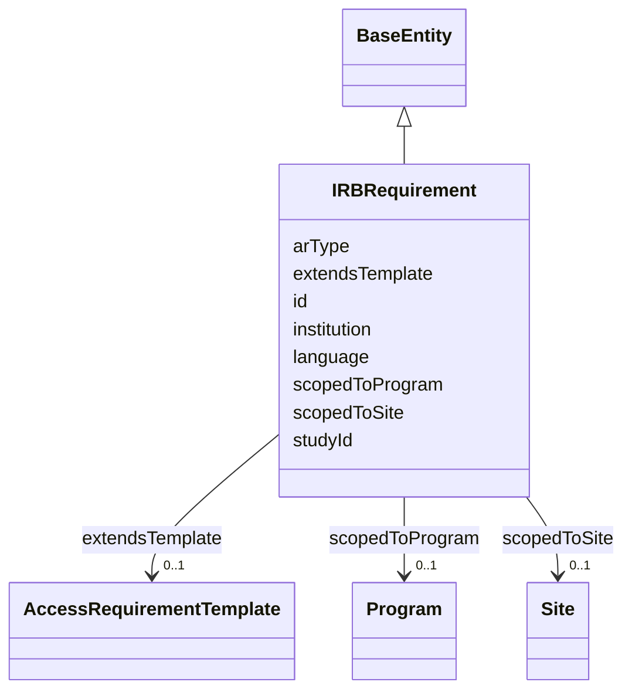

---
search:
  boost: 10.0
---

# Class: IRBRequirement 


_A site/program-specific instantiation of an AccessRequirementTemplate, per the target ontology proposed in review on sagebrain-infra PR #54 (thomasyu888, https://github.com/Sage-Bionetworks-IT/sagebrain-infra/pull/54#discussion_r3926030399). studyId bridges to this repo's existing, *real* governanceduo:Study class via the same owl:sameAs pattern add_access_requirement_association() already uses for gov:AR-<n> <-> governanceduo:access_requirement.<n> -- Study has a real example (study.mc2-jax-5xfad) and a real AccessRequirementKey link to an AccessRequirement, so this is a genuine integration point, not an invented one. `institution` (reusing ResearchProject/DataAccessRequest's own slot) drives `scopedToSite` the same way it drives `gov:affiliatedWith` elsewhere -- not independently re-emitted. `is_a: BaseEntity` for a synthetic dotted id, same reasoning as AccessRequirementTemplate above. See plans/governance_graph_open_questions.md Section C.2._


<div data-search-exclude markdown="1">


URI: [sagegov:IRBRequirement](https://sagebionetworks.org/governance/IRBRequirement)





## Inheritance
* [BaseEntity](../classes/BaseEntity.md)
    * **IRBRequirement**


## Class Properties

| Property | Value |
| --- | --- |
| Class URI | [sagegov:IRBRequirement](https://sagebionetworks.org/governance/IRBRequirement) |


## Slots

| Name | Cardinality and Range | Description | Inheritance |
| ---  | --- | --- | --- |
| [extendsTemplate](../slots/extendsTemplate.md) | 0..1 <br/> [AccessRequirementTemplate](../classes/AccessRequirementTemplate.md) | The AccessRequirementTemplate this IRBRequirement extends | direct |
| [arType](../slots/arType.md) | 0..1 <br/> [String](../types/String.md) | Free-text access requirement type, e | direct |
| [studyId](../slots/studyId.md) | 0..1 <br/> [Uriorcurie](../types/Uriorcurie.md) | The Study (this repo's real governanceduo:Study class, study | direct |
| [language](../slots/language.md) | 0..1 <br/> [String](../types/String.md) | Free-text consent/IRB language for this requirement | direct |
| [scopedToProgram](../slots/scopedToProgram.md) | 0..1 <br/> [Program](../classes/Program.md) | The Program this IRBRequirement is scoped to | direct |
| [scopedToSite](../slots/scopedToSite.md) | 0..1 <br/> [Site](../classes/Site.md) | The Site this IRBRequirement is scoped to | direct |
| [institution](../slots/institution.md) | 0..1 <br/> [String](../types/String.md) | Institution/company name, verbatim from Synapse (ResearchProject | direct |
| [id](../slots/id.md) | 1 <br/> [String](../types/String.md) | A synthetic identifier for this IRB requirement instance | [BaseEntity](../classes/BaseEntity.md) |


## Identifier and Mapping Information


### Schema Source


* from schema: https://w3id.org/sage-bionetworks/governance-duo/governance_duo


## Mappings

| Mapping Type | Mapped Value |
| ---  | ---  |
| self | sagegov:IRBRequirement |
| native | governanceduo:IRBRequirement |


## LinkML Source

<!-- TODO: investigate https://stackoverflow.com/questions/37606292/how-to-create-tabbed-code-blocks-in-mkdocs-or-sphinx -->

### Direct

<details>
```yaml
name: IRBRequirement
description: 'A site/program-specific instantiation of an AccessRequirementTemplate,
  per the target ontology proposed in review on sagebrain-infra PR #54 (thomasyu888,
  https://github.com/Sage-Bionetworks-IT/sagebrain-infra/pull/54#discussion_r3926030399).
  studyId bridges to this repo''s existing, *real* governanceduo:Study class via the
  same owl:sameAs pattern add_access_requirement_association() already uses for gov:AR-<n>
  <-> governanceduo:access_requirement.<n> -- Study has a real example (study.mc2-jax-5xfad)
  and a real AccessRequirementKey link to an AccessRequirement, so this is a genuine
  integration point, not an invented one. `institution` (reusing ResearchProject/DataAccessRequest''s
  own slot) drives `scopedToSite` the same way it drives `gov:affiliatedWith` elsewhere
  -- not independently re-emitted. `is_a: BaseEntity` for a synthetic dotted id, same
  reasoning as AccessRequirementTemplate above. See plans/governance_graph_open_questions.md
  Section C.2.'
from_schema: https://w3id.org/sage-bionetworks/governance-duo/governance_duo
is_a: BaseEntity
slots:
- extendsTemplate
- arType
- studyId
- language
- scopedToProgram
- scopedToSite
- institution
slot_usage:
  id:
    name: id
    description: A synthetic identifier for this IRB requirement instance.
    examples:
    - value: irb_requirement.irb-genomics-adkp
    pattern: ^irb_requirement\.[A-Za-z0-9_-]+$
class_uri: sagegov:IRBRequirement

```
</details>

### Induced

<details>
```yaml
name: IRBRequirement
description: 'A site/program-specific instantiation of an AccessRequirementTemplate,
  per the target ontology proposed in review on sagebrain-infra PR #54 (thomasyu888,
  https://github.com/Sage-Bionetworks-IT/sagebrain-infra/pull/54#discussion_r3926030399).
  studyId bridges to this repo''s existing, *real* governanceduo:Study class via the
  same owl:sameAs pattern add_access_requirement_association() already uses for gov:AR-<n>
  <-> governanceduo:access_requirement.<n> -- Study has a real example (study.mc2-jax-5xfad)
  and a real AccessRequirementKey link to an AccessRequirement, so this is a genuine
  integration point, not an invented one. `institution` (reusing ResearchProject/DataAccessRequest''s
  own slot) drives `scopedToSite` the same way it drives `gov:affiliatedWith` elsewhere
  -- not independently re-emitted. `is_a: BaseEntity` for a synthetic dotted id, same
  reasoning as AccessRequirementTemplate above. See plans/governance_graph_open_questions.md
  Section C.2.'
from_schema: https://w3id.org/sage-bionetworks/governance-duo/governance_duo
is_a: BaseEntity
slot_usage:
  id:
    name: id
    description: A synthetic identifier for this IRB requirement instance.
    examples:
    - value: irb_requirement.irb-genomics-adkp
    pattern: ^irb_requirement\.[A-Za-z0-9_-]+$
attributes:
  extendsTemplate:
    name: extendsTemplate
    description: The AccessRequirementTemplate this IRBRequirement extends.
    from_schema: https://w3id.org/sage-bionetworks/governance-duo/governance_duo
    rank: 1000
    slot_uri: sagegov:extendsTemplate
    owner: IRBRequirement
    domain_of:
    - IRBRequirement
    range: AccessRequirementTemplate
  arType:
    name: arType
    description: Free-text access requirement type, e.g. "IRB".
    from_schema: https://w3id.org/sage-bionetworks/governance-duo/governance_duo
    rank: 1000
    slot_uri: sagegov:arType
    owner: IRBRequirement
    domain_of:
    - IRBRequirement
    range: string
  studyId:
    name: studyId
    description: 'The Study (this repo''s real governanceduo:Study class, study.yaml)
      this IRBRequirement''s language was authored for. slot_uri is owl:sameAs itself,
      not a domain-specific predicate: Study lives in a different namespace (governanceduo:),
      so this declares a co-reference rather than a same-namespace object property
      -- the same pattern AccessRequirement stubs need (see add_access_requirement_association())
      but can''t yet declare, since that stub has no governance_graph.yaml class of
      its own to hang a slot_uri off of. range is the untyped uriorcurie, not Study
      itself: the referenced Study individual is never asserted (type or otherwise)
      in this ABox -- its full definition lives only in the separately-built linkml/examples/rdf/
      graph -- so an sh:class Study constraint would fail against this graph alone
      even when the reference is entirely correct.'
    from_schema: https://w3id.org/sage-bionetworks/governance-duo/governance_duo
    rank: 1000
    slot_uri: owl:sameAs
    owner: IRBRequirement
    domain_of:
    - IRBRequirement
    range: uriorcurie
  language:
    name: language
    description: Free-text consent/IRB language for this requirement.
    from_schema: https://w3id.org/sage-bionetworks/governance-duo/governance_duo
    rank: 1000
    slot_uri: sagegov:language
    owner: IRBRequirement
    domain_of:
    - IRBRequirement
    range: string
  scopedToProgram:
    name: scopedToProgram
    description: The Program this IRBRequirement is scoped to. Illustrative-only --
      see Program's own description.
    from_schema: https://w3id.org/sage-bionetworks/governance-duo/governance_duo
    rank: 1000
    slot_uri: sagegov:scopedToProgram
    owner: IRBRequirement
    domain_of:
    - IRBRequirement
    range: Program
  scopedToSite:
    name: scopedToSite
    description: The Site this IRBRequirement is scoped to.
    from_schema: https://w3id.org/sage-bionetworks/governance-duo/governance_duo
    rank: 1000
    slot_uri: sagegov:scopedToSite
    owner: IRBRequirement
    domain_of:
    - IRBRequirement
    range: Site
  institution:
    name: institution
    description: Institution/company name, verbatim from Synapse (ResearchProject.institution
      / DataAccessRequest.institution -- both real fields hold the same free-text
      shape as UserProfile.company above). On ResearchProject/DataAccessRequest, consumed
      by site_node_for() to derive a gov:affiliatedWith edge, not independently re-emitted;
      on Site itself, this is the node's own display name and IS emitted directly.
    from_schema: https://w3id.org/sage-bionetworks/governance-duo/governance_duo
    rank: 1000
    slot_uri: sagegov:institution
    owner: IRBRequirement
    domain_of:
    - ResearchProject
    - Site
    - DataAccessRequest
    - IRBRequirement
    range: string
  id:
    name: id
    description: A synthetic identifier for this IRB requirement instance.
    examples:
    - value: irb_requirement.irb-genomics-adkp
    from_schema: https://w3id.org/sage-bionetworks/governance-duo/governance_duo
    rank: 1000
    slot_uri: dcterms:identifier
    identifier: true
    owner: IRBRequirement
    domain_of:
    - BaseEntity
    range: string
    required: true
    pattern: ^irb_requirement\.[A-Za-z0-9_-]+$
class_uri: sagegov:IRBRequirement

```
</details></div>