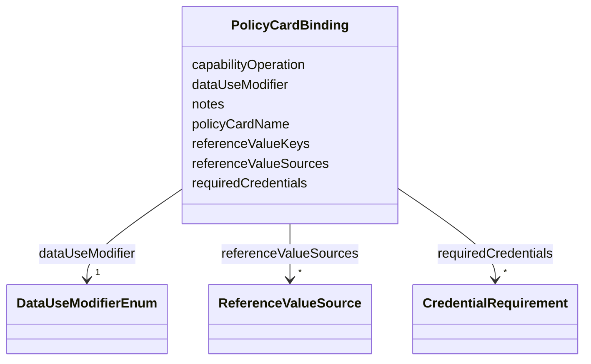

---
search:
  boost: 10.0
---

# Class: PolicyCardBinding 


_One row per verified tmp-policies policy_cards/<name>/ folder: which DUO code it implements, its Reference Values Schema key(s), which existing (or missing) governanceDUO slot already collects each reference value, and which credentials/claims it requires. A referenceValueKey with no entry in referenceValueSources is intentionally left unmapped (rather than force-fit) wherever governanceDUO has no existing slot of the right shape — see policy_fabric_bindings.yaml's `notes` for any such case._


<div data-search-exclude markdown="1">


URI: [governanceduo:class/PolicyCardBinding](https://w3id.org/sage-bionetworks/governance-duo/class/PolicyCardBinding)





<!-- no inheritance hierarchy -->

## Slots

| Name | Cardinality and Range | Description | Inheritance |
| ---  | --- | --- | --- |
| [dataUseModifier](../slots/dataUseModifier.md) | 1 <br/> [DataUseModifierEnum](../enums/DataUseModifierEnum.md) | The DUO code (or Sage DUOPlus extension) this binding documents | direct |
| [policyCardName](../slots/policyCardName.md) | 1 <br/> [String](../types/String.md) | The literal tmp-policies policy_cards/<name>/ folder name, e | direct |
| [referenceValueKeys](../slots/referenceValueKeys.md) | * <br/> [String](../types/String.md) | The policy_data_schema | direct |
| [referenceValueSources](../slots/referenceValueSources.md) | * <br/> [ReferenceValueSource](../classes/ReferenceValueSource.md) |  | direct |
| [requiredCredentials](../slots/requiredCredentials.md) | * <br/> [CredentialRequirement](../classes/CredentialRequirement.md) |  | direct |
| [capabilityOperation](../slots/capabilityOperation.md) | 0..1 <br/> [String](../types/String.md) | The "name" field of the Capability Granted this policy_card's Rego emits on s... | direct |
| [notes](../slots/notes.md) | * <br/> [String](../types/String.md) | Free-text notes — used in particular to record why sourceSlot is left unset (... | direct |


## Usages

| used by | used in | type | used |
| ---  | --- | --- | --- |
| [PolicyCardBindingCollection](../classes/PolicyCardBindingCollection.md) | [bindings](../slots/bindings.md) | range | [PolicyCardBinding](../classes/PolicyCardBinding.md) |


## Identifier and Mapping Information


### Schema Source


* from schema: https://w3id.org/sage-bionetworks/governance-duo/governance_duo


## Mappings

| Mapping Type | Mapped Value |
| ---  | ---  |
| self | governanceduo:PolicyCardBinding |
| native | governanceduo:PolicyCardBinding |


## LinkML Source

<!-- TODO: investigate https://stackoverflow.com/questions/37606292/how-to-create-tabbed-code-blocks-in-mkdocs-or-sphinx -->

### Direct

<details>
```yaml
name: PolicyCardBinding
description: 'One row per verified tmp-policies policy_cards/<name>/ folder: which
  DUO code it implements, its Reference Values Schema key(s), which existing (or missing)
  governanceDUO slot already collects each reference value, and which credentials/claims
  it requires. A referenceValueKey with no entry in referenceValueSources is intentionally
  left unmapped (rather than force-fit) wherever governanceDUO has no existing slot
  of the right shape — see policy_fabric_bindings.yaml''s `notes` for any such case.'
from_schema: https://w3id.org/sage-bionetworks/governance-duo/governance_duo
slots:
- dataUseModifier
- policyCardName
- referenceValueKeys
- referenceValueSources
- requiredCredentials
- capabilityOperation
- notes

```
</details>

### Induced

<details>
```yaml
name: PolicyCardBinding
description: 'One row per verified tmp-policies policy_cards/<name>/ folder: which
  DUO code it implements, its Reference Values Schema key(s), which existing (or missing)
  governanceDUO slot already collects each reference value, and which credentials/claims
  it requires. A referenceValueKey with no entry in referenceValueSources is intentionally
  left unmapped (rather than force-fit) wherever governanceDUO has no existing slot
  of the right shape — see policy_fabric_bindings.yaml''s `notes` for any such case.'
from_schema: https://w3id.org/sage-bionetworks/governance-duo/governance_duo
attributes:
  dataUseModifier:
    name: dataUseModifier
    description: The DUO code (or Sage DUOPlus extension) this binding documents.
    from_schema: https://w3id.org/sage-bionetworks/governance-duo/governance_duo
    rank: 1000
    owner: PolicyCardBinding
    domain_of:
    - PolicyCardBinding
    - DrsAuthorizationBinding
    range: DataUseModifierEnum
    required: true
  policyCardName:
    name: policyCardName
    description: The literal tmp-policies policy_cards/<name>/ folder name, e.g. "geographical-restriction".
    from_schema: https://w3id.org/sage-bionetworks/governance-duo/governance_duo
    rank: 1000
    owner: PolicyCardBinding
    domain_of:
    - PolicyCardBinding
    range: string
    required: true
  referenceValueKeys:
    name: referenceValueKeys
    description: The policy_data_schema.json key(s) this policy_card's Reference Values
      Schema defines, e.g. "allowedCountries". Empty for policy_cards with no reference
      values at all (pure credential-chain checks, e.g. ethics-approval-required).
    from_schema: https://w3id.org/sage-bionetworks/governance-duo/governance_duo
    rank: 1000
    owner: PolicyCardBinding
    domain_of:
    - PolicyCardBinding
    range: string
    multivalued: true
  referenceValueSources:
    name: referenceValueSources
    from_schema: https://w3id.org/sage-bionetworks/governance-duo/governance_duo
    rank: 1000
    owner: PolicyCardBinding
    domain_of:
    - PolicyCardBinding
    range: ReferenceValueSource
    multivalued: true
    inlined: true
  requiredCredentials:
    name: requiredCredentials
    from_schema: https://w3id.org/sage-bionetworks/governance-duo/governance_duo
    rank: 1000
    owner: PolicyCardBinding
    domain_of:
    - PolicyCardBinding
    range: CredentialRequirement
    multivalued: true
    inlined: true
  capabilityOperation:
    name: capabilityOperation
    description: The "name" field of the Capability Granted this policy_card's Rego
      emits on success (every one of the 21 verified policy_cards emits "do_download"
      today — Policy Fabric has not yet diversified beyond dataset download).
    comments:
    - 'Related to, but intentionally not unified with, mixins.yaml''s AccessTypeEnum
      (used by AccessGrant.permission and AccessRequirement.accessType): both describe
      "what operation is being granted," but AccessTypeEnum is Synapse''s own closed
      ACL vocabulary while this slot is Policy Fabric''s free-string Rego capability-name
      convention -- the two vocabularies belong to different external systems and
      may drift independently, so this stays a free string rather than being coerced
      into AccessTypeEnum.'
    from_schema: https://w3id.org/sage-bionetworks/governance-duo/governance_duo
    rank: 1000
    ifabsent: string(do_download)
    owner: PolicyCardBinding
    domain_of:
    - PolicyCardBinding
    range: string
  notes:
    name: notes
    description: Free-text notes — used in particular to record why sourceSlot is
      left unset (which governanceDUO slot would need to be added, and its required
      shape) so a gap is documented rather than silently dropped. Reused by drs_alignment.yaml's
      DrsAuthorizationBinding for the same purpose.
    from_schema: https://w3id.org/sage-bionetworks/governance-duo/governance_duo
    rank: 1000
    owner: PolicyCardBinding
    domain_of:
    - PolicyCardBinding
    - DrsAuthorizationBinding
    range: string
    multivalued: true

```
</details></div>