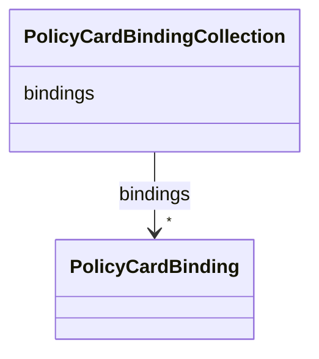

---
search:
  boost: 10.0
---

# Class: PolicyCardBindingCollection 


_Container class for policy_fabric_bindings.yaml — a plain list wrapper so the data file has a single root class to validate against._


<div data-search-exclude markdown="1">


URI: [governanceduo:class/PolicyCardBindingCollection](https://w3id.org/sage-bionetworks/governance-duo/class/PolicyCardBindingCollection)





<!-- no inheritance hierarchy -->

## Class Properties

| Property | Value |
| --- | --- |
| Tree Root | Yes |


## Slots

| Name | Cardinality and Range | Description | Inheritance |
| ---  | --- | --- | --- |
| [bindings](../slots/bindings.md) | * <br/> [PolicyCardBinding](../classes/PolicyCardBinding.md) |  | direct |


## Identifier and Mapping Information


### Schema Source


* from schema: https://w3id.org/sage-bionetworks/governance-duo/governance_duo


## Mappings

| Mapping Type | Mapped Value |
| ---  | ---  |
| self | governanceduo:PolicyCardBindingCollection |
| native | governanceduo:PolicyCardBindingCollection |


## LinkML Source

<!-- TODO: investigate https://stackoverflow.com/questions/37606292/how-to-create-tabbed-code-blocks-in-mkdocs-or-sphinx -->

### Direct

<details>
```yaml
name: PolicyCardBindingCollection
description: Container class for policy_fabric_bindings.yaml — a plain list wrapper
  so the data file has a single root class to validate against.
from_schema: https://w3id.org/sage-bionetworks/governance-duo/governance_duo
slots:
- bindings
tree_root: true

```
</details>

### Induced

<details>
```yaml
name: PolicyCardBindingCollection
description: Container class for policy_fabric_bindings.yaml — a plain list wrapper
  so the data file has a single root class to validate against.
from_schema: https://w3id.org/sage-bionetworks/governance-duo/governance_duo
attributes:
  bindings:
    name: bindings
    from_schema: https://w3id.org/sage-bionetworks/governance-duo/governance_duo
    rank: 1000
    owner: PolicyCardBindingCollection
    domain_of:
    - PolicyCardBindingCollection
    range: PolicyCardBinding
    multivalued: true
    inlined: true
    inlined_as_list: true
tree_root: true

```
</details></div>