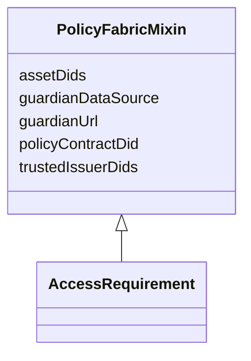

---
search:
  boost: 10.0
---

# Class: PolicyFabricMixin 


_Fields needed to deploy an AccessRequirement's governed entities into Policy Fabric (https://github.com/hasan7n/tmp-policies) as a registered Asset with an exposed policy. All optional — a governanceDUO record can exist before, or without ever, being deployed into Policy Fabric. Applied only to AccessRequirement: it already carries entityIdList (the concrete Synapse containers governed) and dataUseModifiers (which DUO codes/policy_cards apply), making it the natural analog of Policy Fabric's Asset + exposed-policy pairing — see linkml/policy_fabric.yaml and policy_fabric_bindings.yaml for the per-DUO-code credential/reference-value crosswalk this pairs with._


<div data-search-exclude markdown="1">


URI: [governanceduo:class/PolicyFabricMixin](https://w3id.org/sage-bionetworks/governance-duo/class/PolicyFabricMixin)





<!-- no inheritance hierarchy -->

## Class Properties

| Property | Value |
| --- | --- |
| Mixin | Yes |


## Slots

| Name | Cardinality and Range | Description | Inheritance |
| ---  | --- | --- | --- |
| [assetDids](../slots/assetDids.md) | * <br/> [String](../types/String.md) | Policy Fabric Asset-registry DID(s) for the Synapse entities in entityIdList ... | direct |
| [guardianDataSource](../slots/guardianDataSource.md) | 0..1 <br/> [String](../types/String.md) | The data path/source configured for this asset's Guardian | direct |
| [guardianUrl](../slots/guardianUrl.md) | 0..1 <br/> [String](../types/String.md) | The deployed Guardian service URL for this asset | direct |
| [policyContractDid](../slots/policyContractDid.md) | 0..1 <br/> [String](../types/String.md) | The DID of the deployed rego_policy_agent/rego_token contract pair once this ... | direct |
| [trustedIssuerDids](../slots/trustedIssuerDids.md) | * <br/> [String](../types/String.md) | DID(s) of the Verifiable Credential issuer(s) this AccessRequirement's owner ... | direct |


## Mixin Usage

| mixed into | description |
| --- | --- |
| [AccessRequirement](../classes/AccessRequirement.md) | Representation of a Synapse Access Requirement and its relationships to entit... |


## Identifier and Mapping Information


### Schema Source


* from schema: https://w3id.org/sage-bionetworks/governance-duo/governance_duo


## Mappings

| Mapping Type | Mapped Value |
| ---  | ---  |
| self | governanceduo:PolicyFabricMixin |
| native | governanceduo:PolicyFabricMixin |


## LinkML Source

<!-- TODO: investigate https://stackoverflow.com/questions/37606292/how-to-create-tabbed-code-blocks-in-mkdocs-or-sphinx -->

### Direct

<details>
```yaml
name: PolicyFabricMixin
description: 'Fields needed to deploy an AccessRequirement''s governed entities into
  Policy Fabric (https://github.com/hasan7n/tmp-policies) as a registered Asset with
  an exposed policy. All optional — a governanceDUO record can exist before, or without
  ever, being deployed into Policy Fabric. Applied only to AccessRequirement: it already
  carries entityIdList (the concrete Synapse containers governed) and dataUseModifiers
  (which DUO codes/policy_cards apply), making it the natural analog of Policy Fabric''s
  Asset + exposed-policy pairing — see linkml/policy_fabric.yaml and policy_fabric_bindings.yaml
  for the per-DUO-code credential/reference-value crosswalk this pairs with.'
from_schema: https://w3id.org/sage-bionetworks/governance-duo/governance_duo
mixin: true
slots:
- assetDids
- guardianDataSource
- guardianUrl
- policyContractDid
- trustedIssuerDids

```
</details>

### Induced

<details>
```yaml
name: PolicyFabricMixin
description: 'Fields needed to deploy an AccessRequirement''s governed entities into
  Policy Fabric (https://github.com/hasan7n/tmp-policies) as a registered Asset with
  an exposed policy. All optional — a governanceDUO record can exist before, or without
  ever, being deployed into Policy Fabric. Applied only to AccessRequirement: it already
  carries entityIdList (the concrete Synapse containers governed) and dataUseModifiers
  (which DUO codes/policy_cards apply), making it the natural analog of Policy Fabric''s
  Asset + exposed-policy pairing — see linkml/policy_fabric.yaml and policy_fabric_bindings.yaml
  for the per-DUO-code credential/reference-value crosswalk this pairs with.'
from_schema: https://w3id.org/sage-bionetworks/governance-duo/governance_duo
mixin: true
attributes:
  assetDids:
    name: assetDids
    description: Policy Fabric Asset-registry DID(s) for the Synapse entities in entityIdList
      (order-aligned — position N here corresponds to position N in entityIdList).
      Mirrors the Django Asset model's `did` field (unique per Asset) in tmp-policies/tools/asset_registry.
    from_schema: https://w3id.org/sage-bionetworks/governance-duo/governance_duo
    rank: 1000
    owner: PolicyFabricMixin
    domain_of:
    - PolicyFabricMixin
    range: string
    multivalued: true
    pattern: ^did:[a-z0-9]+:.+$
  guardianDataSource:
    name: guardianDataSource
    description: The data path/source configured for this asset's Guardian. Mirrors
      Asset.metadata.data_source, set by convention (not schema) in tmp-policies/tools/pdo_client
      at asset-setup time.
    from_schema: https://w3id.org/sage-bionetworks/governance-duo/governance_duo
    rank: 1000
    owner: PolicyFabricMixin
    domain_of:
    - PolicyFabricMixin
    range: string
  guardianUrl:
    name: guardianUrl
    description: The deployed Guardian service URL for this asset. Mirrors Asset.metadata.guardian_url,
      set by the same asset-setup convention.
    from_schema: https://w3id.org/sage-bionetworks/governance-duo/governance_duo
    rank: 1000
    owner: PolicyFabricMixin
    domain_of:
    - PolicyFabricMixin
    range: string
  policyContractDid:
    name: policyContractDid
    description: The DID of the deployed rego_policy_agent/rego_token contract pair
      once this AccessRequirement's selected DUO codes have been "exposed" as a policy
      in Policy Fabric. Mirrors Asset.metadata.policy_contract.
    from_schema: https://w3id.org/sage-bionetworks/governance-duo/governance_duo
    rank: 1000
    owner: PolicyFabricMixin
    domain_of:
    - PolicyFabricMixin
    range: string
    pattern: ^did:[a-z0-9]+:.+$
  trustedIssuerDids:
    name: trustedIssuerDids
    description: DID(s) of the Verifiable Credential issuer(s) this AccessRequirement's
      owner trusts to attest the claims its selected DUO codes require (see policy_fabric_bindings.yaml's
      requiredCredentials per code). Unlike PolicyCardBinding.requiredCredentials
      (a static, per-DUO-code fact), this varies per AccessRequirement — different
      owners may trust different institutional VC issuers — so it lives here, not
      in the policy_fabric.yaml lookup schema.
    from_schema: https://w3id.org/sage-bionetworks/governance-duo/governance_duo
    rank: 1000
    owner: PolicyFabricMixin
    domain_of:
    - PolicyFabricMixin
    range: string
    multivalued: true
    pattern: ^did:[a-z0-9]+:.+$

```
</details></div>