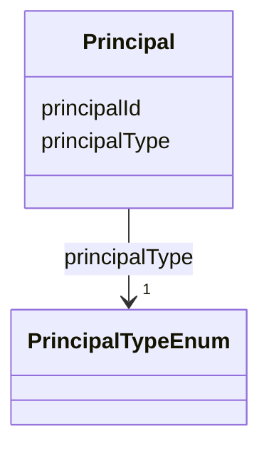

---
search:
  boost: 10.0
---

# Class: Principal 


_A Synapse user or team being granted access via an ACL. Mirrors ACL_RESOURCE_ACCESS.GROUP_ID (the id of the user or team being granted access) with an explicit type discriminator, since a bare GROUP_ID doesn't distinguish the two on its own. Deliberately not `is_a: BaseEntity`, and for a different reason than DataAccessSubmissionStatus's (see that class's own description): unlike AccessGrant/AccessRequirementAssociation/ DataAccessSubmission -- which mint a *synthetic* BaseEntity id specifically because their underlying Synapse tables have no single natural key for the merged, first-class thing being modeled -- GROUP_ID already *is* a real, unambiguous, already-existing natural key (Synapse's own numeric Principal/UserGroup id), so there's nothing to synthesize. It's also an integer, not a string, so reusing BaseEntity's generically string-typed `id` slot would require both a range override and renaming this attribute from principalId to literally `id` (slot_usage overrides a slot's attributes; it can't let a differently-named slot stand in for it) -- sacrificing the direct principalId <-> ACL_RESOURCE_ACCESS.GROUP_ID column traceability this schema preserves everywhere else (see SynapseAccessRequirementMixin's real-column-name convention)._


<div data-search-exclude markdown="1">


URI: [sagegov:Principal](https://sagebionetworks.org/governance/Principal)





<!-- no inheritance hierarchy -->

## Class Properties

| Property | Value |
| --- | --- |
| Class URI | [sagegov:Principal](https://sagebionetworks.org/governance/Principal) |


## Slots

| Name | Cardinality and Range | Description | Inheritance |
| ---  | --- | --- | --- |
| [principalId](../slots/principalId.md) | 1 <br/> [Integer](../types/Integer.md) | The Synapse numeric id of the user or team (ACL_RESOURCE_ACCESS | direct |
| [principalType](../slots/principalType.md) | 1 <br/> [PrincipalTypeEnum](../enums/PrincipalTypeEnum.md) |  | direct |


## Usages

| used by | used in | type | used |
| ---  | --- | --- | --- |
| [AccessGrant](../classes/AccessGrant.md) | [principal](../slots/principal.md) | range | [Principal](../classes/Principal.md) |


## Identifier and Mapping Information


### Schema Source


* from schema: https://w3id.org/sage-bionetworks/governance-duo/governance_duo


## Mappings

| Mapping Type | Mapped Value |
| ---  | ---  |
| self | sagegov:Principal |
| native | governanceduo:Principal |
| close | prov:Agent |


## Examples
### Example: Principal-001-team-x

```yaml
principalId: 9000001
principalType: Team

```
### Example: Principal-002-user

```yaml
principalId: 2000001
principalType: User

```


## LinkML Source

<!-- TODO: investigate https://stackoverflow.com/questions/37606292/how-to-create-tabbed-code-blocks-in-mkdocs-or-sphinx -->

### Direct

<details>
```yaml
name: Principal
description: 'A Synapse user or team being granted access via an ACL. Mirrors ACL_RESOURCE_ACCESS.GROUP_ID
  (the id of the user or team being granted access) with an explicit type discriminator,
  since a bare GROUP_ID doesn''t distinguish the two on its own. Deliberately not
  `is_a: BaseEntity`, and for a different reason than DataAccessSubmissionStatus''s
  (see that class''s own description): unlike AccessGrant/AccessRequirementAssociation/
  DataAccessSubmission -- which mint a *synthetic* BaseEntity id specifically because
  their underlying Synapse tables have no single natural key for the merged, first-class
  thing being modeled -- GROUP_ID already *is* a real, unambiguous, already-existing
  natural key (Synapse''s own numeric Principal/UserGroup id), so there''s nothing
  to synthesize. It''s also an integer, not a string, so reusing BaseEntity''s generically
  string-typed `id` slot would require both a range override and renaming this attribute
  from principalId to literally `id` (slot_usage overrides a slot''s attributes; it
  can''t let a differently-named slot stand in for it) -- sacrificing the direct principalId
  <-> ACL_RESOURCE_ACCESS.GROUP_ID column traceability this schema preserves everywhere
  else (see SynapseAccessRequirementMixin''s real-column-name convention).'
from_schema: https://w3id.org/sage-bionetworks/governance-duo/governance_duo
close_mappings:
- prov:Agent
slots:
- principalId
- principalType
class_uri: sagegov:Principal

```
</details>

### Induced

<details>
```yaml
name: Principal
description: 'A Synapse user or team being granted access via an ACL. Mirrors ACL_RESOURCE_ACCESS.GROUP_ID
  (the id of the user or team being granted access) with an explicit type discriminator,
  since a bare GROUP_ID doesn''t distinguish the two on its own. Deliberately not
  `is_a: BaseEntity`, and for a different reason than DataAccessSubmissionStatus''s
  (see that class''s own description): unlike AccessGrant/AccessRequirementAssociation/
  DataAccessSubmission -- which mint a *synthetic* BaseEntity id specifically because
  their underlying Synapse tables have no single natural key for the merged, first-class
  thing being modeled -- GROUP_ID already *is* a real, unambiguous, already-existing
  natural key (Synapse''s own numeric Principal/UserGroup id), so there''s nothing
  to synthesize. It''s also an integer, not a string, so reusing BaseEntity''s generically
  string-typed `id` slot would require both a range override and renaming this attribute
  from principalId to literally `id` (slot_usage overrides a slot''s attributes; it
  can''t let a differently-named slot stand in for it) -- sacrificing the direct principalId
  <-> ACL_RESOURCE_ACCESS.GROUP_ID column traceability this schema preserves everywhere
  else (see SynapseAccessRequirementMixin''s real-column-name convention).'
from_schema: https://w3id.org/sage-bionetworks/governance-duo/governance_duo
close_mappings:
- prov:Agent
attributes:
  principalId:
    name: principalId
    description: The Synapse numeric id of the user or team (ACL_RESOURCE_ACCESS.GROUP_ID).
    from_schema: https://w3id.org/sage-bionetworks/governance-duo/governance_duo
    rank: 1000
    slot_uri: sagegov:principalId
    identifier: true
    owner: Principal
    domain_of:
    - Principal
    range: integer
    required: true
  principalType:
    name: principalType
    from_schema: https://w3id.org/sage-bionetworks/governance-duo/governance_duo
    rank: 1000
    owner: Principal
    domain_of:
    - Principal
    range: PrincipalTypeEnum
    required: true
class_uri: sagegov:Principal

```
</details></div>