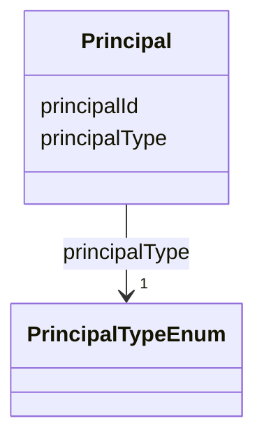

---
search:
  boost: 10.0
---

# Class: Principal 


_A Synapse user or team being granted access via an ACL. Mirrors ACL_RESOURCE_ACCESS.GROUP_ID (the id of the user or team being granted access) with an explicit type discriminator, since a bare GROUP_ID doesn't distinguish the two on its own._


<div data-search-exclude markdown="1">


URI: [governanceduo:class/Principal](https://w3id.org/sage-bionetworks/governance-duo/class/Principal)





<!-- no inheritance hierarchy -->

## Slots

| Name | Cardinality and Range | Description | Inheritance |
| ---  | --- | --- | --- |
| [principalId](../slots/principalId.md) | 1 <br/> [Integer](../types/Integer.md) | The Synapse numeric id of the user or team (ACL_RESOURCE_ACCESS | direct |
| [principalType](../slots/principalType.md) | 1 <br/> [PrincipalTypeEnum](../enums/PrincipalTypeEnum.md) |  | direct |


## Usages

| used by | used in | type | used |
| ---  | --- | --- | --- |
| [AccessGrant](../classes/AccessGrant.md) | [principal](../slots/principal.md) | range | [Principal](../classes/Principal.md) |


## Identifier and Mapping Information


### Schema Source


* from schema: https://w3id.org/sage-bionetworks/governance-duo/governance_duo


## Mappings

| Mapping Type | Mapped Value |
| ---  | ---  |
| self | governanceduo:Principal |
| native | governanceduo:Principal |
| close | prov:Agent |


## Examples
### Example: Principal-001-team-x

```yaml
principalId: 9000001
principalType: Team

```
### Example: Principal-002-user

```yaml
principalId: 2000001
principalType: User

```


## LinkML Source

<!-- TODO: investigate https://stackoverflow.com/questions/37606292/how-to-create-tabbed-code-blocks-in-mkdocs-or-sphinx -->

### Direct

<details>
```yaml
name: Principal
description: A Synapse user or team being granted access via an ACL. Mirrors ACL_RESOURCE_ACCESS.GROUP_ID
  (the id of the user or team being granted access) with an explicit type discriminator,
  since a bare GROUP_ID doesn't distinguish the two on its own.
from_schema: https://w3id.org/sage-bionetworks/governance-duo/governance_duo
close_mappings:
- prov:Agent
slots:
- principalId
- principalType

```
</details>

### Induced

<details>
```yaml
name: Principal
description: A Synapse user or team being granted access via an ACL. Mirrors ACL_RESOURCE_ACCESS.GROUP_ID
  (the id of the user or team being granted access) with an explicit type discriminator,
  since a bare GROUP_ID doesn't distinguish the two on its own.
from_schema: https://w3id.org/sage-bionetworks/governance-duo/governance_duo
close_mappings:
- prov:Agent
attributes:
  principalId:
    name: principalId
    description: The Synapse numeric id of the user or team (ACL_RESOURCE_ACCESS.GROUP_ID).
    from_schema: https://w3id.org/sage-bionetworks/governance-duo/governance_duo
    rank: 1000
    identifier: true
    owner: Principal
    domain_of:
    - Principal
    range: integer
    required: true
  principalType:
    name: principalType
    from_schema: https://w3id.org/sage-bionetworks/governance-duo/governance_duo
    rank: 1000
    owner: Principal
    domain_of:
    - Principal
    range: PrincipalTypeEnum
    required: true

```
</details></div>