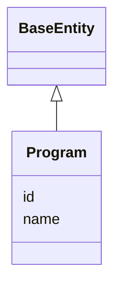

---
search:
  boost: 10.0
---

# Class: Program 


_A multi-site research consortium (e.g. AD Knowledge Portal, NF-OSI). **Honest grounding note**: no real Synapse or repo data source exists for Program-level grouping -- ships as structural capability with one clearly-illustrative example instance, the same treatment thomasyu888's own PR #54 comment gave its illustrative ex:program-adkp/ex:site-jhu data (the whole PR is explicitly a concept/PoC). Do not conflate this with the existing, real governanceduo:Study class, which models a single research study one level more granular than a Program -- see IRBRequirement's studyId description. `is_a: BaseEntity` for a synthetic dotted id, same reasoning as AccessRequirementTemplate above. See plans/governance_graph_open_questions.md Section C.2._


<div data-search-exclude markdown="1">


URI: [sagegov:Program](https://sagebionetworks.org/governance/Program)





## Inheritance
* [BaseEntity](../classes/BaseEntity.md)
    * **Program**


## Class Properties

| Property | Value |
| --- | --- |
| Class URI | [sagegov:Program](https://sagebionetworks.org/governance/Program) |


## Slots

| Name | Cardinality and Range | Description | Inheritance |
| ---  | --- | --- | --- |
| [name](../slots/name.md) | 0..1 <br/> [String](../types/String.md) | A Synapse-native display name | direct |
| [id](../slots/id.md) | 1 <br/> [String](../types/String.md) | A synthetic identifier for this program | [BaseEntity](../classes/BaseEntity.md) |


## Usages

| used by | used in | type | used |
| ---  | --- | --- | --- |
| [Site](../classes/Site.md) | [participatesIn](../slots/participatesIn.md) | range | [Program](../classes/Program.md) |
| [IRBRequirement](../classes/IRBRequirement.md) | [scopedToProgram](../slots/scopedToProgram.md) | range | [Program](../classes/Program.md) |


## Identifier and Mapping Information


### Schema Source


* from schema: https://w3id.org/sage-bionetworks/governance-duo/governance_duo


## Mappings

| Mapping Type | Mapped Value |
| ---  | ---  |
| self | sagegov:Program |
| native | governanceduo:Program |


## LinkML Source

<!-- TODO: investigate https://stackoverflow.com/questions/37606292/how-to-create-tabbed-code-blocks-in-mkdocs-or-sphinx -->

### Direct

<details>
```yaml
name: Program
description: 'A multi-site research consortium (e.g. AD Knowledge Portal, NF-OSI).
  **Honest grounding note**: no real Synapse or repo data source exists for Program-level
  grouping -- ships as structural capability with one clearly-illustrative example
  instance, the same treatment thomasyu888''s own PR #54 comment gave its illustrative
  ex:program-adkp/ex:site-jhu data (the whole PR is explicitly a concept/PoC). Do
  not conflate this with the existing, real governanceduo:Study class, which models
  a single research study one level more granular than a Program -- see IRBRequirement''s
  studyId description. `is_a: BaseEntity` for a synthetic dotted id, same reasoning
  as AccessRequirementTemplate above. See plans/governance_graph_open_questions.md
  Section C.2.'
from_schema: https://w3id.org/sage-bionetworks/governance-duo/governance_duo
is_a: BaseEntity
slots:
- name
slot_usage:
  id:
    name: id
    description: A synthetic identifier for this program.
    examples:
    - value: program.adkp
    pattern: ^program\.[A-Za-z0-9_-]+$
  name:
    name: name
    slot_uri: sagegov:name
class_uri: sagegov:Program

```
</details>

### Induced

<details>
```yaml
name: Program
description: 'A multi-site research consortium (e.g. AD Knowledge Portal, NF-OSI).
  **Honest grounding note**: no real Synapse or repo data source exists for Program-level
  grouping -- ships as structural capability with one clearly-illustrative example
  instance, the same treatment thomasyu888''s own PR #54 comment gave its illustrative
  ex:program-adkp/ex:site-jhu data (the whole PR is explicitly a concept/PoC). Do
  not conflate this with the existing, real governanceduo:Study class, which models
  a single research study one level more granular than a Program -- see IRBRequirement''s
  studyId description. `is_a: BaseEntity` for a synthetic dotted id, same reasoning
  as AccessRequirementTemplate above. See plans/governance_graph_open_questions.md
  Section C.2.'
from_schema: https://w3id.org/sage-bionetworks/governance-duo/governance_duo
is_a: BaseEntity
slot_usage:
  id:
    name: id
    description: A synthetic identifier for this program.
    examples:
    - value: program.adkp
    pattern: ^program\.[A-Za-z0-9_-]+$
  name:
    name: name
    slot_uri: sagegov:name
attributes:
  name:
    name: name
    description: A Synapse-native display name. Shared by SynapseAccessRequirementMixin
      (ACCESS_REQUIREMENT.NAME) and, via the transitive import chain governance_graph.yaml
      -> access_requirement.yaml -> mixins.yaml, SynapseEntity (NODE.NAME) in governance_graph.yaml
      — defined once here rather than in governance_graph.yaml itself, since mixins.yaml
      cannot import governance_graph.yaml back without creating a cycle (governance_graph.yaml
      already depends on mixins.yaml through access_requirement.yaml).
    from_schema: https://w3id.org/sage-bionetworks/governance-duo/governance_duo
    rank: 1000
    slot_uri: sagegov:name
    owner: Program
    domain_of:
    - SynapseAccessRequirementMixin
    - SynapseEntity
    - Program
    range: string
  id:
    name: id
    description: A synthetic identifier for this program.
    examples:
    - value: program.adkp
    from_schema: https://w3id.org/sage-bionetworks/governance-duo/governance_duo
    rank: 1000
    slot_uri: dcterms:identifier
    identifier: true
    owner: Program
    domain_of:
    - BaseEntity
    range: string
    required: true
    pattern: ^program\.[A-Za-z0-9_-]+$
class_uri: sagegov:Program

```
</details></div>