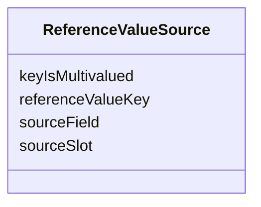

---
search:
  boost: 10.0
---

# Class: ReferenceValueSource 


_One (referenceValueKey -> governanceDUO slot) mapping. A single PolicyCardBinding can need more than one of these — e.g. time-limit-on-use needs both requiredDocumentID and notAfter, sourced from two different slots — so this is its own inlined list on PolicyCardBinding rather than one scalar "sourceSlot" field (an earlier version of this schema had exactly that limitation; it could not represent a binding needing 2+ keys from 2+ slots)._


<div data-search-exclude markdown="1">


URI: [governanceduo:class/ReferenceValueSource](https://w3id.org/sage-bionetworks/governance-duo/class/ReferenceValueSource)





<!-- no inheritance hierarchy -->

## Slots

| Name | Cardinality and Range | Description | Inheritance |
| ---  | --- | --- | --- |
| [referenceValueKey](../slots/referenceValueKey.md) | 1 <br/> [String](../types/String.md) | One of the containing binding's referenceValueKeys, e | direct |
| [sourceSlot](../slots/sourceSlot.md) | 1 <br/> [String](../types/String.md) | The name of the governanceDUO slot (on GovernanceMixin, Study, or the PolicyF... | direct |
| [sourceField](../slots/sourceField.md) | 0..1 <br/> [String](../types/String.md) | When sourceSlot names an inlined class (e | direct |
| [keyIsMultivalued](../slots/keyIsMultivalued.md) | 1 <br/> [Boolean](../types/Boolean.md) | True if this referenceValueKey's own policy_data_schema | direct |


## Usages

| used by | used in | type | used |
| ---  | --- | --- | --- |
| [PolicyCardBinding](../classes/PolicyCardBinding.md) | [referenceValueSources](../slots/referenceValueSources.md) | range | [ReferenceValueSource](../classes/ReferenceValueSource.md) |


## Identifier and Mapping Information


### Schema Source


* from schema: https://w3id.org/sage-bionetworks/governance-duo/governance_duo


## Mappings

| Mapping Type | Mapped Value |
| ---  | ---  |
| self | governanceduo:ReferenceValueSource |
| native | governanceduo:ReferenceValueSource |


## LinkML Source

<!-- TODO: investigate https://stackoverflow.com/questions/37606292/how-to-create-tabbed-code-blocks-in-mkdocs-or-sphinx -->

### Direct

<details>
```yaml
name: ReferenceValueSource
description: One (referenceValueKey -> governanceDUO slot) mapping. A single PolicyCardBinding
  can need more than one of these — e.g. time-limit-on-use needs both requiredDocumentID
  and notAfter, sourced from two different slots — so this is its own inlined list
  on PolicyCardBinding rather than one scalar "sourceSlot" field (an earlier version
  of this schema had exactly that limitation; it could not represent a binding needing
  2+ keys from 2+ slots).
from_schema: https://w3id.org/sage-bionetworks/governance-duo/governance_duo
slots:
- referenceValueKey
- sourceSlot
- sourceField
- keyIsMultivalued

```
</details>

### Induced

<details>
```yaml
name: ReferenceValueSource
description: One (referenceValueKey -> governanceDUO slot) mapping. A single PolicyCardBinding
  can need more than one of these — e.g. time-limit-on-use needs both requiredDocumentID
  and notAfter, sourced from two different slots — so this is its own inlined list
  on PolicyCardBinding rather than one scalar "sourceSlot" field (an earlier version
  of this schema had exactly that limitation; it could not represent a binding needing
  2+ keys from 2+ slots).
from_schema: https://w3id.org/sage-bionetworks/governance-duo/governance_duo
attributes:
  referenceValueKey:
    name: referenceValueKey
    description: One of the containing binding's referenceValueKeys, e.g. "allowedCountries".
    from_schema: https://w3id.org/sage-bionetworks/governance-duo/governance_duo
    rank: 1000
    owner: ReferenceValueSource
    domain_of:
    - ReferenceValueSource
    range: string
    required: true
  sourceSlot:
    name: sourceSlot
    description: The name of the governanceDUO slot (on GovernanceMixin, Study, or
      the PolicyFabricMixin) that collects the value for the paired referenceValueKey.
    from_schema: https://w3id.org/sage-bionetworks/governance-duo/governance_duo
    rank: 1000
    owner: ReferenceValueSource
    domain_of:
    - ReferenceValueSource
    range: string
    required: true
  sourceField:
    name: sourceField
    description: 'When sourceSlot names an inlined class (e.g. PolicyFabricMixin.assetBindings,
      range AssetBinding), the sub-field of each element to extract — e.g. sourceSlot:
      assetBindings, sourceField: assetDid pulls AssetBinding.assetDid out of each
      entry. Unset when sourceSlot is a flat scalar/list slot.'
    from_schema: https://w3id.org/sage-bionetworks/governance-duo/governance_duo
    rank: 1000
    owner: ReferenceValueSource
    domain_of:
    - ReferenceValueSource
    range: string
  keyIsMultivalued:
    name: keyIsMultivalued
    description: True if this referenceValueKey's own policy_data_schema.json documents
      it as a list (e.g. "list of strings"); False if it's a single scalar value (e.g.
      requiredDocumentID, notAfter, datasetID — each documented as "DID of ..."/an
      ISO-8601 datetime, not a list). This is a property of the Policy Fabric key
      itself, independent of whether its governanceDUO sourceSlot happens to be multivalued
      — e.g. datasetID is scalar even though it is sourced from the multivalued assetBindings
      slot (build_policy_fabric.py takes assetBindings[0].assetDid).
    from_schema: https://w3id.org/sage-bionetworks/governance-duo/governance_duo
    rank: 1000
    ifabsent: 'true'
    owner: ReferenceValueSource
    domain_of:
    - ReferenceValueSource
    range: boolean
    required: true

```
</details></div>