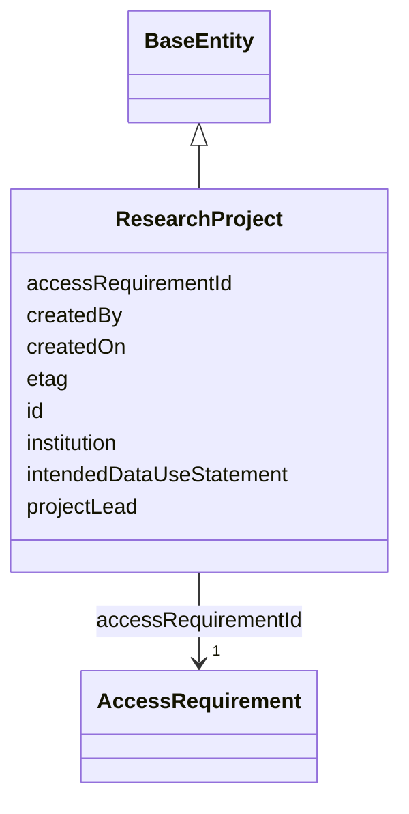

---
search:
  boost: 10.0
---

# Class: ResearchProject 


_Documents the research context/justification behind a DataAccessRequest (and, by extension, a DataAccessSubmission). Mirrors Synapse's real ResearchProject REST object (org.sagebionetworks.repo.model.dataaccess.ResearchProject), verified against rest-docs.synapse.org and the OpenAPI spec. Replaces the bare researchProjectId FK integer literal DataAccessSubmission previously carried with a real node + edge. See plans/governance_graph_open_questions.md Section C._


<div data-search-exclude markdown="1">


URI: [sagegov:ResearchProject](https://sagebionetworks.org/governance/ResearchProject)





## Inheritance
* [BaseEntity](../classes/BaseEntity.md)
    * **ResearchProject**


## Class Properties

| Property | Value |
| --- | --- |
| Class URI | [sagegov:ResearchProject](https://sagebionetworks.org/governance/ResearchProject) |


## Slots

| Name | Cardinality and Range | Description | Inheritance |
| ---  | --- | --- | --- |
| [accessRequirementId](../slots/accessRequirementId.md) | 1 <br/> [AccessRequirement](../classes/AccessRequirement.md) | The AccessRequirement this submission is an application against (DATA_ACCESS_... | direct |
| [institution](../slots/institution.md) | 0..1 <br/> [String](../types/String.md) | Institution/company name, verbatim from Synapse (ResearchProject | direct |
| [projectLead](../slots/projectLead.md) | 0..1 <br/> [String](../types/String.md) | The person leading this research project (ResearchProject | direct |
| [intendedDataUseStatement](../slots/intendedDataUseStatement.md) | 0..1 <br/> [String](../types/String.md) | A few short paragraphs explaining how the controlled data will be used (Resea... | direct |
| [createdBy](../slots/createdBy.md) | 0..1 <br/> [Integer](../types/Integer.md) | Synapse numeric user id of the record's creator | direct |
| [createdOn](../slots/createdOn.md) | 0..1 <br/> [Integer](../types/Integer.md) | When the record was created (epoch milliseconds in the source Synapse tables) | direct |
| [etag](../slots/etag.md) | 0..1 <br/> [String](../types/String.md) | Entity tag for optimistic concurrency control (a 36-character UUID) | direct |
| [id](../slots/id.md) | 1 <br/> [String](../types/String.md) | A unique identifier for this research project (schematic-schema-style dotted ... | [BaseEntity](../classes/BaseEntity.md) |


## Usages

| used by | used in | type | used |
| ---  | --- | --- | --- |
| [DataAccessSubmission](../classes/DataAccessSubmission.md) | [researchProjectId](../slots/researchProjectId.md) | range | [ResearchProject](../classes/ResearchProject.md) |


## Identifier and Mapping Information


### Schema Source


* from schema: https://w3id.org/sage-bionetworks/governance-duo/governance_duo


## Mappings

| Mapping Type | Mapped Value |
| ---  | ---  |
| self | sagegov:ResearchProject |
| native | governanceduo:ResearchProject |


## LinkML Source

<!-- TODO: investigate https://stackoverflow.com/questions/37606292/how-to-create-tabbed-code-blocks-in-mkdocs-or-sphinx -->

### Direct

<details>
```yaml
name: ResearchProject
description: Documents the research context/justification behind a DataAccessRequest
  (and, by extension, a DataAccessSubmission). Mirrors Synapse's real ResearchProject
  REST object (org.sagebionetworks.repo.model.dataaccess.ResearchProject), verified
  against rest-docs.synapse.org and the OpenAPI spec. Replaces the bare researchProjectId
  FK integer literal DataAccessSubmission previously carried with a real node + edge.
  See plans/governance_graph_open_questions.md Section C.
from_schema: https://w3id.org/sage-bionetworks/governance-duo/governance_duo
is_a: BaseEntity
slots:
- accessRequirementId
- institution
- projectLead
- intendedDataUseStatement
- createdBy
- createdOn
- etag
slot_usage:
  id:
    name: id
    description: A unique identifier for this research project (schematic-schema-style
      dotted string wrapping Synapse's own string ResearchProject.id, same id convention
      as DataAccessSubmission).
    examples:
    - value: research_project.8001
    pattern: ^research_project\.\d+$
  createdBy:
    name: createdBy
    comments:
    - ResearchProject.createdBy is the "who authored this record" concept, emitted
      as an IRI reference to a sagegov:Principal node -- distinct from DataAccessSubmission's
      sagegov:submittedBy (the workflow-submission-action concept) and SynapseEntity's
      sagegov:createdByUserId (a raw literal).
    slot_uri: sagegov:createdBy
  createdOn:
    name: createdOn
    slot_uri: sagegov:createdOn
  etag:
    name: etag
    slot_uri: sagegov:etag
class_uri: sagegov:ResearchProject

```
</details>

### Induced

<details>
```yaml
name: ResearchProject
description: Documents the research context/justification behind a DataAccessRequest
  (and, by extension, a DataAccessSubmission). Mirrors Synapse's real ResearchProject
  REST object (org.sagebionetworks.repo.model.dataaccess.ResearchProject), verified
  against rest-docs.synapse.org and the OpenAPI spec. Replaces the bare researchProjectId
  FK integer literal DataAccessSubmission previously carried with a real node + edge.
  See plans/governance_graph_open_questions.md Section C.
from_schema: https://w3id.org/sage-bionetworks/governance-duo/governance_duo
is_a: BaseEntity
slot_usage:
  id:
    name: id
    description: A unique identifier for this research project (schematic-schema-style
      dotted string wrapping Synapse's own string ResearchProject.id, same id convention
      as DataAccessSubmission).
    examples:
    - value: research_project.8001
    pattern: ^research_project\.\d+$
  createdBy:
    name: createdBy
    comments:
    - ResearchProject.createdBy is the "who authored this record" concept, emitted
      as an IRI reference to a sagegov:Principal node -- distinct from DataAccessSubmission's
      sagegov:submittedBy (the workflow-submission-action concept) and SynapseEntity's
      sagegov:createdByUserId (a raw literal).
    slot_uri: sagegov:createdBy
  createdOn:
    name: createdOn
    slot_uri: sagegov:createdOn
  etag:
    name: etag
    slot_uri: sagegov:etag
attributes:
  accessRequirementId:
    name: accessRequirementId
    description: The AccessRequirement this submission is an application against (DATA_ACCESS_SUBMISSION.ACCESS_REQUIREMENT_ID).
    comments:
    - slot_uri intentionally reuses sagegov:accessRequirement, the same predicate
      AccessRequirementAssociation.accessRequirement uses, even though this is a differently-named
      LinkML slot -- so "what AccessRequirement does this concern?" is a uniform gov:accessRequirement
      query regardless of subject class. See scripts/build_governance_graph.py.
    from_schema: https://w3id.org/sage-bionetworks/governance-duo/governance_duo
    close_mappings:
    - dcterms:requires
    rank: 1000
    slot_uri: sagegov:accessRequirement
    owner: ResearchProject
    domain_of:
    - DataAccessSubmission
    - ResearchProject
    range: AccessRequirement
    required: true
  institution:
    name: institution
    description: Institution/company name, verbatim from Synapse (ResearchProject.institution
      / DataAccessRequest.institution -- both real fields hold the same free-text
      shape as UserProfile.company above). On ResearchProject/DataAccessRequest, consumed
      by site_node_for() to derive a gov:affiliatedWith edge, not independently re-emitted;
      on Site itself, this is the node's own display name and IS emitted directly.
    from_schema: https://w3id.org/sage-bionetworks/governance-duo/governance_duo
    rank: 1000
    slot_uri: sagegov:institution
    owner: ResearchProject
    domain_of:
    - ResearchProject
    - Site
    range: string
  projectLead:
    name: projectLead
    description: The person leading this research project (ResearchProject.projectLead).
    from_schema: https://w3id.org/sage-bionetworks/governance-duo/governance_duo
    rank: 1000
    slot_uri: sagegov:projectLead
    owner: ResearchProject
    domain_of:
    - ResearchProject
    range: string
  intendedDataUseStatement:
    name: intendedDataUseStatement
    description: A few short paragraphs explaining how the controlled data will be
      used (ResearchProject.intendedDataUseStatement).
    from_schema: https://w3id.org/sage-bionetworks/governance-duo/governance_duo
    rank: 1000
    slot_uri: sagegov:intendedDataUseStatement
    owner: ResearchProject
    domain_of:
    - ResearchProject
    range: string
  createdBy:
    name: createdBy
    description: Synapse numeric user id of the record's creator. Shared the same
      way as `name` above. Distinct from ContributionMixin's contributorName, which
      is this repo's own free-text curator-provenance field, not Synapse's own numeric
      CREATED_BY column — both coexist on AccessRequirement without collision.
    comments:
    - ResearchProject.createdBy is the "who authored this record" concept, emitted
      as an IRI reference to a sagegov:Principal node -- distinct from DataAccessSubmission's
      sagegov:submittedBy (the workflow-submission-action concept) and SynapseEntity's
      sagegov:createdByUserId (a raw literal).
    from_schema: https://w3id.org/sage-bionetworks/governance-duo/governance_duo
    exact_mappings:
    - dcterms:creator
    rank: 1000
    slot_uri: sagegov:createdBy
    owner: ResearchProject
    domain_of:
    - SynapseAccessRequirementMixin
    - SynapseEntity
    - ResearchProject
    range: integer
  createdOn:
    name: createdOn
    description: When the record was created (epoch milliseconds in the source Synapse
      tables). Shared the same way as `name` above. Distinct from ContributionMixin's
      contributionDate for the same reason as createdBy above.
    from_schema: https://w3id.org/sage-bionetworks/governance-duo/governance_duo
    exact_mappings:
    - dcterms:created
    rank: 1000
    slot_uri: sagegov:createdOn
    owner: ResearchProject
    domain_of:
    - SynapseAccessRequirementMixin
    - SynapseEntity
    - AccessGrant
    - AccessApproval
    - ResearchProject
    range: integer
  etag:
    name: etag
    description: Entity tag for optimistic concurrency control (a 36-character UUID).
      Shared the same way as `name` above, by SynapseAccessRequirementMixin (ACCESS_REQUIREMENT.ETAG)
      and SynapseEntity/DataAccessSubmission (NODE.ETAG/DATA_ACCESS_SUBMISSION.ETAG)
      in governance_graph.yaml.
    from_schema: https://w3id.org/sage-bionetworks/governance-duo/governance_duo
    rank: 1000
    slot_uri: sagegov:etag
    owner: ResearchProject
    domain_of:
    - SynapseAccessRequirementMixin
    - SynapseEntity
    - DataAccessSubmission
    - AccessApproval
    - ResearchProject
    range: string
  id:
    name: id
    description: A unique identifier for this research project (schematic-schema-style
      dotted string wrapping Synapse's own string ResearchProject.id, same id convention
      as DataAccessSubmission).
    examples:
    - value: research_project.8001
    from_schema: https://w3id.org/sage-bionetworks/governance-duo/governance_duo
    rank: 1000
    slot_uri: dcterms:identifier
    identifier: true
    owner: ResearchProject
    domain_of:
    - BaseEntity
    range: string
    required: true
    pattern: ^research_project\.\d+$
class_uri: sagegov:ResearchProject

```
</details></div>