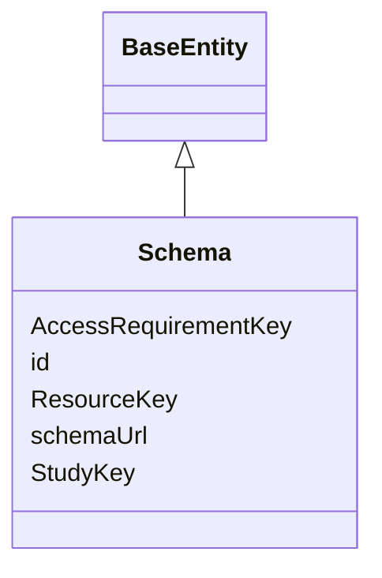

---
search:
  boost: 10.0
---

# Class: Schema 


_Information that is relevant to resource access conditions._


<div data-search-exclude markdown="1">


URI: [governanceduo:class/Schema](https://w3id.org/sage-bionetworks/governance-duo/class/Schema)





## Inheritance
* [BaseEntity](../classes/BaseEntity.md)
    * **Schema**


## Class Properties

| Property | Value |
| --- | --- |
| Tree Root | Yes |


## Slots

| Name | Cardinality and Range | Description | Inheritance |
| ---  | --- | --- | --- |
| [ResourceKey](../slots/ResourceKey.md) | * <br/> [String](../types/String.md) | The identifier(s) for the Resource(s) associated with this schema | direct |
| [AccessRequirementKey](../slots/AccessRequirementKey.md) | * <br/> [String](../types/String.md) | The Access Requirement id(s) associated with this object | direct |
| [StudyKey](../slots/StudyKey.md) | * <br/> [String](../types/String.md) | The Study id(s) associated with this object | direct |
| [schemaUrl](../slots/schemaUrl.md) | 0..1 <br/> [String](../types/String.md) | The registered URL associated with the access requirement JSON schema | direct |
| [id](../slots/id.md) | 1 <br/> [String](../types/String.md) | A unique identifier for the schema (schematic source attribute: Schema_id) | [BaseEntity](../classes/BaseEntity.md) |


## Identifier and Mapping Information


### Schema Source


* from schema: https://w3id.org/sage-bionetworks/governance-duo/governance_duo


## Mappings

| Mapping Type | Mapped Value |
| ---  | ---  |
| self | governanceduo:Schema |
| native | governanceduo:Schema |


## LinkML Source

<!-- TODO: investigate https://stackoverflow.com/questions/37606292/how-to-create-tabbed-code-blocks-in-mkdocs-or-sphinx -->

### Direct

<details>
```yaml
name: Schema
description: Information that is relevant to resource access conditions.
from_schema: https://w3id.org/sage-bionetworks/governance-duo/governance_duo
is_a: BaseEntity
slots:
- ResourceKey
- AccessRequirementKey
- StudyKey
- schemaUrl
slot_usage:
  id:
    name: id
    description: 'A unique identifier for the schema (schematic source attribute:
      Schema_id).'
    pattern: ^schema\.[A-Za-z0-9_-]+$
tree_root: true

```
</details>

### Induced

<details>
```yaml
name: Schema
description: Information that is relevant to resource access conditions.
from_schema: https://w3id.org/sage-bionetworks/governance-duo/governance_duo
is_a: BaseEntity
slot_usage:
  id:
    name: id
    description: 'A unique identifier for the schema (schematic source attribute:
      Schema_id).'
    pattern: ^schema\.[A-Za-z0-9_-]+$
attributes:
  ResourceKey:
    name: ResourceKey
    annotations:
      foreign_key:
        tag: foreign_key
        value: true
    description: The identifier(s) for the Resource(s) associated with this schema.
      Provide multiple values as a comma-separated list.
    comments:
    - 'Untyped string, not range: Resource -- see props.yaml''s AccessRequirementKey
      comment for why (this file cannot import resource.yaml without risking a cycle).
      The pattern below (matching Resource.id''s own slot_usage pattern in resource.yaml)
      is the cycle-free substitute. See plans/identifier_update.md.'
    from_schema: https://w3id.org/sage-bionetworks/governance-duo/governance_duo
    rank: 1000
    owner: Schema
    domain_of:
    - Schema
    range: string
    multivalued: true
    pattern: ^resource\.[A-Za-z0-9]+$
  AccessRequirementKey:
    name: AccessRequirementKey
    annotations:
      foreign_key:
        tag: foreign_key
        value: true
    description: The Access Requirement id(s) associated with this object. Provide
      multiple values as a comma-separated list.
    comments:
    - 'Deliberately an untyped string, not range: AccessRequirement: giving it a real
      typed range would require importing access_requirement.yaml into this file,
      but this file (like mixins.yaml) is a leaf that imports only linkml:types specifically
      so it can never import an entity file and risk an import cycle (see the schema-level
      description above). governance_graph.yaml can afford real typed ranges for its
      own cross-references (e.g. accessRequirement: range: AccessRequirement) because
      it is a single, later-loaded file that already imports everything it references
      -- this file cannot follow that pattern without breaking its own leaf-file guarantee.
      Same rationale applies to StudyKey below and to ResourceKey (schema.yaml)/SchemaKey
      (resource.yaml). The pattern above (matching AccessRequirement.id''s own slot_usage
      pattern in access_requirement.yaml) is the cycle-free substitute: it catches
      a malformed id without needing a typed range at all -- the same approach already
      used for entityIdList in that same file. See plans/identifier_update.md.'
    from_schema: https://w3id.org/sage-bionetworks/governance-duo/governance_duo
    rank: 1000
    owner: Schema
    domain_of:
    - Resource
    - Schema
    - Study
    range: string
    multivalued: true
    pattern: ^access_requirement\.\d+$
  StudyKey:
    name: StudyKey
    annotations:
      foreign_key:
        tag: foreign_key
        value: true
    description: The Study id(s) associated with this object. Provide multiple values
      as a comma-separated list.
    from_schema: https://w3id.org/sage-bionetworks/governance-duo/governance_duo
    rank: 1000
    owner: Schema
    domain_of:
    - AccessRequirement
    - Resource
    - Schema
    range: string
    multivalued: true
    pattern: ^study\.[A-Za-z0-9_-]+$
  schemaUrl:
    name: schemaUrl
    description: The registered URL associated with the access requirement JSON schema.
    comments:
    - dcterms:conformsTo, "An established standard to which the described resource
      conforms" — see resource.yaml's registeredSchemaUrl for the same exact mapping
      and rationale.
    from_schema: https://w3id.org/sage-bionetworks/governance-duo/governance_duo
    exact_mappings:
    - dcterms:conformsTo
    rank: 1000
    owner: Schema
    domain_of:
    - Schema
    range: string
  id:
    name: id
    description: 'A unique identifier for the schema (schematic source attribute:
      Schema_id).'
    from_schema: https://w3id.org/sage-bionetworks/governance-duo/governance_duo
    rank: 1000
    slot_uri: dcterms:identifier
    identifier: true
    owner: Schema
    domain_of:
    - BaseEntity
    range: string
    required: true
    pattern: ^schema\.[A-Za-z0-9_-]+$
tree_root: true

```
</details></div>