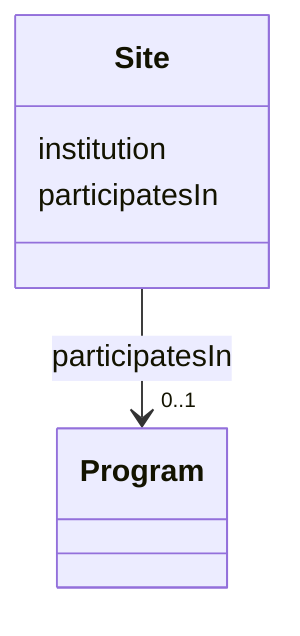

---
search:
  boost: 10.0
---

# Class: Site 


_An institution real Synapse data associates with a ResearchProject, DataAccessRequest, or User-type Principal. Synapse never gives a stable Site id, only a free-text institution/company name string (ResearchProject.institution / DataAccessRequest.institution / UserProfile.company -- all three real fields hold the same shape), so gov:Site nodes are minted deterministically by slugifying that name (see site_node_for() in build_governance_graph.py) -- the same "derive a stable node from real but non-id-shaped data" pattern add_principal() already uses for bare integer ids. Not `is_a: BaseEntity` for the same reason. gov:affiliatedWith (from ResearchProject/DataAccessRequest/Principal to this class) is a derived convenience triple with no governance_graph.yaml slot backing it, same as gov:hasACL/gov:hasAccessRequirement/gov:hasCondition -- it's never present in any source data, only computed by the script. See plans/governance_graph_open_questions.md Section C._


<div data-search-exclude markdown="1">


URI: [sagegov:Site](https://sagebionetworks.org/governance/Site)





<!-- no inheritance hierarchy -->

## Class Properties

| Property | Value |
| --- | --- |
| Class URI | [sagegov:Site](https://sagebionetworks.org/governance/Site) |


## Slots

| Name | Cardinality and Range | Description | Inheritance |
| ---  | --- | --- | --- |
| [institution](../slots/institution.md) | 0..1 <br/> [String](../types/String.md) | Institution/company name, verbatim from Synapse (ResearchProject | direct |
| [participatesIn](../slots/participatesIn.md) | 0..1 <br/> [Program](../classes/Program.md) | The Program a Site participates in | direct |


## Usages

| used by | used in | type | used |
| ---  | --- | --- | --- |
| [IRBRequirement](../classes/IRBRequirement.md) | [scopedToSite](../slots/scopedToSite.md) | range | [Site](../classes/Site.md) |


## Identifier and Mapping Information


### Schema Source


* from schema: https://w3id.org/sage-bionetworks/governance-duo/governance_duo


## Mappings

| Mapping Type | Mapped Value |
| ---  | ---  |
| self | sagegov:Site |
| native | governanceduo:Site |


## LinkML Source

<!-- TODO: investigate https://stackoverflow.com/questions/37606292/how-to-create-tabbed-code-blocks-in-mkdocs-or-sphinx -->

### Direct

<details>
```yaml
name: Site
description: 'An institution real Synapse data associates with a ResearchProject,
  DataAccessRequest, or User-type Principal. Synapse never gives a stable Site id,
  only a free-text institution/company name string (ResearchProject.institution /
  DataAccessRequest.institution / UserProfile.company -- all three real fields hold
  the same shape), so gov:Site nodes are minted deterministically by slugifying that
  name (see site_node_for() in build_governance_graph.py) -- the same "derive a stable
  node from real but non-id-shaped data" pattern add_principal() already uses for
  bare integer ids. Not `is_a: BaseEntity` for the same reason. gov:affiliatedWith
  (from ResearchProject/DataAccessRequest/Principal to this class) is a derived convenience
  triple with no governance_graph.yaml slot backing it, same as gov:hasACL/gov:hasAccessRequirement/gov:hasCondition
  -- it''s never present in any source data, only computed by the script. See plans/governance_graph_open_questions.md
  Section C.'
from_schema: https://w3id.org/sage-bionetworks/governance-duo/governance_duo
slots:
- institution
- participatesIn
class_uri: sagegov:Site

```
</details>

### Induced

<details>
```yaml
name: Site
description: 'An institution real Synapse data associates with a ResearchProject,
  DataAccessRequest, or User-type Principal. Synapse never gives a stable Site id,
  only a free-text institution/company name string (ResearchProject.institution /
  DataAccessRequest.institution / UserProfile.company -- all three real fields hold
  the same shape), so gov:Site nodes are minted deterministically by slugifying that
  name (see site_node_for() in build_governance_graph.py) -- the same "derive a stable
  node from real but non-id-shaped data" pattern add_principal() already uses for
  bare integer ids. Not `is_a: BaseEntity` for the same reason. gov:affiliatedWith
  (from ResearchProject/DataAccessRequest/Principal to this class) is a derived convenience
  triple with no governance_graph.yaml slot backing it, same as gov:hasACL/gov:hasAccessRequirement/gov:hasCondition
  -- it''s never present in any source data, only computed by the script. See plans/governance_graph_open_questions.md
  Section C.'
from_schema: https://w3id.org/sage-bionetworks/governance-duo/governance_duo
attributes:
  institution:
    name: institution
    description: Institution/company name, verbatim from Synapse (ResearchProject.institution
      / DataAccessRequest.institution -- both real fields hold the same free-text
      shape as UserProfile.company above). On ResearchProject/DataAccessRequest, consumed
      by site_node_for() to derive a gov:affiliatedWith edge, not independently re-emitted;
      on Site itself, this is the node's own display name and IS emitted directly.
    from_schema: https://w3id.org/sage-bionetworks/governance-duo/governance_duo
    rank: 1000
    slot_uri: sagegov:institution
    owner: Site
    domain_of:
    - ResearchProject
    - Site
    - DataAccessRequest
    - IRBRequirement
    range: string
  participatesIn:
    name: participatesIn
    description: The Program a Site participates in. Illustrative-only -- see Program's
      own description.
    from_schema: https://w3id.org/sage-bionetworks/governance-duo/governance_duo
    rank: 1000
    slot_uri: sagegov:participatesIn
    owner: Site
    domain_of:
    - Site
    range: Program
class_uri: sagegov:Site

```
</details></div>