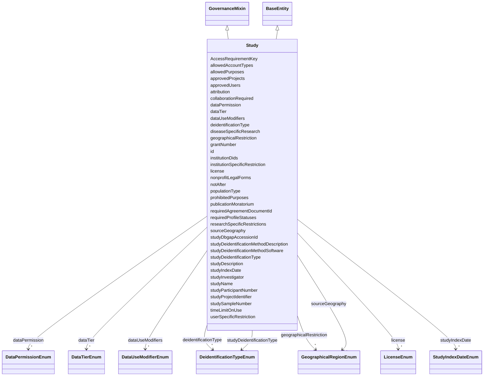

---
search:
  boost: 10.0
---

# Class: Study 


_Studies associated with a grant._


<div data-search-exclude markdown="1">


URI: [governanceduo:class/Study](https://w3id.org/sage-bionetworks/governance-duo/class/Study)





## Inheritance
* [BaseEntity](../classes/BaseEntity.md)
    * **Study** [ [GovernanceMixin](../classes/GovernanceMixin.md)]


## Class Properties

| Property | Value |
| --- | --- |
| Tree Root | Yes |


## Slots

| Name | Cardinality and Range | Description | Inheritance |
| ---  | --- | --- | --- |
| [AccessRequirementKey](../slots/AccessRequirementKey.md) | * <br/> [String](../types/String.md) | The Access Requirement id(s) associated with this object | direct |
| [grantNumber](../slots/grantNumber.md) | * <br/> [String](../types/String.md) | The identifier associated with the award funding this study | direct |
| [studyName](../slots/studyName.md) | 1 <br/> [String](../types/String.md) | Name of the study | direct |
| [studyDescription](../slots/studyDescription.md) | 1 <br/> [String](../types/String.md) | Description of the study, including the types of experimental assays, model s... | direct |
| [studyInvestigator](../slots/studyInvestigator.md) | 1 <br/> [String](../types/String.md) | Investigator(s) associated with the project | direct |
| [studyParticipantNumber](../slots/studyParticipantNumber.md) | 1 <br/> [Float](../types/Float.md) | The number of participant instances associated with systematic investigation ... | direct |
| [studySampleNumber](../slots/studySampleNumber.md) | 1 <br/> [Float](../types/Float.md) | The number of specimens associated with systematic investigation into a subje... | direct |
| [studyDeidentificationType](../slots/studyDeidentificationType.md) | * <br/> [DeidentificationTypeEnum](../enums/DeidentificationTypeEnum.md) | General description of the de-identification method | direct |
| [studyDeidentificationMethodDescription](../slots/studyDeidentificationMethodDescription.md) | 0..1 <br/> [String](../types/String.md) | Description of the process of removing potentially identifying data or data e... | direct |
| [studyDeidentificationMethodSoftware](../slots/studyDeidentificationMethodSoftware.md) | 0..1 <br/> [String](../types/String.md) | Software that was used to de-identify the data (if used) | direct |
| [studyDbgapAccessionId](../slots/studyDbgapAccessionId.md) | 0..1 <br/> [String](../types/String.md) | A stable unique alphanumeric identifier assigned to a study and any objects b... | direct |
| [studyIndexDate](../slots/studyIndexDate.md) | * <br/> [StudyIndexDateEnum](../enums/StudyIndexDateEnum.md) | The reference event associated with timepoints in this study | direct |
| [studyProjectIdentifier](../slots/studyProjectIdentifier.md) | * <br/> [String](../types/String.md) | The Synapse Project identifier (synID) with which this Study is related | direct |
| [dataUseModifiers](../slots/dataUseModifiers.md) | * <br/> [DataUseModifierEnum](../enums/DataUseModifierEnum.md) | A list of data use modifiers that apply to the access requirement | [GovernanceMixin](../classes/GovernanceMixin.md) |
| [collaborationRequired](../slots/collaborationRequired.md) | 0..1 <br/> [String](../types/String.md) | If collaboration is required for the access requirement, provide the PI email... | [GovernanceMixin](../classes/GovernanceMixin.md) |
| [diseaseSpecificResearch](../slots/diseaseSpecificResearch.md) | * <br/> [String](../types/String.md) | The type(s) of disease research allowed by this access requirement | [GovernanceMixin](../classes/GovernanceMixin.md) |
| [geographicalRestriction](../slots/geographicalRestriction.md) | * <br/> [GeographicalRegionEnum](../enums/GeographicalRegionEnum.md) | The specific geographic region(s) to which use is limited by the access requi... | [GovernanceMixin](../classes/GovernanceMixin.md) |
| [institutionSpecificRestriction](../slots/institutionSpecificRestriction.md) | * <br/> [String](../types/String.md) | Institutions with specific restrictions associated with the access requiremen... | [GovernanceMixin](../classes/GovernanceMixin.md) |
| [institutionDids](../slots/institutionDids.md) | * <br/> [String](../types/String.md) | Institutions with specific restrictions associated with the access requiremen... | [GovernanceMixin](../classes/GovernanceMixin.md) |
| [publicationMoratorium](../slots/publicationMoratorium.md) | 0..1 <br/> [String](../types/String.md) | End date of the publication moratorium associated with the access requirement | [GovernanceMixin](../classes/GovernanceMixin.md) |
| [researchSpecificRestrictions](../slots/researchSpecificRestrictions.md) | 0..1 <br/> [String](../types/String.md) | Research-specific restrictions associated with the access requirement | [GovernanceMixin](../classes/GovernanceMixin.md) |
| [timeLimitOnUse](../slots/timeLimitOnUse.md) | 0..1 <br/> [Float](../types/Float.md) | Time limit on the use of the data associated with the access requirement | [GovernanceMixin](../classes/GovernanceMixin.md) |
| [userSpecificRestriction](../slots/userSpecificRestriction.md) | 0..1 <br/> [String](../types/String.md) | The user-specific restrictions associated with the access requirement | [GovernanceMixin](../classes/GovernanceMixin.md) |
| [sourceGeography](../slots/sourceGeography.md) | * <br/> [GeographicalRegionEnum](../enums/GeographicalRegionEnum.md) | The geographical source of the data associated with the access requirement | [GovernanceMixin](../classes/GovernanceMixin.md) |
| [populationType](../slots/populationType.md) | 0..1 <br/> [String](../types/String.md) | The population studied in the research associated with the access requirement | [GovernanceMixin](../classes/GovernanceMixin.md) |
| [deidentificationType](../slots/deidentificationType.md) | * <br/> [DeidentificationTypeEnum](../enums/DeidentificationTypeEnum.md) | The type of de-identification applied to the data associated with the access ... | [GovernanceMixin](../classes/GovernanceMixin.md) |
| [dataPermission](../slots/dataPermission.md) | * <br/> [DataPermissionEnum](../enums/DataPermissionEnum.md) | The permissions associated with the data under the access requirement | [GovernanceMixin](../classes/GovernanceMixin.md) |
| [dataTier](../slots/dataTier.md) | * <br/> [DataTierEnum](../enums/DataTierEnum.md) | The tier of data access associated with the access requirement | [GovernanceMixin](../classes/GovernanceMixin.md) |
| [license](../slots/license.md) | * <br/> [LicenseEnum](../enums/LicenseEnum.md) | The license under which the data associated with the access requirement is sh... | [GovernanceMixin](../classes/GovernanceMixin.md) |
| [attribution](../slots/attribution.md) | 0..1 <br/> [String](../types/String.md) | The attribution statement for the data associated with the access requirement | [GovernanceMixin](../classes/GovernanceMixin.md) |
| [requiredAgreementDocumentId](../slots/requiredAgreementDocumentId.md) | 0..1 <br/> [String](../types/String.md) | DID of the terms/agreement document the requester must accept before this acc... | [GovernanceMixin](../classes/GovernanceMixin.md) |
| [notAfter](../slots/notAfter.md) | 0..1 <br/> [String](../types/String.md) | ISO-8601 datetime after which use is no longer permitted | [GovernanceMixin](../classes/GovernanceMixin.md) |
| [allowedPurposes](../slots/allowedPurposes.md) | * <br/> [String](../types/String.md) | Research purpose term(s) for which use is allowed | [GovernanceMixin](../classes/GovernanceMixin.md) |
| [prohibitedPurposes](../slots/prohibitedPurposes.md) | * <br/> [String](../types/String.md) | Research purpose term(s) for which use is explicitly disallowed | [GovernanceMixin](../classes/GovernanceMixin.md) |
| [nonprofitLegalForms](../slots/nonprofitLegalForms.md) | * <br/> [String](../types/String.md) | Legal entity form(s) qualifying as not-for-profit, coded per ISO 20275:2017 (... | [GovernanceMixin](../classes/GovernanceMixin.md) |
| [approvedProjects](../slots/approvedProjects.md) | * <br/> [String](../types/String.md) | DID(s) of project(s) approved to use the data under this access requirement | [GovernanceMixin](../classes/GovernanceMixin.md) |
| [approvedUsers](../slots/approvedUsers.md) | * <br/> [String](../types/String.md) | Identifier(s) of specifically approved users | [GovernanceMixin](../classes/GovernanceMixin.md) |
| [allowedAccountTypes](../slots/allowedAccountTypes.md) | * <br/> [String](../types/String.md) | Account type(s) permitted to access the data (checked against UserPlatformCre... | [GovernanceMixin](../classes/GovernanceMixin.md) |
| [requiredProfileStatuses](../slots/requiredProfileStatuses.md) | * <br/> [String](../types/String.md) | Profile status value(s) a requester's account must have (checked against User... | [GovernanceMixin](../classes/GovernanceMixin.md) |
| [id](../slots/id.md) | 1 <br/> [String](../types/String.md) | A unique primary key that enables record updates using schematic (schematic s... | [BaseEntity](../classes/BaseEntity.md) |


## Identifier and Mapping Information


### Schema Source


* from schema: https://w3id.org/sage-bionetworks/governance-duo/governance_duo


## Mappings

| Mapping Type | Mapped Value |
| ---  | ---  |
| self | governanceduo:Study |
| native | governanceduo:Study |


## Examples
### Example: Study-001

```yaml
id: study.mc2-jax-5xfad
grantNumber:
  - U54AG079754
studyName: MC2 Center Pilot Study
studyDescription: >-
  Pilot investigation into tumor microenvironment signaling in a genetically
  engineered mouse model cohort.
studyInvestigator: Jane Doe
studyParticipantNumber: 25
studySampleNumber: 40
studyDeidentificationType:
  - SafeHarbor
studyDbgapAccessionId: phs000123
dataUseModifiers:
  - DUOPlus1
sourceGeography:
  - US

```


## LinkML Source

<!-- TODO: investigate https://stackoverflow.com/questions/37606292/how-to-create-tabbed-code-blocks-in-mkdocs-or-sphinx -->

### Direct

<details>
```yaml
name: Study
description: Studies associated with a grant.
from_schema: https://w3id.org/sage-bionetworks/governance-duo/governance_duo
is_a: BaseEntity
mixins:
- GovernanceMixin
slots:
- AccessRequirementKey
- grantNumber
- studyName
- studyDescription
- studyInvestigator
- studyParticipantNumber
- studySampleNumber
- studyDeidentificationType
- studyDeidentificationMethodDescription
- studyDeidentificationMethodSoftware
- studyDbgapAccessionId
- studyIndexDate
- studyProjectIdentifier
slot_usage:
  id:
    name: id
    annotations:
      cde_id:
        tag: cde_id
        value: '12960571'
    description: 'A unique primary key that enables record updates using schematic
      (schematic source attribute: Study_id).'
    pattern: ^study\.[A-Za-z0-9_-]+$
tree_root: true

```
</details>

### Induced

<details>
```yaml
name: Study
description: Studies associated with a grant.
from_schema: https://w3id.org/sage-bionetworks/governance-duo/governance_duo
is_a: BaseEntity
mixins:
- GovernanceMixin
slot_usage:
  id:
    name: id
    annotations:
      cde_id:
        tag: cde_id
        value: '12960571'
    description: 'A unique primary key that enables record updates using schematic
      (schematic source attribute: Study_id).'
    pattern: ^study\.[A-Za-z0-9_-]+$
attributes:
  AccessRequirementKey:
    name: AccessRequirementKey
    annotations:
      foreign_key:
        tag: foreign_key
        value: true
    description: The Access Requirement id(s) associated with this object. Provide
      multiple values as a comma-separated list.
    from_schema: https://w3id.org/sage-bionetworks/governance-duo/governance_duo
    rank: 1000
    owner: Study
    domain_of:
    - Resource
    - Schema
    - Study
    range: string
    multivalued: true
  grantNumber:
    name: grantNumber
    description: The identifier associated with the award funding this study.
    comments:
    - EVORAO:grantNumber, "A formal reference or agreement number assigned by the
      funding body" — verified live and non-obsolete via the OLS4 API.
    from_schema: https://w3id.org/sage-bionetworks/governance-duo/governance_duo
    exact_mappings:
    - EVORAO:grantNumber
    rank: 1000
    owner: Study
    domain_of:
    - Study
    range: string
    multivalued: true
  studyName:
    name: studyName
    annotations:
      cde_id:
        tag: cde_id
        value: '11459810'
    description: Name of the study.
    from_schema: https://w3id.org/sage-bionetworks/governance-duo/governance_duo
    rank: 1000
    owner: Study
    domain_of:
    - Study
    range: string
    required: true
  studyDescription:
    name: studyDescription
    annotations:
      cde_id:
        tag: cde_id
        value: '03444002'
    description: Description of the study, including the types of experimental assays,
      model systems, types of analysis, description of cohort, associated vulnerable
      populations, special categories of data, rare diseases, etc. Maps to DUOPlus2.
    from_schema: https://w3id.org/sage-bionetworks/governance-duo/governance_duo
    rank: 1000
    owner: Study
    domain_of:
    - Study
    range: string
    required: true
  studyInvestigator:
    name: studyInvestigator
    description: Investigator(s) associated with the project. Multiple names should
      be provided as a comma-separated list.
    comments:
    - NCIT:C19924 "Principal Investigator" — a role concept, not a name; this slot
      holds literal investigator name(s), so the mapping is close, not exact.
    from_schema: https://w3id.org/sage-bionetworks/governance-duo/governance_duo
    close_mappings:
    - NCIT:C19924
    rank: 1000
    owner: Study
    domain_of:
    - Study
    range: string
    required: true
  studyParticipantNumber:
    name: studyParticipantNumber
    annotations:
      cde_id:
        tag: cde_id
        value: '11555662'
    description: The number of participant instances associated with systematic investigation
      into a subject.
    from_schema: https://w3id.org/sage-bionetworks/governance-duo/governance_duo
    rank: 1000
    owner: Study
    domain_of:
    - Study
    range: float
    required: true
  studySampleNumber:
    name: studySampleNumber
    annotations:
      cde_id:
        tag: cde_id
        value: '11555663'
    description: The number of specimens associated with systematic investigation
      into a subject.
    from_schema: https://w3id.org/sage-bionetworks/governance-duo/governance_duo
    rank: 1000
    owner: Study
    domain_of:
    - Study
    range: float
    required: true
  studyDeidentificationType:
    name: studyDeidentificationType
    annotations:
      cde_id:
        tag: cde_id
        value: '14576319'
    description: General description of the de-identification method. Maps to DUOPlus3.
    comments:
    - T4FS:0000414 "de-identification" — see GovernanceMixin.deidentificationType
      for the same close (not exact) mapping and rationale.
    from_schema: https://w3id.org/sage-bionetworks/governance-duo/governance_duo
    close_mappings:
    - T4FS:0000414
    rank: 1000
    owner: Study
    domain_of:
    - Study
    range: DeidentificationTypeEnum
    multivalued: true
  studyDeidentificationMethodDescription:
    name: studyDeidentificationMethodDescription
    description: Description of the process of removing potentially identifying data
      or data elements to render data into a form that does not identify individuals
      and where identification is not likely to take place.
    from_schema: https://w3id.org/sage-bionetworks/governance-duo/governance_duo
    rank: 1000
    owner: Study
    domain_of:
    - Study
    range: string
  studyDeidentificationMethodSoftware:
    name: studyDeidentificationMethodSoftware
    description: Software that was used to de-identify the data (if used).
    from_schema: https://w3id.org/sage-bionetworks/governance-duo/governance_duo
    rank: 1000
    owner: Study
    domain_of:
    - Study
    range: string
  studyDbgapAccessionId:
    name: studyDbgapAccessionId
    annotations:
      cde_id:
        tag: cde_id
        value: '11524544'
    description: A stable unique alphanumeric identifier assigned to a study and any
      objects by the database of Genotypes and Phenotypes (dbGaP). Required for controlled
      access data being submitted to CDS/CRDC.
    comments:
    - NCIT:C173940 "dbGaP Accession Number" — its OLS definition text is word-for-
      word this slot's description (the CSV description likely originates from this
      NCIT term already).
    from_schema: https://w3id.org/sage-bionetworks/governance-duo/governance_duo
    exact_mappings:
    - NCIT:C173940
    rank: 1000
    owner: Study
    domain_of:
    - Study
    range: string
  studyIndexDate:
    name: studyIndexDate
    description: The reference event associated with timepoints in this study. One
      of Diagnosis Date, Enrollment Date, Collection Date, or Birth Date.
    from_schema: https://w3id.org/sage-bionetworks/governance-duo/governance_duo
    rank: 1000
    owner: Study
    domain_of:
    - Study
    range: StudyIndexDateEnum
    multivalued: true
  studyProjectIdentifier:
    name: studyProjectIdentifier
    description: The Synapse Project identifier (synID) with which this Study is related.
    from_schema: https://w3id.org/sage-bionetworks/governance-duo/governance_duo
    rank: 1000
    owner: Study
    domain_of:
    - Study
    range: string
    multivalued: true
    pattern: syn[0-9]+
  dataUseModifiers:
    name: dataUseModifiers
    description: A list of data use modifiers that apply to the access requirement.
      Includes real Data Use Ontology (DUO) terms plus Sage-local DUOPlus1-7 extensions
      (see README) and the literal value "Pending Annotation".
    from_schema: https://w3id.org/sage-bionetworks/governance-duo/governance_duo
    rank: 1000
    owner: Study
    domain_of:
    - GovernanceMixin
    range: DataUseModifierEnum
    multivalued: true
  collaborationRequired:
    name: collaborationRequired
    description: If collaboration is required for the access requirement, provide
      the PI email address. Provide multiple as a comma-separated list.
    comments:
    - Required when dataUseModifiers contains DUO:0000020 — see GovernanceMixin rules.
    - NCIT:C221739 "Consent for Use Requires Collaboration Agreement" carries the
      synonyms "COL"/"Collaboration required", the same shorthand this repo already
      uses for DUO:0000020 — verified live and non-obsolete via the OLS4 API.
    from_schema: https://w3id.org/sage-bionetworks/governance-duo/governance_duo
    exact_mappings:
    - NCIT:C221739
    rank: 1000
    owner: Study
    domain_of:
    - GovernanceMixin
    range: string
  diseaseSpecificResearch:
    name: diseaseSpecificResearch
    description: 'The type(s) of disease research allowed by this access requirement.
      Provide the MONDO ID in format MONDO:id. Provide multiple values as a comma-separated
      list. MONDO terms can be found here: https://ols.monarchinitiative.org/ontologies/mondo'
    comments:
    - Required when dataUseModifiers contains DUO:0000007 — see GovernanceMixin rules.
    from_schema: https://w3id.org/sage-bionetworks/governance-duo/governance_duo
    rank: 1000
    owner: Study
    domain_of:
    - GovernanceMixin
    range: string
    multivalued: true
    pattern: MONDO:\d{7}
  geographicalRestriction:
    name: geographicalRestriction
    description: The specific geographic region(s) to which use is limited by the
      access requirement.
    comments:
    - Required when dataUseModifiers contains DUO:0000022 — see GovernanceMixin rules.
    from_schema: https://w3id.org/sage-bionetworks/governance-duo/governance_duo
    rank: 1000
    owner: Study
    domain_of:
    - GovernanceMixin
    range: GeographicalRegionEnum
    multivalued: true
  institutionSpecificRestriction:
    name: institutionSpecificRestriction
    description: 'Institutions with specific restrictions associated with the access
      requirement. Provide the institution ROR ID in format ROR:id. Provide multiple
      entries as a comma-separated list. ROR IDs can be found here: https://ror.org/search'
    comments:
    - Required when dataUseModifiers contains DUO:0000028 — see GovernanceMixin rules.
    from_schema: https://w3id.org/sage-bionetworks/governance-duo/governance_duo
    rank: 1000
    owner: Study
    domain_of:
    - GovernanceMixin
    range: string
    multivalued: true
    pattern: ROR:[a-z0-9]{9}
  institutionDids:
    name: institutionDids
    description: Institutions with specific restrictions associated with the access
      requirement, as decentralized identifiers (DIDs) rather than ROR ids. Policy
      Fabric (https://github.com/hasan7n/tmp-policies)'s institution-specific-restriction
      policy_card expects its allowedInstitutions reference values, and the AffiliationCredential.isMemberOf
      claim it checks against them, to both be organization DIDs — not ROR ids. No
      standard ROR-to-DID resolution exists yet, so this is a separate, companion
      slot rather than a reinterpretation of institutionSpecificRestriction's existing
      pattern.
    from_schema: https://w3id.org/sage-bionetworks/governance-duo/governance_duo
    rank: 1000
    owner: Study
    domain_of:
    - GovernanceMixin
    range: string
    multivalued: true
    pattern: ^did:[a-z0-9]+:.+$
  publicationMoratorium:
    name: publicationMoratorium
    description: End date of the publication moratorium associated with the access
      requirement.
    comments:
    - 'schematic Format: date'
    - Required when dataUseModifiers contains DUO:0000024 — see GovernanceMixin rules.
    from_schema: https://w3id.org/sage-bionetworks/governance-duo/governance_duo
    rank: 1000
    owner: Study
    domain_of:
    - GovernanceMixin
    range: string
  researchSpecificRestrictions:
    name: researchSpecificRestrictions
    description: Research-specific restrictions associated with the access requirement.
    comments:
    - Required when dataUseModifiers contains DUO:0000012 — see GovernanceMixin rules.
    from_schema: https://w3id.org/sage-bionetworks/governance-duo/governance_duo
    rank: 1000
    owner: Study
    domain_of:
    - GovernanceMixin
    range: string
  timeLimitOnUse:
    name: timeLimitOnUse
    description: Time limit on the use of the data associated with the access requirement.
    comments:
    - Required when dataUseModifiers contains DUO:0000025 — see GovernanceMixin rules.
    from_schema: https://w3id.org/sage-bionetworks/governance-duo/governance_duo
    rank: 1000
    owner: Study
    domain_of:
    - GovernanceMixin
    range: float
  userSpecificRestriction:
    name: userSpecificRestriction
    description: The user-specific restrictions associated with the access requirement.
    comments:
    - Required when dataUseModifiers contains DUO:0000026 — see GovernanceMixin rules.
    from_schema: https://w3id.org/sage-bionetworks/governance-duo/governance_duo
    rank: 1000
    owner: Study
    domain_of:
    - GovernanceMixin
    range: string
  sourceGeography:
    name: sourceGeography
    description: The geographical source of the data associated with the access requirement.
      Equivalent to DUOPlus1.
    comments:
    - Required when dataUseModifiers contains DUOPlus1 — see GovernanceMixin rules.
    from_schema: https://w3id.org/sage-bionetworks/governance-duo/governance_duo
    rank: 1000
    owner: Study
    domain_of:
    - GovernanceMixin
    range: GeographicalRegionEnum
    multivalued: true
  populationType:
    name: populationType
    description: The population studied in the research associated with the access
      requirement. Equivalent to DUOPlus2.
    comments:
    - Required when dataUseModifiers contains DUOPlus2 — see GovernanceMixin rules.
    from_schema: https://w3id.org/sage-bionetworks/governance-duo/governance_duo
    rank: 1000
    owner: Study
    domain_of:
    - GovernanceMixin
    range: string
  deidentificationType:
    name: deidentificationType
    description: The type of de-identification applied to the data associated with
      the access requirement. Equivalent to DUOPlus3.
    comments:
    - Required when dataUseModifiers contains DUOPlus3 — see GovernanceMixin rules.
    - T4FS:0000414 "de-identification" (Terminology for Food Safety, but the term
      itself is a generic privacy concept) is a close, not exact, match — this slot
      names one of a specific set of methods (HIPPA_LDS/SafeHarbor/etc.), the OLS
      term describes the general technique.
    from_schema: https://w3id.org/sage-bionetworks/governance-duo/governance_duo
    close_mappings:
    - T4FS:0000414
    rank: 1000
    owner: Study
    domain_of:
    - GovernanceMixin
    range: DeidentificationTypeEnum
    multivalued: true
  dataPermission:
    name: dataPermission
    description: The permissions associated with the data under the access requirement.
      Equivalent to DUOPlus4.
    comments:
    - Required when dataUseModifiers contains DUOPlus4 — see GovernanceMixin rules.
    from_schema: https://w3id.org/sage-bionetworks/governance-duo/governance_duo
    rank: 1000
    owner: Study
    domain_of:
    - GovernanceMixin
    range: DataPermissionEnum
    multivalued: true
  dataTier:
    name: dataTier
    description: The tier of data access associated with the access requirement. Equivalent
      to DUOPlus5.
    comments:
    - Required when dataUseModifiers contains DUOPlus5 — see GovernanceMixin rules.
    - 'NCIT:C175887 "Open or Controlled Data Access Indicator" (synonym: "Data Access
      Level") is defined as "Specifies whether the data in a repository is open access
      or controlled access" — a direct match for this slot''s Anonymous/Open/Controlled/Private
      tiers.'
    from_schema: https://w3id.org/sage-bionetworks/governance-duo/governance_duo
    exact_mappings:
    - NCIT:C175887
    rank: 1000
    owner: Study
    domain_of:
    - GovernanceMixin
    range: DataTierEnum
    multivalued: true
  license:
    name: license
    description: The license under which the data associated with the access requirement
      is shared. Equivalent to DUOPlus6.
    comments:
    - Required when dataUseModifiers contains DUOPlus6 — see GovernanceMixin rules.
    from_schema: https://w3id.org/sage-bionetworks/governance-duo/governance_duo
    rank: 1000
    owner: Study
    domain_of:
    - GovernanceMixin
    range: LicenseEnum
    multivalued: true
  attribution:
    name: attribution
    description: The attribution statement for the data associated with the access
      requirement. Equivalent to DUOPlus7.
    comments:
    - Required when dataUseModifiers contains DUOPlus7 — see GovernanceMixin rules.
    - SWO:9000006 "Attribution clause" (Software Ontology term, reused via the mcro
      ontology) — a license-clause-shaped close mapping; this slot instead holds the
      free-text statement itself, not the clause concept.
    from_schema: https://w3id.org/sage-bionetworks/governance-duo/governance_duo
    close_mappings:
    - ebiswo:9000006
    rank: 1000
    owner: Study
    domain_of:
    - GovernanceMixin
    range: string
  requiredAgreementDocumentId:
    name: requiredAgreementDocumentId
    description: 'DID of the terms/agreement document the requester must accept before
      this access requirement''s data use modifiers are satisfied. Added to close
      a Policy Fabric (https://github.com/hasan7n/tmp-policies) gap: its general-research-use,
      publication-moratorium, return-to-database-or-resource, and time-limit-on-use
      policy_cards all key their Reference Values Schema on a single requiredDocumentID,
      which no existing slot held — publicationMoratorium and timeLimitOnUse hold
      a date/duration, not a document identifier, so this is a new, distinct slot
      rather than a reinterpretation of either.'
    comments:
    - Required when dataUseModifiers contains DUO:0000042, DUO:0000024, DUO:0000029,
      or DUO:0000025 — see GovernanceMixin rules.
    from_schema: https://w3id.org/sage-bionetworks/governance-duo/governance_duo
    rank: 1000
    owner: Study
    domain_of:
    - GovernanceMixin
    range: string
    pattern: ^did:[a-z0-9]+:.+$
  notAfter:
    name: notAfter
    description: 'ISO-8601 datetime after which use is no longer permitted. Added
      to close a Policy Fabric gap: time-limit-on-use''s Reference Values Schema key
      notAfter is an absolute datetime, whereas the existing timeLimitOnUse slot holds
      a number of months — a different shape entirely, so this is a new, distinct
      slot.'
    comments:
    - Required when dataUseModifiers contains DUO:0000025 — see GovernanceMixin rules.
    from_schema: https://w3id.org/sage-bionetworks/governance-duo/governance_duo
    rank: 1000
    owner: Study
    domain_of:
    - GovernanceMixin
    range: string
  allowedPurposes:
    name: allowedPurposes
    description: 'Research purpose term(s) for which use is allowed. Added to close
      a Policy Fabric gap: genetic-studies-only, health-or-medical-or-biomedical-research,
      population-origins-or-ancestry-research-only, and research-specific-restrictions
      all key their Reference Values Schema on a multivalued allowedPurposes list;
      the existing researchSpecificRestrictions slot is free text and not multivalued,
      so this is a new, distinct slot rather than a reinterpretation of it (the two
      can coexist — one is a human-readable narrative, this one is the structured,
      machine-checkable list Policy Fabric''s Rego logic actually reads).'
    comments:
    - Required when dataUseModifiers contains DUO:0000016, DUO:0000006, DUO:0000011,
      or DUO:0000012 — see GovernanceMixin rules.
    from_schema: https://w3id.org/sage-bionetworks/governance-duo/governance_duo
    rank: 1000
    owner: Study
    domain_of:
    - GovernanceMixin
    range: string
    multivalued: true
  prohibitedPurposes:
    name: prohibitedPurposes
    description: 'Research purpose term(s) for which use is explicitly disallowed.
      Added to close a Policy Fabric gap: health-or-medical-or-biomedical-research,
      no-general-methods-research, non-commercial-use-only, not-for-profit-non-commercial-use-only,
      and population-origins-or-ancestry-research-prohibited all key their Reference
      Values Schema on a multivalued prohibitedPurposes list, which no existing slot
      held.'
    comments:
    - Required when dataUseModifiers contains DUO:0000006, DUO:0000015, DUO:0000046,
      DUO:0000018, or DUO:0000044 — see GovernanceMixin rules.
    from_schema: https://w3id.org/sage-bionetworks/governance-duo/governance_duo
    rank: 1000
    owner: Study
    domain_of:
    - GovernanceMixin
    range: string
    multivalued: true
  nonprofitLegalForms:
    name: nonprofitLegalForms
    description: 'Legal entity form(s) qualifying as not-for-profit, coded per ISO
      20275:2017 (Entity Legal Form Code List). Added to close a Policy Fabric gap:
      not-for-profit-organisation-use-only and not-for-profit-non-commercial-use-only
      both key their Reference Values Schema on a multivalued nonprofitLegalForms
      list, which no existing slot held.'
    comments:
    - Required when dataUseModifiers contains DUO:0000045 or DUO:0000018 — see GovernanceMixin
      rules.
    from_schema: https://w3id.org/sage-bionetworks/governance-duo/governance_duo
    rank: 1000
    owner: Study
    domain_of:
    - GovernanceMixin
    range: string
    multivalued: true
  approvedProjects:
    name: approvedProjects
    description: 'DID(s) of project(s) approved to use the data under this access
      requirement. Added to close a Policy Fabric gap: project-specific-restriction
      keys its Reference Values Schema on a multivalued approvedProjects list of DIDs,
      which no existing slot held.'
    comments:
    - Required when dataUseModifiers contains DUO:0000027 — see GovernanceMixin rules.
    from_schema: https://w3id.org/sage-bionetworks/governance-duo/governance_duo
    rank: 1000
    owner: Study
    domain_of:
    - GovernanceMixin
    range: string
    multivalued: true
    pattern: ^did:[a-z0-9]+:.+$
  approvedUsers:
    name: approvedUsers
    description: 'Identifier(s) of specifically approved users. Added to close a Policy
      Fabric gap: user-specific-restriction keys part of its Reference Values Schema
      on a multivalued approvedUsers list, checked against UserPlatformCredential.userId
      — the existing userSpecificRestriction slot is free text describing the restriction,
      not a structured list of identifiers, so this is a new, distinct slot (userSpecificRestriction,
      allowedAccountTypes, and requiredProfileStatuses together cover the three separate
      keys this one policy_card''s Reference Values Schema defines).'
    comments:
    - Required when dataUseModifiers contains DUO:0000026 — see GovernanceMixin rules.
    from_schema: https://w3id.org/sage-bionetworks/governance-duo/governance_duo
    rank: 1000
    owner: Study
    domain_of:
    - GovernanceMixin
    range: string
    multivalued: true
  allowedAccountTypes:
    name: allowedAccountTypes
    description: Account type(s) permitted to access the data (checked against UserPlatformCredential.accountType).
      Added to close the same user-specific-restriction gap as approvedUsers.
    comments:
    - Required when dataUseModifiers contains DUO:0000026 — see GovernanceMixin rules.
    from_schema: https://w3id.org/sage-bionetworks/governance-duo/governance_duo
    rank: 1000
    owner: Study
    domain_of:
    - GovernanceMixin
    range: string
    multivalued: true
  requiredProfileStatuses:
    name: requiredProfileStatuses
    description: Profile status value(s) a requester's account must have (checked
      against UserPlatformCredential.profileStatus). Added to close the same user-specific-restriction
      gap as approvedUsers.
    comments:
    - Required when dataUseModifiers contains DUO:0000026 — see GovernanceMixin rules.
    from_schema: https://w3id.org/sage-bionetworks/governance-duo/governance_duo
    rank: 1000
    owner: Study
    domain_of:
    - GovernanceMixin
    range: string
    multivalued: true
  id:
    name: id
    annotations:
      cde_id:
        tag: cde_id
        value: '12960571'
    description: 'A unique primary key that enables record updates using schematic
      (schematic source attribute: Study_id).'
    from_schema: https://w3id.org/sage-bionetworks/governance-duo/governance_duo
    rank: 1000
    slot_uri: dcterms:identifier
    identifier: true
    owner: Study
    domain_of:
    - BaseEntity
    range: string
    required: true
    pattern: ^study\.[A-Za-z0-9_-]+$
tree_root: true

```
</details></div>