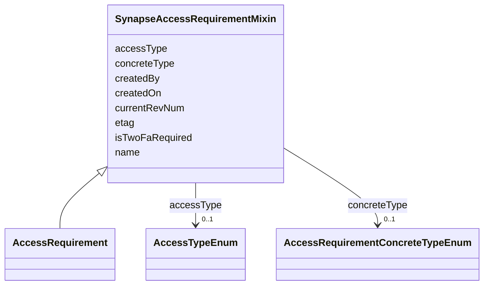

---
search:
  boost: 10.0
---

# Class: SynapseAccessRequirementMixin 


_The real Synapse-native ACCESS_REQUIREMENT row fields (verified against "sagebrain governance graph ACL_AR data - AR table schemas.csv" plus the live/source lookups documented on the shared slots and enums above), applied to AccessRequirement alongside GovernanceMixin (the DUO characterization of an AR's conditions) and ContributionMixin (this repo's own curator-provenance fields — distinct from Synapse's own createdBy/ createdOn here, see those slots' descriptions). Part of aligning governanceDUO with the SageBrain Governance Graph design, where an AccessRequirement is a first-class graph entity with its own Synapse identity, not only a DUO-condition record._


<div data-search-exclude markdown="1">


URI: [governanceduo:class/SynapseAccessRequirementMixin](https://w3id.org/sage-bionetworks/governance-duo/class/SynapseAccessRequirementMixin)





<!-- no inheritance hierarchy -->

## Class Properties

| Property | Value |
| --- | --- |
| Mixin | Yes |


## Slots

| Name | Cardinality and Range | Description | Inheritance |
| ---  | --- | --- | --- |
| [name](../slots/name.md) | 0..1 <br/> [String](../types/String.md) | A Synapse-native display name | direct |
| [etag](../slots/etag.md) | 0..1 <br/> [String](../types/String.md) | Entity tag for optimistic concurrency control (a 36-character UUID) | direct |
| [currentRevNum](../slots/currentRevNum.md) | 0..1 <br/> [Integer](../types/Integer.md) | The current revision number of the record | direct |
| [accessType](../slots/accessType.md) | 0..1 <br/> [AccessTypeEnum](../enums/AccessTypeEnum.md) | The kind of access this Access Requirement governs (ACCESS_REQUIREMENT | direct |
| [concreteType](../slots/concreteType.md) | 0..1 <br/> [AccessRequirementConcreteTypeEnum](../enums/AccessRequirementConcreteTypeEnum.md) | Which kind of Access Requirement this is (ACCESS_REQUIREMENT | direct |
| [isTwoFaRequired](../slots/isTwoFaRequired.md) | 0..1 <br/> [Boolean](../types/Boolean.md) | Whether two-factor authentication is required (ACCESS_REQUIREMENT | direct |
| [createdBy](../slots/createdBy.md) | 0..1 <br/> [Integer](../types/Integer.md) | Synapse numeric user id of the record's creator | direct |
| [createdOn](../slots/createdOn.md) | 0..1 <br/> [Integer](../types/Integer.md) | When the record was created (epoch milliseconds in the source Synapse tables) | direct |


## Mixin Usage

| mixed into | description |
| --- | --- |
| [AccessRequirement](../classes/AccessRequirement.md) | Representation of a Synapse Access Requirement and its relationships to entit... |


## Identifier and Mapping Information


### Schema Source


* from schema: https://w3id.org/sage-bionetworks/governance-duo/governance_duo


## Mappings

| Mapping Type | Mapped Value |
| ---  | ---  |
| self | governanceduo:SynapseAccessRequirementMixin |
| native | governanceduo:SynapseAccessRequirementMixin |


## LinkML Source

<!-- TODO: investigate https://stackoverflow.com/questions/37606292/how-to-create-tabbed-code-blocks-in-mkdocs-or-sphinx -->

### Direct

<details>
```yaml
name: SynapseAccessRequirementMixin
description: The real Synapse-native ACCESS_REQUIREMENT row fields (verified against
  "sagebrain governance graph ACL_AR data - AR table schemas.csv" plus the live/source
  lookups documented on the shared slots and enums above), applied to AccessRequirement
  alongside GovernanceMixin (the DUO characterization of an AR's conditions) and ContributionMixin
  (this repo's own curator-provenance fields — distinct from Synapse's own createdBy/
  createdOn here, see those slots' descriptions). Part of aligning governanceDUO with
  the SageBrain Governance Graph design, where an AccessRequirement is a first-class
  graph entity with its own Synapse identity, not only a DUO-condition record.
from_schema: https://w3id.org/sage-bionetworks/governance-duo/governance_duo
mixin: true
slots:
- name
- etag
- currentRevNum
- accessType
- concreteType
- isTwoFaRequired
- createdBy
- createdOn

```
</details>

### Induced

<details>
```yaml
name: SynapseAccessRequirementMixin
description: The real Synapse-native ACCESS_REQUIREMENT row fields (verified against
  "sagebrain governance graph ACL_AR data - AR table schemas.csv" plus the live/source
  lookups documented on the shared slots and enums above), applied to AccessRequirement
  alongside GovernanceMixin (the DUO characterization of an AR's conditions) and ContributionMixin
  (this repo's own curator-provenance fields — distinct from Synapse's own createdBy/
  createdOn here, see those slots' descriptions). Part of aligning governanceDUO with
  the SageBrain Governance Graph design, where an AccessRequirement is a first-class
  graph entity with its own Synapse identity, not only a DUO-condition record.
from_schema: https://w3id.org/sage-bionetworks/governance-duo/governance_duo
mixin: true
attributes:
  name:
    name: name
    description: A Synapse-native display name. Shared by SynapseAccessRequirementMixin
      (ACCESS_REQUIREMENT.NAME) and, via the transitive import chain governance_graph.yaml
      -> access_requirement.yaml -> mixins.yaml, SynapseEntity (NODE.NAME) in governance_graph.yaml
      — defined once here rather than in governance_graph.yaml itself, since mixins.yaml
      cannot import governance_graph.yaml back without creating a cycle (governance_graph.yaml
      already depends on mixins.yaml through access_requirement.yaml).
    from_schema: https://w3id.org/sage-bionetworks/governance-duo/governance_duo
    rank: 1000
    owner: SynapseAccessRequirementMixin
    domain_of:
    - SynapseAccessRequirementMixin
    - SynapseEntity
    range: string
  etag:
    name: etag
    description: Entity tag for optimistic concurrency control (a 36-character UUID).
      Shared the same way as `name` above, by SynapseAccessRequirementMixin (ACCESS_REQUIREMENT.ETAG)
      and SynapseEntity/DataAccessSubmission (NODE.ETAG/DATA_ACCESS_SUBMISSION.ETAG)
      in governance_graph.yaml.
    from_schema: https://w3id.org/sage-bionetworks/governance-duo/governance_duo
    rank: 1000
    owner: SynapseAccessRequirementMixin
    domain_of:
    - SynapseAccessRequirementMixin
    - SynapseEntity
    - DataAccessSubmission
    - AccessApproval
    - ResearchProject
    - DataAccessRequest
    range: string
  currentRevNum:
    name: currentRevNum
    description: The current revision number of the record. Shared the same way as
      `name` above, by SynapseAccessRequirementMixin (ACCESS_REQUIREMENT.CURRENT_REV_NUM)
      and SynapseEntity (NODE.CURRENT_REV_NUM).
    from_schema: https://w3id.org/sage-bionetworks/governance-duo/governance_duo
    rank: 1000
    owner: SynapseAccessRequirementMixin
    domain_of:
    - SynapseAccessRequirementMixin
    - SynapseEntity
    range: integer
  accessType:
    name: accessType
    description: The kind of access this Access Requirement governs (ACCESS_REQUIREMENT.ACCESS_TYPE).
      Range is the same AccessTypeEnum used by AccessGrant.permission in governance_graph.yaml
      — one real Synapse ACCESS_TYPE type backs both an ACL grant's permission and
      an Access Requirement's own governed access kind.
    from_schema: https://w3id.org/sage-bionetworks/governance-duo/governance_duo
    rank: 1000
    owner: SynapseAccessRequirementMixin
    domain_of:
    - SynapseAccessRequirementMixin
    range: AccessTypeEnum
  concreteType:
    name: concreteType
    description: Which kind of Access Requirement this is (ACCESS_REQUIREMENT.CONCRETE_TYPE).
      The real Synapse column stores the full Java class name (e.g. "org.sagebionetworks.repo.model.ManagedACTAccessRequirement");
      this enum uses the short class name for readability.
    from_schema: https://w3id.org/sage-bionetworks/governance-duo/governance_duo
    rank: 1000
    owner: SynapseAccessRequirementMixin
    domain_of:
    - SynapseAccessRequirementMixin
    range: AccessRequirementConcreteTypeEnum
  isTwoFaRequired:
    name: isTwoFaRequired
    description: Whether two-factor authentication is required (ACCESS_REQUIREMENT.IS_TWO_FA_REQUIRED).
    from_schema: https://w3id.org/sage-bionetworks/governance-duo/governance_duo
    rank: 1000
    owner: SynapseAccessRequirementMixin
    domain_of:
    - SynapseAccessRequirementMixin
    range: boolean
  createdBy:
    name: createdBy
    description: Synapse numeric user id of the record's creator. Shared the same
      way as `name` above. Distinct from ContributionMixin's contributorName, which
      is this repo's own free-text curator-provenance field, not Synapse's own numeric
      CREATED_BY column — both coexist on AccessRequirement without collision.
    comments:
    - 'scripts/build_governance_graph.py emits this integer two different ways depending
      on which class it''s on: as an IRI reference to a gov:Principal node (gov:createdBy)
      on DataAccessSubmission -- since a submission''s creator can be looked up as
      a first-class Principal individual -- but as a plain literal (gov:createdByUserId,
      a distinct predicate, not gov:createdBy) on SynapseEntity, which has no corresponding
      Principal record to link to. This divergence is deliberate and documented in
      shapes/governance_graph.owl.ttl, not a schema/export mismatch to fix.'
    from_schema: https://w3id.org/sage-bionetworks/governance-duo/governance_duo
    exact_mappings:
    - dcterms:creator
    rank: 1000
    owner: SynapseAccessRequirementMixin
    domain_of:
    - SynapseAccessRequirementMixin
    - SynapseEntity
    - ResearchProject
    - DataAccessRequest
    range: integer
  createdOn:
    name: createdOn
    description: When the record was created (epoch milliseconds in the source Synapse
      tables). Shared the same way as `name` above. Distinct from ContributionMixin's
      contributionDate for the same reason as createdBy above.
    from_schema: https://w3id.org/sage-bionetworks/governance-duo/governance_duo
    exact_mappings:
    - dcterms:created
    rank: 1000
    owner: SynapseAccessRequirementMixin
    domain_of:
    - SynapseAccessRequirementMixin
    - SynapseEntity
    - AccessGrant
    - AccessApproval
    - ResearchProject
    - DataAccessRequest
    range: integer

```
</details></div>