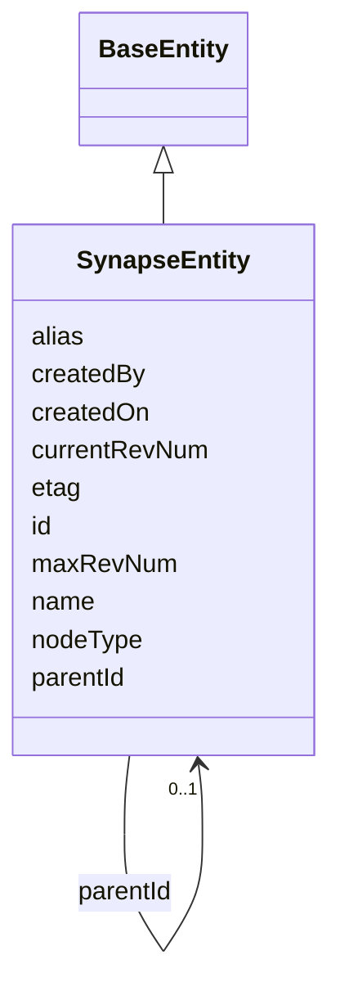

---
search:
  boost: 10.0
---

# Class: SynapseEntity 


_A concrete Synapse entity (project, folder, file, etc.) that ACLs and Access Requirements attach to. Mirrors the NODE table. Deliberately separate from the Resource class: Resource represents a reusable resource-*type* pattern (e.g. "mc2Res1"), not a concrete entity instance with real parent/child structure._


<div data-search-exclude markdown="1">


URI: [sagegov:SynapseEntity](https://sagebionetworks.org/governance/SynapseEntity)





## Inheritance
* [BaseEntity](../classes/BaseEntity.md)
    * **SynapseEntity**


## Class Properties

| Property | Value |
| --- | --- |
| Class URI | [sagegov:SynapseEntity](https://sagebionetworks.org/governance/SynapseEntity) |


## Slots

| Name | Cardinality and Range | Description | Inheritance |
| ---  | --- | --- | --- |
| [name](../slots/name.md) | 0..1 <br/> [String](../types/String.md) | A Synapse-native display name | direct |
| [nodeType](../slots/nodeType.md) | 0..1 <br/> [String](../types/String.md) | The kind of Synapse entity (NODE | direct |
| [parentId](../slots/parentId.md) | 0..1 <br/> [SynapseEntity](../classes/SynapseEntity.md) | The parent Synapse entity in the containment hierarchy (NODE | direct |
| [alias](../slots/alias.md) | 0..1 <br/> [String](../types/String.md) | The Synapse entity's alias (NODE | direct |
| [currentRevNum](../slots/currentRevNum.md) | 0..1 <br/> [Integer](../types/Integer.md) | The current revision number of the record | direct |
| [maxRevNum](../slots/maxRevNum.md) | 0..1 <br/> [String](../types/String.md) | The maximum revision number of this Synapse entity (NODE | direct |
| [etag](../slots/etag.md) | 0..1 <br/> [String](../types/String.md) | Entity tag for optimistic concurrency control (a 36-character UUID) | direct |
| [createdBy](../slots/createdBy.md) | 0..1 <br/> [Integer](../types/Integer.md) | Synapse numeric user id of the record's creator | direct |
| [createdOn](../slots/createdOn.md) | 0..1 <br/> [Integer](../types/Integer.md) | When the record was created (epoch milliseconds in the source Synapse tables) | direct |
| [id](../slots/id.md) | 1 <br/> [String](../types/String.md) | The Synapse entity id (NODE | [BaseEntity](../classes/BaseEntity.md) |


## Usages

| used by | used in | type | used |
| ---  | --- | --- | --- |
| [SynapseEntity](../classes/SynapseEntity.md) | [parentId](../slots/parentId.md) | range | [SynapseEntity](../classes/SynapseEntity.md) |
| [AccessGrant](../classes/AccessGrant.md) | [resource](../slots/resource.md) | range | [SynapseEntity](../classes/SynapseEntity.md) |
| [AccessRequirementAssociation](../classes/AccessRequirementAssociation.md) | [resource](../slots/resource.md) | range | [SynapseEntity](../classes/SynapseEntity.md) |


## Identifier and Mapping Information


### Schema Source


* from schema: https://w3id.org/sage-bionetworks/governance-duo/governance_duo


## Mappings

| Mapping Type | Mapped Value |
| ---  | ---  |
| self | sagegov:SynapseEntity |
| native | governanceduo:SynapseEntity |
| close | prov:Entity |


## Examples
### Example: SynapseEntity-002-study

```yaml
id: syn2343195
name: NF2-related schwannomatosis RNA-seq study
nodeType: project
etag: 8b7c6d5e-4f3a-4b2c-8d1e-0f9a8b7c6d5e
createdBy: 1000002
createdOn: 1700000000000

```
### Example: SynapseEntity-001-file

```yaml
id: syn10081783
name: HS01_CUDC907_Run1_S2_R1_001.fastq
nodeType: file
parentId: syn2343195
etag: 3f9c9b8a-1a2b-4c3d-9e5f-6a7b8c9d0e1f
createdBy: 1000001
createdOn: 1755000000000

```


## LinkML Source

<!-- TODO: investigate https://stackoverflow.com/questions/37606292/how-to-create-tabbed-code-blocks-in-mkdocs-or-sphinx -->

### Direct

<details>
```yaml
name: SynapseEntity
description: 'A concrete Synapse entity (project, folder, file, etc.) that ACLs and
  Access Requirements attach to. Mirrors the NODE table. Deliberately separate from
  the Resource class: Resource represents a reusable resource-*type* pattern (e.g.
  "mc2Res1"), not a concrete entity instance with real parent/child structure.'
from_schema: https://w3id.org/sage-bionetworks/governance-duo/governance_duo
close_mappings:
- prov:Entity
is_a: BaseEntity
slots:
- name
- nodeType
- parentId
- alias
- currentRevNum
- maxRevNum
- etag
- createdBy
- createdOn
slot_usage:
  id:
    name: id
    description: The Synapse entity id (NODE.ID), e.g. syn10081783.
    examples:
    - value: syn10081783
    pattern: ^syn\d+$
  name:
    name: name
    slot_uri: sagegov:name
  etag:
    name: etag
    slot_uri: sagegov:etag
  currentRevNum:
    name: currentRevNum
    slot_uri: sagegov:currentRevNum
  createdOn:
    name: createdOn
    slot_uri: sagegov:createdOn
  createdBy:
    name: createdBy
    comments:
    - On SynapseEntity specifically, this is a raw literal Synapse user id (sagegov:createdByUserId),
      not an IRI reference -- see mixins.yaml's createdBy comment for why this diverges
      from DataAccessSubmission's usage of the same underlying slot.
    slot_uri: sagegov:createdByUserId
class_uri: sagegov:SynapseEntity

```
</details>

### Induced

<details>
```yaml
name: SynapseEntity
description: 'A concrete Synapse entity (project, folder, file, etc.) that ACLs and
  Access Requirements attach to. Mirrors the NODE table. Deliberately separate from
  the Resource class: Resource represents a reusable resource-*type* pattern (e.g.
  "mc2Res1"), not a concrete entity instance with real parent/child structure.'
from_schema: https://w3id.org/sage-bionetworks/governance-duo/governance_duo
close_mappings:
- prov:Entity
is_a: BaseEntity
slot_usage:
  id:
    name: id
    description: The Synapse entity id (NODE.ID), e.g. syn10081783.
    examples:
    - value: syn10081783
    pattern: ^syn\d+$
  name:
    name: name
    slot_uri: sagegov:name
  etag:
    name: etag
    slot_uri: sagegov:etag
  currentRevNum:
    name: currentRevNum
    slot_uri: sagegov:currentRevNum
  createdOn:
    name: createdOn
    slot_uri: sagegov:createdOn
  createdBy:
    name: createdBy
    comments:
    - On SynapseEntity specifically, this is a raw literal Synapse user id (sagegov:createdByUserId),
      not an IRI reference -- see mixins.yaml's createdBy comment for why this diverges
      from DataAccessSubmission's usage of the same underlying slot.
    slot_uri: sagegov:createdByUserId
attributes:
  name:
    name: name
    description: A Synapse-native display name. Shared by SynapseAccessRequirementMixin
      (ACCESS_REQUIREMENT.NAME) and, via the transitive import chain governance_graph.yaml
      -> access_requirement.yaml -> mixins.yaml, SynapseEntity (NODE.NAME) in governance_graph.yaml
      — defined once here rather than in governance_graph.yaml itself, since mixins.yaml
      cannot import governance_graph.yaml back without creating a cycle (governance_graph.yaml
      already depends on mixins.yaml through access_requirement.yaml).
    from_schema: https://w3id.org/sage-bionetworks/governance-duo/governance_duo
    rank: 1000
    slot_uri: sagegov:name
    owner: SynapseEntity
    domain_of:
    - SynapseAccessRequirementMixin
    - SynapseEntity
    range: string
  nodeType:
    name: nodeType
    description: The kind of Synapse entity (NODE.NODE_TYPE), e.g. project, folder,
      file, table. **Not independently verified** against a canonical enum in this
      pass — modeled as an open string rather than a fabricated enum, unlike AccessTypeEnum/AccessRequirementConcreteTypeEnum/SubmissionStateEnum
      above, all three of which were confirmed against a real source. Common Synapse
      entity types (project/folder/file/link/table/view/dockerrepo) are well known
      but not cited here as a closed, checked list.
    from_schema: https://w3id.org/sage-bionetworks/governance-duo/governance_duo
    rank: 1000
    slot_uri: sagegov:nodeType
    owner: SynapseEntity
    domain_of:
    - SynapseEntity
    range: string
  parentId:
    name: parentId
    description: The parent Synapse entity in the containment hierarchy (NODE.PARENT_ID)
      — used to resolve direct-vs-inherited governance (e.g. a file inheriting its
      parent study's Access Requirement, per the design doc's "Direct and Inherited
      Governance" section).
    from_schema: https://w3id.org/sage-bionetworks/governance-duo/governance_duo
    exact_mappings:
    - dcterms:isPartOf
    rank: 1000
    slot_uri: sagegov:parentId
    owner: SynapseEntity
    domain_of:
    - SynapseEntity
    range: SynapseEntity
  alias:
    name: alias
    description: The Synapse entity's alias (NODE.ALIAS), if any.
    from_schema: https://w3id.org/sage-bionetworks/governance-duo/governance_duo
    rank: 1000
    slot_uri: sagegov:alias
    owner: SynapseEntity
    domain_of:
    - SynapseEntity
    range: string
  currentRevNum:
    name: currentRevNum
    description: The current revision number of the record. Shared the same way as
      `name` above, by SynapseAccessRequirementMixin (ACCESS_REQUIREMENT.CURRENT_REV_NUM)
      and SynapseEntity (NODE.CURRENT_REV_NUM).
    from_schema: https://w3id.org/sage-bionetworks/governance-duo/governance_duo
    rank: 1000
    slot_uri: sagegov:currentRevNum
    owner: SynapseEntity
    domain_of:
    - SynapseAccessRequirementMixin
    - SynapseEntity
    range: integer
  maxRevNum:
    name: maxRevNum
    description: The maximum revision number of this Synapse entity (NODE.MAX_REV_NUM).
    from_schema: https://w3id.org/sage-bionetworks/governance-duo/governance_duo
    rank: 1000
    slot_uri: sagegov:maxRevNum
    owner: SynapseEntity
    domain_of:
    - SynapseEntity
    range: string
  etag:
    name: etag
    description: Entity tag for optimistic concurrency control (a 36-character UUID).
      Shared the same way as `name` above, by SynapseAccessRequirementMixin (ACCESS_REQUIREMENT.ETAG)
      and SynapseEntity/DataAccessSubmission (NODE.ETAG/DATA_ACCESS_SUBMISSION.ETAG)
      in governance_graph.yaml.
    from_schema: https://w3id.org/sage-bionetworks/governance-duo/governance_duo
    rank: 1000
    slot_uri: sagegov:etag
    owner: SynapseEntity
    domain_of:
    - SynapseAccessRequirementMixin
    - SynapseEntity
    - DataAccessSubmission
    - AccessApproval
    - ResearchProject
    range: string
  createdBy:
    name: createdBy
    description: Synapse numeric user id of the record's creator. Shared the same
      way as `name` above. Distinct from ContributionMixin's contributorName, which
      is this repo's own free-text curator-provenance field, not Synapse's own numeric
      CREATED_BY column — both coexist on AccessRequirement without collision.
    comments:
    - On SynapseEntity specifically, this is a raw literal Synapse user id (sagegov:createdByUserId),
      not an IRI reference -- see mixins.yaml's createdBy comment for why this diverges
      from DataAccessSubmission's usage of the same underlying slot.
    from_schema: https://w3id.org/sage-bionetworks/governance-duo/governance_duo
    exact_mappings:
    - dcterms:creator
    rank: 1000
    slot_uri: sagegov:createdByUserId
    owner: SynapseEntity
    domain_of:
    - SynapseAccessRequirementMixin
    - SynapseEntity
    - ResearchProject
    range: integer
  createdOn:
    name: createdOn
    description: When the record was created (epoch milliseconds in the source Synapse
      tables). Shared the same way as `name` above. Distinct from ContributionMixin's
      contributionDate for the same reason as createdBy above.
    from_schema: https://w3id.org/sage-bionetworks/governance-duo/governance_duo
    exact_mappings:
    - dcterms:created
    rank: 1000
    slot_uri: sagegov:createdOn
    owner: SynapseEntity
    domain_of:
    - SynapseAccessRequirementMixin
    - SynapseEntity
    - AccessGrant
    - AccessApproval
    - ResearchProject
    range: integer
  id:
    name: id
    description: The Synapse entity id (NODE.ID), e.g. syn10081783.
    examples:
    - value: syn10081783
    from_schema: https://w3id.org/sage-bionetworks/governance-duo/governance_duo
    rank: 1000
    slot_uri: dcterms:identifier
    identifier: true
    owner: SynapseEntity
    domain_of:
    - BaseEntity
    range: string
    required: true
    pattern: ^syn\d+$
class_uri: sagegov:SynapseEntity

```
</details></div>