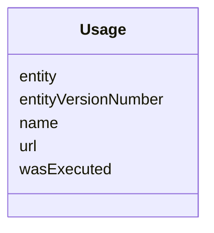

---
search:
  boost: 10.0
---

# Class: Usage 


_Flattens Synapse's real Used interface and its two implementations — UsedEntity (+ reference.targetId/targetVersionNumber) and UsedURL (+ url/name), both verified against rest-docs.synapse.org — into one class, the same flattening governance_graph.yaml's DataAccessRequest already does for principalInvestigator/signingOfficial (neither branch has an independent identifier, and nothing else in this graph needs to reference one individually; only one branch is populated per instance). Not `is_a: BaseEntity`: keyed structurally by its parent Activity's qualifiedUsage list, same reasoning as Condition/DataAccessSubmissionStatus. Maps onto PROV-O's own qualification pattern: prov:Usage is a real PROV-O class for exactly this "Activity used this Entity, plus extra detail" shape (prov:qualifiedUsage / prov:entity), not an invented parallel structure._


<div data-search-exclude markdown="1">


URI: [prov:Usage](http://www.w3.org/ns/prov#Usage)





<!-- no inheritance hierarchy -->

## Class Properties

| Property | Value |
| --- | --- |
| Class URI | [prov:Usage](http://www.w3.org/ns/prov#Usage) |


## Slots

| Name | Cardinality and Range | Description | Inheritance |
| ---  | --- | --- | --- |
| [wasExecuted](../slots/wasExecuted.md) | 1 <br/> [Boolean](../types/Boolean.md) | Mirrors Used | direct |
| [entity](../slots/entity.md) | 0..1 <br/> [Uriorcurie](../types/Uriorcurie.md) | The SynapseEntity referenced by this Usage, when Used | direct |
| [entityVersionNumber](../slots/entityVersionNumber.md) | 0..1 <br/> [Integer](../types/Integer.md) | Mirrors UsedEntity | direct |
| [url](../slots/url.md) | 0..1 <br/> [String](../types/String.md) | The external URL used, when Used | direct |
| [name](../slots/name.md) | 0..1 <br/> [String](../types/String.md) | A Synapse-native display name | direct |


## Usages

| used by | used in | type | used |
| ---  | --- | --- | --- |
| [Activity](../classes/Activity.md) | [qualifiedUsage](../slots/qualifiedUsage.md) | range | [Usage](../classes/Usage.md) |


## Identifier and Mapping Information


### Schema Source


* from schema: https://w3id.org/sage-bionetworks/governance-duo/governance_duo


## Mappings

| Mapping Type | Mapped Value |
| ---  | ---  |
| self | prov:Usage |
| native | governanceduo:Usage |


## LinkML Source

<!-- TODO: investigate https://stackoverflow.com/questions/37606292/how-to-create-tabbed-code-blocks-in-mkdocs-or-sphinx -->

### Direct

<details>
```yaml
name: Usage
description: 'Flattens Synapse''s real Used interface and its two implementations
  — UsedEntity (+ reference.targetId/targetVersionNumber) and UsedURL (+ url/name),
  both verified against rest-docs.synapse.org — into one class, the same flattening
  governance_graph.yaml''s DataAccessRequest already does for principalInvestigator/signingOfficial
  (neither branch has an independent identifier, and nothing else in this graph needs
  to reference one individually; only one branch is populated per instance). Not `is_a:
  BaseEntity`: keyed structurally by its parent Activity''s qualifiedUsage list, same
  reasoning as Condition/DataAccessSubmissionStatus. Maps onto PROV-O''s own qualification
  pattern: prov:Usage is a real PROV-O class for exactly this "Activity used this
  Entity, plus extra detail" shape (prov:qualifiedUsage / prov:entity), not an invented
  parallel structure.'
from_schema: https://w3id.org/sage-bionetworks/governance-duo/governance_duo
slots:
- wasExecuted
- entity
- entityVersionNumber
- url
- name
class_uri: prov:Usage

```
</details>

### Induced

<details>
```yaml
name: Usage
description: 'Flattens Synapse''s real Used interface and its two implementations
  — UsedEntity (+ reference.targetId/targetVersionNumber) and UsedURL (+ url/name),
  both verified against rest-docs.synapse.org — into one class, the same flattening
  governance_graph.yaml''s DataAccessRequest already does for principalInvestigator/signingOfficial
  (neither branch has an independent identifier, and nothing else in this graph needs
  to reference one individually; only one branch is populated per instance). Not `is_a:
  BaseEntity`: keyed structurally by its parent Activity''s qualifiedUsage list, same
  reasoning as Condition/DataAccessSubmissionStatus. Maps onto PROV-O''s own qualification
  pattern: prov:Usage is a real PROV-O class for exactly this "Activity used this
  Entity, plus extra detail" shape (prov:qualifiedUsage / prov:entity), not an invented
  parallel structure.'
from_schema: https://w3id.org/sage-bionetworks/governance-duo/governance_duo
attributes:
  wasExecuted:
    name: wasExecuted
    description: Mirrors Used.wasExecuted verbatim ("The enclosed entity was used
      and also executed in the Activity") — a Synapse-specific boolean flag distinguishing
      code/workflow inputs from data inputs within one qualifiedUsage list, with no
      exact PROV-O predicate equivalent found; left as a repo-local predicate rather
      than forced onto e.g. prov:hadRole, same as other slots this repo leaves unmapped
      when no confident match exists (see README's OLS-verification table).
    from_schema: https://w3id.org/sage-bionetworks/governance-duo/governance_duo
    rank: 1000
    slot_uri: sagegov:wasExecuted
    owner: Usage
    domain_of:
    - Usage
    range: boolean
    required: true
  entity:
    name: entity
    description: The SynapseEntity referenced by this Usage, when Used.concreteType
      is UsedEntity (Used.reference.targetId). range is uriorcurie, not SynapseEntity
      — same cross-ABox reasoning as Activity.generated above. Absent when this Usage
      instead carries url/name (a UsedURL).
    from_schema: https://w3id.org/sage-bionetworks/governance-duo/governance_duo
    rank: 1000
    slot_uri: prov:entity
    owner: Usage
    domain_of:
    - Usage
    range: uriorcurie
  entityVersionNumber:
    name: entityVersionNumber
    description: 'Mirrors UsedEntity.reference.targetVersionNumber. No PROV-O equivalent:
      PROV-O does not version-scope entities the way Synapse does.'
    from_schema: https://w3id.org/sage-bionetworks/governance-duo/governance_duo
    rank: 1000
    slot_uri: sagegov:entityVersionNumber
    owner: Usage
    domain_of:
    - Usage
    range: integer
  url:
    name: url
    description: The external URL used, when Used.concreteType is UsedURL (UsedURL.url
      — "The external URL of the file that was used"). Absent when this Usage instead
      carries entity/entityVersionNumber (a UsedEntity). Usage.name (UsedURL.name
      — the same field description, verbatim, despite the field being named `name`)
      reuses the shared display-name slot (mixins.yaml) directly rather than being
      redefined here.
    from_schema: https://w3id.org/sage-bionetworks/governance-duo/governance_duo
    rank: 1000
    slot_uri: sagegov:url
    owner: Usage
    domain_of:
    - Usage
    range: string
  name:
    name: name
    description: A Synapse-native display name. Shared by SynapseAccessRequirementMixin
      (ACCESS_REQUIREMENT.NAME) and, via the transitive import chain governance_graph.yaml
      -> access_requirement.yaml -> mixins.yaml, SynapseEntity (NODE.NAME) in governance_graph.yaml
      — defined once here rather than in governance_graph.yaml itself, since mixins.yaml
      cannot import governance_graph.yaml back without creating a cycle (governance_graph.yaml
      already depends on mixins.yaml through access_requirement.yaml).
    from_schema: https://w3id.org/sage-bionetworks/governance-duo/governance_duo
    rank: 1000
    owner: Usage
    domain_of:
    - SynapseAccessRequirementMixin
    - SynapseEntity
    - Program
    - Activity
    - Usage
    range: string
class_uri: prov:Usage

```
</details></div>