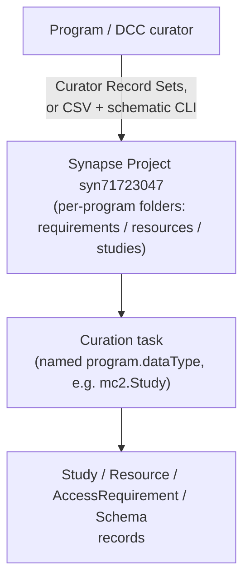

# Use cases, data sources, and the submission pipeline

This page answers three questions this repo's other docs assume you already know
the answer to: **what is this model for**, **where is the data supposed to come
from**, and **is there an actual pipeline that gets it there today**. The short
version: the DUO-core model has a real, operational record-submission pipeline
(one earlier piece of it, deriving AR annotations from entity annotations via a
conditional schema, was never put into practice and is deprecated); the Governance
Graph's live-Synapse sync is implemented
and tested offline but hasn't been run against real Synapse credentials yet; the
Policy Fabric crosswalk is operational but manually triggered; DRS interoperability
is a design document with no data or pipeline at all. Details below.

## What each part is for

### DUO-core model — gating access to Synapse data by DUO condition

The core use case, per the root [`README.md`](https://github.com/mc2-center/governanceDUO/blob/main/README.md): DUO ("Data Use
Ontology") tags let Sage Bionetworks programs semantically describe *how* a dataset
may be used, then have Synapse automatically gate access to that data based on those
tags. The adopted direction for how an entity ends up governed by a DUO-tagged
**Access Requirement (AR)** is annotation on the AR itself, applied once by ACT and
inherited by every entity the AR is assigned to — not a human manually configuring
access per-entity, and not (an earlier, deprecated design) deriving the AR's
annotation from tags already applied to entities beneath it; see
[`plans/ar_level_duo_annotations.md`](https://github.com/mc2-center/governanceDUO/blob/main/plans/ar_level_duo_annotations.md).
ARs come in two flavors: a **clickwrap** (the user just agrees to terms) or a
**managed AR**,
which can demand evidence of Authentication (training certification, profile
validation, two-factor auth) and/or Authorization (an intended-data-use statement, a
data use certificate, an IRB/IEC ethics approval letter). `Study`/`Resource`/`Schema`
exist to give an AR the context it needs — which grant/data source it belongs to,
which Synapse containers it governs, which registered JSON schema encodes it.

### Governance Graph — a queryable model of *effective* access

The graph layer's use case is different from the DUO-core model's: it's not about
authoring conditions, it's about **representing the resulting state** — who
actually has what permission on a resource (a W3C Web Access Control
`Authorization`) versus what additional conditions must separately be satisfied (an
`AccessRequirement`, attached directly to the entity it governs and inherited by
walking the container hierarchy, satisfied-or-not via a recorded `Approval`) — as
one RDF graph capable of answering "does this specific user have effective access to
this specific resource right now?" (ACL permits **AND** applicable ARs are
satisfied). See [Governance graph design](graph-design.md) for the model itself, and
[Knowledge graph representation](knowledge-graph.md) for the RDF shape.

### Policy Fabric integration — making DUO conditions programmatically enforceable

The DUO-core model captures conditions as metadata; it doesn't enforce anything by
itself. `policy_fabric.yaml`/`policy_fabric_bindings.yaml`'s use case is to translate
an `AccessRequirement`'s DUO-coded conditions into the literal input shape a real,
external decentralized-governance system —
[Policy Fabric](https://github.com/hasan7n/tmp-policies) — needs to actually evaluate
and gate access at request time, via Verifiable Credentials and Rego policy
evaluation. See [Policy Fabric integration](policy-fabric.md).

### DRS interoperability — a forward-looking design, not a running feature

[`docs/drs-interop.md`](drs-interop.md) maps this model onto the GA4GH Data
Repository Service API's object/authorization semantics, so that a future DRS-facing
integration wouldn't have to invent that mapping from scratch. It is explicitly a
**design document only** — this repo does not expose a DRS API today.

## Intended data sources

| Component | Intended data source | What actually populates it today |
| --- | --- | --- |
| DUO-core model (`AccessRequirement`/`Resource`/`Study`/`Schema`) | Program/DCC curators, submitting via a dedicated Synapse Project | **Real curator submissions** — see the pipeline below |
| Governance Graph (`SynapseEntity`/`Authorization`/`User`/`Team`/`AccessRequirement`/`Approval`/`DataAccessSubmission`) | Synapse's own REST API — `GET /entity/{id}/path`, `.../acl`, `.../accessRequirement`, `POST /accessRequirement/{id}/submissions`, `POST /accessApproval/search` — every class/slot was verified against these real Synapse endpoints so the sync can populate it faithfully | Illustrative example instances (`linkml/examples/graph/*.example.yaml`, built by `make governance-graph`), and `scripts/sync_governance_graph.py`, which builds the same layers from Synapse's REST API for listed entities — implemented and tested offline, not yet run against live Synapse |
| Policy Fabric crosswalk data (`policy_fabric_bindings.yaml`) | Not per-record data at all — a static, hand-curated lookup table (21 rows, one per verified Policy Fabric `policy_card`), verified directly against `hasan7n/tmp-policies`'s own `policy.rego`/`policy_data_schema.json` files | Same — this is reference data, checked in once and updated only if Policy Fabric's own `policy_cards/` change |
| Policy Fabric *per-record* inputs (`scripts/build_policy_fabric.py`'s actual argument) | A single existing `AccessRequirement` instance's `dataUseModifiers` and companion slots (`assetBindings`, `trustedIssuerDids`, `institutionDids`, ...) | Whatever `AccessRequirement` record a maintainer points the script at — today, always one of the hand-authored examples under `linkml/examples/` |
| Provenance layer (`prov:Activity`/`prov:Usage`, part of the same graph schema as Governance above) | Synapse's provenance API (`GET /entity/{id}/generatedBy`) | Illustrative examples (`linkml/examples/graph/`), and `scripts/sync_provenance_graph.py` for listed entities — tested offline, not yet run against live Synapse |
| Derivation policy layer (`ControlLabel`/`DerivationReview`, also part of the same graph schema) | Computed from the graph's governance and provenance content plus curated AR tiers (`scripts/build_derivation_policy.py`) | Computed from the example graph; `DerivationRule` content is illustrative |
| DRS alignment (`drs_alignment.yaml`) | N/A | Nothing — no populated instances exist; it's a mapping schema plus one hand-written illustrative example in `docs/drs-interop.md` |

## The submission pipeline (what's real today)

Two supported ways to get `Study`/`Resource`/`AccessRequirement`/`Schema` records into
Synapse today (per the root README's collapsed archive section, "Submitting metadata
to the database"):

1. **Curator Record Sets** — bind the relevant registered JSON schema to the target
   folder, create a Record Set + curation task, fill rows in the grid UI (or upload a
   CSV into it), and select "Apply Changes."
2. **CSV + `schematic` CLI** — fill a downloaded CSV template (or a Google Sheet
   template copy) one sheet per Synapse Project, validate it
   (`schematic model validate`), then submit it (`schematic model submit`, upsert
   mode) to the target folder.

Either way, records land in one of three per-program folders under a single, shared
Synapse Project.

**Deprecated, never put into practice: deriving an AR's DUO annotation from a
conditional JSON schema bound to a folder.** An earlier design
(`access_requirement_JSON/README.md`'s Data Dictionary CSV feeding an external
script, `generate_duo_schema.py`, to emit a schema that would bind to a folder and
derive the AR's annotation from matching entity annotations) never shipped as a
working end-to-end flow — confirmed by the user, 2026-09-24, and consistent with
`plans/governance_graph_ingestion.md`'s own framing of that same
`generate_duo_schema.py` framework as "archived... a pilot process being
superseded, not a design to stay compatible with." Don't read the root README's
"🚧 Content in development 🚧" marker as an active effort; nothing has picked it up
since. The adopted go-forward direction for how DUO conditions reach an Access
Requirement is the opposite of this design — annotate the AR directly, not derive
its annotation from entities beneath it — see
[`plans/ar_level_duo_annotations.md`](https://github.com/mc2-center/governanceDUO/blob/main/plans/ar_level_duo_annotations.md).

## What's implemented but not yet run live, or has no pipeline at all

- **Governance Graph**: `scripts/sync_governance_graph.py` and
  `scripts/sync_provenance_graph.py` implement the live-Synapse pull and are tested
  offline against fake Synapse clients, but neither has been run against a real
  Synapse credential yet, so no live-populated export exists today — only the
  illustrative canonical example (`make governance-graph`). See
  [`plans/governance_graph_ingestion.md`](https://github.com/mc2-center/governanceDUO/blob/main/plans/governance_graph_ingestion.md)
  for the source-endpoint design this implementation follows, how it bridges to
  Policy Fabric/DUO-core outputs, and which attributes need curator-spreadsheet
  input instead of a live Synapse pull.
- **Policy Fabric**: `make policy-fabric` is a manual, repo-maintainer-run command
  against one `AccessRequirement` example at a time — nothing in the curator
  submission flow above automatically triggers it when a new AR record is submitted.
- **DRS interoperability**: no pipeline, no server, no populated data — see
  [DRS interoperability](drs-interop.md)'s own "What this page is not" section.

## Summary

| Component | Use case | Data source status | Pipeline status |
| --- | --- | --- | --- |
| DUO-core model | Gate Synapse data access by DUO condition, scaled across programs | Real curator submissions | **Operational** (record submission); the conditional-schema-generation approach to deriving AR annotations is **deprecated, never shipped** — see `plans/ar_level_duo_annotations.md` for the adopted direction |
| Governance Graph | Query "does this user have effective access to this resource?" | Verified against Synapse's REST API | **Implemented** — live sync tested offline only; contract-checked against sagebrain-infra's authorizer |
| Provenance and Derivation Policy Graphs | Carry access labels onto derived content | Synapse provenance API; curated AR tiers | **Implemented** — tested offline and against a fixture |
| Policy Fabric crosswalk | Make DUO conditions programmatically enforceable via an external system | One AR record + a static, verified binding table | **Operational, manual** — no automated trigger |
| DRS alignment | Forward-looking interoperability design | N/A | **Design-only** |
