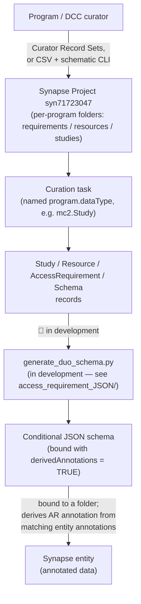

# Use cases, data sources, and the submission pipeline

This page answers three questions this repo's other docs assume you already know
the answer to: **what is this model for**, **where is the data supposed to come
from**, and **is there an actual pipeline that gets it there today**. The short
version: the DUO-core model has a real, operational (if partly in-development)
curator submission pipeline; the Governance Graph is verified against real Synapse
table schemas but has no populated data or export pipeline yet; the Policy Fabric
crosswalk is operational but manually triggered; DRS interoperability is a design
document with no data or pipeline at all. Details below.

## What each part is for

### DUO-core model — gating access to Synapse data by DUO condition

The core use case, per the root [`README.md`](https://github.com/mc2-center/governanceDUO/blob/main/README.md): DUO ("Data Use
Ontology") tags let Sage Bionetworks programs semantically describe *how* a dataset
may be used, then have Synapse automatically gate access to that data based on those
tags — an **Access Requirement (AR)** gets applied to an entity because of its DUO
annotation, rather than a human manually configuring access per-entity. ARs come in
two flavors: a **clickwrap** (the user just agrees to terms) or a **managed AR**,
which can demand evidence of Authentication (training certification, profile
validation, two-factor auth) and/or Authorization (an intended-data-use statement, a
data use certificate, an IRB/IEC ethics approval letter). `Study`/`Resource`/`Schema`
exist to give an AR the context it needs — which grant/data source it belongs to,
which Synapse containers it governs, which registered JSON schema encodes it.

### Governance Graph — a queryable model of *effective* access

`governance_graph.yaml`'s use case is different from the DUO-core model's: it's not
about authoring conditions, it's about **representing the resulting state** — who
actually has what permission on a resource (an ACL, `AccessGrant`) versus what
additional conditions must separately be satisfied (an `AccessRequirement`, bound via
`AccessRequirementAssociation`, satisfied-or-not via `DataAccessSubmission`/
`DataAccessSubmissionStatus`) — as one RDF graph capable of answering "does this
specific user have effective access to this specific resource right now?" (ACL
permits **AND** applicable ARs are satisfied). See
[Knowledge graph representation](knowledge-graph.md) for the RDF shape itself.

### Policy Fabric integration — making DUO conditions programmatically enforceable

The DUO-core model captures conditions as metadata; it doesn't enforce anything by
itself. `policy_fabric.yaml`/`policy_fabric_bindings.yaml`'s use case is to translate
an `AccessRequirement`'s DUO-coded conditions into the literal input shape a real,
external decentralized-governance system —
[Policy Fabric](https://github.com/hasan7n/tmp-policies) — needs to actually evaluate
and gate access at request time, via Verifiable Credentials and Rego policy
evaluation. See [Policy Fabric integration](policy-fabric.md).

### DRS interoperability — a forward-looking design, not a running feature

[`docs/drs-interop.md`](drs-interop.md) maps this model onto the GA4GH Data
Repository Service API's object/authorization semantics, so that a future DRS-facing
integration wouldn't have to invent that mapping from scratch. It is explicitly a
**design document only** — this repo does not expose a DRS API today.

## Intended data sources

| Component | Intended data source | What actually populates it today |
| --- | --- | --- |
| DUO-core model (`AccessRequirement`/`Resource`/`Study`/`Schema`) | Program/DCC curators, submitting via a dedicated Synapse Project | **Real curator submissions** — see the pipeline below |
| Governance Graph (`SynapseEntity`/`AccessGrant`/`Principal`/`AccessRequirementAssociation`/`DataAccessSubmission`/`DataAccessSubmissionStatus`) | Synapse's own live relational tables — `NODE`, `ACL`, `ACL_RESOURCE_ACCESS`, `ACCESS_REQUIREMENT`, `ACCESS_REQUIREMENT_PROJECT`, `DATA_ACCESS_SUBMISSION`, `DATA_ACCESS_SUBMISSION_STATUS` — every class/enum in `governance_graph.yaml` was verified column-by-column against these real Synapse schemas specifically so a future export could populate it faithfully | **Hand-authored example instances only** (`linkml/examples/governance_graph/*.example.yaml`) — there is no export/API pipeline that pulls live Synapse ACL/AR state into this graph yet |
| Policy Fabric crosswalk data (`policy_fabric_bindings.yaml`) | Not per-record data at all — a static, hand-curated lookup table (21 rows, one per verified Policy Fabric `policy_card`), verified directly against `hasan7n/tmp-policies`'s own `policy.rego`/`policy_data_schema.json` files | Same — this is reference data, checked in once and updated only if Policy Fabric's own `policy_cards/` change |
| Policy Fabric *per-record* inputs (`scripts/build_policy_fabric.py`'s actual argument) | A single existing `AccessRequirement` instance's `dataUseModifiers` and companion slots (`assetBindings`, `trustedIssuerDids`, `institutionDids`, ...) | Whatever `AccessRequirement` record a maintainer points the script at — today, always one of the hand-authored examples under `linkml/examples/` |
| DRS alignment (`drs_alignment.yaml`) | N/A | Nothing — no populated instances exist; it's a mapping schema plus one hand-written illustrative example in `docs/drs-interop.md` |

## The submission pipeline (what's real today)

Two supported ways to get `Study`/`Resource`/`AccessRequirement`/`Schema` records into
Synapse today (per the root README's "Submitting metadata to the database" section):

1. **Curator Record Sets** — bind the relevant registered JSON schema to the target
   folder, create a Record Set + curation task, fill rows in the grid UI (or upload a
   CSV into it), and select "Apply Changes."
2. **CSV + `schematic` CLI** — fill a downloaded CSV template (or a Google Sheet
   template copy) one sheet per Synapse Project, validate it
   (`schematic model validate`), then submit it (`schematic model submit`, upsert
   mode) to the target folder.

Either way, records land in one of three per-program folders under a single, shared
Synapse Project, and any conditional JSON schemas generated from those records get
stored in a dedicated schemas folder and registered so their URI can be bound
elsewhere. **The step that actually generates a conditional JSON schema from
submitted AR records is explicitly marked "🚧 Content in development 🚧"** in the root
README today. The mechanism it's meant to produce is documented separately in
[`access_requirement_JSON/README.md`](https://github.com/mc2-center/governanceDUO/blob/main/access_requirement_JSON/README.md): a Data
Dictionary CSV (DUO codes + AR id + governed entity ids + activation annotation key)
feeds an external, still-WIP script
([`generate_duo_schema.py`](https://github.com/mc2-center/mc2-center-dcc/blob/add-ARjson-build-script/utils/generate_duo_schema.py),
mirrored in this repo's own `scripts/generate_duo_schema.py`) that emits the
conditional schema — but this isn't yet a single, polished, end-to-end flow a curator
can run unassisted.

## What has no pipeline at all yet

- **Governance Graph**: nothing exports live Synapse ACL/AccessRequirement state into
  `governance_graph.yaml`'s shape. `scripts/build_governance_graph.py` only ever runs
  against the hand-authored examples under `linkml/examples/governance_graph/`. The
  schema is verified-correct against real Synapse table columns *in anticipation* of
  such a pipeline, not because one exists — see
  [Sourcing the Governance Graph from Synapse](governance-graph-sync.md) for a design
  of what that pipeline would look like and how it'd bridge to Policy Fabric/DUO-core
  outputs.
- **Policy Fabric**: `make policy-fabric` is a manual, repo-maintainer-run command
  against one `AccessRequirement` example at a time — nothing in the curator
  submission flow above automatically triggers it when a new AR record is submitted.
- **DRS interoperability**: no pipeline, no server, no populated data — see
  [DRS interoperability](drs-interop.md)'s own "What this page is not" section.

## Summary

| Component | Use case | Data source status | Pipeline status |
| --- | --- | --- | --- |
| DUO-core model | Gate Synapse data access by DUO condition, scaled across programs | Real curator submissions | **Operational** (conditional-schema-generation step still 🚧) |
| Governance Graph | Query "does this user have effective access to this resource?" | Verified against real Synapse tables; not yet connected | **No pipeline** — example data only |
| Policy Fabric crosswalk | Make DUO conditions programmatically enforceable via an external system | One AR record + a static, verified binding table | **Operational, manual** — no automated trigger |
| DRS alignment | Forward-looking interoperability design | N/A | **Design-only** |
