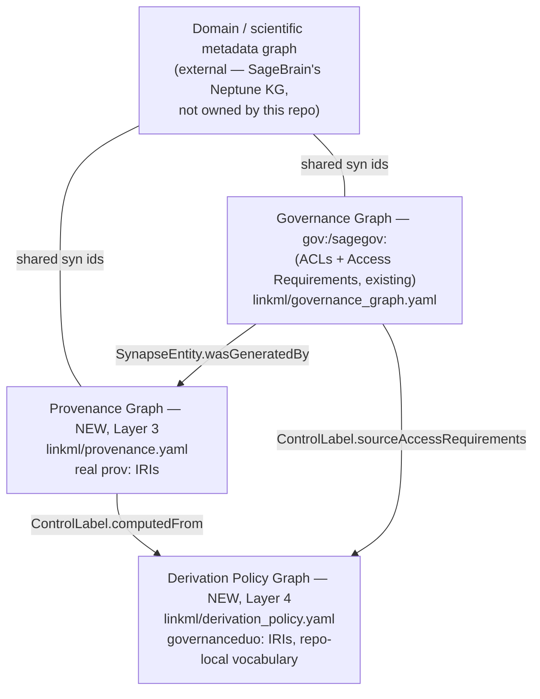

PROV-O integration: a Provenance Graph and a Derivation Policy Graph as two new,
separate layers alongside the existing Governance Graph

This plan turns `plans/prov_integration_an_9-8-26.md` (kept as-is, not deleted — it's
the analysis this plan formalizes) into concrete schema/script/Makefile changes. That
note's central tension, restated: once metadata lives in a traversable knowledge
graph, dataset-level access control stops being sufficient — a user with legitimate
access to two independently-approved things can walk an edge between them and infer
something neither grant authorized. PROV-O gives you the ancestry to *detect* that;
it does not decide propagation policy, does not catch composite risk on its own,
and does not enforce anything at query time (note, paragraphs 9–13). This plan is
scoped to exactly what PROV-O and this repo's own conventions can responsibly build:
a lineage layer and a separate policy layer that consumes it. It does **not** build
the enforcement/query-rewriting layer or resolve revocation semantics — both are
carried forward as explicit open questions (Sections 6–7), the same way
`plans/governance_graph_open_questions.md` carries questions forward rather than
papering over them.

## 1. What already exists (grounding pass, verified this session)

**PROV-O today is annotation-only, not structural.** `prov:` is already declared as a
prefix in `linkml/governance_graph.yaml:41` and `linkml/mixins.yaml:17`, and four
`close_mappings` already exist:

- `SynapseEntity` → `prov:Entity` (`governance_graph.yaml:107-108`)
- `Principal` → `prov:Agent` (`governance_graph.yaml:170-171`)
- `AccessGrant.principal` → `prov:agent` (`governance_graph.yaml:645-646`)
- `ContributionMixin.contributorName`/`contributionDate` → `prov:wasAttributedTo`/
  `prov:generatedAtTime` (`mixins.yaml:172-185`)

All four are `skos:closeMatch` annotations in the generated OWL
(`shapes/governance_duo.owl.ttl`) — semantic siblinghood for a human reader, not a
real `prov:Activity`/`prov:wasDerivedFrom` edge anywhere in the graph. There is no
lineage data in this repo today. This plan's Layer 3 (Section 3) is what turns that
siblinghood into real structure, for entities that actually have derivation.

**Synapse has a real, native provenance feature, and it maps onto PROV-O almost
exactly.** Verified live against rest-docs.synapse.org this session (public API
documentation, no credentials needed — the same verification method
`plans/governance_graph_ingestion.md` Section 1 already established for this repo):

- `GET /entity/{id}/generatedBy` and `GET /entity/{id}/version/{versionNumber}/generatedBy`
  both exist, both require OAuth `view` scope — the same auth tier
  `scripts/sync_governance_graph.py` already operates under, no new credential type
  needed. Both return an `Activity` object.
- `Activity` (`org.sagebionetworks.repo.model.provenance.Activity`): `id`, `name`,
  `description`, `etag`, `createdOn`, `modifiedOn`, `createdBy`, `modifiedBy`, and
  `used: Set<Used>`.
- `Used` (interface): `wasExecuted` (boolean — "the enclosed entity was used and also
  executed in the Activity"), `concreteType`. Two implementations:
  - `UsedEntity`: adds `reference` (a `Reference`: `targetId`/`targetVersionNumber`).
  - `UsedURL`: adds `url`/`name` (an external file reference instead of a Synapse
    entity).

That gives a near-1:1 grounding: `Activity` ~ `prov:Activity`, `used` ~ `prov:used`,
`generatedBy` ~ `prov:wasGeneratedBy`, `createdBy` ~ `prov:wasAssociatedWith`. This is
**not** an invented mapping — it's the same "reuse the real object by IRI, don't
re-derive a parallel one" move this repo's README already documents for DUO terms
("Real Data Use Ontology (DUO) terms are reused by IRI... never re-minted") and for
Governance Graph classes (`SynapseEntity`/`Principal` above). The honest gap: **the
API's existence is confirmed; whether real DCC Synapse entities actually have
`Activity` records populated is not verified this pass** — Synapse's provenance
feature is opt-in (set via the UI or `synapseclient.Activity`/`setProvenance`), and
in practice most files have never had it filled in. Flag this exactly the way
`governance_graph_ingestion_report.md` flags its own untested-against-live-Synapse
items: structural capability, real live-sync smoke test still needed before trusting
population rates.

## 2. Four-layer architecture

`governance_graph.yaml`'s own description already states the design principle this
plan extends: the Governance Graph is "a logically separate graph... connected to the
domain/scientific metadata graph only via shared Synapse entity URIs"
(`governance_graph.yaml:4-6`). The two new layers follow the identical bridging rule
— no new cross-graph mechanism is invented, the existing one is reused twice more:

1. **Domain graph** (external, unowned) — what a thing *is*.
2. **Governance Graph** (existing) — who can act on it *right now* (ACL) and what
   conditions gate that (AR). Effective access = ACL permits AND applicable ARs
   satisfied.
3. **Provenance Graph** (new) — how it *came to exist* (lineage). Answers the note's
   paragraph 3: "for any node, walk backward and ask what controlled sources
   contributed to this, even indirectly."
4. **Derivation Policy Graph** (new) — whether that lineage is *safe*, given
   governance state plus combinatorics. Answers the note's paragraph 21: rules for
   which datatype/AR combinations may be joined, and a stored, reviewable record of
   the resulting access decision.

These are kept as **separate LinkML schema files**, each with its own generated
Turtle export and its own OWL/SHACL pair — exactly the pattern `governance_graph.yaml`
and `policy_fabric.yaml` already are relative to `governance_duo.linkml.yaml` (one
schema file per concern, bridged via `imports`, never merged). This is also
substantively the right split, not just a stylistic one: conflating lineage-recording
with propagation-policy would repeat the exact ACL-vs-AR conflation the Governance
Graph design doc was written to undo (see `governance_graph.yaml:8-14`), and the note
itself insists on keeping them distinct (paragraphs 10-11, 19).

## 3. Layer 3: Provenance Graph (new)

New file `linkml/provenance.yaml`. `imports: [linkml:types, governance_graph]` (for
`SynapseEntity`/`Principal`). `default_prefix: governanceduo` (unchanged from every
other schema file here) — the *class* identity stays in this repo's own namespace,
same as every Governance Graph class already does; only `class_uri`/`slot_uri`
annotations point at real `prov:` IRIs, reused directly rather than re-minted, per
Section 1's DUO-reuse precedent.

Classes:

- **`Activity`** — `class_uri: prov:Activity`. `is_a: BaseEntity` (synthetic dotted id
  `activity.<n>` wrapping Synapse's own `Activity.id`, same convention as
  `AccessGrant`/`DataAccessSubmission`). Slots: `name`, `description`, `etag`,
  `createdOn`, `modifiedOn`, `createdBy` (range `Principal`, `slot_uri:
  prov:wasAssociatedWith`), `modifiedBy` (range `Principal`), `used` (multivalued,
  range `Usage`, `slot_uri: prov:used`).
- **`Usage`** — not `is_a: BaseEntity` (no independent identifier, keyed structurally
  by its parent `Activity` — same reasoning as `Condition`/`DataAccessSubmissionStatus`).
  Flattens `Used`/`UsedEntity`/`UsedURL` into one class rather than three nested ones,
  the same flattening `DataAccessRequest` already does for
  `principalInvestigator`/`signingOfficial` (`governance_graph.yaml`'s own
  `DataAccessRequest` description explains why: neither branch has an independent
  identifier, and nothing else in the graph needs to reference one individually).
  Slots: `wasExecuted` (boolean), `targetEntity` (range `SynapseEntity`, populated
  from `UsedEntity.reference.targetId`), `targetVersionNumber` (integer, from
  `UsedEntity.reference.targetVersionNumber`), `url`, `name` (populated from
  `UsedURL` instead, when `targetEntity` is absent).
- New slot on the **existing** `SynapseEntity` class (not a new parallel Entity type):
  `wasGeneratedBy` (range `Activity`, `slot_uri: prov:wasGeneratedBy`) — this is what
  actually closes the "close_mapping is only an annotation" gap from Section 1, by
  extending the class that already carries `prov:Entity` as a `close_mapping`, rather
  than minting a second, competing `prov:Entity`-typed class.
- Derived convenience edge, script-computed, no LinkML slot backing it — same
  "pure inverse/join, not independently sourced" pattern already used for
  `gov:hasACL`/`gov:hasAccessRequirement` (documented in `docs/knowledge-graph.md`
  lines 111-120): for every `SynapseEntity` E with `wasGeneratedBy` → Activity A, and
  every `Usage` U in A.used where `wasExecuted == false` and `targetEntity` is set,
  emit `E prov:wasDerivedFrom U.targetEntity`. This is the literal mechanism the
  note's paragraph 3 asks for ("that gives you a queryable ancestry"), built from real
  Synapse data, not invented.

**RDF export needs no new bespoke script for the schema-driven half.**
`scripts/convert_examples_to_rdf.py` already derives its subject-URI prefix from
`schemaview.schema.default_prefix` at runtime (`convert_examples_to_rdf.py:83`), so it
is schema-agnostic already — pointing `--schema linkml/provenance.yaml` at a new
`linkml/examples/provenance/*.example.yaml` directory works with **one** required
edit: add matching entries to its hardcoded `EXAMPLE_CLASSES` filename→class map
(`convert_examples_to_rdf.py:54-57`), e.g. `"activity": "Activity"`. Likewise `gen-shacl
linkml/provenance.yaml` can be used directly for `shapes/provenance.shacl.ttl` — unlike
`governance_graph.yaml`'s bespoke `gov:`/`syn:` reserialization,
`Activity`/`Usage`/`wasGeneratedBy` have no external "target design doc" namespace to
match, so there is no reason to hand-write a `build_provenance_graph.py` exporter or a
hand-authored SHACL file the way `governance_graph.yaml` needed (`docs/knowledge-graph.md`
Section 3 explains exactly why that one *did* need hand-authoring — none of those
reasons apply here).

A genuinely bespoke script is still needed for **live sync only** (Phase 2, Section
8): a `fetch_generated_by(syn, entity_id)` call added to
`scripts/sync_governance_graph.py`'s existing per-entity loop (`sync_entity()`,
`sync_governance_graph.py:308`), mirroring its existing
`fetch_acl_entries`/`fetch_access_requirement_ids` calls
(`sync_governance_graph.py:154,212`), writing `Activity`/`Usage` instances to a
separate `provenance_graph_export/provenance_graph.ttl` rather than folding them into
`governance_graph_export/`, keeping the two exports independent per Section 2's
separate-layers rule. This part is genuinely new code because it has to resolve the
`Used` interface's polymorphic `concreteType` (`UsedEntity` vs `UsedURL`), which no
generic LinkML dumper does for you.

Makefile: `provenance-graph` (build from examples), `provenance-graph-validate`
(gen-shacl + pySHACL, mirroring `shacl-validate`'s own three-line pattern at
`Makefile:39-40`), `sync-provenance-graph` (live sync, same
credentials-required framing as `sync-governance-graph`, `Makefile:51-56`). Add both
validate targets to `validate-all` (`Makefile:61`).

## 4. Layer 4: Derivation Policy Graph (new) — explicitly not PROV-O

Per the note's own words: propagation rules are "a policy design question your team
has to answer explicitly — PROV-O just gives you the edges to enforce whatever rule
you pick" (paragraph 11), and this evaluation "has to happen at the point the derived
artifact is published, as its own step, not inferred from the graph after the fact"
(paragraph 10). This layer is this repo's own vocabulary riding on top of PROV-O, the
same relationship Policy Fabric already has to `GovernanceMixin` (a repo-local layer
consuming DUO data, not part of the DUO ontology itself) — see Section 5 for why the
two are not the same thing and don't overlap.

New file `linkml/derivation_policy.yaml`. `imports: [linkml:types, provenance,
governance_graph, mixins]` (for `Activity`/`Usage`, `AccessRequirementReference`,
`DataTierEnum`).

Classes:

- **`DerivationRule`** — `is_a: BaseEntity` (synthetic id
  `derivation_rule.<n>`). Answers the note's paragraph 21 combinatorial question "at a
  datatype/processing level." Slots: `inputDataTiers` (multivalued, range
  `DataTierEnum`, the combination this rule governs), `permitted` (boolean),
  `resultingDataTier` (range `DataTierEnum` — the propagated sensitivity when
  permitted; defaults to max(inputs) per the note's own paragraph 18 recommendation,
  but a rule can explicitly override it for a specific combination), `rationale`
  (free text), `requiresReview` (boolean, for combinations that are conditionally
  rather than flatly permitted).
  **Honest grounding note, matching the treatment `AccessRequirementTemplate`/
  `Program`/`Site`/`IRBRequirement` already got** (`governance_graph.yaml:516-522`):
  no real Synapse or repo data source enumerates combination rules today — this
  class ships as structural capability with illustrative examples only, populated by
  governance/DCC policy owners as an explicit editorial act, never inferred.
  `DataTierEnum` (`mixins.yaml:703-711`: Anonymous/Open/Controlled/Private) has no
  numeric rank declared today — computing "max" requires one; add an explicit
  ordering (a small constant in the computation script, Section below, not a schema
  change) rather than silently assuming enum declaration order means anything.
- **`ControlLabel`** — not `is_a: BaseEntity` (computed, keyed structurally by the
  `SynapseEntity` it labels — same reasoning as `Condition`/`Site`). Slots: `subject`
  (range `SynapseEntity`), `dataTier` (range `DataTierEnum` — the precomputed
  max-sensitivity-across-ancestry value, exactly the note's paragraph 18 design:
  "a control label computed once, at the point a new entity is created... stored as
  an attribute on the node, not recomputed live on every query"), `sourceAccessRequirements`
  (multivalued, range `AccessRequirementReference` — every AR contributing to this
  label, so a later composite-risk check can tell whether two labels trace to the
  *same* AR or *different* ones — this is what makes the Section-below composite
  check possible at all), `computedFrom` (range `Activity`), `computedOn` (timestamp).
- **`DerivationReview`** — `is_a: BaseEntity` (synthetic id `derivation_review.<n>`).
  Minted per the note's own proposed mechanism (paragraph 21: "the access rule could
  then be stored as a node in the graph for later review/retrieval") whenever an
  `Activity`'s `used` set contains ≥2 `Usage` entries whose `ControlLabel`s cite
  disjoint `sourceAccessRequirements` sets — the note's paragraph 12 "composite risk
  from independent grants" case, flagged by pattern rather than inferred. Slots:
  `activity` (range `Activity`, the join/derivation being flagged), `inputLabels`
  (multivalued, range `ControlLabel`), `status` (range new
  `DerivationReviewStatusEnum`: `Flagged`/`Reviewed`/`Approved`/`Denied` — the same
  enum-per-workflow-state convention `ApprovalStateEnum`/`SubmissionStateEnum` already
  use), `reviewedBy` (range `Principal`), `reviewedOn`, `notes`.

**This does need a bespoke computation script**, `scripts/build_derivation_policy.py`,
with two responsibilities kept explicitly separate — matching the note's own
insistence (paragraphs 10, 19) that lineage-recording and policy-evaluation stay
distinct steps, not one blurred pass:

1. Compute `ControlLabel` per `SynapseEntity`: walk `prov:wasDerivedFrom` ancestry
   (from `provenance_graph_export/provenance_graph.ttl`) plus direct AR bindings
   (from `governance_graph_export/governance_graph.ttl`), take the max `DataTierEnum`
   rank across ancestors' own labels, apply any matching `DerivationRule` override.
2. Compute `DerivationReview` per multi-input `Activity`: for each pairwise
   combination of input `ControlLabel`s, check `sourceAccessRequirements` disjointness
   and consult `DerivationRule` for whether that `inputDataTiers` combination is
   `permitted`/`requiresReview`.

Makefile: `derivation-policy`, `derivation-policy-validate`; add both to
`validate-all`.

## 5. Distinguish from Policy Fabric — no overlap, both needed

`linkml/policy_fabric.yaml`/`policy_fabric_bindings.yaml` already answer a related but
different question: given **one** AccessRequirement's DUO code, what Verifiable
Credential claims prove a **single requester** satisfies it at request time — e.g.
`DUO:0000022` geographical-restriction → `LocationCredential.locatedAt.country`
(`policy_fabric_bindings.yaml:2-17`). It operates per-AR, per-requester, at request
time.

`DerivationRule`/`DerivationReview` (Section 4) operate per-derivation-`Activity`,
across ARs and `DataTierEnum`s, at derivation/ingestion time, answering "should this
join have happened at all" — not "did this one requester satisfy this one condition."
These are complementary gates, not overlapping ones: this plan does not touch Policy
Fabric, and Policy Fabric's per-requester credential model has no way to express a
cross-AR composite check even in principle (it never sees more than one AR's
`policy_card` at a time).

## 6. Enforcement / query-time gating — explicitly out of scope

Per the note's paragraph 13: no query-rewriting/filtering layer is built here.
`ControlLabel` and `DerivationReview` are the data such a layer would consume — a
SPARQL-rewriting proxy or app-level filter checking a requester's live
ARs/`AccessApproval`s against a target's `ControlLabel.dataTier` and any open
`DerivationReview.status == Flagged` before allowing traversal — but that layer is
future work, not designed here. Stating this plainly matters: per the note's own
closing caveat (paragraph 19), someone will otherwise reasonably assume adopting
PROV-O solved the leakage problem on its own. It doesn't; this plan doesn't either.

## 7. Revocation — open question, not resolved

Restating the note's paragraph 14 as-is: if an AR is revoked, does everything
downstream derived while it was active retroactively lose its labeling — and if a
public artifact already incorporated that information, has the leak already
happened regardless of what the graph now says? This plan does not resolve that.
What it does provide: `ControlLabel.computedFrom`/`computedOn` give a staleness
signal — if an ancestor's contributing AR is later revoked, anything computed from it
before that point is now provably stale and can be flagged for recompute — but
retroactively scrubbing already-published derivative artifacts is explicitly **not**
solved here. Carried forward as an open question for governance/DCC policy owners,
the same honest-open-question treatment `plans/governance_graph_open_questions.md`
gives its own Section D.

## 8. Phasing

1. **Provenance Graph schema + example-driven RDF/SHACL** (Section 3, first half) —
   `linkml/provenance.yaml`, `linkml/examples/provenance/*.example.yaml`, `gen-shacl`,
   the one-line `EXAMPLE_CLASSES` edit. No live Synapse access needed.
2. **Provenance live sync** — `fetch_generated_by` added to
   `sync_governance_graph.py`, new `provenance_graph_export/` output. Untestable
   against live Synapse in this environment (no credentials), same caveat
   `governance_graph_ingestion_report.md` already carries for its own sync script —
   a live smoke test is the right next step before trusting population rates
   (Section 1's honest gap).
3. **Derivation Policy Graph schema** — `linkml/derivation_policy.yaml`, illustrative
   `DerivationRule` examples only, explicitly flagged as structural capability, not
   real-sourced (Section 4).
4. **`build_derivation_policy.py`**'s two computations (`ControlLabel`,
   `DerivationReview`) against Phases 1-3's outputs.
5. **Explicitly not this repo, not this plan**: the enforcement/query-rewriting layer
   (Section 6) and revocation-propagation semantics (Section 7) — future work only.

## 9. Validation

`make provenance-graph-validate` / `make derivation-policy-validate`, both folded into
`make validate-all` (`Makefile:61`). One known, pre-existing-pattern gap to carry
forward rather than pretend is solved: `DerivationRule`'s conditional
`permitted`/`resultingDataTier` logic is a cross-slot rule that LinkML `rules:` can
only partially express — `gen-shacl` does not compile `GovernanceMixin`'s own
`rules:` today either (`mixins.yaml:194-197`'s comment on exactly this limit;
`docs/knowledge-graph.md` Section 1 confirms `linkml-validate`'s JSON Schema path is
what actually enforces those, not SHACL). Same gap, same treatment: `linkml-validate`
covers it, `gen-shacl`/SHACL covers everything else (required fields, enum
membership, datatypes).

## 10. New artifacts, at a glance

| Path | Layer | Status |
| --- | --- | --- |
| `linkml/provenance.yaml` | 3 | new |
| `linkml/examples/provenance/*.example.yaml` | 3 | new |
| `shapes/provenance.owl.ttl` / `.shacl.ttl` | 3 | new (via `build_owl.py`/`gen-shacl`, no hand-authoring needed) |
| `provenance_graph_export/provenance_graph.ttl` | 3 | new |
| `scripts/sync_governance_graph.py`'s `fetch_generated_by()` | 3 | new function in existing file |
| `linkml/derivation_policy.yaml` | 4 | new |
| `linkml/examples/derivation_policy/*.example.yaml` | 4 | new, illustrative only |
| `shapes/derivation_policy.owl.ttl` / `.shacl.ttl` | 4 | new |
| `derivation_policy_export/derivation_policy.ttl` | 4 | new |
| `scripts/build_derivation_policy.py` | 4 | new script |
| `Makefile` targets: `provenance-graph(-validate)`, `sync-provenance-graph`, `derivation-policy(-validate)` | 3/4 | new |
